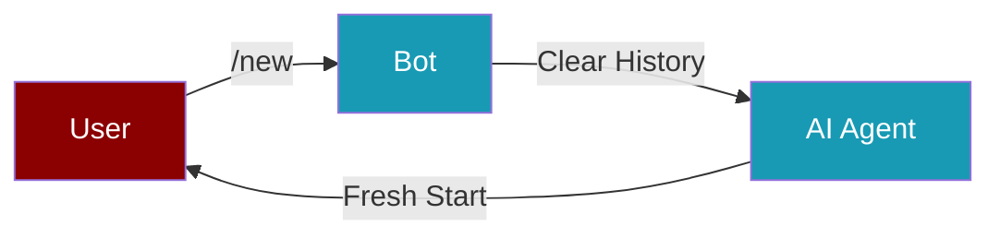

Every PraisonAI bot comes with built-in chat commands. Just type a command in your chat — no setup required.

## Built-in Commands

<CardGroup cols={3}>
  <Card title="/status" icon="circle-info">
    Shows agent name, model, platform, and uptime.
  </Card>
  <Card title="/new" icon="rotate">
    Resets the conversation session. Starts a fresh chat with the agent.
  </Card>
  <Card title="/help" icon="circle-question">
    Lists all available commands (built-in + custom) with descriptions.
  </Card>
</CardGroup>

## Quick Start

<Steps>
  <Step title="Install PraisonAI">
    ```bash
    pip install praisonai
    ```
  </Step>

  <Step title="Set Your Bot Token">
    ```bash
    export TELEGRAM_BOT_TOKEN=your_token_here
    ```
  </Step>

  <Step title="Start the Bot">
    ```bash
    praisonai bot telegram --token $TELEGRAM_BOT_TOKEN
    ```
  </Step>

  <Step title="Send a Command">
    Open your bot chat and type:
    ```
    /status
    ```
    You'll see the agent name, model, platform, and uptime.
  </Step>
</Steps>

## Platform Examples

<CodeGroup>
```bash Telegram
praisonai bot telegram --token $TELEGRAM_BOT_TOKEN
```

```bash Discord
praisonai bot discord --token $DISCORD_BOT_TOKEN
```

```bash Slack
praisonai bot slack --token $SLACK_BOT_TOKEN --app-token $SLACK_APP_TOKEN
```
</CodeGroup>

## Command Details

### /status

Shows current bot information:

| Field | Description |
|-------|-------------|
| **Agent** | Name of the AI agent |
| **Model** | LLM model being used |
| **Platform** | telegram, discord, slack, or whatsapp |
| **Uptime** | How long the bot has been running |
| **Running** | Whether the bot is currently active |

### /new

Resets the conversation:



- Clears all previous messages from the agent's session
- Replies with a confirmation message
- Next message starts a completely new conversation

### /help

Lists all available commands — both built-in and custom — with their descriptions.

<Tip>
Commands work the same way on all platforms — Telegram, Discord, Slack, and WhatsApp. The `/` prefix is the default command prefix.
</Tip>

---

## Custom Commands

Register your own commands using `register_command()`. Available on all bot adapters.

```python
from praisonai.bots import TelegramBot
from praisonaiagents import Agent

agent = Agent(name="assistant", instructions="Be helpful")
bot = TelegramBot(token="YOUR_TOKEN", agent=agent)

# Register a custom command
async def handle_ping(message):
    return "Pong! Bot is alive."

bot.register_command("ping", handle_ping, description="Check if bot is alive")

import asyncio
asyncio.run(bot.start())
# Now /ping is available alongside /status, /new, /help
```

### register_command() API

```python
bot.register_command(
    name="mycommand",           # Command name (without /)
    handler=my_handler,          # Async or sync callable
    description="What it does",  # Shown in /help
    usage="/mycommand <arg>",    # Optional usage string
    channels=["telegram"],       # Optional: restrict to specific platforms
)
```

| Parameter | Type | Required | Description |
|-----------|------|----------|-------------|
| `name` | `str` | Yes | Command name without `/` prefix |
| `handler` | `Callable` | Yes | Function to call. Receives a `BotMessage` argument |
| `description` | `str` | No | Human-readable description (shown in `/help`) |
| `usage` | `str` | No | Usage example string |
| `channels` | `list[str]` | No | Restrict to specific platforms (e.g., `["telegram", "slack"]`). Empty = all platforms |

### list_commands()

Get all registered commands:

```python
commands = bot.list_commands()
# Returns: [ChatCommandInfo(name="status", ...), ChatCommandInfo(name="new", ...), ...]

# Filter by platform
telegram_commands = bot.list_commands(platform="telegram")
```

---

## Python Usage

Start bots programmatically — built-in commands are always available:

<CodeGroup>
```python Telegram
from praisonai.bots import TelegramBot
from praisonaiagents import Agent

agent = Agent(name="assistant", instructions="Be helpful")
bot = TelegramBot(token="YOUR_TOKEN", agent=agent)

import asyncio
asyncio.run(bot.start())
# /status, /new, /help available automatically
```

```python Discord
from praisonai.bots import DiscordBot
from praisonaiagents import Agent

agent = Agent(name="assistant", instructions="Be helpful")
bot = DiscordBot(token="YOUR_TOKEN", agent=agent)

import asyncio
asyncio.run(bot.start())
```

```python Slack
from praisonai.bots import SlackBot
from praisonaiagents import Agent

agent = Agent(name="assistant", instructions="Be helpful")
bot = SlackBot(token="YOUR_TOKEN", app_token="YOUR_APP_TOKEN", agent=agent)

import asyncio
asyncio.run(bot.start())
```

```python WhatsApp
from praisonai.bots import WhatsAppBot
from praisonaiagents import Agent

agent = Agent(name="assistant", instructions="Be helpful")
bot = WhatsAppBot(mode="web", agent=agent)

import asyncio
asyncio.run(bot.start())
```
</CodeGroup>

<Note>
Bot tokens should never be hardcoded. Use environment variables or a `.env` file to store them securely.
</Note>
