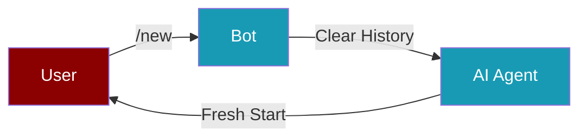

Every PraisonAI bot comes with built-in chat commands. Just type a command in your chat — no setup required.

## Available Commands

<CardGroup cols={3}>
  <Card title="/status" icon="circle-info">
    Shows agent name, model, platform, session ID, and uptime.
  </Card>
  <Card title="/new" icon="rotate">
    Resets the conversation session. Starts a fresh chat with the agent.
  </Card>
  <Card title="/help" icon="circle-question">
    Lists all available commands with descriptions.
  </Card>
</CardGroup>

## Quick Start

<Steps>
  <Step title="Install PraisonAI">
    ```bash
    pip install praisonai
    ```
  </Step>

  <Step title="Set Your Bot Token">
    Set the token for your platform as an environment variable:
    ```bash
    export TELEGRAM_BOT_TOKEN=your_token_here
    ```
  </Step>

  <Step title="Start the Bot">
    ```bash
    praisonai bot telegram --token $TELEGRAM_BOT_TOKEN
    ```
  </Step>

  <Step title="Send a Command">
    Open your bot chat and type:
    ```
    /status
    ```
    You'll see the agent name, model, and uptime.
  </Step>
</Steps>

## Platform Examples

<CodeGroup>
```bash Telegram
praisonai bot telegram --token $TELEGRAM_BOT_TOKEN
```

```bash Discord
praisonai bot discord --token $DISCORD_BOT_TOKEN
```

```bash Slack
praisonai bot slack --token $SLACK_BOT_TOKEN
```
</CodeGroup>

## Command Details

### /status

Shows current bot information:

| Field | Description |
|-------|-------------|
| **Agent** | Name of the AI agent |
| **Model** | LLM model being used |
| **Platform** | telegram, discord, or slack |
| **Session** | Current session ID (if set) |
| **Uptime** | How long the bot has been running |

### /new

Resets the conversation:



- Clears all previous messages from the agent's memory
- Replies with a confirmation message
- Next message starts a completely new conversation

### /help

Lists all available commands with their descriptions. Useful for discovering what your bot can do.

<Tip>
Commands work the same way on all platforms — Telegram, Discord, and Slack. The `/` prefix is the default command prefix.
</Tip>

## Python Usage

You can also start bots programmatically with the same built-in commands:

<CodeGroup>
```python Telegram
from praisonai.bots import TelegramBot
from praisonaiagents import Agent

agent = Agent(name="assistant", instructions="Be helpful")
bot = TelegramBot(token="YOUR_TOKEN", agent=agent)

import asyncio
asyncio.run(bot.start())
# Commands /status, /new, /help are available automatically
```

```python Discord
from praisonai.bots import DiscordBot
from praisonaiagents import Agent

agent = Agent(name="assistant", instructions="Be helpful")
bot = DiscordBot(token="YOUR_TOKEN", agent=agent)

import asyncio
asyncio.run(bot.start())
```

```python Slack
from praisonai.bots import SlackBot
from praisonaiagents import Agent

agent = Agent(name="assistant", instructions="Be helpful")
bot = SlackBot(token="YOUR_TOKEN", agent=agent)

import asyncio
asyncio.run(bot.start())
```
</CodeGroup>

<Note>
Bot tokens should never be hardcoded. Use environment variables or a `.env` file to store them securely.
</Note>
