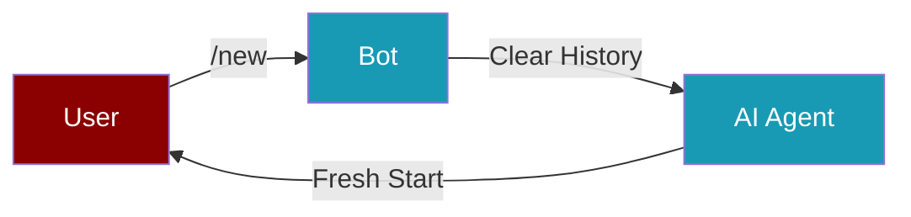
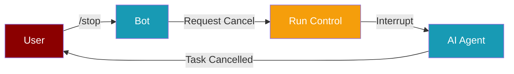
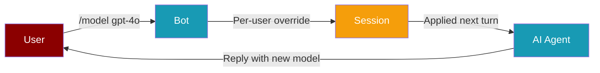
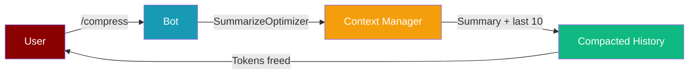
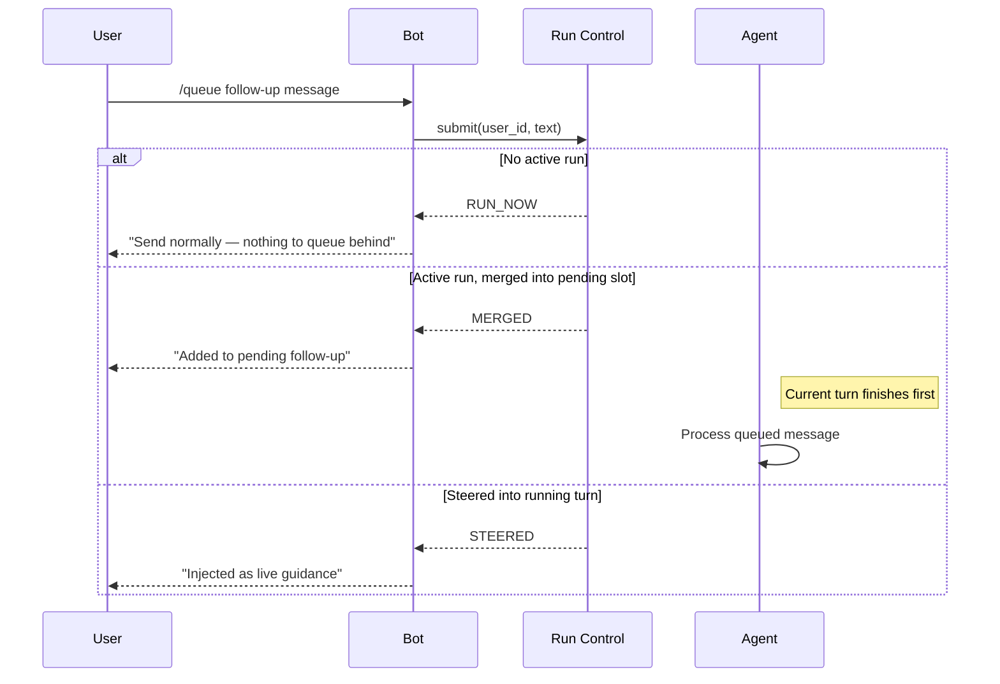
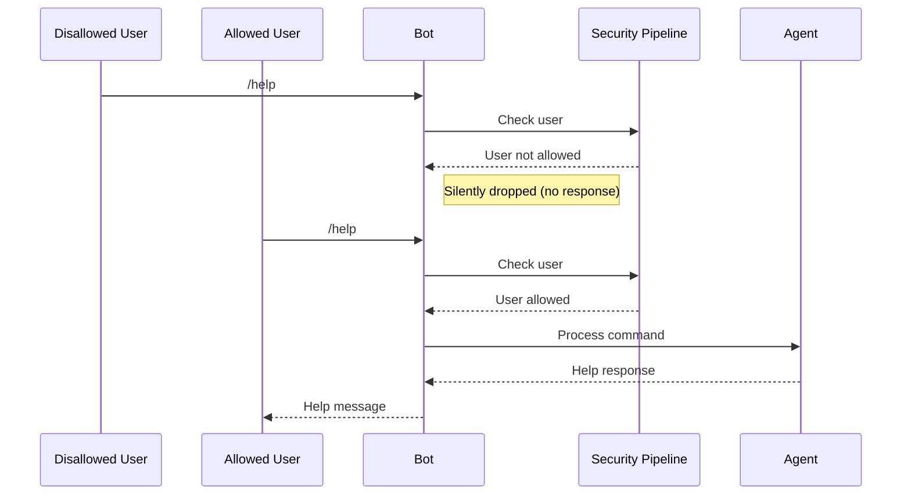

```mermaid
graph TB
    Q{What do you need?} --> A[Cancel a running task]
    Q --> B[Free context space]
    Q --> C[Change LLM]
    Q --> D[See cost/tokens]
    Q --> E[Queue a follow-up]
    Q --> F[Author a skill from sources]
    Q --> G[Rewind the last turn]
    Q --> H[List or switch sessions]
    Q --> I[Re-run your last message]
    Q --> J[Toggle reasoning visibility]
    A --> A1[/stop]
    B --> B1[/compress]
    C --> C1[/model]
    D --> D1[/usage]
    E --> E1[/queue]
    F --> F1[/learn]
    G --> G1[/undo]
    H --> H1[/sessions, /resume]
    I --> I1[/retry]
    J --> J1[/reasoning]

    classDef decision fill:#6366F1,stroke:#7C90A0,color:#fff
    classDef result fill:#10B981,stroke:#7C90A0,color:#fff

    class Q decision
    class A1,B1,C1,D1,E1,F1,G1,H1,I1,J1 result
```

Every PraisonAI bot comes with built-in chat commands. Just type a command in your chat — no setup required.


## Best Practices

<AccordionGroup>
  <Accordion title="Start simple">
    Enable the feature with a single parameter before adding configuration. Verify it works, then layer in options.
  </Accordion>
  <Accordion title="Use environment variables for secrets">
    Never hardcode API keys or tokens. Use `os.getenv("KEY_NAME")` to read from environment variables.
  </Accordion>
  <Accordion title="Test with minimal examples first">
    Copy the Quick Start example, run it, then extend it. This confirms your environment is set up correctly.
  </Accordion>
  <Accordion title="Check the logs">
    Set `verbose=True` on your agent to see detailed execution logs when debugging unexpected behavior.
  </Accordion>
</AccordionGroup>

## Built-in Commands

<CardGroup cols={2}>
  <Card title="/status" icon="circle-info">
    Shows agent name, model, platform, and uptime.
  </Card>
  <Card title="/new" icon="rotate">
    Resets the conversation session. Starts a fresh chat with the agent.
  </Card>
  <Card title="/stop" icon="octagon-pause">
    Cancels the current agent task. Requires run control to be enabled.
  </Card>
  <Card title="/sethome" icon="house">
    Mark this chat as the platform home channel for scheduled deliveries.
  </Card>
  <Card title="/help" icon="circle-question">
    Lists all available commands (built-in + custom) with descriptions. Output is filtered to commands the caller is allowed to run.
  </Card>
  <Card title="/whoami" icon="user">
    Shows your user ID, role, and the commands you are allowed to run.
  </Card>
  <Card title="/model" icon="arrows-rotate">
    Switch the LLM model for this conversation (session-scoped).
  </Card>
  <Card title="/usage" icon="chart-column">
    Show token usage and estimated cost for this session.
  </Card>
  <Card title="/compress" icon="compress">
    Summarise older messages to free context window space.
  </Card>
  <Card title="/queue" icon="list-ol">
    Queue a follow-up message to run after the current task.
  </Card>
  <Card title="/learn" icon="graduation-cap">
    Distil a grounded skill from sources you describe (repo, docs, PDFs, or this chat). **Privileged** — admin-only by default when a policy is configured. Authored via `skill_manage` with the same approval gate as other agent-created skills. See [Learn a Skill from Sources](/docs/features/learn-skill) and [Command Access Control](/docs/features/bot-command-access-control).
  </Card>
  <Card title="/undo" icon="rotate-left">
    Undo the last turn's file changes. Requires the agent to track changes (`autonomy` with `track_changes`).
  </Card>
  <Card title="/sessions" icon="folder-open">
    List the caller's saved sessions/checkpoints. Scoped to the requesting user — never enumerates other users' sessions.
  </Card>
  <Card title="/resume" icon="play">
    Switch to a saved session: `/resume &lt;id&gt;`. Use `/sessions` to list available IDs.
  </Card>
  <Card title="/retry" icon="rotate-right">
    Re-run your last message through the normal chat path.
  </Card>
  <Card title="/reasoning" icon="brain">
    Toggle whether extended-thinking output is shown in this conversation (per user).
  </Card>
</CardGroup>

## Per-Command Access Control

Restrict which commands each user may run with `admin_users` and `user_allowed_commands` on Telegram, Slack, and Discord — admins get full access, regular users only run commands you list. All built-in commands, including the new runtime controls, are gated by this policy.

<Card title="Command Access Control" icon="shield-keyhole" href="/docs/features/bot-command-access-control">
  Admin users, per-command allowlists, and /whoami
</Card>

## Quick Start

<Steps>
  <Step title="Install PraisonAI">
    ```bash
    pip install praisonai
    ```
  </Step>

  <Step title="Set Your Bot Token">
    ```bash
    export TELEGRAM_BOT_TOKEN=your_token_here
    ```
  </Step>

  <Step title="Start the Bot">
    ```bash
    praisonai bot telegram --token $TELEGRAM_BOT_TOKEN
    ```
  </Step>

  <Step title="Send a Command">
    Open your bot chat and type:
    ```
    /status
    ```
    You'll see the agent name, model, platform, and uptime.
  </Step>
</Steps>

## Platform Examples

<CodeGroup>
```bash Telegram
praisonai bot telegram --token $TELEGRAM_BOT_TOKEN
```

```bash Discord
praisonai bot discord --token $DISCORD_BOT_TOKEN
```

```bash Slack
praisonai bot slack --token $SLACK_BOT_TOKEN --app-token $SLACK_APP_TOKEN
```
</CodeGroup>

## Command Details

### /status

Shows current bot information:

| Field | Description |
|-------|-------------|
| **Agent** | Name of the AI agent |
| **Model** | LLM model being used |
| **Platform** | telegram, discord, slack, or whatsapp |
| **Uptime** | How long the bot has been running |
| **Running** | Whether the bot is currently active |

### /whoami

Shows permission information for the caller:

| Field | Description |
|-------|-------------|
| **User ID** | Platform-native user ID |
| **Username** | Display name when available |
| **Role** | Admin or User |
| **Allowed commands** | Commands this user may run |

Example output:

```
User Information
User ID: 456
Username: alice
Role: User
Allowed commands: help, status, whoami
```

### /new

Resets the conversation:


```mermaid
flowchart LR
    User[User] -->|/new| Bot[Bot]
    Bot -->|Clear History| Agent[AI Agent]
    Agent -->|Fresh Start| User
    
    style User fill:#8B0000,color:#fff
    style Bot fill:#189AB4,color:#fff
    style Agent fill:#189AB4,color:#fff
```

- Clears all previous messages from the agent's session
- Replies with a confirmation message
- Next message starts a completely new conversation

### /stop

Cancels the current agent task immediately:


```mermaid
flowchart LR
    User[User] -->|/stop| Bot[Bot]
    Bot -->|Request Cancel| RunControl[Run Control]
    RunControl -->|Interrupt| Agent[AI Agent]
    Agent -->|Task Cancelled| User
    
    style User fill:#8B0000,color:#fff
    style Bot fill:#189AB4,color:#fff
    style RunControl fill:#F59E0B,color:#fff
    style Agent fill:#189AB4,color:#fff
```

- Immediately interrupts the current agent processing
- Clears any pending messages in the queue
- Replies with confirmation that the task was cancelled
- Next message starts a fresh task

<Note>
`/stop` works out of the box on any bot using the default `BotSessionManager` — Telegram, Discord, Slack, and WhatsApp all register it. Enabling [Bot Run Control](/docs/features/bot-run-control) with `busy_mode` adds mid-run interruption plus pending-message handling on top of basic cancellation.
</Note>

### /sethome

Mark this chat as the platform's **home channel** for scheduled deliveries. Jobs using `--deliver <platform>` or `--deliver all` land here.


```mermaid
flowchart LR
    User[User] -->|/sethome| Bot[Bot]
    Bot --> Registry[HomeChannelRegistry]
    Registry --> Confirm[Confirmed]

    classDef agent fill:#8B0000,stroke:#7C90A0,color:#fff
    classDef tool fill:#189AB4,stroke:#7C90A0,color:#fff
    classDef ok fill:#10B981,stroke:#7C90A0,color:#fff

    class User agent
    class Bot,Registry tool
    class Confirm ok
```

Persists to `~/.praisonai/state/home_channels.json`. See [Proactive Delivery](/docs/features/proactive-delivery).

### /help

Lists all available commands — both built-in and custom — with their descriptions.

<Tip>
Commands work the same way on all platforms — Telegram, Discord, Slack, and WhatsApp. The `/` prefix is the default command prefix.
</Tip>

### /model

Switches the LLM model for your conversation, or reports which model is currently active.


```mermaid
flowchart LR
    User[User] -->|/model gpt-4o| Bot[Bot]
    Bot -->|Per-user override| Session[Session]
    Session -->|Applied next turn| Agent[AI Agent]
    Agent -->|Reply with new model| User

    style User fill:#8B0000,color:#fff
    style Bot fill:#189AB4,color:#fff
    style Session fill:#F59E0B,color:#fff
    style Agent fill:#189AB4,color:#fff
```

**Show current model** — `/model` with no argument:

```
Current model: gpt-4o-mini
Use /model <name> to switch (e.g., /model gpt-4o)
```

**Switch model** — `/model <name>`:

```
/model gpt-4o
✅ Model switched to gpt-4o for this conversation.
```

<Note>
The override is scoped to your conversation only — other users keep their own model. On each turn the original model is restored after your message is processed, so a shared agent never leaks one user's model to another concurrent user.
</Note>

### /usage

Reports token usage and a rough estimated cost for the session.

| Field | Description |
|-------|-------------|
| **Total** | Total tokens used in the session |
| **Prompt** | Tokens spent on prompts (when tracked) |
| **Completion** | Tokens generated by the model (when tracked) |
| **Est. cost** | Approximate cost using a flat per-token rate — not model-specific |

Example output:

```
📊 Token Usage
Total: 18,204 tokens
Prompt: 12,800 | Completion: 5,404
Est. cost: $0.0036
```

<Warning>
The cost estimate uses a flat `$0.00002 / token` rate — it is **not** model-specific pricing. Treat it as a rough order-of-magnitude guide, not a billing figure.
</Warning>

### /compress

Compresses your conversation history to free context-window space.


```mermaid
flowchart LR
    User[User] -->|/compress| Bot[Bot]
    Bot -->|SummarizeOptimizer| Context[Context Manager]
    Context -->|Summary + last 10| History[Compacted History]
    History -->|Tokens freed| User

    style User fill:#8B0000,color:#fff
    style Bot fill:#189AB4,color:#fff
    style Context fill:#F59E0B,color:#fff
    style History fill:#10B981,color:#fff
```

- Requires at least 10 messages — shorter histories get: `"ℹ️ Conversation too short to compress (need at least 10 messages)."`
- Targets ~50% token reduction, always preserving the most recent 10 messages and all system messages
- Reports messages removed and tokens freed:

```
✅ Compressed 32 messages, freed ~12,400 tokens.
```

- If the context optimizer library is unavailable, falls back to keeping system messages and the last 10 messages
- On failure the history is left untouched: `"❌ Compression failed: {error}"`

<Tip>
Run `/compress` before a long research task to reclaim context window space without losing your conversation thread.
</Tip>

### /queue

Adds a follow-up message that runs after the current task completes.


```mermaid
sequenceDiagram
    participant User
    participant Bot
    participant RunControl as Run Control
    participant Agent

    User->>Bot: /queue follow-up message
    Bot->>RunControl: submit(user_id, text)
    alt No active run
        RunControl-->>Bot: RUN_NOW
        Bot-->>User: "Send normally — nothing to queue behind"
    else Active run, merged into pending slot
        RunControl-->>Bot: MERGED
        Bot-->>User: "Added to pending follow-up"
        Note right of Agent: Current turn finishes first
        Agent->>Agent: Process queued message
    else Steered into running turn
        RunControl-->>Bot: STEERED
        Bot-->>User: "Injected as live guidance"
    end
```

**Check pending queue** — `/queue` with no argument:

```
📝 Pending follow-up: summarise the key findings
```

Or if nothing is pending:

```
No follow-up queued. Use /queue <message> to add one while a task is running.
```

**Queue a message** — three possible outcomes depending on bot state:

| Outcome | When | Bot reply |
|---------|------|-----------|
| Nothing to queue | No task running | `"ℹ️ No task is currently running, so there's nothing to queue behind. Send your message normally to run it now."` |
| Merged | Task running, message parked in pending slot | `"⏳ Added to your pending follow-up — it will run after the current task completes."` |
| Steered | Task running, message injected as live guidance | `"🧭 Injected into the running task as live guidance."` |

<Note>
`/queue` requires [Bot Run Control](/docs/features/bot-run-control) to be enabled with `busy_mode`. Without it, the bot replies: `"ℹ️ Message queuing isn't enabled for this bot. Just send your message and it will be processed."`
</Note>

### /undo

Rewinds the last turn's file changes via `Agent.undo()`.

- Requires change tracking — enable `autonomy` with `track_changes` on the agent
- Returns `"✅ Reverted the last turn."` when files were restored, `"ℹ️ Nothing to undo."` when there is nothing to revert
- Degrades gracefully when undo is unavailable: `"❌ This agent does not support undo (change tracking not enabled)."`

### /sessions

Lists recent saved sessions for the **requesting user only**. Session lookups are scoped via the per-user storage key so one caller cannot enumerate another user's sessions.

Example output:

```
📁 Recent sessions:
• telegram:123456789
• telegram:123456789:project-a

Use /resume <id> to switch to one.
```

Returns `"No saved sessions yet."` when nothing is stored.

### /resume

Switches to a previously saved session.

```
/resume telegram:123456789:project-a
✅ Resumed session telegram:123456789:project-a.
```

- Usage: `/resume <id>` — run `/sessions` first to see IDs
- Returns `"❌ Session {id} not found."` when the ID is unknown
- When the session manager lacks a `resume_session` primitive, the bot reports honestly rather than claiming a switch succeeded

### /retry

Re-runs your most recent user message through the normal `session.chat(...)` path.

```
🔁 Retrying your last message:
Summarise the deployment runbook in three bullets.
```

Returns `"ℹ️ Nothing to retry — no previous message found."` when the history is empty.

### /reasoning

Toggles whether extended-thinking output is shown for **this user** in this conversation. The preference is stored per user on the session manager.

```
/reasoning
🧠 Reasoning output will be shown for this conversation.
```

Run again to hide:

```
/reasoning
🙈 Reasoning output will be hidden for this conversation.
```

Defaults to hidden when no preference is set. Adapters consult `is_reasoning_visible()` when rendering responses.

### /learn

Authors a grounded, reusable `SKILL.md` from sources you name — a codebase, API docs, PDFs, configs, or the current chat.

```
/learn deploy steps from this repo and the runbook PDF
```

- Calls `agent.learn_skill(request)` which gathers the named sources with the agent's existing tools and writes one grounded `SKILL.md` via `skill_manage`
- **Admin-only by default** when a `CommandAccessPolicy` is configured (`admin_users` or `user_allowed_commands` set) — it belongs to `PRIVILEGED_COMMANDS` because it reads host sources and alters future agent behaviour
- Available to all users when no policy is configured (backward-compatible)

<Card title="Learn Skill" icon="graduation-cap" href="/docs/features/agent-learn-skill">
  Full guide: sources, grounding rules, async API, bot usage
</Card>

---

## Custom Commands

Register your own commands using `register_command()`. Available on all bot adapters.

```python
from praisonai.bots import TelegramBot
from praisonaiagents import Agent

agent = Agent(name="assistant", instructions="Be helpful")
bot = TelegramBot(token="YOUR_TOKEN", agent=agent)

# Register a custom command
async def handle_ping(message):
    return "Pong! Bot is alive."

bot.register_command("ping", handle_ping, description="Check if bot is alive")

import asyncio
asyncio.run(bot.start())
# Now /ping is available alongside /status, /new, /stop, /help
```

### register_command() API

```python
bot.register_command(
    name="mycommand",           # Command name (without /)
    handler=my_handler,          # Async or sync callable
    description="What it does",  # Shown in /help
    usage="/mycommand <arg>",    # Optional usage string
    channels=["telegram"],       # Optional: restrict to specific platforms
)
```

| Parameter | Type | Required | Description |
|-----------|------|----------|-------------|
| `name` | `str` | Yes | Command name without `/` prefix |
| `handler` | `Callable` | Yes | Function to call. Receives a `BotMessage` argument |
| `description` | `str` | No | Human-readable description (shown in `/help`) |
| `usage` | `str` | No | Usage example string |
| `channels` | `list[str]` | No | Restrict to specific platforms (e.g., `["telegram", "slack"]`). Empty = all platforms |

### list_commands()

Get all registered commands:

```python
commands = bot.list_commands()
# Returns: [ChatCommandInfo(name="status", ...), ChatCommandInfo(name="new", ...), ...]

# Filter by platform
telegram_commands = bot.list_commands(platform="telegram")
```

---

## Security & Allowlists

Built-in commands (`/status`, `/new`, `/help`) and custom commands registered via `register_command()` go through the same security pipeline as regular text messages. If `allowed_users` is set and the sender is not in it, the command is silently dropped with no reply. If `unknown_user_policy="pair"`, unknown senders get the pairing flow before the command runs. If `group_policy="mention_only"`, commands in groups still need a mention.

```python
from praisonai.bots import TelegramBot
from praisonaiagents.bots import BotConfig
from praisonaiagents import Agent

agent = Agent(name="assistant", instructions="Be helpful")
bot = TelegramBot(
    token="YOUR_TOKEN",
    agent=agent,
    config=BotConfig(allowed_users=["123456789"]),  # Only this user
)

# /help, /status, /new from any other user are now silently ignored
```


```mermaid
sequenceDiagram
    participant DisallowedUser as Disallowed User
    participant AllowedUser as Allowed User
    participant Bot as Bot
    participant SecurityPipeline as Security Pipeline
    participant Agent as Agent
    
    DisallowedUser->>Bot: /help
    Bot->>SecurityPipeline: Check user
    SecurityPipeline-->>Bot: User not allowed
    Note right of Bot: Silently dropped (no response)
    
    AllowedUser->>Bot: /help
    Bot->>SecurityPipeline: Check user
    SecurityPipeline-->>Bot: User allowed
    Bot->>Agent: Process command
    Agent-->>Bot: Help response
    Bot-->>AllowedUser: Help message
```

For full allowlist setup, see the [Bot Security](/docs/best-practices/bot-security) guide. This security hardening was implemented in [PR #1835](https://github.com/MervinPraison/PraisonAI/pull/1835).

---

## Python Usage

Start bots programmatically — built-in commands are always available:

<CodeGroup>
```python Telegram
from praisonai.bots import TelegramBot
from praisonaiagents import Agent

agent = Agent(name="assistant", instructions="Be helpful")
bot = TelegramBot(token="YOUR_TOKEN", agent=agent)

import asyncio
asyncio.run(bot.start())
# /status, /new, /stop, /model, /usage, /compress, /queue, /help available automatically
```

```python Discord
from praisonai.bots import DiscordBot
from praisonaiagents import Agent

agent = Agent(name="assistant", instructions="Be helpful")
bot = DiscordBot(token="YOUR_TOKEN", agent=agent)

import asyncio
asyncio.run(bot.start())
```

```python Slack
from praisonai.bots import SlackBot
from praisonaiagents import Agent

agent = Agent(name="assistant", instructions="Be helpful")
bot = SlackBot(token="YOUR_TOKEN", app_token="YOUR_APP_TOKEN", agent=agent)

import asyncio
asyncio.run(bot.start())
```

```python WhatsApp
from praisonai.bots import WhatsAppBot
from praisonaiagents import Agent

agent = Agent(name="assistant", instructions="Be helpful")
bot = WhatsAppBot(mode="web", agent=agent)
# /stop, /status, /new, /help registered automatically

import asyncio
asyncio.run(bot.start())
```
</CodeGroup>

<Note>
Bot tokens should never be hardcoded. Use environment variables or a `.env` file to store them securely.
</Note>
