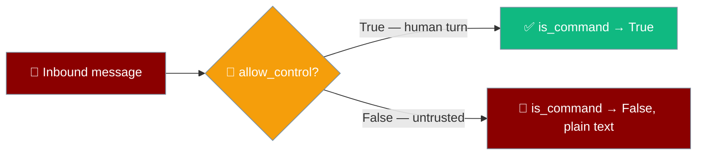
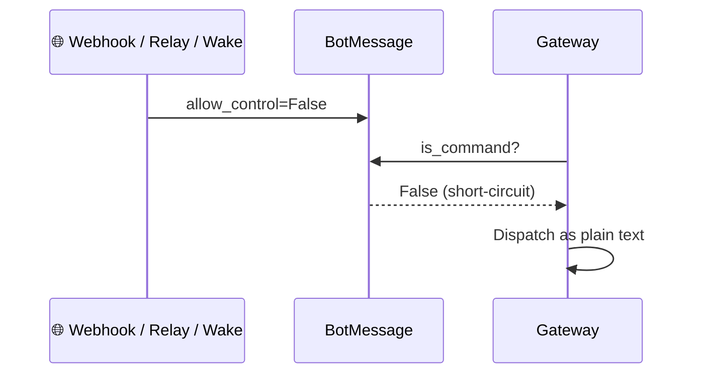
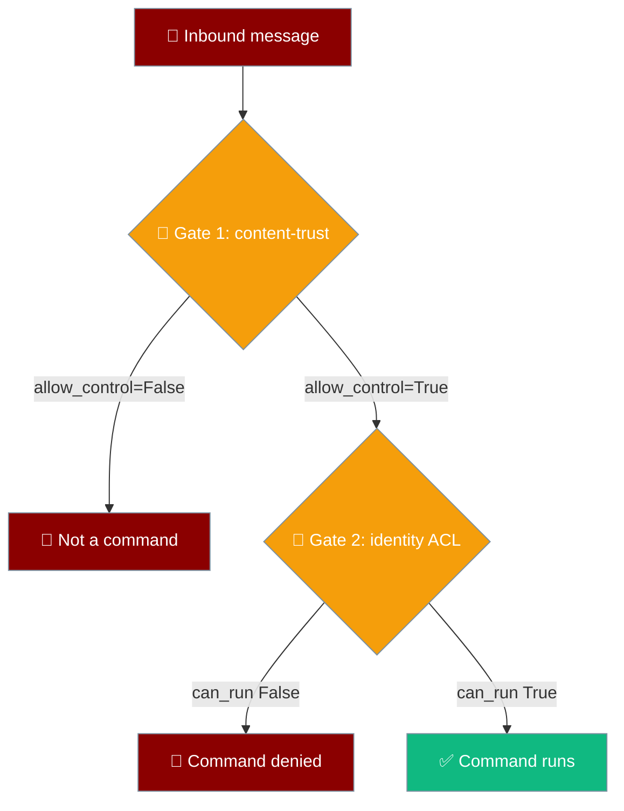

Gateway control commands are gated by content provenance: a message only counts as a command when it is a real interactive human turn, so an untrusted producer can never drive `/stop`, `/new`, or `/compress` even under a privileged identity.



## Quick Start

<Steps>
<Step title="Interactive human turn — command runs">

A real user typing into a live chat keeps the default (`allow_control=True`), so a slash-prefixed message is classified as a command.

```python
from praisonaiagents import BotMessage

msg = BotMessage(content="/compress")
msg.is_command   # -> True
```

</Step>

<Step title="Untrusted producer — command is neutralised">

A webhook, relay, or wake producer marks its message `allow_control=False`, so the same text is handled as plain text instead of a privileged command.

```python
from praisonaiagents import BotMessage

msg = BotMessage(content="/compress", allow_control=False)
msg.is_command   # -> False
```

</Step>
</Steps>

---

## How It Works

A producer sets `allow_control=False` on non-interactive content; `is_command` short-circuits to `False` before the gateway ever classifies the message, so it is dispatched as plain text.



| Producer | `allow_control` | Rationale |
|---|---|---|
| Interactive human turn (Telegram/Slack/Discord/Signal/WhatsApp/local DM) | `True` (default) | Real user typed into a live chat |
| Generic webhook channel body | `False` | Body originates outside the human turn |
| Relayed / mirrored bot-authored content (`sender.is_bot == True`) | `False` | Not a user's typed input |
| Proactive / wake / scheduler inject | `False` | Synthetic, not typed by the user |

---

## The Two-Gate Model

Command classification passes through two independent gates — content-trust fires first, identity ACL second.



Identity alone is not enough: untrusted content is often attributed to an allowed identity — a webhook bound to the owner, a relayed or proactive event on the bot's own session. Identity ACL passes, but content-trust does not, so the command never executes.

---

## What This Prevents

Content provenance is now a first-class part of the contract, so a `/`-prefix in an untrusted body no longer drives privileged session control.

```python
from praisonaiagents import BotMessage, BotUser

OWNER_ID = "owner-123"

# BEFORE — content prefix alone drove control commands
# A webhook body of "/compress" attributed to the owner passed identity ACL
# and compacted the session.

# AFTER — provenance is first-class on the contract
msg = BotMessage(
    content="/compress",
    sender=BotUser(user_id=OWNER_ID, is_bot=True),
    allow_control=False,            # webhook/relay/mirror/proactive producer marks it untrusted
)
msg.is_command                      # -> False (handled as plain text)

# Interactive user turn — unchanged
BotMessage(content="/compress", sender=BotUser(user_id=OWNER_ID)).is_command   # -> True
```

---

## For Adapter Authors

<AccordionGroup>
<Accordion title="Set allow_control=False on non-interactive producers">
When you write an adapter or a webhook/relay/proactive producer, set `allow_control=False` on the `BotMessage` unless the content is a real, interactive human turn on that channel. The default (`True`) keeps today's behaviour for interactive turns; the primitive is safe by narrowing it for untrusted sources.
</Accordion>

<Accordion title="Round-trip carries the field">
`to_dict()` and `from_dict()` carry `allow_control`. `from_dict` defaults it to `True` when the key is absent, so older serialised payloads still deserialize as trusted.
</Accordion>

<Accordion title="Layer identity ACL on top">
Content-trust is the first gate. `CommandAccessPolicy.can_run(user_id, cmd)` still runs afterward for messages that pass content-trust, so identity gating (`admin_users`, `user_allowed_commands`) is unchanged.
</Accordion>
</AccordionGroup>

---

## Configuration Reference

| Field | Type | Default | Description |
|---|---|---|---|
| `BotMessage.allow_control` | `bool` | `True` | `True` for interactive human turns only. Producers set `False` for untrusted / non-interactive content. When `False`, `is_command` returns `False` regardless of `/` prefix or `MessageType.COMMAND`. |

---

## Backward Compatibility

The default is `True`, so today's interactive traffic is unchanged. `from_dict` defaults the field to `True` when absent, so pre-PR serialised messages still deserialize as trusted. There is no config flag, CLI flag, or YAML change — this is a contract primitive, not a user-facing feature knob.

---

## Related

<CardGroup cols={2}>
<Card title="Untrusted Request Fencing" icon="shield-check" href="/features/untrusted-request-fencing">
  Prompt-plane counterpart — wraps untrusted payload content as data
</Card>
<Card title="Bot Command Access Control" icon="lock" href="/features/bot-command-access-control">
  Identity-based ACL that layers on top of content-trust
</Card>
<Card title="Webhook Channel" icon="webhook" href="/features/webhook-channel">
  The primary untrusted producer
</Card>
<Card title="Gateway Inbound Hooks" icon="webhook" href="/features/gateway-inbound-hooks">
  HTTP-triggered agent runs with the same trust posture
</Card>
<Card title="Bot Chat Commands" icon="terminal" href="/features/bot-commands">
  What the gated commands actually do
</Card>
<Card title="Inbound Message Gate" icon="filter" href="/features/inbound-message-gate">
  Admission after is_command classifies
</Card>
</CardGroup>
