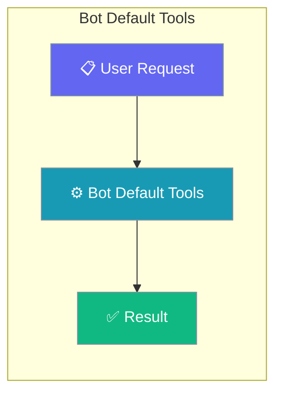
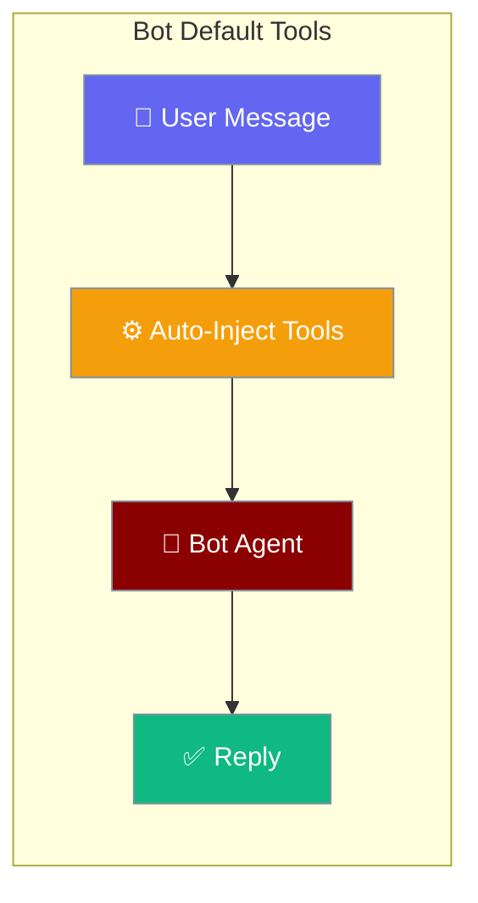
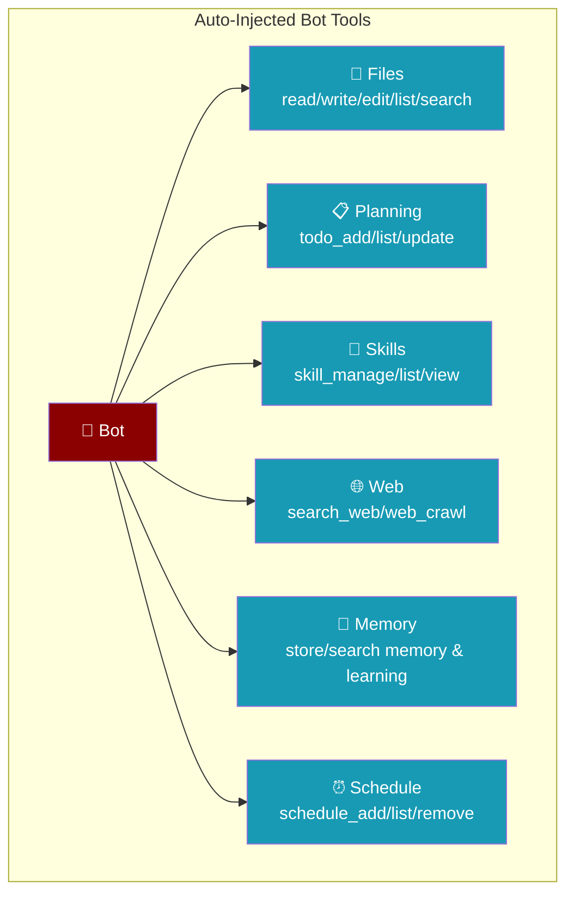
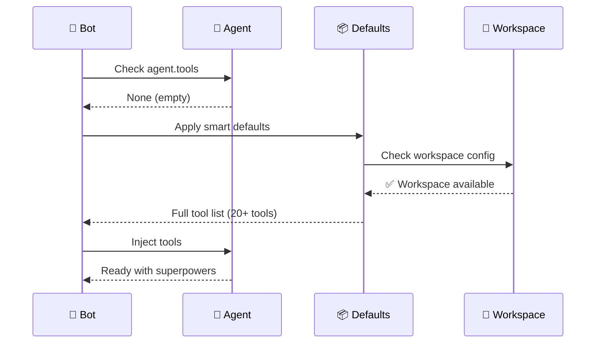

<Note>
Bot platform adapters now ship in the `praisonai-bot` package. `praisonai bot serve` still works exactly as documented here; for a standalone install see [praisonai-bot Migration](/docs/guides/praisonai-bot-migration).
</Note>


Bot default tools provide instant superpowers to every bot deployment, automatically injecting 20+ safe and useful tools when agents have no explicit tool configuration.

```python
from praisonaiagents import Agent

agent = Agent(
    name="Assistant",
    instructions="Help users with files, web search, and scheduling.",
)
```

The user messages the bot with no custom `tools=` list; PraisonAI injects file, web, memory, and schedule tools automatically.



### Injected Tools



## Quick Start

<Steps>
<Step title="Zero-Config Bot">
```python
from praisonaiagents import Agent
from praisonai.bots import TelegramBot

agent = Agent(
    name="Assistant",
    instructions="You help users. Use any tool you need."
)

# No tools= passed — bot auto-injects safe defaults
TelegramBot(token="YOUR_TOKEN", agent=agent).start()
```
</Step>

<Step title="Custom Tool Selection">
```python
from praisonaiagents import BotConfig

config = BotConfig(
    token="YOUR_TOKEN",
    default_tools=["search_web", "read_file", "todo_add"],  # override list
    auto_approve_tools=True,  # default True for bots
)

bot = TelegramBot(config=config, agent=agent)
```
</Step>
</Steps>

---

## How It Works



Smart defaults activate when:

| Condition | Behavior | Result |
|-----------|----------|--------|
| **Agent has no tools** | Auto-inject defaults | Full 20+ tool suite |
| **Agent has tools=[]** | Respect explicit empty | No tools injected |
| **Agent has tools=[...]** | Keep existing tools | No injection |
| **No workspace configured** | Filter destructive tools | Safe subset only |

---

## Configuration Options

### Complete Default Tools List

| Tool | Category | Safe without workspace? | Notes |
|------|----------|:-----------------------:|-------|
| `search_web` | Web | ✅ | Search the internet |
| `web_crawl` | Web | ✅ | Crawl and extract web content |
| `store_memory` | Memory | ✅ | Store information in memory |
| `search_memory` | Memory | ✅ | Search stored memories |
| `store_learning` | Learning | ✅ | Store learned knowledge |
| `search_learning` | Learning | ✅ | Search learned knowledge |
| `schedule_add` | Scheduling | ✅ | Add scheduled tasks |
| `schedule_list` | Scheduling | ✅ | List scheduled tasks |
| `schedule_remove` | Scheduling | ✅ | Remove scheduled tasks |
| `clarify` | Clarification | ✅ | Ask clarifying questions |
| `read_file` | Files | ✅ (read-only) | **NEW** — Read files from workspace |
| `write_file` | Files | ⚠️ requires workspace | **NEW** — Write files to workspace |
| `edit_file` | Files | ⚠️ requires workspace | **NEW** — Edit files with find/replace |
| `list_files` | Files | ✅ | **NEW** — List directory contents |
| `search_files` | Files | ✅ | **NEW** — Search for patterns in files |
| `todo_add` | Planning | ✅ | **NEW** — Add tasks to todo list |
| `todo_list` | Planning | ✅ | **NEW** — List todo items |
| `todo_update` | Planning | ✅ | **NEW** — Update todo status/content |
| `skills_list` | Skills | ✅ | **NEW** — List available skills |
| `skill_view` | Skills | ✅ | **NEW** — View skill details |
| `skill_manage` | Skills | ⚠️ requires workspace | **NEW** — Create/edit/delete skills |

### Opt-In Tools (not auto-injected)

These tools are functional but require explicit opt-in:

| Tool | Reason | How to Enable |
|------|--------|---------------|
| `delegate_task` | Stub implementation | Add to `default_tools` manually |
| `session_search` | Cross-session conversation recall — opt in per bot | Add to `default_tools` manually, e.g. `default_tools=[..., "session_search"]`. See [Cross-Session Recall](/docs/features/cross-session-recall). |

### Smart Defaults Configuration

```python
from praisonaiagents import BotConfig

# Disable auto-injection completely
config = BotConfig(
    token="YOUR_TOKEN",
    default_tools=[],  # explicit empty list
)

# Custom safe subset
config = BotConfig(
    token="YOUR_TOKEN", 
    default_tools=[
        "search_web", "store_memory", "todo_add",
        "read_file", "skills_list"
    ]
)

# Full suite (same as default when workspace configured)
config = BotConfig(
    token="YOUR_TOKEN",
    workspace_dir="./bot-workspace",  # enables destructive tools
    default_tools=None,  # use full defaults
)
```

### Tool Approval Settings

```python
# Auto-approve all tool calls (default for bots)
config = BotConfig(
    auto_approve_tools=True,  # ← Default: True for chat bots
)

# Require manual approval (useful for development)
config = BotConfig(
    auto_approve_tools=False,  # Agents show confirmation prompts
)
```

<Note>
Setting `channels.<platform>.allow_shell: true` on a gateway channel additionally injects `execute_command` into the agent's tool list, lifts the tool from the deny-list, and appends a one-line permission grant to `agent.instructions`. See [Bot Shell Execution](/docs/features/bot-shell-execution).
</Note>

---

## Common Patterns

### Workspace-Aware Filtering

```python
# Without workspace: safe tools only
config = BotConfig(
    token="YOUR_TOKEN",
    # No workspace_dir set
    # Result: write_file, edit_file, skill_manage filtered out
)

# With workspace: full tool suite
config = BotConfig(
    token="YOUR_TOKEN",
    workspace_dir="./safe-sandbox",
    # Result: all 20+ tools available
)
```

### Development vs Production

```python
# Development: explicit tool control
agent = Agent(
    name="Dev Bot",
    tools=["search_web", "read_file"]  # explicit list prevents defaults
)

# Production: trust smart defaults  
agent = Agent(
    name="Prod Bot", 
    instructions="Help users with anything"
    # No tools= → auto-injection activates
)
```

### Tool Categories by Use Case

```python
# Minimal web assistant
config = BotConfig(default_tools=[
    "search_web", "web_crawl", "store_memory", "search_memory"
])

# File-focused assistant  
config = BotConfig(default_tools=[
    "read_file", "write_file", "edit_file", "list_files", "search_files"
])

# Learning assistant
config = BotConfig(default_tools=[
    "store_learning", "search_learning", "skills_list", "skill_view", "skill_manage"
])

# Gateway / long-lived assistant
config = BotConfig(default_tools=[
    "store_memory", "search_memory",
    "session_search",  # recall past conversations
])
```

---

## Best Practices

<AccordionGroup>
<Accordion title="Trust Smart Defaults">
In most cases, let the bot auto-inject tools rather than specifying manually. Smart defaults adapt based on workspace configuration and provide the safest possible tool suite.
</Accordion>

<Accordion title="Workspace Security">
Destructive file tools (`write_file`, `edit_file`, `skill_manage`) are automatically filtered out unless a workspace is configured. This ensures bots are safe by construction.
</Accordion>

<Accordion title="Development Testing">
Use `auto_approve_tools=False` during development to see exactly which tools your bot is calling. Switch to `auto_approve_tools=True` for production deployments.
</Accordion>

<Accordion title="Explicit Override">
To disable auto-injection, pass an explicit empty list: `Agent(tools=[])`. Passing no tools parameter triggers smart defaults.
</Accordion>
</AccordionGroup>

---

## Troubleshooting

<AccordionGroup>
<Accordion title="My bot only has a few tools, not the 20+ listed here">
If your bot is missing most default tools (only sees a small fallback set), upgrade to the version that includes [PR #2004](https://github.com/MervinPraison/PraisonAI/pull/2004). A regression caused `ToolResolver` to be imported from the wrong module, which silently dropped the full default toolset and left only a small hardcoded fallback.

Verify the fix is active by checking that imports resolve from `praisonai.tool_resolver`, not `praisonaiagents.tools`.
</Accordion>
</AccordionGroup>

---

## Related

<CardGroup cols={2}>
<Card title="Workspace" icon="folder-lock" href="/docs/features/workspace">
  How workspace containment enables safe file tools
</Card>
<Card title="BotOS" icon="robot" href="/docs/features/botos">
  Multi-platform bot orchestration concepts
</Card>
</CardGroup>