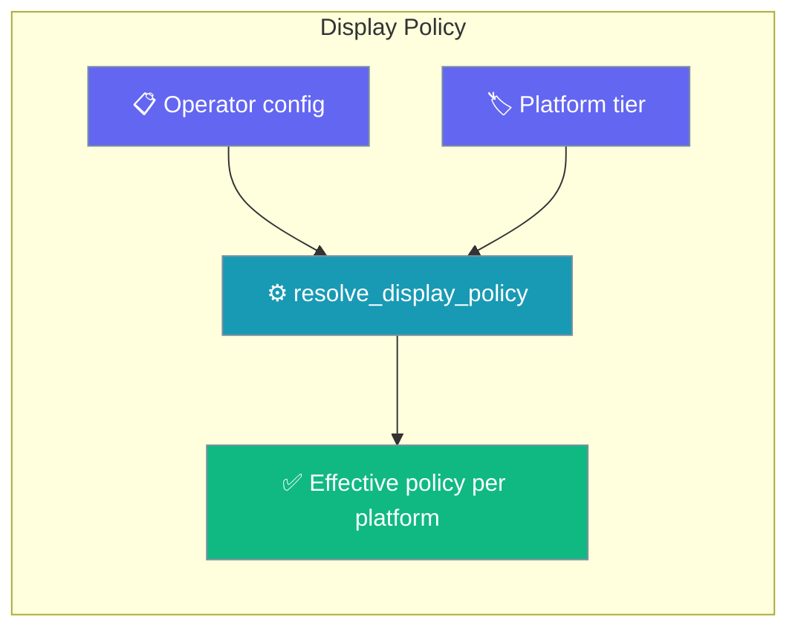
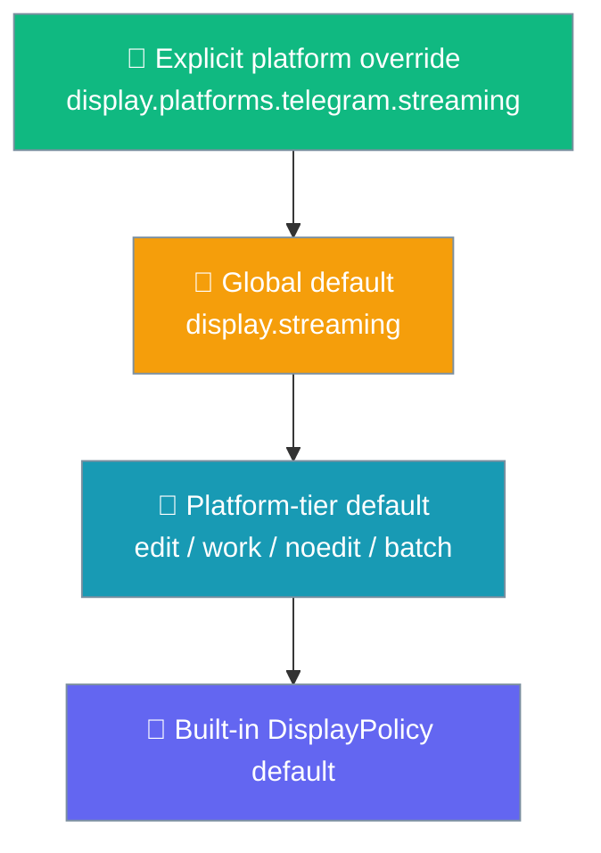
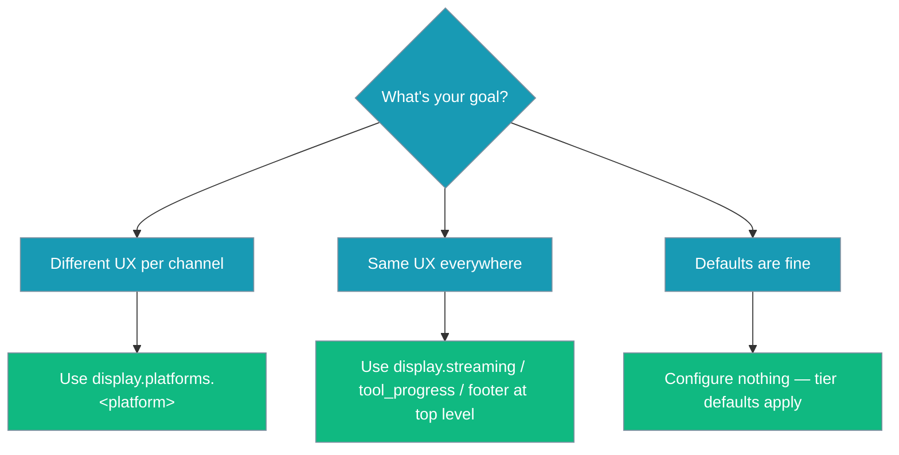

Display Policy controls how an agent's reply is presented on each messaging channel.



## Quick Start

<Steps>

<Step title="Zero config — built-in defaults">

Most operators configure nothing. Telegram automatically streams in `draft` mode; Slack posts discrete progress steps; WhatsApp sends a single final message.

```python
from praisonaiagents import Agent
from praisonai.bots import TelegramBot
from praisonaiagents.bots import BotConfig

agent = Agent(name="assistant", instructions="Be helpful.")
bot = TelegramBot(token="...", agent=agent, config=BotConfig(token="..."))
bot.start()
```

</Step>

<Step title="Global override — same policy on every channel">

```yaml
display:
  streaming: progress     # applies to every channel
  footer: compact

channels:
  telegram: { token: "${TELEGRAM_BOT_TOKEN}" }
  slack:    { token: "${SLACK_BOT_TOKEN}" }
```

</Step>

<Step title="Per-platform override — different UX per channel">

```yaml
display:
  streaming: off          # global default for all channels
  platforms:
    telegram:             # case-insensitive — "Telegram" works too
      streaming: draft
      footer: compact
    slack:
      tool_progress: inline
```

</Step>

</Steps>

---

## How It Works

`resolve_display_policy(platform, config)` walks a four-level precedence ladder and returns the first value found for each setting.



Most operators configure nothing and still get correct UX on every channel — the tier defaults handle it.

---

## Configuration Options

| Option | Type | Default | Allowed values | Description |
|--------|------|---------|----------------|-------------|
| `streaming` | `str` | `"off"` | `"off"`, `"draft"`, `"progress"` | Reply streaming mode. `off` = single final message; `draft` = edit in place; `progress` = compact status then final |
| `tool_progress` | `str` | `"off"` | `"off"`, `"inline"` | Whether tool execution progress is surfaced inline |
| `interim_assistant_messages` | `bool` | `False` | `True` / `False` | Show partial assistant messages, or only the final reply |
| `footer` | `str` | `"off"` | `"off"`, `"compact"` | Runtime footer / status-line appended to replies (e.g. `model · ctx% · cwd`) |

`DisplayPolicy.from_dict()` ignores unknown keys; `to_dict()` round-trips for serialisation.

### Which option do I set?



---

## Platform Tiers

Every known platform belongs to a tier. The tier sets sensible defaults so you don't have to.

| Platform | Tier | `streaming` | `tool_progress` | `interim_assistant_messages` | `footer` |
|----------|------|------------|-----------------|------------------------------|---------|
| `telegram` | `edit` | `"draft"` | `"off"` | `False` | `"off"` |
| `discord` | `edit` | `"draft"` | `"off"` | `False` | `"off"` |
| `slack` | `work` | `"off"` | `"inline"` | `False` | `"off"` |
| `teams` | `work` | `"off"` | `"inline"` | `False` | `"off"` |
| `mattermost` | `work` | `"off"` | `"inline"` | `False` | `"off"` |
| `whatsapp` | `noedit` | `"off"` | `"off"` | `False` | `"off"` |
| `email` | `batch` | `"off"` | `"off"` | `False` | `"off"` |
| `sms` | `batch` | `"off"` | `"off"` | `False` | `"off"` |

**Tier semantics:**

| Tier | Platforms | Behaviour |
|------|-----------|-----------|
| `edit` | Telegram, Discord | Edit-capable personal chats — stream live, hide tool spam |
| `work` | Slack, Teams, Mattermost | Workspace chats — post discrete progress steps |
| `noedit` | WhatsApp | No-edit chats — single final message |
| `batch` | Email, SMS | Batch-only channels — one final message, no interim |

Platforms **not** in this list get the built-in `DisplayPolicy()` defaults: all settings `"off"` / `False`.

---

## Common Patterns

### Stream on Telegram only

```yaml
display:
  streaming: off          # default for all channels
  platforms:
    telegram:
      streaming: draft
```

### Tool progress in Slack

```yaml
display:
  platforms:
    slack:
      tool_progress: inline
```

### Compact footer on all channels

```yaml
display:
  footer: compact
```

### Per-channel footer with streaming

```yaml
display:
  streaming: off
  platforms:
    telegram:
      streaming: draft
      footer: compact
    slack:
      tool_progress: inline
      footer: compact
```

---

## Best Practices

<AccordionGroup>

<Accordion title="Rely on tier defaults — configure nothing to start">
The eight built-in platforms already have sensible tier defaults. Telegram and Discord stream in `draft` mode; Slack and Teams show `inline` tool progress; WhatsApp, Email, and SMS send a single final message. Configure only what you need to override.
</Accordion>

<Accordion title="Override per platform, not globally, when channels differ">
A global `streaming: draft` looks great on Telegram but can flood Slack channels with rapid edits. Use `display.platforms.<platform>` overrides to tailor UX per channel.

```yaml
display:
  streaming: off          # safe global default
  platforms:
    telegram:
      streaming: draft    # stream only where edit-in-place works well
```
</Accordion>

<Accordion title="Platform keys are case-insensitive">
`Telegram`, `telegram`, and `TELEGRAM` all match the same platform. Use whichever casing feels natural in your YAML.
</Accordion>

<Accordion title="Invalid values silently fall back to the default">
If you set `streaming: turbo` (not an allowed value), `DisplayPolicy` silently falls back to `"off"`. String booleans for `interim_assistant_messages` are parsed case-insensitively: `"yes"`, `"true"`, `"1"`, `"on"` → `True`; `"no"`, `"false"`, `"0"`, `"off"` → `False`. Anything else falls back to `False`.
</Accordion>

</AccordionGroup>

---

## Related

<CardGroup cols={2}>
  <Card title="Bot Platform Capabilities" icon="sliders" href="/docs/features/bot-platform-capabilities">
    What the platform CAN do (vs what you WANT) — the capability side of the display story
  </Card>
  <Card title="Bot Streaming Replies" icon="message-pen" href="/docs/features/bot-streaming-replies">
    Lower-level StreamingConfig per channel — `streaming: true` is a shortcut into this
  </Card>
  <Card title="Display System" icon="display" href="/docs/features/display-system">
    Terminal output, TaskOutput, and display callbacks (separate from channel display)
  </Card>
  <Card title="Messaging Bots" icon="message-circle" href="/docs/features/messaging-bots">
    Complete guide to messaging bot setup and features
  </Card>
</CardGroup>
