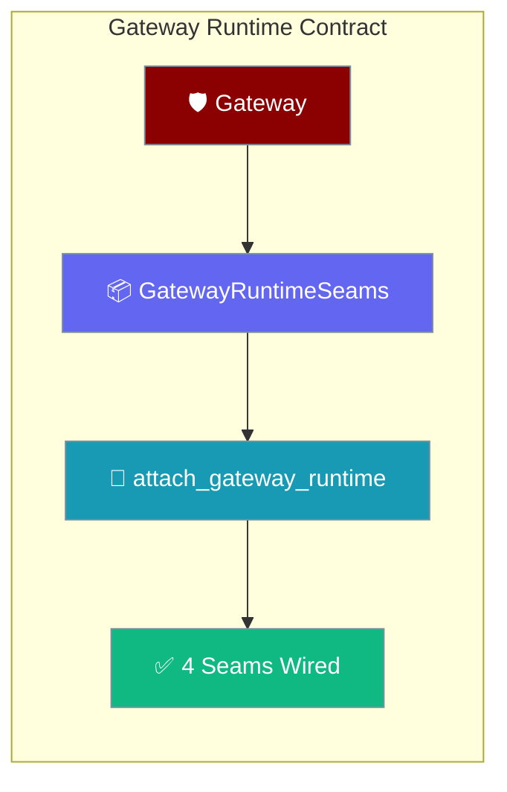
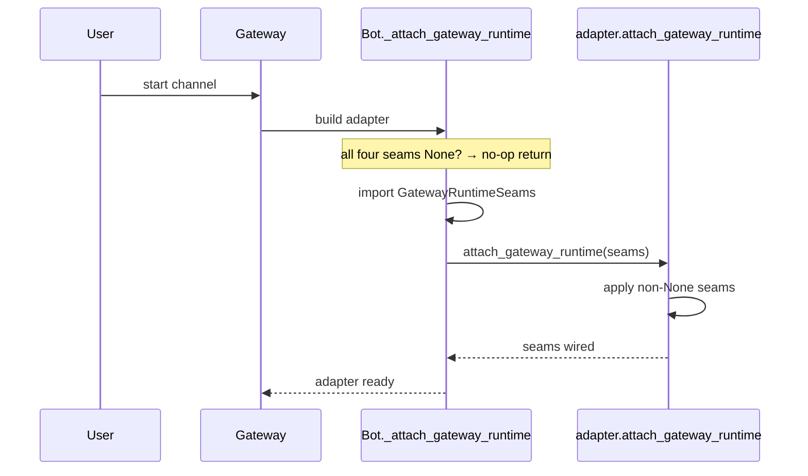
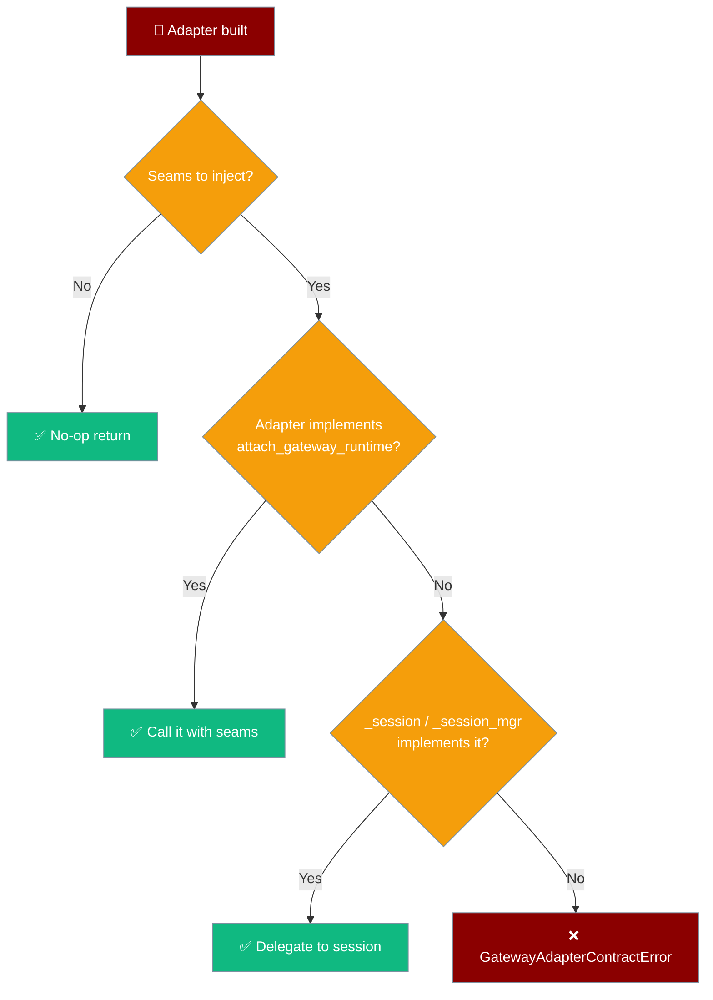

Custom channel adapters implement `SupportsGatewayRuntime` to receive the gateway's four reliability seams; miss the contract and the gateway fails loudly instead of silently dropping admission control, delivery routing, and cross-platform turn locking.



## Quick Start

Adapters that build a `BotSessionManager` satisfy the contract for free; others implement one method.

<Steps>
<Step title="You don't have to do anything">

Delegate to `BotSessionManager` — it already implements the contract, so your adapter inherits it through `self._session`.

```python
from praisonai_bot.bots._session import BotSessionManager


class MyBot:
    def __init__(self, agent):
        # The gateway finds attach_gateway_runtime on self._session
        # and wires all four seams automatically.
        self._session = BotSessionManager(agent=agent)
```

</Step>

<Step title="Implement the contract yourself">

Define `attach_gateway_runtime` and copy each non-`None` seam exactly as `BotSessionManager` does — a `None` seam means "keep what you already have".

```python
from praisonaiagents.bots import GatewayRuntimeSeams, SupportsGatewayRuntime


class MyBot:
    def attach_gateway_runtime(self, runtime: GatewayRuntimeSeams) -> None:
        if runtime.identity_resolver is not None:
            self._identity_resolver = runtime.identity_resolver
        if runtime.delivery_router is not None:
            self._delivery_router = runtime.delivery_router
        if runtime.admission_gate is not None:
            self._admission_gate = runtime.admission_gate
        if runtime.turn_lock_map is not None:
            self._locks = runtime.turn_lock_map


# Runtime-checkable: isinstance confirms the contract is satisfied.
assert isinstance(MyBot(), SupportsGatewayRuntime)
```

</Step>
</Steps>

---

## How It Works

The gateway builds each adapter once, then hands it a typed `GatewayRuntimeSeams` carrier through `attach_gateway_runtime`.



The gateway resolves the target in a fixed order:

| Step | Condition | Outcome |
|------|-----------|---------|
| 1 | All four seams are `None` | Return immediately — pure no-op. |
| 2 | `from praisonaiagents.bots import ...` fails | Fall back to the pre-contract splices (compatibility only). |
| 3 | `adapter.attach_gateway_runtime` is callable | Preferred path — call it with the seams. |
| 4 | `adapter._session` / `adapter._session_mgr` implements it | Built-in path via `BotSessionManager`. |
| 5 | None of the above | Raise `GatewayAdapterContractError`. |

---

## The Four Seams

Each seam maps to a gateway reliability guarantee and a feature doc.

| Field | Type | Default | Description | Feature doc |
|-------|------|---------|-------------|-------------|
| `identity_resolver` | `Optional[Any]` | `None` | Unifies the same human across platforms onto one session key. | [Cross-Platform Mirror](/features/cross-platform-mirror) |
| `delivery_router` | `Optional[Any]` | `None` | Backing router for the `send_message` tool (proactive mid-turn delivery). | [Proactive Delivery](/features/proactive-delivery) |
| `admission_gate` | `Optional[Any]` | `None` | Gateway-wide concurrency ceiling / fair queue / backpressure on inbound runs. | [Gateway Admission Control](/features/gateway-admission-control) |
| `turn_lock_map` | `Optional[Any]` | `None` | Shared per-turn lock map for cross-platform turn serialisation on the resolved session id. | [Cross-Platform Mirror](/features/cross-platform-mirror) |

A seam left `None` means the gateway has nothing to inject for it; leave whatever value you already hold untouched.

---

## The Contract

Three symbols define the contract, all imported from one place.

```python
from praisonaiagents.bots import (
    GatewayRuntimeSeams,
    SupportsGatewayRuntime,
    GatewayAdapterContractError,
)
```

`GatewayRuntimeSeams` is the typed carrier the gateway fills and passes to your adapter.

```python
from dataclasses import dataclass
from typing import Any, Optional


@dataclass
class GatewayRuntimeSeams:
    identity_resolver: Optional[Any] = None
    delivery_router: Optional[Any] = None
    admission_gate: Optional[Any] = None
    turn_lock_map: Optional[Any] = None
```

`SupportsGatewayRuntime` is the runtime-checkable Protocol your adapter satisfies.

```python
from typing import Protocol, runtime_checkable


@runtime_checkable
class SupportsGatewayRuntime(Protocol):
    def attach_gateway_runtime(self, runtime: "GatewayRuntimeSeams") -> None:
        ...
```

`GatewayAdapterContractError` is the loud failure raised when seams cannot be delivered.

```python
class GatewayAdapterContractError(TypeError):
    """Raised when a channel adapter cannot receive the gateway runtime seams."""
```

---

## When `GatewayAdapterContractError` Fires

The gateway raises this error only when it has seams to inject but your adapter neither implements `attach_gateway_runtime` nor exposes a `_session` / `_session_mgr` that does — the raise is intentional, replacing a silent loss of reliability guarantees.



The fix is one of the two Quick Start options: build a `BotSessionManager` on `self._session`, or implement `attach_gateway_runtime` directly.

---

## Compatibility

The wrapper permits `praisonaiagents >= 1.6.152`; on a core that predates the contract the import in step 2 fails and the gateway transparently falls back to the pre-contract private-attribute splices (`_identity_resolver`, `_delivery_router`, `_admission_gate`, `_locks`) written onto `adapter._session` or `adapter._session_mgr`.

<Note>
The legacy fallback is a compatibility shim, not a public API. Write to the contract (`attach_gateway_runtime`) — the fallback exists solely so older-but-supported installs keep wiring the seams.
</Note>

---

## Best Practices

<AccordionGroup>
<Accordion title="Delegate to BotSessionManager when you can">
If your adapter already builds a `BotSessionManager`, expose it as `self._session` and do nothing else. The gateway finds `attach_gateway_runtime` on the session and wires all four seams for free.
</Accordion>

<Accordion title="Apply only non-None seams">
Every seam is optional. A `None` seam means the gateway has nothing for it — leave your existing value in place. Copy each attribute only when it is not `None`, exactly as the reference implementation does.
</Accordion>

<Accordion title="Let the contract error fire — don't suppress it">
`GatewayAdapterContractError` means the gateway had reliability seams to inject and your adapter could not receive them. Fix the adapter rather than catching the error; suppressing it silently drops admission control, delivery routing, identity resolution, and per-turn locking.
</Accordion>

<Accordion title="Migrating an old duck-typed adapter">
If your adapter previously relied on the gateway splicing `_session._identity_resolver` and friends, add a single `attach_gateway_runtime` method that assigns each non-`None` seam to the same slot. This makes the wiring explicit and passes the `SupportsGatewayRuntime` isinstance check.
</Accordion>
</AccordionGroup>

---

## Related

<CardGroup cols={2}>
<Card title="Bot Platform Plugins" icon="puzzle-piece" href="/features/bot-platform-plugins">
  Register a custom platform adapter with `register_platform(name, cls)`.
</Card>
<Card title="Bot Platform Adapter" icon="plug" href="/features/bot-platform-adapter">
  Build a channel adapter by subclassing `BasePlatformAdapter`.
</Card>
<Card title="Gateway Admission Control" icon="gauge-high" href="/features/gateway-admission-control">
  The admission gate seam — concurrency ceiling and backpressure.
</Card>
<Card title="Cross-Platform Mirror" icon="users" href="/features/cross-platform-mirror">
  The identity resolver and turn lock map seams across platforms.
</Card>
</CardGroup>
