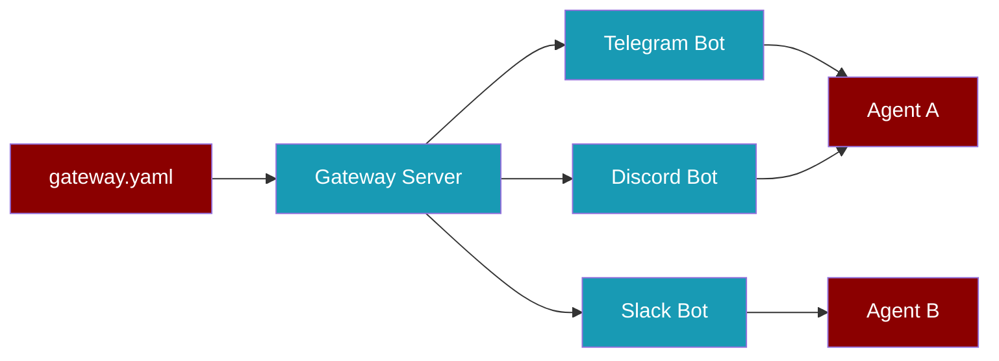

Run all your bots from one command. The Gateway Server manages multiple bot connections and routes messages to the right AI agent.

## Quick Start

<Steps>
  <Step title="Install PraisonAI">
    ```bash
    pip install praisonai
    ```
  </Step>

  <Step title="Create gateway.yaml">
    Create a `gateway.yaml` file in your project:
    ```yaml
    gateway:
      host: "127.0.0.1"
      port: 8765

    agents:
      personal:
        instructions: "You are a helpful personal assistant"
        model: gpt-4o-mini
      support:
        instructions: "You are a customer support agent"
        model: gpt-4o

    channels:
      telegram:
        token: ${TELEGRAM_BOT_TOKEN}
        routes:
          dm: personal
          group: support
          default: personal
      discord:
        token: ${DISCORD_BOT_TOKEN}
        routes:
          default: personal
    ```
  </Step>

  <Step title="Set Environment Variables">
    ```bash
    export TELEGRAM_BOT_TOKEN=your_telegram_token
    export DISCORD_BOT_TOKEN=your_discord_token
    export OPENAI_API_KEY=your_openai_key
    ```
  </Step>

  <Step title="Start the Gateway">
    ```bash
    praisonai gateway start --config gateway.yaml
    ```
    All bots start together. Messages are routed to the correct agent automatically.
  </Step>
</Steps>

## Supported Channels

<CardGroup cols={3}>
  <Card title="Telegram" icon="paper-plane">
    Full support for DMs, groups, commands, voice, and media.
  </Card>
  <Card title="Discord" icon="discord">
    Guild channels, DMs, slash commands, and embeds.
  </Card>
  <Card title="Slack" icon="slack">
    Socket Mode, channels, DMs, slash commands, and threads.
  </Card>
</CardGroup>

## Configuration Reference

### Gateway Section

| Field | Type | Default | Description |
|-------|------|---------|-------------|
| **host** | string | `127.0.0.1` | Address to bind the gateway server |
| **port** | integer | `8765` | Port for the WebSocket server |

### Agents Section

Each agent is defined by a unique ID and its configuration:

```yaml
agents:
  my_agent_id:
    instructions: "Your system prompt here"
    model: gpt-4o-mini        # LLM model to use
    memory: true               # Enable conversation memory
```

### Channels Section

Each channel maps to a bot platform:

```yaml
channels:
  telegram:
    token: ${TELEGRAM_BOT_TOKEN}    # Environment variable
    routes:
      dm: personal                   # DMs → personal agent
      group: support                 # Groups → support agent
      default: personal              # Fallback agent
```

<Tip>
Use `${ENV_VAR_NAME}` syntax in token fields. The gateway automatically reads from your environment variables.
</Tip>

## CLI Commands

<CodeGroup>
```bash Start Gateway
praisonai gateway start --config gateway.yaml
```

```bash Start with Custom Host/Port
praisonai gateway start --config gateway.yaml --host 0.0.0.0 --port 9000
```

```bash Check Gateway Status
praisonai gateway status
```
</CodeGroup>

## Python Usage

You can also start the gateway programmatically:

```python
import asyncio
from praisonai.gateway import WebSocketGateway
from praisonaiagents import Agent
from praisonaiagents.gateway import GatewayConfig

# Create agents
personal = Agent(name="personal", instructions="You are a helpful assistant")
support = Agent(name="support", instructions="You are a support agent")

# Create gateway
config = GatewayConfig(host="127.0.0.1", port=8765)
gateway = WebSocketGateway(config=config)

# Register agents
gateway.register_agent(personal, agent_id="personal")
gateway.register_agent(support, agent_id="support")

# Start gateway
asyncio.run(gateway.start())
```

<Accordion title="Advanced: Health Endpoint">
  The gateway exposes a health endpoint at `http://host:port/health`:
  
  ```bash
  curl http://127.0.0.1:8765/health
  ```
  
  Returns:
  ```json
  {
    "status": "healthy",
    "uptime": 120.5,
    "agents": 2,
    "sessions": 3,
    "clients": 1
  }
  ```
</Accordion>

<Accordion title="Advanced: Standalone Bot Mode">
  You can still run a single bot without the gateway:
  
  ```bash
  praisonai bot telegram --token $TELEGRAM_BOT_TOKEN
  ```
  
  This starts just one bot connected to a single agent — no gateway needed.
</Accordion>

<Warning>
Never commit bot tokens to version control. Always use environment variables or a `.env` file.
</Warning>
