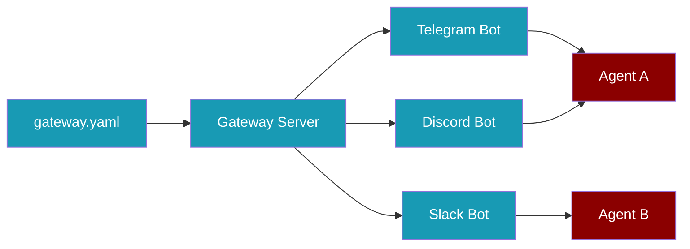
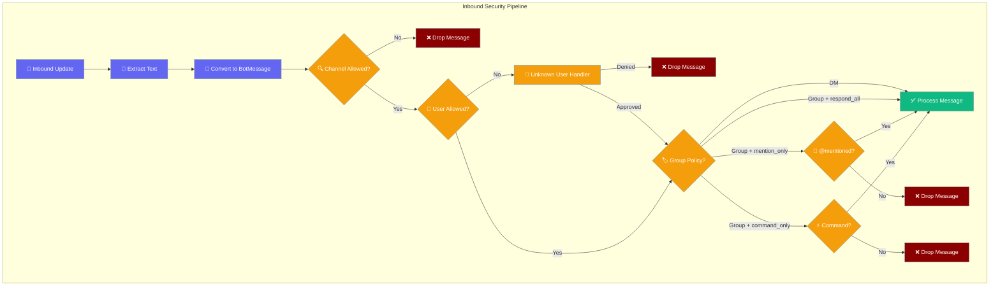

```python
from praisonaiagents import Agent

agent = Agent(name="gateway-bot", instructions="Handle messages from Telegram, Slack, and Discord.")
agent.start("Set up the bot gateway for all chat platforms.")
```



```mermaid
flowchart LR
    Config[gateway.yaml] --> Gateway[Gateway Server]
    Gateway --> TG[Telegram Bot]
    Gateway --> DC[Discord Bot]
    Gateway --> SL[Slack Bot]
    TG --> AgentA[Agent A]
    DC --> AgentA
    SL --> AgentB[Agent B]
    
    classDef agent fill:#8B0000,color:#fff
    classDef tool fill:#189AB4,color:#fff
    
    class AgentA,AgentB agent
    class Config,Gateway,TG,DC,SL tool
```

Run all your bots from one command. The Gateway Server manages multiple bot connections and routes messages to the right AI agent.

**Parity with Bot()**: `praisonai gateway start` now applies the same smart defaults as `praisonai bot start`, resolving the previous "zero tools in daemon mode" issue. Both entry points produce identical behavior with safe tools auto-injected and auto-approval enabled by default.

Each channel bot gets an isolated agent via `Agent.clone_for_channel()` — fresh locks, fresh interrupt controller, and no shared `handoffs` state — so configuring tools or memory on one channel never leaks into another.

## Quick Start

<Steps>
  <Step title="Install PraisonAI">
    ```bash
    pip install praisonai
    ```
  </Step>

  <Step title="Create gateway.yaml">
    Create a `gateway.yaml` file in your project (Gateway YAML files are read as UTF-8 — non-ASCII characters work on all platforms including Windows):
    ```yaml
    gateway:
      host: "127.0.0.1"
      port: 8765

    agents:
      personal:
        instructions: "You are a helpful personal assistant"
        model: gpt-4o-mini
        tools:
          - internet_search
          - get_current_time
        reflection: true
      support:
        instructions: "You are a customer support agent"
        model: gpt-4o
        role: "Customer Support Specialist"
        goal: "Resolve customer issues quickly and accurately"
        backstory: "Expert in troubleshooting and customer care"
        tools:
          - internet_search
        tool_choice: auto
        allow_delegation: false

    channels:
      telegram:
        token: ${TELEGRAM_BOT_TOKEN}
        streaming:
          mode: draft       # off | draft | progress — see /features/bot-streaming-replies
        routes:
          dm: personal
          group: support
          default: personal
      discord:
        token: ${DISCORD_BOT_TOKEN}
        routes:
          default: personal
    ```
  </Step>

  <Step title="Set Environment Variables">
    ```bash
    export TELEGRAM_BOT_TOKEN=your_telegram_token
    export DISCORD_BOT_TOKEN=your_discord_token
    export OPENAI_API_KEY=your_openai_key
    ```
  </Step>

  <Step title="Start the Gateway">
    ```bash
    praisonai gateway start --config gateway.yaml
    ```
    All bots start together. Messages are routed to the correct agent automatically.
  </Step>
</Steps>

## Supported Channels

<CardGroup cols={2}>
  <Card title="Telegram" icon="paper-plane">
    Full support for DMs, groups, commands, voice, and media.
  </Card>
  <Card title="Discord" icon="discord">
    Guild channels, DMs, slash commands, and embeds.
  </Card>
  <Card title="Slack" icon="slack">
    Socket Mode, channels, DMs, slash commands, and threads.
  </Card>
  <Card title="WhatsApp" icon="whatsapp">
    Cloud API and Web mode. DMs, groups, media support.
  </Card>
</CardGroup>

<Note>
**Windows users:** Gateway Telegram error replies are automatically sanitized to ASCII-safe text — non-ASCII exception content (warning symbols, emoji, accented characters) no longer crashes the error handler with a `charmap` codec error. Real underlying errors (quota, rate limit, auth) surface cleanly.
</Note>

## Configuration Reference

### Gateway Section

| Field | Type | Default | Description |
|-------|------|---------|-------------|
| **host** | string | `127.0.0.1` | Address to bind the gateway server |
| **port** | integer | `8765` | Port for the WebSocket server |

### Agents Section

Each agent is defined by a unique ID and its configuration:

```yaml
agents:
  my_agent_id:
    instructions: "Your system prompt here"
    model: gpt-4o-mini
    memory: true
    tools:
      - internet_search
      - get_current_time
    reflection: true
    role: "Research Analyst"
    goal: "Find accurate information"
    backstory: "Expert researcher"
    tool_choice: auto
    allow_delegation: false
```

| Field | Type | Default | Description |
|-------|------|---------|-------------|
| **instructions** | string | `""` | System prompt for the agent |
| **model** | string | `None` | LLM model (e.g., `gpt-4o-mini`, `gpt-4o`) |
| **memory** | boolean | `false` | Enable conversation memory |
| **tools** | list | `[]` | Tool names resolved via ToolResolver |
| **reflection** | boolean | `true` | Enable self-reflection / interactive mode |
| **role** | string | `None` | Agent role (CrewAI-style) |
| **goal** | string | `None` | Agent goal (CrewAI-style) |
| **backstory** | string | `None` | Agent backstory (CrewAI-style) |
| **tool_choice** | string | `None` | `auto`, `required`, or `none` |
| **allow_delegation** | boolean | `false` | Allow task delegation to other agents |

### Channels Section

Each channel maps to a bot platform:

```yaml
channels:
  telegram:
    token: ${TELEGRAM_BOT_TOKEN}    # Environment variable
    routes:
      dm: personal                   # DMs → personal agent
      group: support                 # Groups → support agent
      default: personal              # Fallback agent
```

<Tip>
Use `${ENV_VAR_NAME}` syntax in token fields. The gateway automatically reads from your environment variables.
</Tip>

### Channel Security

Each channel enforces the same access-control pipeline as standalone bots.

| YAML Key | Type | Default | Purpose |
|----------|------|---------|---------|
| `token` | `str` | required* | Bot auth token. *Optional for `whatsapp` web mode and `email`/`agentmail`. |
| `platform` | `str` | channel name | Override channel platform (e.g. `telegram`). |
| `routing` / `routes` | `dict` | `{"default": "default"}` | Route map: `dm`, `group`, `default` → agent id. |
| `allowed_users` | `list[str]` \| `str` | `[]` | User-ID allowlist. Comma-separated string also accepted (env-expansion friendly). |
| `allowed_channels` | `list[str]` \| `str` | `[]` | Channel/group-ID allowlist. Same string handling. |
| `group_policy` | `str` | `"mention_only"` | One of `"mention_only"`, `"command_only"`, `"respond_all"`. Sets `mention_required` automatically. |
| `auto_approve_tools` | `bool` \| `str` | `True` | Auto-approve safe tools. Strings `"1"/"true"/"yes"/"on"` are truthy. |
| `default_tools` | `list[str]` | (BotConfig default) | Per-channel override for default safe tools. |

```yaml
channels:
  telegram_support:
    token: ${TELEGRAM_BOT_TOKEN}
    allowed_users:                # User-ID allowlist (empty list → unknown_user_policy decides)
      - "123456789"
      - "987654321"
    allowed_channels:             # Group/channel allowlist (empty = anywhere)
      - "-1001234567890"
    group_policy: "mention_only"  # mention_only | command_only | respond_all
    auto_approve_tools: true      # Auto-approve safe tools (default true)
    routes:
      dm: personal
      group: support
      default: personal
```


```mermaid
graph TB
    subgraph "Inbound Security Pipeline"
        Message[📨 Inbound Update] --> Extract[📝 Extract Text]
        Extract --> Convert[🔄 Convert to BotMessage]
        Convert --> Check1{🔍 Channel Allowed?}
        Check1 -->|No| Drop1[❌ Drop Message]
        Check1 -->|Yes| Check2{👤 User Allowed?}
        Check2 -->|No| Pairing[🤝 Unknown User Handler]
        Pairing -->|Denied| Drop2[❌ Drop Message]
        Pairing -->|Approved| Check3{🏷️ Group Policy?}
        Check2 -->|Yes| Check3
        Check3 -->|DM| Process[✅ Process Message]
        Check3 -->|Group + mention_only| Mention{💬 @mentioned?}
        Check3 -->|Group + command_only| Command{⚡ Command?}
        Check3 -->|Group + respond_all| Process
        Mention -->|Yes| Process
        Mention -->|No| Drop3[❌ Drop Message]
        Command -->|Yes| Process
        Command -->|No| Drop4[❌ Drop Message]
    end
    
    classDef input fill:#6366F1,stroke:#7C90A0,color:#fff
    classDef check fill:#F59E0B,stroke:#7C90A0,color:#fff
    classDef success fill:#10B981,stroke:#7C90A0,color:#fff
    classDef drop fill:#8B0000,stroke:#7C90A0,color:#fff
    
    class Message,Extract,Convert input
    class Check1,Check2,Check3,Mention,Command,Pairing check
    class Process success
    class Drop1,Drop2,Drop3,Drop4 drop
```

<Warning>
**`allowed_users` interacts with `unknown_user_policy`.** With an empty `allowed_users` list, every Telegram user is treated as "unknown" and the `unknown_user_policy` decides their fate:
- `"deny"` (default) — all messages silently dropped (recommended for production).
- `"pair"` — unknown users go through the owner-approval pairing flow.
- `"allow"` — every user is let through (only set this in trusted networks).

Earlier releases incorrectly treated empty `allowed_users` as "allow everyone" on Telegram, bypassing the policy entirely. Fixed in [PR #1885](https://github.com/MervinPraison/PraisonAI/pull/1885). Discord and Slack were already correct.
</Warning>

<Note>
As of PR #1791, gateway-mode bots enforce the same security pipeline as standalone bots (`praisonai bot start`). Previous versions silently bypassed `allowed_users`, pairing, and `group_policy` in gateway mode.
</Note>

<Note>
Pair with `unknown_user_policy: "deny"` for the most secure default. To intentionally allow everyone (e.g. internal staging), leave `allowed_users` empty **and** set `unknown_user_policy: "allow"` — both are required.
</Note>

### Interactive presentations (optional)

`GatewayMessage` carries an optional `presentation: MessagePresentation` field. When set, channel adapters that implement [`SupportsPresentation`](/docs/features/bot-presentations) render it as a native widget (Telegram inline keyboard, Slack Block Kit, Discord components). Channels that do not implement the protocol fall back to the message's plain-text `content`. See [Interactive Bot Messages](/docs/features/bot-presentations) for the full presentation model.

## Hot-Reload

Editing `gateway.yaml` while the gateway runs triggers a diff-driven reload — only affected agents or channels restart. The WebSocket server stays up.

See [Gateway Hot-Reload](/docs/features/gateway-hot-reload) for the full restart-scope table.

## CLI Commands

<CodeGroup>
```bash Start Gateway
praisonai gateway start --config gateway.yaml
```

```bash Start with Custom Host/Port
praisonai gateway start --config gateway.yaml --host 0.0.0.0 --port 9000
```

```bash Check Gateway Status
praisonai gateway status
```
</CodeGroup>

## Python Usage

<Tabs>
<Tab title="From YAML">
```python
from praisonai.gateway import WebSocketGateway

# Load gateway config, agents, and channels from YAML
gateway = WebSocketGateway.from_config_file("gateway.yaml")

import asyncio
asyncio.run(gateway.start())
```

<Tip>
`from_config_file()` automatically resolves `${ENV_VAR}` syntax in your YAML, creates agents with tools, and configures channel bots.
</Tip>
</Tab>

<Tab title="Programmatic">
```python
import asyncio
from praisonai.gateway import WebSocketGateway
from praisonaiagents import Agent
from praisonaiagents.gateway import GatewayConfig

# Create agents
personal = Agent(name="personal", instructions="You are a helpful assistant")
support = Agent(name="support", instructions="You are a support agent")

# Create gateway
config = GatewayConfig(host="127.0.0.1", port=8765)
gateway = WebSocketGateway(config=config)

# Register agents (use overwrite=False to prevent accidental replacement)
gateway.register_agent(personal, agent_id="personal")
gateway.register_agent(support, agent_id="support", overwrite=False)

# Start gateway
asyncio.run(gateway.start())
```
</Tab>

<Tab title="Inspect Bots">
```python
# After starting the gateway, inspect connected channel bots
gateway.list_channel_bots()      # ['telegram', 'discord']
gateway.get_channel_bot("telegram")  # Returns bot instance
gateway.has_channel_bot("slack")     # False

# Inspect registered agents
gateway.list_agents()            # ['personal', 'support']
gateway.get_agent("personal")    # Returns Agent instance
```
</Tab>
</Tabs>

<Accordion title="Advanced: Health Endpoint">
  The gateway exposes a health endpoint at `http://host:port/health`:
  
  ```bash
  curl http://127.0.0.1:8765/health
  ```
  
  Returns:
  ```json
  {
    "status": "healthy",
    "uptime": 120.5,
    "agents": 2,
    "sessions": 3,
    "clients": 1,
    "channels": {
      "telegram": {
        "platform": "telegram",
        "running": true
      },
      "discord": {
        "platform": "discord", 
        "running": false
      }
    },
    "push": {
      "enabled": true,
      "push_channels": 2,
      "online_clients": 5,
      "redis_connected": true
    }
  }
  ```
  
  The `push` section is only included when push notifications are enabled.
</Accordion>

<Accordion title="Advanced: Channel isolation">
  The gateway calls `_create_bot()` to build independent clones for each channel:

  ```mermaid
  flowchart TB
      Base[🤖 Base Agent] --> Gateway[Gateway Server]
      Gateway --> Clone1[📱 Telegram Clone]
      Gateway --> Clone2[💬 Discord Clone] 
      Gateway --> Clone3[📺 Slack Clone]
      
      style Base fill:#8B0000,color:#fff
      style Gateway fill:#189AB4,color:#fff
      style Clone1,Clone2,Clone3 fill:#10B981,color:#fff
  ```

  Each clone has fresh locks and interrupt controllers, preventing cross-channel interference. Learn more about [Agent Cloning](/features/agent-cloning).
</Accordion>

<Accordion title="Advanced: Standalone Bot Mode">
  You can still run a single bot without the gateway:
  
  ```bash
  praisonai bot telegram --token $TELEGRAM_BOT_TOKEN
  ```
  
  This starts just one bot connected to a single agent — no gateway needed.
</Accordion>

<Warning>
Never commit bot tokens to version control. Always use environment variables or a `.env` file.
</Warning>

## BotOS Options

When creating a `BotOS` instance in Python, the following options control gateway-level behaviour:

| Field | Type | Default | Description |
|-------|------|---------|-------------|
| `bots` | `list[Bot]` | `[]` | Pre-built Bot instances to orchestrate |
| `agent` | `Agent` | `None` | Shared agent for auto-created bots (used with `platforms`) |
| `platforms` | `list[str]` | `None` | Platform names; creates one Bot per platform using the shared `agent` |
| `health_monitor` | `HealthMonitorConfig` | `None` | Channel health monitoring configuration |
| `enable_supervision` | `bool` | `True` | Enable automatic channel supervision and recovery |
| `idle_policy` | `GatewayIdlePolicyProtocol` | `None` | When set, schedules an idle-dormancy loop that quiesces transports after inactivity. Default `None` = always-on. See [Scale-to-Zero Gateway](/docs/features/gateway-scale-to-zero). |

```python
from praisonaiagents import Agent
from praisonai.bots import BotOS, Bot
from praisonaiagents.gateway import ScaleToZeroPolicy

agent = Agent(name="assistant", instructions="Help users")

botos = BotOS(
    bots=[Bot("telegram", agent=agent)],
    idle_policy=ScaleToZeroPolicy(
        idle_timeout_minutes=5,
        wake_url="https://my-bot.fly.dev/_wake",
    ),
)
botos.run()
```

## Observability

<CardGroup cols={2}>
  <Card icon="chart-line" href="/features/gateway-metrics" title="Gateway Metrics">
    Scrape `GET /metrics` for Prometheus-format counters and gauges on every
    hop of the message flow — no extra dependencies.
  </Card>
  <Card icon="link" href="/features/correlation-ids" title="Correlation IDs">
    One stable id joins ingress, session, and agent-run logs for every turn.
    Read it inside any tool with `current_correlation_id()`.
  </Card>
</CardGroup>

## Best Practices

<AccordionGroup>
  <Accordion title="Lock down empty allowlists">
    Leave `allowed_users` empty only with `unknown_user_policy: "deny"` for production. Pairing mode is fine for personal bots; public gateways need explicit allowlists.
  </Accordion>
  <Accordion title="Route by channel context">
    Map `dm`, `group`, and `default` to different agents when support and personal assistants should not share memory or tools. Isolated clones prevent cross-channel leakage.
  </Accordion>
  <Accordion title="Use environment variables for tokens">
    Reference tokens as `${TELEGRAM_BOT_TOKEN}` in YAML — never commit secrets. Gateway resolves env vars at load time on all platforms including Windows.
  </Accordion>
  <Accordion title="Monitor via /health and /metrics">
    Poll the health endpoint during deploys and wire [Gateway Metrics](/docs/features/gateway-metrics) into Prometheus for message-flow visibility.
  </Accordion>
</AccordionGroup>

## Related

<CardGroup cols={2}>
  <Card icon="shield" href="/features/gateway-bind-aware-auth" title="Bind-Aware Auth">
    Token auth and loopback bypass for gateway operational endpoints.
  </Card>
  <Card icon="triangle-alert" href="/features/gateway-error-handling" title="Gateway Error Handling">
    Supervision, restarts, and error recovery in the gateway.
  </Card>
  <Card icon="chart-line" href="/features/gateway-metrics" title="Gateway Metrics">
    Prometheus-format message-flow metrics from `GET /metrics`.
  </Card>
  <Card icon="link" href="/features/correlation-ids" title="Correlation IDs">
    Join ingress, session, and agent-run logs on one stable id per message.
  </Card>
</CardGroup>
