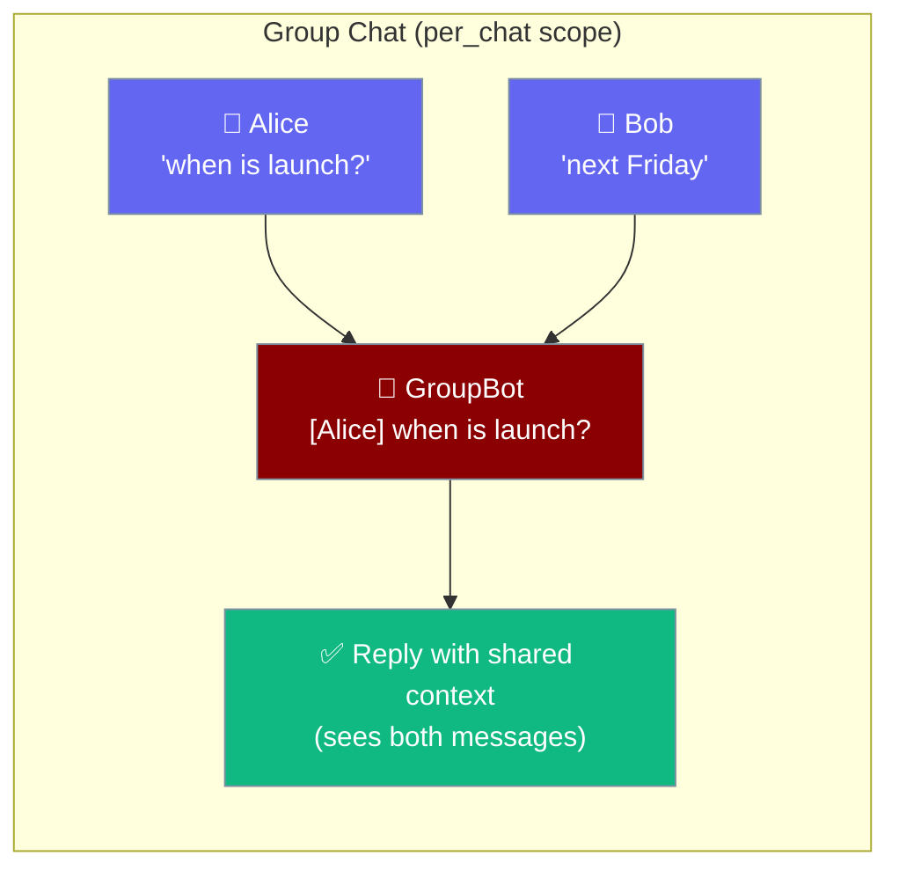
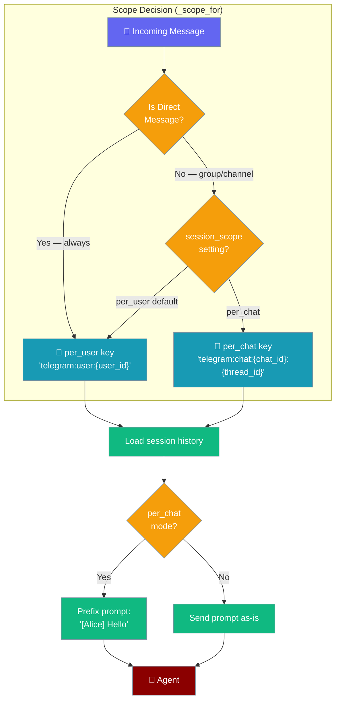
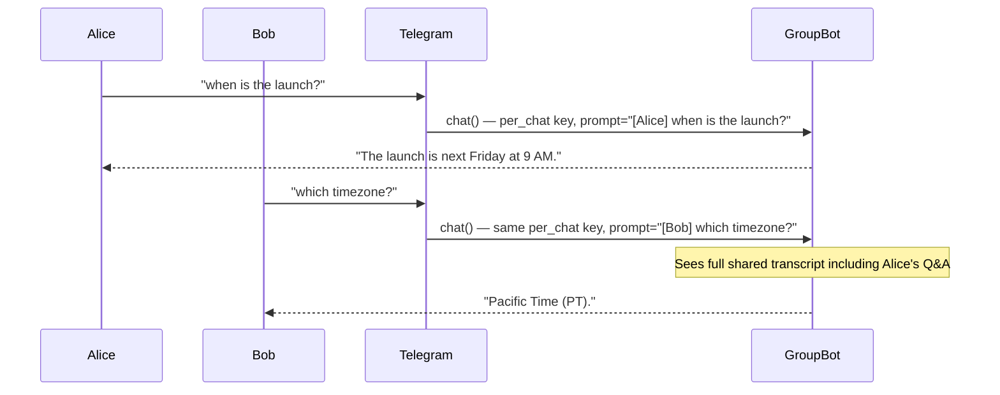

Group sessions let every member of a Telegram group, Slack channel, or Discord server share one conversation transcript with your bot — the agent sees who said what and responds with full context.



## Quick Start

<Steps>

<Step title="Create config.yaml">

```yaml
# config.yaml
gateway:
  bots:
    - platform: telegram
  session:
    session_scope: per_chat
    attribution: "[{sender}] "
```

</Step>

<Step title="Run the bot">

```python
from praisonaiagents import Agent
from praisonai.bots import run_gateway

agent = Agent(
    name="GroupBot",
    instructions="Be a helpful participant in the group chat.",
)

run_gateway(agent, config="config.yaml")
```

</Step>

</Steps>

That's it. In a Telegram group of three people, the agent receives `[Alice] when is the launch?` … `[Bob] next Friday` and answers from one shared transcript.

---

## How It Works



### Scope routing rules

| Context | `session_scope: per_user` | `session_scope: per_chat` |
|---------|--------------------------|--------------------------|
| Direct message (DM) | `telegram:user:{user_id}` | `telegram:user:{user_id}` (forced) |
| Group / channel | `telegram:user:{user_id}` | `telegram:chat:{chat_id}:{thread_id}` |

DMs **always use `per_user`** even when `per_chat` is enabled. This ensures private conversations stay private.

### Sender attribution

When `session_scope: per_chat` is active, every inbound message is prefixed with the sender's display name before reaching the agent:

```
[Alice] when is the launch?
[Bob] next Friday
```

The attribution template is configurable:

| Placeholder | Value |
|-------------|-------|
| `{sender}` | Display name of the message sender |
| `{time}` | Wall-clock time the message arrived |

Default template: `"[{sender}] "` — a name in brackets followed by a space.

---

## User Interaction Flow



---

## Configuration Options

Configure session scope under the `gateway.session` or channel-level `session` block:

```yaml
gateway:
  session:
    session_scope: per_chat        # per_user (default) | per_chat
    attribution: "[{sender}] "     # template applied in per_chat mode only
```

Or per-channel to override the gateway default:

```yaml
channels:
  telegram:
    token: ${TELEGRAM_BOT_TOKEN}
    session:
      session_scope: per_chat
      attribution: "[{sender} @ {time}] "
```

| Option | Type | Default | Description |
|--------|------|---------|-------------|
| `session_scope` | `str` | `"per_user"` | `"per_user"` — isolated per user; `"per_chat"` — shared per group/channel |
| `attribution` | `str` | `"[{sender}] "` | Prefix template applied to each prompt in `per_chat` mode. Supports `{sender}` and `{time}` placeholders. Only applied in group context. |

<Note>
Invalid `session_scope` values fall back to `per_user` silently.
</Note>

---

## Common Patterns

**Team standup bot** — all members share the same running transcript so the bot can summarise the full conversation at the end:

```yaml
gateway:
  session:
    session_scope: per_chat
    attribution: "[{sender}] "
```

**Threaded Slack discussion** — thread IDs are included in the session key so each thread gets its own shared context:

```yaml
channels:
  slack:
    token: ${SLACK_BOT_TOKEN}
    app_token: ${SLACK_APP_TOKEN}
    session:
      session_scope: per_chat
```

**Timestamped audit log** — see exactly when each message was sent:

```yaml
gateway:
  session:
    session_scope: per_chat
    attribution: "[{sender} @ {time}] "
```

---

## Resetting a Group Session

`/new` in a group chat clears the **shared** session — not just the sender's history. All group members start with a blank slate on the next message.

<Warning>
In `per_chat` mode, `/new` clears the shared group transcript. Any member can reset the conversation for everyone in the group. See [Bot Session Reset](/docs/features/bot-session-reset) for automatic reset policies.
</Warning>

---

## Best Practices

<AccordionGroup>

<Accordion title="When to use per_chat vs per_user">
Use `per_chat` when the conversation **belongs to the group** — brainstorming, project planning, team Q&A, shared knowledge retrieval.

Keep `per_user` (the default) when each person needs **a private session** — personal assistants, sensitive queries, or workflows where one user's context should not be visible to others.

DMs always remain `per_user` regardless of this setting.
</Accordion>

<Accordion title="Attribution template design">
The default `"[{sender}] "` is readable and compact. For audit-heavy bots, add `{time}`:

```
attribution: "[{sender} @ {time}] "
```

Keep the prefix short — it prepends every message, so very long templates inflate context quickly.

The `{sender}` value is the display name provided by the platform (Telegram first name, Slack display name, Discord username). It is **not** the user ID, so it may be non-unique in large groups.
</Accordion>

<Accordion title="Context size in busy groups">
Shared sessions grow faster than per-user sessions because all members contribute turns. Combine `per_chat` with a reset policy or compaction to keep context manageable:

```yaml
channels:
  telegram:
    token: ${TELEGRAM_BOT_TOKEN}
    session:
      session_scope: per_chat
      max_history: 50
      reset:
        mode: idle
        idle_minutes: 60
```

See [Bot Session Reset](/docs/features/bot-session-reset) and [Bot Session Compaction](/docs/features/bot-session-compaction).
</Accordion>

<Accordion title="Thread isolation on Slack and Discord">
Slack threads and Discord forum threads produce a unique `thread_id`. Each thread gets its **own** shared key, so a `#general` channel and a `#general → thread` conversation never share history. This is automatic — no extra configuration needed.
</Accordion>

</AccordionGroup>

---

## Related

<CardGroup cols={2}>
  <Card title="Bot Gateway" icon="server" href="/docs/features/bot-gateway">
    Run multiple bots from one gateway server
  </Card>
  <Card title="Bot Session Reset" icon="rotate" href="/docs/features/bot-session-reset">
    Automatic and manual session reset policies
  </Card>
  <Card title="Gateway Session Continuity" icon="shield-check" href="/docs/features/gateway-session-continuity">
    Durable sessions that survive restarts
  </Card>
  <Card title="Bot Session Compaction" icon="compress" href="/docs/features/bot-session-compaction">
    Summarise old turns to keep context lean
  </Card>
</CardGroup>
