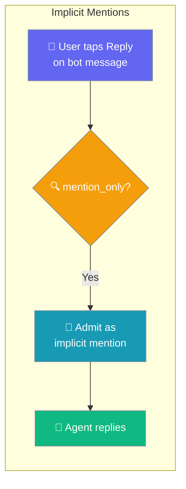
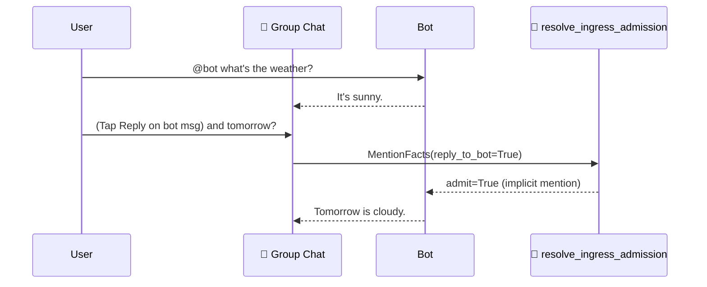

In a `mention_only` group, tapping **Reply** on the bot's own message counts as addressing it — the follow-up is answered without re-typing `@bot`.



The "aha" scenario — Alice in a Telegram group set to `group_policy: mention_only`:

```
Alice:  @planning_bot what's on today?
Bot:    You have 3 meetings.
Alice:  (taps Reply on the bot's message) And tomorrow?
Bot:    Tomorrow you have 2 meetings and a demo.
```

Before this change the follow-up was silently dropped because there was no `@planning_bot` in the text. Now the natural "reply to the bot" continues the conversation.

## Quick Start

<Steps>
<Step title="Default: reply-to-bot just works">
Set `group_policy: mention_only` — a reply to the bot is admitted with no extra config.

```yaml
# gateway.yaml
channels:
  telegram:
    token: ${TELEGRAM_BOT_TOKEN}
    group_policy: mention_only    # reply-to-bot counts by default
```
</Step>

<Step title="Enable quote as an implicit mention">
Add `quote` when you also want a quoted/forwarded bot message to count.

```yaml
channels:
  telegram:
    token: ${TELEGRAM_BOT_TOKEN}
    group_policy: mention_only
    implicit_mentions: ["reply", "quote"]
```
</Step>

<Step title="Disable implicit mentions (strict @-only)">
An empty list requires a literal `@bot` on every message.

```yaml
channels:
  telegram:
    token: ${TELEGRAM_BOT_TOKEN}
    group_policy: mention_only
    implicit_mentions: []         # strict: only @bot admits
```
</Step>
</Steps>

---

## How It Works

The adapter reports *how* the bot was addressed as structured facts; the admission primitive admits the message when an enabled implicit signal is present.



An explicit `@bot` always counts. Each implicit signal counts only when its name is listed in `implicit_mentions`.

| Signal | Meaning | Default |
|--------|---------|---------|
| `reply` | The message replies to a previous bot message | ✅ on |
| `quote` | The message quotes/forwards a previous bot message | ❌ off |
| `thread` | The message is in a thread the bot participates in | ❌ off |

```python
from praisonaiagents.bots import (
    MentionFacts,
    resolve_ingress_admission,
    DEFAULT_IMPLICIT_MENTIONS,
)

# A reply to the bot in a mention_only group — admitted by default.
decision = resolve_ingress_admission(
    chat_type="group",
    sender_id="123",
    mention=MentionFacts(reply_to_bot=True),
    group_policy="mention_only",
)
print(decision.admit)                 # True
print(DEFAULT_IMPLICIT_MENTIONS)      # frozenset({'reply'})
```

---

## Configuration Options

| Option | Type | Default | Description |
|--------|------|---------|-------------|
| `implicit_mentions` | `list[str]` | `["reply"]` | Which non-`@mention` signals admit a message under `mention_only` / `observe`. Values: `"reply"`, `"quote"`, `"thread"`. Empty list = strict `@`-only. |

<Card title="Bot Gateway" icon="tower-broadcast" href="/features/bot-gateway#channel-security">
  Where `implicit_mentions` lives in `gateway.yaml`, alongside `group_policy`
</Card>

---

## Supported Signals per Platform

Reply-to-bot detection is wired on Telegram today. The `MentionFacts` shape exists in core for every adapter, but only Telegram reports `reply_to_bot` in this release.

| Platform | `reply` | `quote` | `thread` |
|----------|:------:|:-------:|:--------:|
| Telegram | ✅ | 🔜 | 🔜 |
| Discord | ❌ | ❌ | ❌ |
| Slack | ❌ | ❌ | ❌ |
| WhatsApp | ❌ | ❌ | ❌ |

<Note>
Enabling `implicit_mentions: ["reply", "quote"]` on an adapter that doesn't report those signals has no effect — the adapter simply never sets the fact.
</Note>

---

## Common Patterns

**Natural follow-up (default).** A reply to the bot continues the conversation without `@bot`.

```yaml
channels:
  telegram:
    token: ${TELEGRAM_BOT_TOKEN}
    group_policy: mention_only
    # implicit_mentions defaults to ["reply"]
```

**Answer anywhere in this thread.** Treat any message in a bot thread as addressing the bot.

```yaml
channels:
  telegram:
    token: ${TELEGRAM_BOT_TOKEN}
    group_policy: mention_only
    implicit_mentions: ["reply", "thread"]
```

**Audit-only channel (strict @).** Require a literal `@bot` every time.

```yaml
channels:
  telegram:
    token: ${TELEGRAM_BOT_TOKEN}
    group_policy: mention_only
    implicit_mentions: []
```

---

## Best Practices

<AccordionGroup>
<Accordion title="Keep reply on by default">
A reply to the bot matches what users expect and does not widen the gate — the sender is still checked against `allowed_users` / `allowlist` first.
</Accordion>

<Accordion title="Enable quote sparingly">
A quote can be a share of an old bot message the user never meant to re-invoke. Turn on `quote` only when you want shares to count.
</Accordion>

<Accordion title="thread needs a real thread model">
`thread` is only useful on platforms with real threads (Telegram forum topics, Slack threads). Wire it only when the adapter reliably reports thread membership.
</Accordion>

<Accordion title="Implicit mentions are not an auth gate">
`implicit_mentions: []` combined with an empty `allowed_users` is the strictest *noise* setting, but it adds no security on top of an allow-list — it only affects which messages the bot answers, not who is allowed.
</Accordion>
</AccordionGroup>

---

## Related

<CardGroup cols={2}>
<Card title="Bot Gateway" icon="tower-broadcast" href="/features/bot-gateway">
  Where `implicit_mentions` and `group_policy` live in YAML
</Card>
<Card title="Observe Mode" icon="eye" href="/features/bot-observe-mode">
  The same reply-to-bot rule applies under `observe`
</Card>
<Card title="Bot Security & DM Policy" icon="shield-keyhole" href="/best-practices/bot-security">
  The mention gate is not an authentication gate
</Card>
<Card title="Bot Platform Plugins" icon="plug" href="/features/bot-platform-plugins">
  How adapters compute MentionFacts for the admission primitive
</Card>
</CardGroup>
