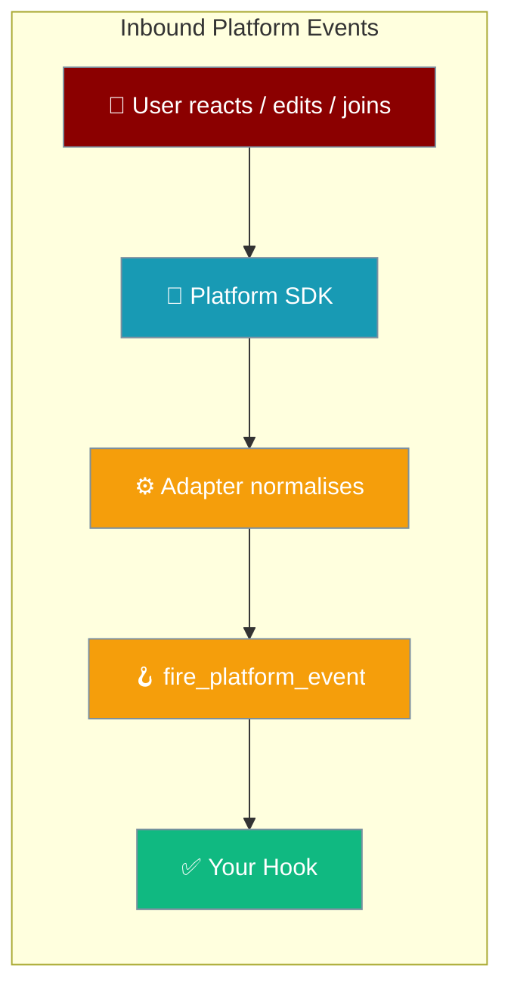
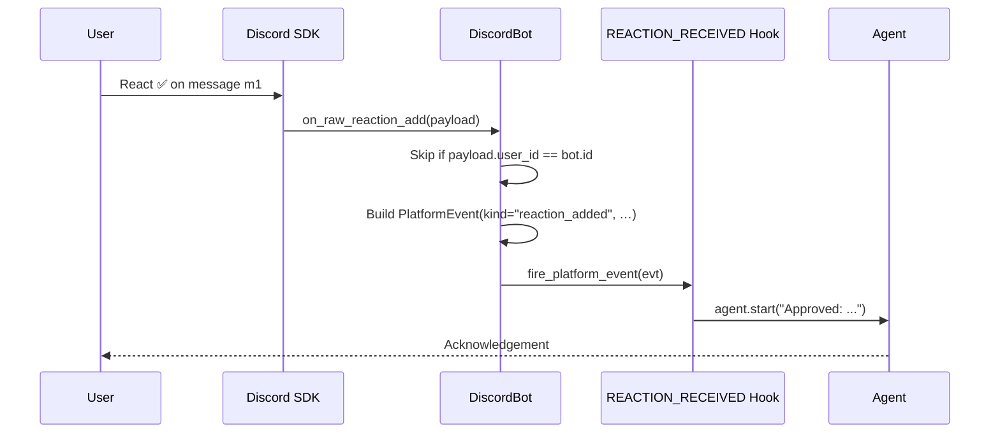
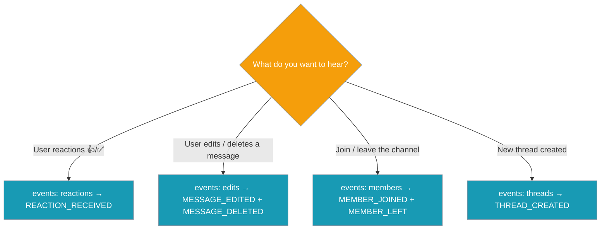

Inbound platform events let your agent hear more than text — reactions, edits, deletions, member changes, and thread creations from Discord, Telegram, Slack, and other supported platforms.



## Quick Start

Register a hook on the agent, then opt the channel in from the gateway config.

```python
from praisonaiagents import Agent
from praisonaiagents.hooks import add_hook, HookEvent

@add_hook(HookEvent.REACTION_RECEIVED)
def on_reaction(evt):
    if evt.emoji == "✅" and evt.kind == "reaction_added":
        print(f"{evt.user_id} approved message {evt.message_id}")

agent = Agent(name="ApprovalBot", instructions="Approve requests reacted to with ✅.")
agent.start("Approve incoming requests when a teammate reacts with ✅.")
```

```yaml
# gateway.yaml — opt in per channel
channels:
  my-discord-bot:
    platform: discord
    token: "${DISCORD_BOT_TOKEN}"
    events: [reactions]      # NEW — opt in to inbound reactions
```

<Note>
Nothing new fires unless a channel opts in via `events:`. Omit the key and behaviour is unchanged — the surface is purely additive and capability-gated.
</Note>

---

## Opt-In Classes

<Steps>
<Step title="reactions">
Hear when a user adds or removes a reaction. Branch on `evt.kind` to tell add from remove.

```yaml
channels:
  my-discord-bot:
    platform: discord
    token: "${DISCORD_BOT_TOKEN}"
    events: [reactions]
```

```python
from praisonaiagents.hooks import add_hook, HookEvent

@add_hook(HookEvent.REACTION_RECEIVED)
def on_reaction(evt):
    if evt.kind == "reaction_added":
        print(f"{evt.user_id} added {evt.emoji} to {evt.message_id}")
    else:
        print(f"{evt.user_id} removed {evt.emoji} from {evt.message_id}")
```
</Step>

<Step title="edits">
Hear message edits and deletions.

```yaml
channels:
  my-discord-bot:
    platform: discord
    token: "${DISCORD_BOT_TOKEN}"
    events: [edits]
```

```python
from praisonaiagents.hooks import add_hook, HookEvent

@add_hook(HookEvent.MESSAGE_EDITED)
def on_edit(evt):
    print(f"{evt.message_id} is now: {evt.new_text}")

@add_hook(HookEvent.MESSAGE_DELETED)
def on_delete(evt):
    print(f"{evt.user_id} deleted {evt.message_id}")
```
</Step>

<Step title="members">
Hear when a user joins or leaves. Requires the privileged `members` gateway intent, which the adapter enables only when you request this class.

```yaml
channels:
  my-discord-bot:
    platform: discord
    token: "${DISCORD_BOT_TOKEN}"
    events: [members]
```

```python
from praisonaiagents.hooks import add_hook, HookEvent

@add_hook(HookEvent.MEMBER_JOINED)
def on_join(evt):
    print(f"Welcome {evt.user_id} to {evt.chat_id}")

@add_hook(HookEvent.MEMBER_LEFT)
def on_leave(evt):
    print(f"{evt.user_id} left {evt.chat_id}")
```
</Step>

<Step title="threads">
Hear when a new thread is created. `thread_id` and the parent `chat_id` are populated.

```yaml
channels:
  my-discord-bot:
    platform: discord
    token: "${DISCORD_BOT_TOKEN}"
    events: [threads]
```

```python
from praisonaiagents.hooks import add_hook, HookEvent

@add_hook(HookEvent.THREAD_CREATED)
def on_thread(evt):
    print(f"New thread {evt.thread_id} in {evt.chat_id}")
```
</Step>
</Steps>

<Tip>
Combine classes in one list: `events: [reactions, edits, members, threads]`.
</Tip>

---

## How It Works

A native platform event is normalised into a portable `PlatformEvent`, which fires the matching `HookEvent`.



Every adapter emits through one DRY seam, `fire_platform_event`, which maps `PlatformEvent.kind` onto the matching `HookEvent`. Reaction add and remove **both** fire `REACTION_RECEIVED` — the `kind` field disambiguates.

---

## Which Event Fires When?

Pick the class that matches what you want to hear.



---

## Configuration Options

Each class token subscribes the adapter to a set of native handlers.

| Class token | Enabled events | Native handlers | Notes |
|-------------|----------------|-----------------|-------|
| `reactions` | `REACTION_RECEIVED` | `on_raw_reaction_add`, `on_raw_reaction_remove` | `kind` field disambiguates add vs remove; the bot's own reactions are ignored |
| `edits` | `MESSAGE_EDITED`, `MESSAGE_DELETED` | `on_message_edit`, `on_message_delete` | Bot-authored edits are skipped |
| `members` | `MEMBER_JOINED`, `MEMBER_LEFT` | `on_member_join`, `on_member_remove` | Requires the privileged **`members` gateway intent** — enabled only when this class is requested |
| `threads` | `THREAD_CREATED` | `on_thread_create` | `thread_id` and parent `chat_id` are populated |

### Hook Payload (`PlatformEventInput`)

Every inbound event carries a `PlatformEventInput`.

| Field | Type | Default | Description |
|-------|------|---------|-------------|
| `kind` | `str` | `""` | One of `reaction_added` / `reaction_removed` / `message_edited` / `message_deleted` / `member_joined` / `member_left` / `thread_created` |
| `platform` | `str` | `""` | Emitting platform (`"discord"` today; `"telegram"`/`"slack"` when their adapters wire it) |
| `chat_id` | `str` | `""` | Channel/chat where the event occurred |
| `user_id` | `str` | `""` | User who caused the event |
| `message_id` | `Optional[str]` | `None` | Target message id (reactions/edits/deletes) |
| `emoji` | `Optional[str]` | `None` | Reaction emoji, for reaction add/remove |
| `new_text` | `Optional[str]` | `None` | New content, for an edit (truncated to 500 chars in `to_dict()`) |
| `thread_id` | `Optional[str]` | `None` | Thread id, for thread creation |

Import it directly when you need the type:

```python
from praisonaiagents.hooks import PlatformEventInput
from praisonaiagents.bots import PlatformEvent, PlatformEventKind
```

---

## Platform Coverage

Only Discord is wired today. Other adapters translate their native events into the same `PlatformEvent` in follow-up releases.

| Platform | Reactions | Edits | Deletes | Members | Threads |
|----------|-----------|-------|---------|---------|---------|
| Discord  | ✅ | ✅ | ✅ | ✅ (privileged intent) | ✅ |
| Telegram | ⏳ Not yet | ⏳ | ⏳ | ⏳ | ⏳ |
| Slack    | ⏳ Not yet | ⏳ | ⏳ | ⏳ | ⏳ |
| WhatsApp | ⏳ Not yet | ⏳ | ⏳ | — | — |
| Others   | See adapter | | | | |

<Note>
Platforms that cannot deliver a given event simply never emit — nothing raises, hooks that never fire cost nothing. Enabling `events:` on a platform that hasn't wired it yet is safe and forward-compatible.
</Note>

---

## Common Patterns

**Reaction-as-approval** — react ✅ to approve, no typing required.

```python
from praisonaiagents.hooks import add_hook, HookEvent

@add_hook(HookEvent.REACTION_RECEIVED)
def approve(evt):
    if evt.emoji == "✅" and evt.kind == "reaction_added":
        print(f"Approved {evt.message_id} by {evt.user_id}")
```

**Undo-on-delete** — retract a stored plan when the source message disappears.

```python
from praisonaiagents.hooks import add_hook, HookEvent

@add_hook(HookEvent.MESSAGE_DELETED)
def undo(evt):
    print(f"Clearing follow-ups tied to {evt.message_id}")
```

**Welcome-on-join** — greet new members.

```python
from praisonaiagents.hooks import add_hook, HookEvent

@add_hook(HookEvent.MEMBER_JOINED)
def welcome(evt):
    print(f"Sending welcome to {evt.user_id} in {evt.chat_id}")
```

**Thread-scoped session** — open a new agent session tied to a thread.

```python
from praisonaiagents.hooks import add_hook, HookEvent

@add_hook(HookEvent.THREAD_CREATED)
def open_session(evt):
    print(f"Starting a session for thread {evt.thread_id}")
```

---

## Best Practices

<AccordionGroup>
<Accordion title="Enable only the classes you need">
Every unlisted class stays unsubscribed. `members` in particular pulls the privileged Discord `members` intent — request it only when you use it.
</Accordion>

<Accordion title="Safe to combine with status reactions">
The bot's own reactions and edits are filtered out automatically, so internal ack/done housekeeping is never mistaken for a user reaction. You can enable `reactions` alongside [status reactions](/features/bot-status-reactions) without loops.
</Accordion>

<Accordion title="Hook errors are non-fatal">
A raised exception inside a hook is logged at debug and swallowed — it never breaks the adapter's event loop.
</Accordion>

<Accordion title="Route by kind inside REACTION_RECEIVED">
Reaction add and remove both fire `REACTION_RECEIVED`. Branch on `evt.kind` (`reaction_added` vs `reaction_removed`) to distinguish them.
</Accordion>

<Accordion title="Remember new_text is truncated in to_dict()">
`PlatformEventInput.to_dict()` truncates `new_text` to 500 chars for observability. The in-memory `evt.new_text` attribute is not truncated.
</Accordion>
</AccordionGroup>

---

## Related

<CardGroup cols={2}>
<Card title="Hook Events" icon="webhook" href="/features/hook-events">
Full reference for every HookEvent member.
</Card>
<Card title="Bot Status Reactions" icon="face-smile" href="/features/bot-status-reactions">
The outbound counterpart — the bot adds emoji to show run state.
</Card>
<Card title="Interactive Bot Actions" icon="hand-pointer" href="/features/interactive-bot-actions">
Button and select-menu clicks — another interactive surface.
</Card>
<Card title="Messaging Bots" icon="comments" href="/features/messaging-bots">
Where the gateway config lives.
</Card>
</CardGroup>
