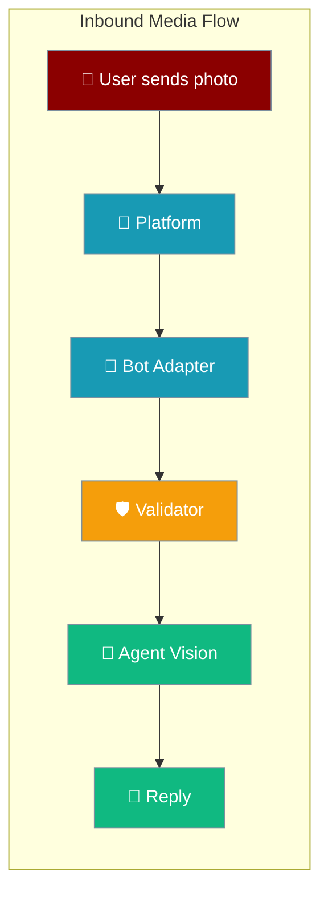
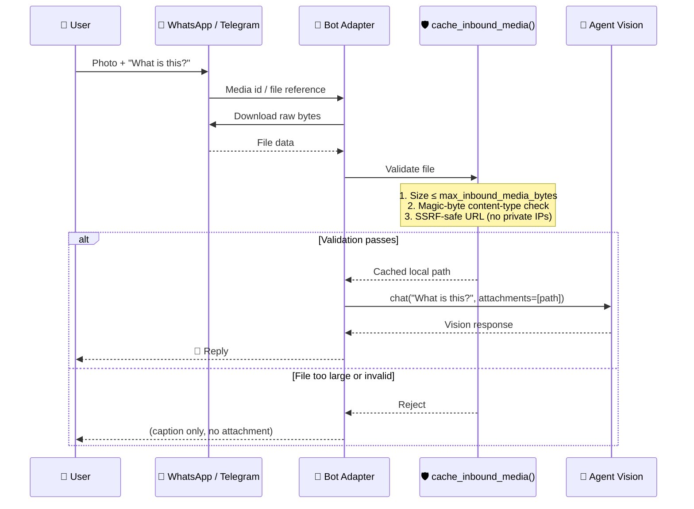
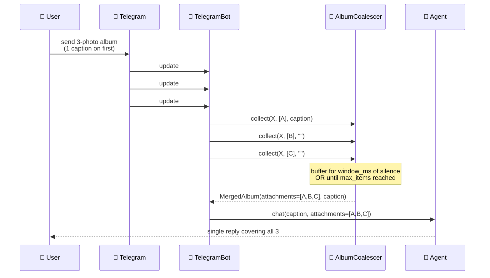
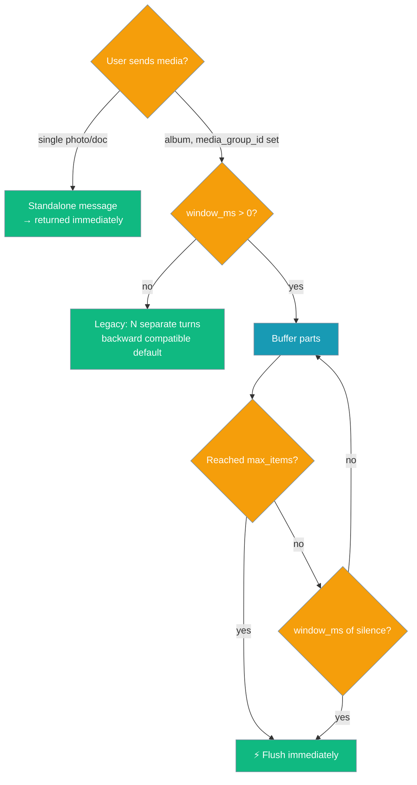

<Note>
Bot platform adapters now ship in the `praisonai-bot` package. `praisonai bot serve` still works exactly as documented here; for a standalone install see [praisonai-bot Migration](/docs/guides/praisonai-bot-migration).
</Note>


Bot adapters forward inbound photos and documents to your agent's vision capability — validated, size-capped, and SSRF-safe.

```python
from praisonaiagents import Agent

agent = Agent(
    name="Assistant",
    instructions="Describe photos and documents users send in chat.",
)

agent.start("What is in this image?")
```

The user sends a photo or document in WhatsApp or Telegram; the bot validates the file and passes it to the agent vision model.



## Quick Start

<Steps>
<Step title="Simple — works with any vision model">
No configuration needed. Point a vision-capable agent at your bot.

```python
from praisonaiagents import Agent
from praisonai.bots import TelegramBot

agent = Agent(
    name="vision-assistant",
    instructions="Describe images and answer questions about them.",
    llm="gpt-4o",
)

bot = TelegramBot(token="your-telegram-bot-token", agent=agent)

import asyncio
asyncio.run(bot.start())
```

Send the bot a photo (with or without a caption). The agent sees the image and responds.
</Step>

<Step title="With size limit">
Cap media size for public-facing bots to avoid processing large files.

```python
from praisonaiagents import Agent
from praisonai.bots import WhatsAppBot
from praisonaiagents import BotConfig

agent = Agent(
    name="assistant",
    instructions="Help users with their images and questions.",
    llm="gpt-4o",
)

bot = WhatsAppBot(
    agent=agent,
    config=BotConfig(
        max_inbound_media_bytes=5 * 1024 * 1024,  # 5 MiB cap
    ),
)

import asyncio
asyncio.run(bot.start())
```
</Step>

<Step title="Disable inbound media">
Set `max_inbound_media_bytes=0` for text-only agents.

```python
from praisonaiagents import Agent
from praisonai.bots import TelegramBot
from praisonaiagents import BotConfig

agent = Agent(name="text-only", instructions="Answer text questions only.")

bot = TelegramBot(
    token="your-token",
    agent=agent,
    config=BotConfig(max_inbound_media_bytes=0),
)

import asyncio
asyncio.run(bot.start())
```
</Step>
</Steps>

---

## How It Works



| Step | What happens |
|------|-------------|
| **Download** | WhatsApp: fetches via Graph API by media id. Telegram: uses `get_file()` → `download_to_drive()` |
| **Size cap** | File rejected if size exceeds `max_inbound_media_bytes`. Default: 20 MiB |
| **Magic-byte check** | File header bytes checked against declared content-type — prevents type confusion |
| **SSRF guard** | URL must use `http`/`https` and resolve to a public IP — rejects loopback, link-local, and RFC-1918 ranges |
| **Forward** | Validated path passed to `agent.chat(attachments=[path])` |

---

## Platform Coverage

| Platform | Media types | Caption support |
|----------|-------------|----------------|
| **WhatsApp** (Cloud API) | Photos, documents | ✅ Caption forwarded as prompt |
| **Telegram** | Photos, all documents | ✅ Caption forwarded as prompt |

<Note>
Telegram registers a `PHOTO | Document.ALL` handler — both photos and any document type (PDF, DOCX, etc.) flow through the same validation pipeline.
</Note>

---

## Media Albums

Coalesce a burst of updates sharing one `media_group_id` into a single multimodal turn — the agent sees the whole album at once instead of N separate turns.



Opt in via `BotConfig.metadata` — disabled by default so existing deployments are unchanged.

```python
from praisonaiagents import Agent, BotConfig
from praisonai.bots import TelegramBot

agent = Agent(
    name="album-assistant",
    instructions="Compare and describe the photos the user sends.",
    llm="gpt-4o",
)

bot = TelegramBot(
    token="your-telegram-bot-token",
    agent=agent,
    config=BotConfig(
        metadata={
            "media_group_window_ms": 1200,   # silence window (0 = disabled)
            "media_group_max": 10,           # cap per album (default: 10)
        },
    ),
)

import asyncio
asyncio.run(bot.start())
```

Each inbound update flows through this decision path:



### Behaviour

| Behaviour | Detail |
|-----------|--------|
| **Disabled by default** | `media_group_window_ms=0` keeps every existing deployment byte-for-byte unchanged. |
| **First non-empty caption wins** | The album's prompt is the caption on whichever part carried one first (Telegram typically puts it on part 1). |
| **Sibling updates fold in** | Only one caller owns the merged turn; siblings' media folds into it and their `collect()` returns `None` internally. |
| **Cancelled-owner cleanup** | If the owning update is cancelled mid-wait (e.g. during shutdown), buffered temp files are reclaimed via the shared `_remove_inbound_media` hook. |
| **Shutdown flush** | `bot.stop()` calls `AlbumCoalescer.cancel_all()`, flushing pending buffers. |
| **Telegram-only** | Slack and Discord adapters do not wire the coalescer — they don't have Telegram's split-update album model. |

---

## Configuration

| Option | Type | Default | Description |
|--------|------|---------|-------------|
| `max_inbound_media_bytes` | `int` | `20971520` | Maximum file size in bytes. `0` = disable inbound media. |
| `metadata["media_group_window_ms"]` | `int` (ms) | `0` (disabled) | Silence window before an album flushes as one turn. Set > 0 (e.g. `1200`) to enable coalescing; `0` keeps legacy per-update behaviour. |
| `metadata["media_group_max"]` | `int` | `10` | Upper bound on attachments buffered per album — a full Telegram album is 10, so the default splits nothing. Lower it to bound memory/latency; reaching it forces an immediate flush. |

Both album options live under `BotConfig.metadata` (there are no top-level `BotConfig` fields for them — `resolve_album_window_ms` / `resolve_album_max_items` read `metadata` first, then a direct attribute). Values that fail `int()` coercion silently fall back to the default.

Set via `BotConfig`:

```python
from praisonaiagents import BotConfig

config = BotConfig(
    max_inbound_media_bytes=10 * 1024 * 1024,  # 10 MiB
)
```

Or via YAML:

```yaml
agent:
  name: vision-bot
  instructions: Describe images.
  llm: gpt-4o

platforms:
  telegram:
    token: ${TELEGRAM_BOT_TOKEN}
    max_inbound_media_bytes: 10485760       # 10 MiB
    metadata:
      media_group_window_ms: 1200           # coalesce albums (0 disables)
      media_group_max: 10
```

---

## Common Patterns

### Photo + question (most common)

The user sends a photo with a caption asking a question. The caption becomes the prompt; the image is the attachment.

```
User: [photo of a chart] → "What does this chart show?"
Agent: "The chart shows quarterly revenue growth from Q1 to Q4..."
```

### Document analysis

Send a PDF or Word document. The agent reads the content via vision.

```
User: [report.pdf] → "Summarize the key findings"
Agent: "The report covers three main findings..."
```

### Oversized file rejected

Files above `max_inbound_media_bytes` are silently dropped. Only the caption text is forwarded.

```
User: [50 MB video] → "Describe this"
Agent: (receives only "Describe this", no attachment)
```

### Non-vision agent (backward compatible)

If `agent.chat()` does not accept `attachments`, the adapter skips the file gracefully.

```python
agent = Agent(name="text-only", instructions="Answer text questions.")
# Agent chat() has no attachments parameter — attachments are skipped automatically
```

---

## Best Practices

<AccordionGroup>
<Accordion title="Set a tighter cap for public bots">
The default 20 MiB is generous. For public-facing bots, set 2–5 MiB to reduce processing time and storage use.

```python
config = BotConfig(max_inbound_media_bytes=2 * 1024 * 1024)
```
</Accordion>

<Accordion title="Disable with 0 for text-only agents">
If your agent doesn't use vision, set `max_inbound_media_bytes=0`. Users still get a response — just from the caption text alone.

```python
config = BotConfig(max_inbound_media_bytes=0)
```
</Accordion>

<Accordion title="Watch logs for SSRF rejects">
The SSRF guard logs rejections at WARNING level. If you see unexpected rejections in production, check that the platform's media CDN URLs resolve to public IPs.

```
WARNING: SSRF guard rejected URL: https://internal-cdn.example.com/...
```
</Accordion>

<Accordion title="Enable album coalescing on public Telegram bots">
Set `metadata["media_group_window_ms"]` to `1000`–`1500` ms so a user sending "compare these 3 photos" reaches the agent as one multimodal turn instead of three. Leave `media_group_max` at `10` (a full Telegram album) unless you want to cap memory further.

```python
config = BotConfig(metadata={"media_group_window_ms": 1200})
```
</Accordion>

<Accordion title="Use gpt-4o or claude-3 for vision">
Not all models support vision. Pass a vision-capable model to see image attachments.

```python
agent = Agent(llm="gpt-4o")          # OpenAI vision
agent = Agent(llm="claude-3-7-sonnet-20250219")  # Anthropic vision
agent = Agent(llm="gemini/gemini-2.0-flash")      # Google vision
```
</Accordion>
</AccordionGroup>

---

## Related

<CardGroup cols={2}>
<Card title="WhatsApp Bot" icon="whatsapp" href="/docs/features/whatsapp-bot">
  WhatsApp setup, Cloud API, Web mode, and message filtering
</Card>
<Card title="Messaging Bots" icon="robot" href="/docs/features/messaging-bots">
  All supported platforms: Telegram, Discord, Slack, WhatsApp
</Card>
<Card title="Platform-Aware Agents" icon="satellite-dish" href="/docs/features/platform-aware-agents">
  Session context, channel directory, and `BotSessionManager` parameters
</Card>
<Card title="Bot Streaming Replies" icon="message-pen" href="/docs/features/bot-streaming-replies">
  Live streaming responses for Telegram, Slack, and Discord
</Card>
<Card title="Turn Completion Notes" icon="message-check" href="/docs/features/gateway-turn-completion">
  Surface why a bot turn ended (max_steps, cancelled, error) as a user-safe note
</Card>
</CardGroup>
