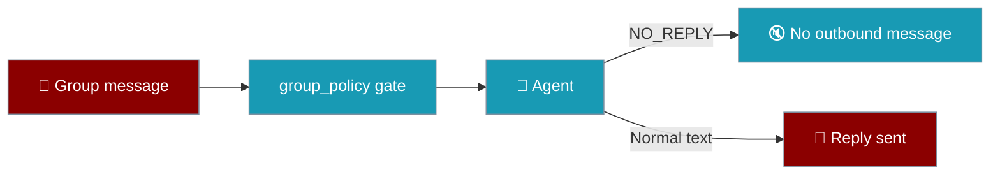
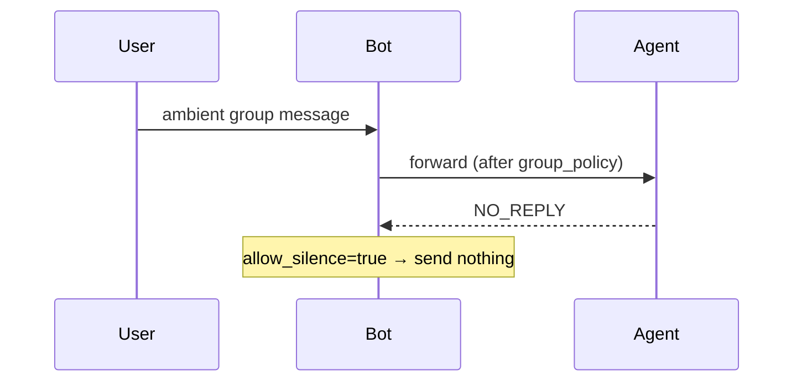

With `allow_silence: true`, an agent can return `NO_REPLY` (or a custom token) to send nothing — no message, no typing indicator, no error.



## Quick Start

<Steps>
<Step title="YAML">

```yaml
channels:
  telegram:
    token: ${TELEGRAM_BOT_TOKEN}
    group_policy: respond_all
    allow_silence: true
```

</Step>

<Step title="Python">

```python
from praisonai.bots import Bot
from praisonaiagents import Agent

agent = Agent(
    name="Group Helper",
    instructions="Reply only when asked a direct question. Otherwise return exactly NO_REPLY.",
)
bot = Bot("telegram", agent=agent, allow_silence=True)
bot.run()
```

</Step>
</Steps>

---

## How It Works



| Marker | Honoured when `allow_silence=true` |
|---|---|
| `NO_REPLY` | ✅ default token |
| `[SILENT]` | ✅ |
| `SILENT` | ✅ |
| Custom `silence_token` | ✅ exact match only |
| Prose containing "NO_REPLY" | ❌ not treated as silence |

---

## Configuration

| Field | Type | Default | Description |
|---|---|---|---|
| `allow_silence` | `bool` | `false` | Honour silence markers (opt-in) |
| `silence_token` | `str` | `None` | Override marker; when set, only this exact string triggers silence |

Combine with `group_policy: respond_all` so the agent *may* respond, then chooses silence via `NO_REPLY`.

---

## Best Practices

<AccordionGroup>
<Accordion title="Opt in explicitly">
`allow_silence` defaults to `false` — existing bots behave unchanged.
</Accordion>

<Accordion title="Teach the agent the contract">
Instructions should say when to return exactly `NO_REPLY` vs a normal reply.
</Accordion>

<Accordion title="Use for ambient group channels">
Reduces noise when the bot listens to everything but should rarely speak.
</Accordion>
</AccordionGroup>

---

## Related

<CardGroup cols={2}>
<Card title="Gateway" icon="server" href="/docs/features/gateway">
  Channel configuration reference
</Card>
<Card title="Messaging Bots" icon="comments" href="/docs/features/messaging-bots">
  Multi-platform bot setup
</Card>
</CardGroup>
