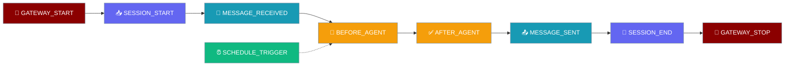
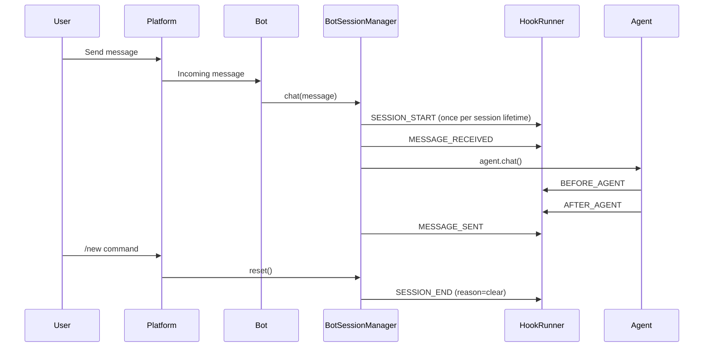

Bot lifecycle hooks let you watch your bot start and stop, see every user session begin and end, and react when scheduled jobs fire — without changing your agent code.

```python
from praisonaiagents import Agent

agent = Agent(name="assistant", instructions="You are a helpful messaging bot.")
agent.start("Log when sessions start and end.")
```


<Note>
This page covers **in-process outbound lifecycle hooks** (GATEWAY_START, SESSION_START, SCHEDULE_TRIGGER) that fire inside the running gateway. For **HTTP inbound triggers** that let external services start agent runs via `POST /hooks/<path>`, see [Gateway Inbound Hooks](/docs/features/gateway-inbound-hooks).
</Note>

The user opens a chat session; lifecycle hooks fire on gateway start, session boundaries, and scheduled jobs.



## Quick Start

<Steps>

<Step title="Register a SESSION_START hook">
```python
import os
from praisonaiagents import Agent
from praisonaiagents.hooks import HookRegistry, HookEvent, HookResult

registry = HookRegistry()

@registry.on(HookEvent.SESSION_START)
def on_session_start(event_data):
    print(f"New session: {event_data.session_id} on {event_data.session_name}")
    return HookResult.allow()
```
</Step>

<Step title="Pass the registry to your agent and bot">
```python
from praisonai.bots import TelegramBot

agent = Agent(
    name="MyBot",
    instructions="You are a helpful assistant.",
    hooks=registry
)

bot = TelegramBot(
    token=os.getenv("TELEGRAM_BOT_TOKEN"),
    agent=agent
)

import asyncio
asyncio.run(bot.start())
```

Running this bot now prints a line whenever a user opens a new session.
</Step>

</Steps>

---

## How It Works



<Note>
`BEFORE_AGENT` and `AFTER_AGENT` are fired by `agent.chat()` itself — the gateway does **not** re-fire them to avoid double-dispatch to plugins.
</Note>

---

## Events Fired by the Bot Runtime

| Event | When | Input Type | Key Fields |
|-------|------|------------|------------|
| `GATEWAY_START` | `BotOS.start()` | `GatewayStartInput` | `platforms`, `bot_count` |
| `GATEWAY_STOP` | `BotOS.stop()` | `GatewayStopInput` | `platforms`, `bot_count`, `reason` |
| `SESSION_START` | First message per user (once per session lifetime) | `SessionStartInput` | `session_id`, `agent_name`, `source`, `session_name` |
| `SESSION_END` | `/new` reset, policy auto-reset, stale reap, `reset_all` | `SessionEndInput` | `session_id`, `agent_name`, `reason` |
| `SCHEDULE_TRIGGER` | Scheduled job runs in `BotOS._execute_schedule_job` | `ScheduleTriggerInput` | `job_name`, `job_id`, `message` |
| `MESSAGE_RECEIVED` | Incoming message from platform, **before** agent dispatch — **inbound gate**: `deny` drops the message, `modified_input["content"]` rewrites it | `MessageReceivedInput` | `platform`, `content`, `sender_id` |
| `MESSAGE_SENDING` | Before bot sends a reply — **outbound gate**: `deny` cancels sending, `modified_input["content"]` rewrites it | `MessageSendingInput` | `platform`, `content`, `channel_id` |
| `MESSAGE_SENT` | After bot successfully sends a reply | `MessageSentInput` | `platform`, `content`, `message_id` |

**`SESSION_END` reason values:**
- `clear` — user sent `/new`
- `policy` — policy auto-reset triggered
- `stale` — session reaped due to inactivity
- `clear_all` — `reset_all` called (clears all sessions)

---

## Common Patterns

### Audit Log

Log every gateway and session event to a file with timestamps.

```python
import os
import datetime
from praisonaiagents import Agent
from praisonaiagents.hooks import HookRegistry, HookEvent, HookResult
from praisonai.bots import TelegramBot

registry = HookRegistry()
LOG_FILE = "bot_audit.log"

def _log(msg: str) -> None:
    ts = datetime.datetime.utcnow().isoformat()
    with open(LOG_FILE, "a") as f:
        f.write(f"[{ts}] {msg}\n")

@registry.on(HookEvent.GATEWAY_START)
def audit_gateway_start(event_data):
    _log(f"GATEWAY_START platforms={event_data.platforms} bots={event_data.bot_count}")
    return HookResult.allow()

@registry.on(HookEvent.SESSION_START)
def audit_session_start(event_data):
    _log(f"SESSION_START session={event_data.session_id} platform={event_data.session_name}")
    return HookResult.allow()

@registry.on(HookEvent.SESSION_END)
def audit_session_end(event_data):
    _log(f"SESSION_END session={event_data.session_id} reason={event_data.reason}")
    return HookResult.allow()

@registry.on(HookEvent.GATEWAY_STOP)
def audit_gateway_stop(event_data):
    _log(f"GATEWAY_STOP platforms={event_data.platforms} reason={event_data.reason}")
    return HookResult.allow()

agent = Agent(name="AuditBot", instructions="Be helpful.", hooks=registry)
bot = TelegramBot(token=os.getenv("TELEGRAM_BOT_TOKEN"), agent=agent)

import asyncio
asyncio.run(bot.start())
```

### Per-User Usage Counter

Increment a counter when a session starts, persist it when the session ends.

```python
import os
from collections import defaultdict
from praisonaiagents import Agent
from praisonaiagents.hooks import HookRegistry, HookEvent, HookResult
from praisonai.bots import TelegramBot

registry = HookRegistry()
session_counts: dict = defaultdict(int)

@registry.on(HookEvent.SESSION_START)
def count_session(event_data):
    session_counts[event_data.agent_name] += 1
    print(f"[{event_data.agent_name}] total sessions: {session_counts[event_data.agent_name]}")
    return HookResult.allow()

@registry.on(HookEvent.SESSION_END)
def persist_count(event_data):
    print(f"Session {event_data.session_id} ended ({event_data.reason}), "
          f"total for {event_data.agent_name}: {session_counts[event_data.agent_name]}")
    return HookResult.allow()

agent = Agent(name="CounterBot", instructions="Be helpful.", hooks=registry)
bot = TelegramBot(token=os.getenv("TELEGRAM_BOT_TOKEN"), agent=agent)

import asyncio
asyncio.run(bot.start())
```

### Scheduled-Job Observability

Push a metric every time a scheduled job fires.

```python
import os
import urllib.request
import json
from praisonaiagents import Agent
from praisonaiagents.hooks import HookRegistry, HookEvent, HookResult
from praisonai.bots import BotOS, TelegramBot

registry = HookRegistry()
METRICS_ENDPOINT = os.getenv("METRICS_ENDPOINT", "http://localhost:9091/metrics")

@registry.on(HookEvent.SCHEDULE_TRIGGER)
def track_schedule(event_data):
    payload = json.dumps({
        "job_name": event_data.job_name,
        "job_id": event_data.job_id,
        "agent": event_data.agent_name,
        "message_preview": event_data.message[:100] if event_data.message else "",
    }).encode()
    try:
        req = urllib.request.Request(
            METRICS_ENDPOINT,
            data=payload,
            headers={"Content-Type": "application/json"},
            method="POST",
        )
        urllib.request.urlopen(req, timeout=2)
    except Exception:
        pass
    return HookResult.allow()

agent = Agent(name="ScheduleBot", instructions="Run scheduled tasks.", hooks=registry)
botos = BotOS(
    bots=[TelegramBot(token=os.getenv("TELEGRAM_BOT_TOKEN"), agent=agent)]
)

import asyncio
asyncio.run(botos.start())
```

---

## Configuration / HookResult

**Two events that DO gate:** `MESSAGE_RECEIVED` and `MESSAGE_SENDING` are real policy control points — `HookResult.deny("reason")` drops the message and the agent is never invoked; `HookResult(decision="allow", modified_input={"content": "..."})` rewrites the content before the agent sees it.

Returning `HookResult.deny("reason")` from gateway or session lifecycle hooks is **best-effort** for those specific events (`GATEWAY_START`, `GATEWAY_STOP`, `SESSION_START`, `SESSION_END`): `BotOS` emits them but does not gate startup or shutdown on the result.

<Note>
`MESSAGE_RECEIVED` is now an inbound gate, symmetric with `MESSAGE_SENDING` on the outbound side. A hook can drop (deny) or redact (rewrite content via `modified_input`) an inbound message before agent dispatch. This works consistently across sync and async adapters (Telegram, Slack, Discord, WhatsApp, Email, AgentMail) — no `async def` required. See [Hook Events → Message Events](/docs/features/hook-events#message-events).
</Note>

For policy enforcement on agent internals (e.g. blocking tool calls or LLM requests), use `BEFORE_TOOL` or `BEFORE_LLM` hooks.

<Note>
**Exception — `MESSAGE_RECEIVED` is now a real gate.** Since PR #2589, returning `HookResult.deny(...)` from `MESSAGE_RECEIVED` drops the inbound message, and `HookResult(decision="allow", modified_input={"content": "…"})` rewrites it in place before the agent sees it. See [Inbound Message Gate](/docs/features/inbound-message-gate).
</Note>

---

## Best Practices

<AccordionGroup>

<Accordion title="Keep lifecycle hooks lightweight">
Gateway and session hooks may run inside an async event loop. Avoid blocking I/O or heavy computation — use fire-and-forget coroutines or thread pools for slow operations.
</Accordion>

<Accordion title="Don't raise from a hook">
Emission is wrapped in `try/except` inside the bot runtime, but unhandled exceptions from your hook function are logged at `debug` level and swallowed. Return `HookResult.allow()` even on internal errors to avoid silent failures.
</Accordion>

<Accordion title="Use agent_name to disambiguate multiple agents">
When one `BotOS` runs multiple bots (each with a different agent), the `agent_name` field on every event identifies which agent the event belongs to. Key your per-agent metrics on `event_data.agent_name`.
</Accordion>

<Accordion title="Key per-user state on session_id, not platform user IDs">
Platform user IDs differ between Telegram, Discord, Slack, and WhatsApp. Use `session_id` from `SessionStartInput` / `SessionEndInput` as the stable key for per-user state across platforms.
</Accordion>

</AccordionGroup>

---

## Related

<CardGroup cols={2}>
  <Card title="Inbound Message Gate" icon="shield-check" href="/docs/features/inbound-message-gate">
    Drop or redact incoming messages before the agent sees them
  </Card>
  <Card title="Hook Events Reference" icon="list" href="/docs/features/hook-events">
    Complete event reference with all input types and fields
  </Card>
  <Card title="BotOS" icon="robot" href="/docs/features/botos">
    Multi-platform bot orchestrator that emits these lifecycle hooks
  </Card>
  <Card title="Hooks" icon="webhook" href="/docs/features/hooks">
    Hook system concepts: registries, decisions, and matchers
  </Card>
  <Card title="Session Management" icon="users" href="/docs/features/session-persistence">
    How per-user sessions are managed across platforms
  </Card>
</CardGroup>
