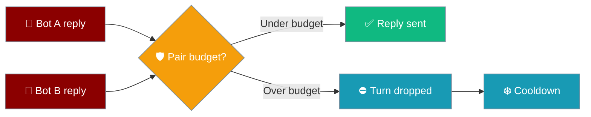
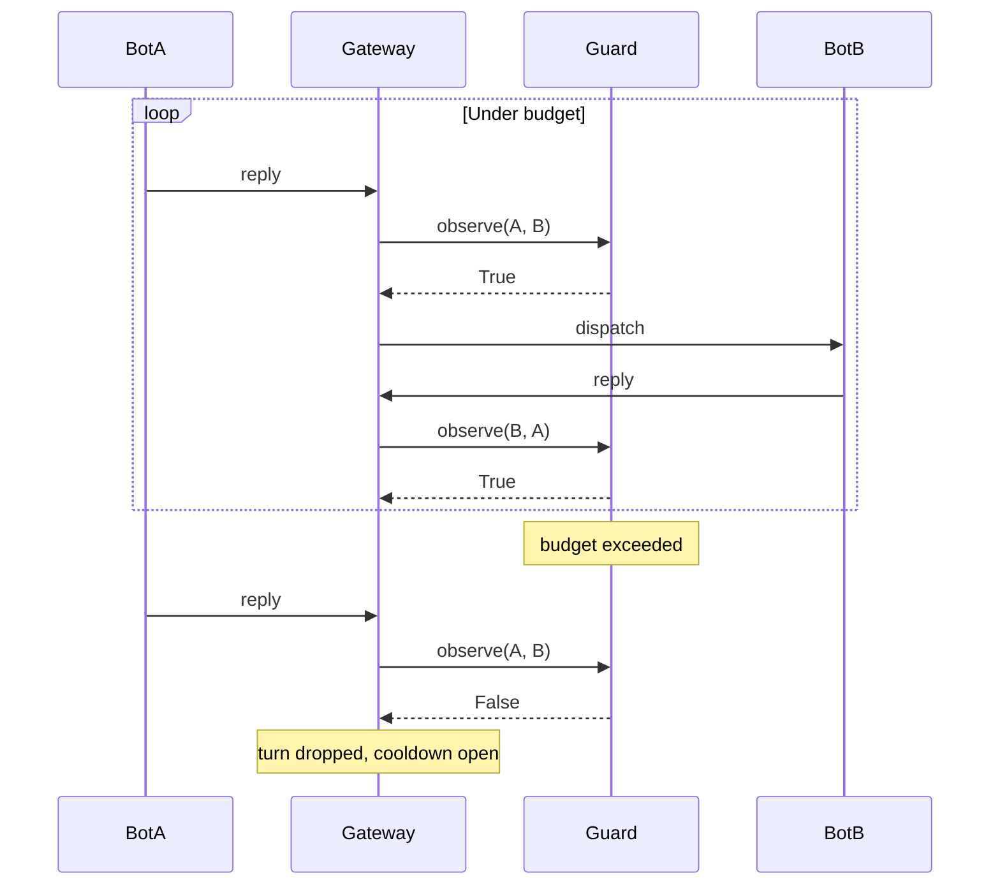
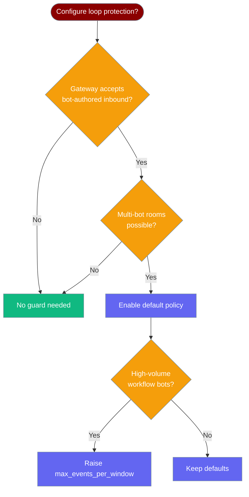

`BotLoopGuard` breaks runaway bot-to-bot reply loops — two bots answering each other forever — by budgeting how many exchanges a pair may have inside a sliding window.

```python
from praisonaiagents import Agent
from praisonaiagents.bots import BotLoopGuard, BotLoopPolicy

agent = Agent(
    name="Group Helper",
    instructions="Answer questions posted in the room.",
)

guard = BotLoopGuard(BotLoopPolicy(max_events_per_window=20, window_seconds=60))

# In your bot inbound handler, before dispatching to the agent:
if sender_is_bot and not guard.observe(
    self_bot_id="mybot",
    sender_bot_id=inbound_sender_id,
):
    return  # drop the turn — pair is over budget / in cooldown

agent.start(inbound_text)
```

Two bots ping-pong replies; the guard counts each exchange and, once a pair passes its budget, drops the turn and opens a cooldown.



<Note>
`BotLoopGuard` is a gateway-layer primitive: it decides whether to admit one bot's reply to another bot. It differs from [Loop Guard](/docs/features/loop-guard), which caps tool calls inside a single agent turn.
</Note>

## Quick Start

<Steps>
<Step title="Enable with defaults">

Call `observe()` for each bot-authored inbound turn and drop the turn when it returns `False`.

```python
from praisonaiagents.bots import BotLoopGuard

guard = BotLoopGuard()  # default policy: 20 exchanges / 60s window / 60s cooldown

if not guard.observe(self_bot_id="mybot", sender_bot_id="otherbot"):
    return  # drop the turn — loop budget hit
```

</Step>

<Step title="Tune the budget with BotLoopPolicy">

Pass a `BotLoopPolicy` to change how quickly a loop trips and how long it stays quiet.

```python
from praisonaiagents.bots import BotLoopGuard, BotLoopPolicy

guard = BotLoopGuard(BotLoopPolicy(
    max_events_per_window=10,
    window_seconds=30.0,
    cooldown_seconds=120.0,
))
```

</Step>

<Step title="Build the policy from YAML/kwargs">

`BotLoopPolicy.from_dict` builds a policy from a config mapping and ignores unknown keys.

```python
from praisonaiagents.bots import BotLoopGuard, BotLoopPolicy

policy = BotLoopPolicy.from_dict({
    "enabled": True,
    "max_events_per_window": 10,
    "window_seconds": 30.0,
    "cooldown_seconds": 120.0,
})
guard = BotLoopGuard(policy)
```

</Step>
</Steps>

---

## How It Works

The guard tracks each bot pair in a sliding window; exchange #21 trips the budget and both bots go quiet for the cooldown.



`A → B` and `B → A` collapse to the same pair key, so a ping-pong loop accrues one budget instead of two independent streams.

| Behaviour | Effect |
|---|---|
| Direction independence | `A↔B` and `B↔A` share one budget |
| Sliding window | Events older than `window_seconds` are evicted before the budget check |
| Cooldown | Once exceeded, the pair is dropped for `cooldown_seconds` without recording |
| Distinct pairs | `A↔B` at budget does not affect `A↔C` |

---

## When to Enable

`BotLoopGuard` only matters when your gateway accepts bot-authored inbound messages and multiple bots can share a room.



---

## Configuration Options

`BotLoopPolicy` declares the per-pair budget. Every field matches `praisonaiagents/bots/silence.py`.

| Field | Type | Default | Description |
|---|---|---|---|
| `enabled` | `bool` | `True` | When `False`, the guard is a transparent no-op (always allows). |
| `max_events_per_window` | `int` | `20` | Max bot-authored exchanges per pair before cooldown opens. Clamped to `>= 1`. |
| `window_seconds` | `float` | `60.0` | Length of the sliding window. |
| `cooldown_seconds` | `float` | `60.0` | How long a pair stays suppressed once the budget is exceeded. |

`BotLoopPolicy.from_dict(data)` builds a policy from a mapping; `None` returns the enabled default and unknown keys are ignored.

The runtime `BotLoopGuard` exposes this surface:

| Symbol | Signature | Purpose |
|---|---|---|
| Constructor | `BotLoopGuard(policy: Optional[BotLoopPolicy] = None)` | Defaults to the enabled default policy; uses an internal lock for shared-state safety. |
| `enabled` | `@property -> bool` | Whether the guard actively suppresses loops. |
| `observe` | `observe(*, self_bot_id: str, sender_bot_id: str, now: Optional[float] = None) -> bool` | Records one exchange; returns `True` to allow or `False` to drop. Always `True` when disabled. |
| `reset` | `reset() -> None` | Clears all tracked pairs and cooldowns. |

<Note>
`BotLoopGuard` ships in the Python SDK only. TypeScript and Rust ports do not exist yet — do not wire it into `docs/js/` or `docs/rust/`.
</Note>

---

## Common Patterns

Three patterns cover most gateway deployments.

**Group room with multiple assistants** — use one guard per gateway and call `observe()` only when the sender is a bot.

```python
from praisonaiagents.bots import BotLoopGuard

guard = BotLoopGuard()

def on_inbound(msg, sender_is_bot):
    if sender_is_bot and not guard.observe(
        self_bot_id="mybot", sender_bot_id=msg.sender_id
    ):
        return  # loop budget hit — drop silently
    handle(msg)
```

**Testing with an injected clock** — pass explicit `now=` values for deterministic time-dependent tests.

```python
from praisonaiagents.bots import BotLoopGuard, BotLoopPolicy

guard = BotLoopGuard(BotLoopPolicy(max_events_per_window=2, window_seconds=60.0))
assert guard.observe(self_bot_id="a", sender_bot_id="b", now=0.0)
assert guard.observe(self_bot_id="a", sender_bot_id="b", now=1.0)
assert not guard.observe(self_bot_id="a", sender_bot_id="b", now=2.0)
```

**Resetting on gateway restart** — call `reset()` after redeploy so leftover cooldowns from an earlier process don't leak.

```python
guard.reset()  # clear tracked pairs and cooldowns
```

---

## When It Fires vs Doesn't

Only bot-authored inbound turns reach the guard; humans and single-bot deployments never call `observe()`.

| Inbound sender | Below budget | Above budget in cooldown | After cooldown expires |
|---|---|---|---|
| Human | Not observed (always allowed) | Not observed | Not observed |
| Bot (different pair) | Allowed | Allowed (independent pair) | Allowed |
| Bot (same pair) | Allowed | **Dropped** | Allowed (fresh window) |

---

## Best Practices

<AccordionGroup>
<Accordion title="Only observe bot-authored inbound turns">
Skip `observe()` when the sender is human — the guard is zero-cost on the common path.
</Accordion>

<Accordion title="Size the window and cooldown separately">
Use a shorter `window_seconds` with a higher `cooldown_seconds` for chatty rooms — the window sizes urgency, the cooldown sizes recovery.
</Accordion>

<Accordion title="Disable with enabled=False, not a zero budget">
`max_events_per_window=0` is clamped to `1` and hides intent. Set `enabled=False` to turn the guard off.
</Accordion>

<Accordion title="Share one guard per gateway process">
The deque/dict state is per-instance and per-pair, so a single shared `BotLoopGuard` tracks the whole gateway.
</Accordion>

<Accordion title="Combine with Intentional Silence">
Pair the guard with `allow_silence` and Intentional Silence for full ambient-channel safety — the agent chooses to stay quiet, and the guard stops runaway loops.
</Accordion>
</AccordionGroup>

---

## Related

<CardGroup cols={2}>
<Card title="Intentional Silence" icon="volume-xmark" href="/docs/features/bot-intentional-silence">
  The sibling `NO_REPLY` primitive in the same `silence.py` file.
</Card>
<Card title="Messaging Bots" icon="comments" href="/docs/features/messaging-bots">
  Where bot inbound flow originates.
</Card>
<Card title="Loop Guard" icon="shield-halved" href="/docs/features/loop-guard">
  Per-turn tool-call guard — a different layer inside one agent.
</Card>
<Card title="Gateway" icon="server" href="/docs/features/gateway">
  Channel configuration where the guard sits.
</Card>
</CardGroup>
