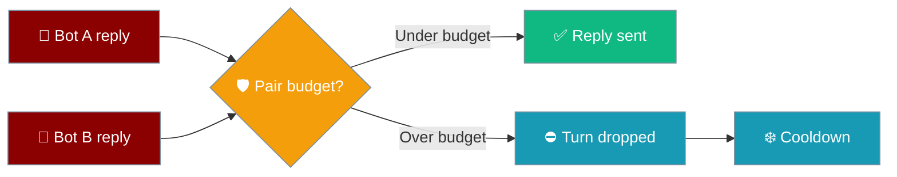
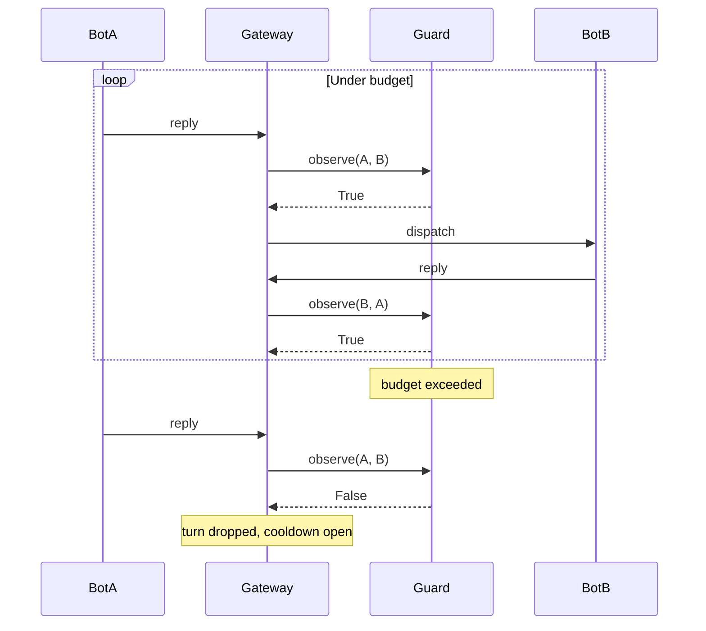
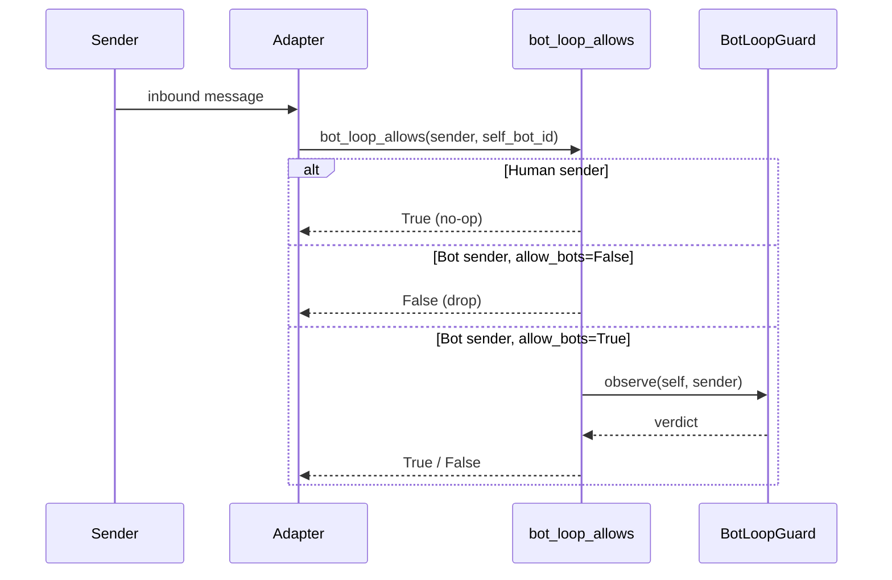
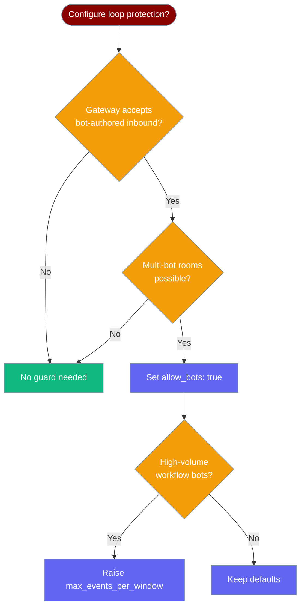

`BotLoopGuard` breaks runaway bot-to-bot reply loops — two bots answering each other forever — by budgeting how many exchanges a pair may have inside a sliding window. Once a channel opts in with `allow_bots: true`, the guard is auto-instantiated per adapter — no code to wire.

```yaml
# gateway.yaml
channels:
  telegram:
    token: ${TELEGRAM_BOT_TOKEN}
    allow_bots: true          # accept bot-authored inbound messages
    bot_loop_protection:      # break runaway A<->B reply loops
      max_events_per_window: 20
```

That's it — the `BotLoopGuard` is auto-instantiated per adapter, and any A↔B pair that exceeds 20 exchanges in a 60s window is suppressed for a 60s cooldown.

Two bots ping-pong replies; the guard counts each exchange and, once a pair passes its budget, drops the turn and opens a cooldown.


```mermaid
graph LR
    A[🤖 Bot A reply] --> Guard{🛡️ Pair budget?}
    B[🤖 Bot B reply] --> Guard
    Guard -->|Under budget| Send[✅ Reply sent]
    Guard -->|Over budget| Drop[⛔ Turn dropped]
    Drop --> Cool[❄️ Cooldown]

    classDef agent fill:#8B0000,stroke:#7C90A0,color:#fff
    classDef check fill:#F59E0B,stroke:#7C90A0,color:#fff
    classDef ok fill:#10B981,stroke:#7C90A0,color:#fff
    classDef drop fill:#189AB4,stroke:#7C90A0,color:#fff

    class A,B agent
    class Guard check
    class Send ok
    class Drop,Cool drop
```

<Note>
`BotLoopGuard` is a gateway-layer primitive: it decides whether to admit one bot's reply to another bot. It differs from [Loop Guard](/features/loop-guard), which caps tool calls inside a single agent turn.
</Note>

## Quick Start

<Steps>
<Step title="Enable with allow_bots: true">

Flip the opt-in on the channel — everything else uses the default budget (20 exchanges / 60s window / 60s cooldown).

```yaml
# gateway.yaml
channels:
  telegram:
    token: ${TELEGRAM_BOT_TOKEN}
    allow_bots: true
```

</Step>

<Step title="Tune the budget">

Add `bot_loop_protection` keys to change how quickly a loop trips and how long it stays quiet.

```yaml
# gateway.yaml
channels:
  telegram:
    token: ${TELEGRAM_BOT_TOKEN}
    allow_bots: true
    bot_loop_protection:
      max_events_per_window: 10
      window_seconds: 30
      cooldown_seconds: 120
```

The same two fields exist on `BotConfig` for the Python constructor path:

```python
from praisonaiagents import Agent
from praisonaiagents.bots import BotConfig

agent = Agent(
    name="Group Helper",
    instructions="Answer questions posted in the room.",
)

config = BotConfig(
    allow_bots=True,
    bot_loop_protection={
        "max_events_per_window": 10,
        "window_seconds": 30,
        "cooldown_seconds": 120,
    },
)
```

</Step>

<Step title="Advanced — wire the primitive yourself">

Custom adapters that do not inherit `MessageHookMixin` can call `BotLoopGuard.observe(...)` directly — this is the escape hatch, not the recommended path.

```python
from praisonaiagents.bots import BotLoopGuard, BotLoopPolicy

guard = BotLoopGuard(BotLoopPolicy(max_events_per_window=20, window_seconds=60))

# In your bot inbound handler, before dispatching to the agent:
if sender_is_bot and not guard.observe(
    self_bot_id="mybot",
    sender_bot_id=inbound_sender_id,
):
    return  # drop the turn — pair is over budget / in cooldown
```

</Step>
</Steps>

---

## How It Works

The guard tracks each bot pair in a sliding window; exchange #21 trips the budget and both bots go quiet for the cooldown.


```mermaid
sequenceDiagram
    participant BotA
    participant Gateway
    participant Guard
    participant BotB

    loop Under budget
        BotA->>Gateway: reply
        Gateway->>Guard: observe(A, B)
        Guard-->>Gateway: True
        Gateway->>BotB: dispatch
        BotB->>Gateway: reply
        Gateway->>Guard: observe(B, A)
        Guard-->>Gateway: True
    end
    Note over Guard: budget exceeded
    BotA->>Gateway: reply
    Gateway->>Guard: observe(A, B)
    Guard-->>Gateway: False
    Note over Gateway: turn dropped, cooldown open
```

`A → B` and `B → A` collapse to the same pair key, so a ping-pong loop accrues one budget instead of two independent streams.

| Behaviour | Effect |
|---|---|
| Direction independence | `A↔B` and `B↔A` share one budget |
| Sliding window | Events older than `window_seconds` are evicted before the budget check |
| Cooldown | Once exceeded, the pair is dropped for `cooldown_seconds` without recording |
| Distinct pairs | `A↔B` at budget does not affect `A↔C` |

---

## How adapters wire it

Every adapter inherits `MessageHookMixin.bot_loop_allows(sender, self_bot_id=...)`, the shared helper that folds the `allow_bots` opt-in and the per-pair budget into one verdict — a human sender always passes, a bot sender passes only when `allow_bots: true` and the pair is under budget.


```mermaid
sequenceDiagram
    participant Sender
    participant Adapter
    participant Mixin as bot_loop_allows
    participant Guard as BotLoopGuard

    Sender->>Adapter: inbound message
    Adapter->>Mixin: bot_loop_allows(sender, self_bot_id)
    alt Human sender
        Mixin-->>Adapter: True (no-op)
    else Bot sender, allow_bots=False
        Mixin-->>Adapter: False (drop)
    else Bot sender, allow_bots=True
        Mixin->>Guard: observe(self, sender)
        Guard-->>Mixin: verdict
        Mixin-->>Adapter: True / False
    end
```

| Adapter | Where it calls | Self-message drop |
|---|---|---|
| Telegram | shared `process_inbound_telegram_message` pipeline | — |
| Slack | `_bot_sender_allowed` | drops on the app's `bot_id` (not `user`) |
| Discord | `on_message` | drops when `message.author.id == self._client.user.id` |

---

## When to Enable

`BotLoopGuard` only matters when your gateway accepts bot-authored inbound messages and multiple bots can share a room.


```mermaid
graph TB
    Start([Configure loop protection?]) --> Q1{Gateway accepts<br/>bot-authored inbound?}
    Q1 -->|No| Skip[No guard needed]
    Q1 -->|Yes| Q2{Multi-bot rooms<br/>possible?}
    Q2 -->|No| Skip
    Q2 -->|Yes| Enable[Set allow_bots: true]
    Enable --> Q3{High-volume<br/>workflow bots?}
    Q3 -->|Yes| Raise[Raise max_events_per_window]
    Q3 -->|No| Keep[Keep defaults]

    classDef start fill:#8B0000,stroke:#7C90A0,color:#fff
    classDef check fill:#F59E0B,stroke:#7C90A0,color:#fff
    classDef config fill:#6366F1,stroke:#7C90A0,color:#fff
    classDef ok fill:#10B981,stroke:#7C90A0,color:#fff

    class Start start
    class Q1,Q2,Q3 check
    class Enable,Raise,Keep config
    class Skip ok
```

---

## Configuration Options

Two `BotConfig` fields turn the guard on and shape its budget. Both match `praisonaiagents/bots/config.py`.

| Field | Type | Default | Description |
|---|---|---|---|
| `BotConfig.allow_bots` | `bool` | `False` | Opt-in for bot-authored inbound messages. Default-off drops every bot-authored inbound turn (unchanged from pre-#5242). |
| `BotConfig.bot_loop_protection` | `dict \| None` | `None` | Sliding-window pair-budget policy. `None` uses the default (`enabled=True`, budget 20 per 60s, cooldown 60s). |

`bot_loop_protection` accepts the same keys as `BotLoopPolicy`, coerced via `BotLoopPolicy.from_dict(...)`. Every field matches `praisonaiagents/bots/silence.py`.

| Field | Type | Default | Description |
|---|---|---|---|
| `enabled` | `bool` | `True` | When `False`, the guard is a transparent no-op (always allows). |
| `max_events_per_window` | `int` | `20` | Max bot-authored exchanges per pair before cooldown opens. Clamped to `>= 1`. |
| `window_seconds` | `float` | `60.0` | Length of the sliding window. |
| `cooldown_seconds` | `float` | `60.0` | How long a pair stays suppressed once the budget is exceeded. |

`BotLoopPolicy.from_dict(data)` builds a policy from a mapping; `None` returns the enabled default and unknown keys are ignored.

`BotLoopPolicy.from_dict` tolerates malformed numeric values — a typo like `max_events_per_window: "abc"` falls back to the field default instead of crashing the inbound path on the first bot message.

The runtime `BotLoopGuard` exposes this surface:

| Symbol | Signature | Purpose |
|---|---|---|
| Constructor | `BotLoopGuard(policy: Optional[BotLoopPolicy] = None)` | Defaults to the enabled default policy; uses an internal lock for shared-state safety. |
| `enabled` | `@property -> bool` | Whether the guard actively suppresses loops. |
| `observe` | `observe(*, self_bot_id: str, sender_bot_id: str, now: Optional[float] = None) -> bool` | Records one exchange; returns `True` to allow or `False` to drop. Always `True` when disabled. |
| `reset` | `reset() -> None` | Clears all tracked pairs and cooldowns. |

<Note>
`BotLoopGuard` ships in the Python SDK only. TypeScript and Rust ports do not exist yet — do not wire it into `docs/js/` or `docs/rust/`.
</Note>

---

## Common Patterns

Once `allow_bots: true` is set the guard runs automatically; these primitive-level patterns cover custom adapters and tests.

**Group room with multiple assistants** — use one guard per gateway and call `observe()` only when the sender is a bot.

```python
from praisonaiagents.bots import BotLoopGuard

guard = BotLoopGuard()

def on_inbound(msg, sender_is_bot):
    if sender_is_bot and not guard.observe(
        self_bot_id="mybot", sender_bot_id=msg.sender_id
    ):
        return  # loop budget hit — drop silently
    handle(msg)
```

**Testing with an injected clock** — pass explicit `now=` values for deterministic time-dependent tests.

```python
from praisonaiagents.bots import BotLoopGuard, BotLoopPolicy

guard = BotLoopGuard(BotLoopPolicy(max_events_per_window=2, window_seconds=60.0))
assert guard.observe(self_bot_id="a", sender_bot_id="b", now=0.0)
assert guard.observe(self_bot_id="a", sender_bot_id="b", now=1.0)
assert not guard.observe(self_bot_id="a", sender_bot_id="b", now=2.0)
```

**Resetting on gateway restart** — call `reset()` after redeploy so leftover cooldowns from an earlier process don't leak.

```python
guard.reset()  # clear tracked pairs and cooldowns
```

---

## When It Fires vs Doesn't

Only bot-authored inbound turns reach the guard; humans and single-bot deployments never call `observe()`.

| Inbound sender | Below budget | Above budget in cooldown | After cooldown expires |
|---|---|---|---|
| Human | Not observed (always allowed) | Not observed | Not observed |
| Bot (different pair) | Allowed | Allowed (independent pair) | Allowed |
| Bot (same pair) | Allowed | **Dropped** | Allowed (fresh window) |

---

## Best Practices

<AccordionGroup>
<Accordion title="Only observe bot-authored inbound turns">
Skip `observe()` when the sender is human — the guard is zero-cost on the common path.
</Accordion>

<Accordion title="Size the window and cooldown separately">
Use a shorter `window_seconds` with a higher `cooldown_seconds` for chatty rooms — the window sizes urgency, the cooldown sizes recovery.
</Accordion>

<Accordion title="Disable with enabled=False, not a zero budget">
`max_events_per_window=0` is clamped to `1` and hides intent. Set `enabled=False` to turn the guard off.
</Accordion>

<Accordion title="Share one guard per gateway process">
The deque/dict state is per-instance and per-pair, so a single shared `BotLoopGuard` tracks the whole gateway.
</Accordion>

<Accordion title="Combine with Intentional Silence">
Pair the guard with `allow_silence` and Intentional Silence for full ambient-channel safety — the agent chooses to stay quiet, and the guard stops runaway loops.
</Accordion>
</AccordionGroup>

---

## Related

<CardGroup cols={2}>
<Card title="Intentional Silence" icon="volume-xmark" href="/features/bot-intentional-silence">
  The sibling `NO_REPLY` primitive in the same `silence.py` file.
</Card>
<Card title="Messaging Bots" icon="comments" href="/features/messaging-bots">
  Where bot inbound flow originates.
</Card>
<Card title="Loop Guard" icon="shield-halved" href="/features/loop-guard">
  Per-turn tool-call guard — a different layer inside one agent.
</Card>
<Card title="Gateway" icon="server" href="/features/gateway">
  Channel configuration where the guard sits.
</Card>
<Card title="Bot Gateway → Channel Security" icon="shield" href="/features/bot-gateway#channel-security">
  The `allow_bots` / `bot_loop_protection` YAML surface on `gateway.yaml`.
</Card>
</CardGroup>
