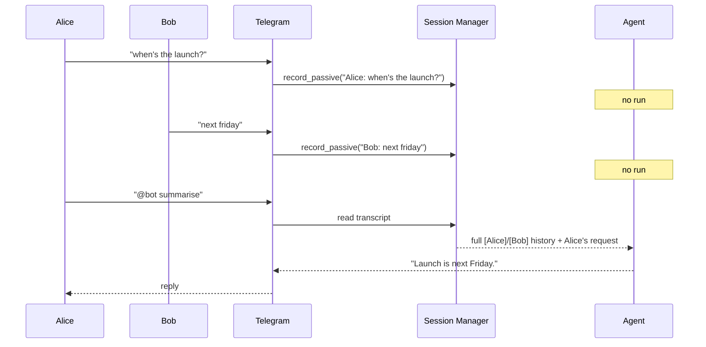
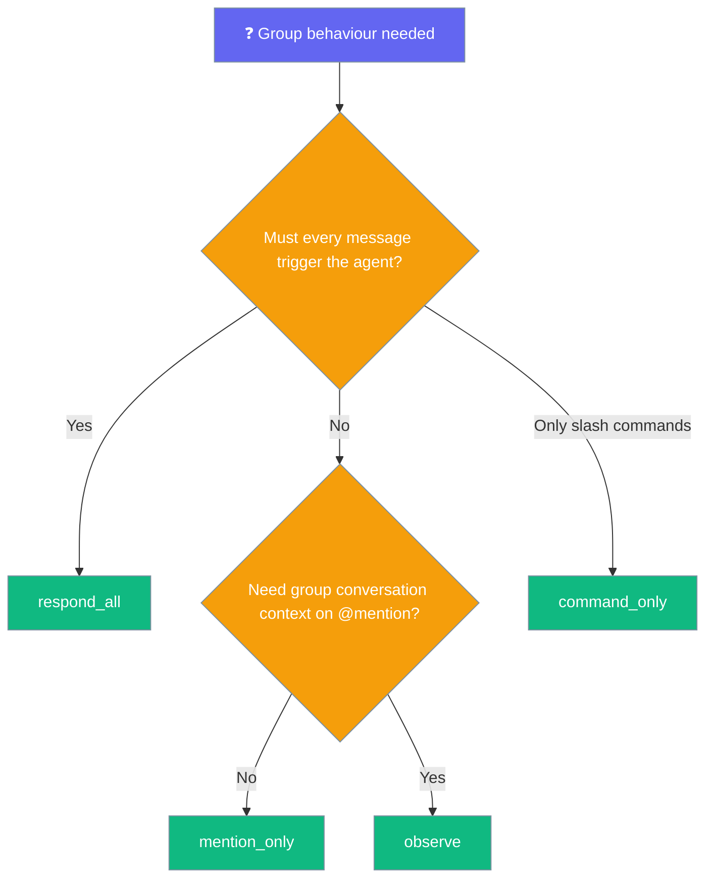

`observe` lets your bot listen to a group without answering — every message lands in the transcript, but the agent only runs when it's @mentioned.

```mermaid
graph LR
    subgraph "Observe Mode"
        Msg[📨 Group message] --> Mention{@mentioned?}
        Mention -->|No| Record[📝 Record as context]
        Mention -->|Yes| Run[🤖 Run agent]
        Record --> Done[🔇 No reply]
        Run --> Reply[💬 Reply with full context]
    end

    classDef input fill:#6366F1,stroke:#7C90A0,color:#fff
    classDef check fill:#F59E0B,stroke:#7C90A0,color:#fff
    classDef result fill:#10B981,stroke:#7C90A0,color:#fff
    classDef silent fill:#8B0000,stroke:#7C90A0,color:#fff

    class Msg input
    class Mention,Record check
    class Run,Reply result
    class Done silent
```

## Quick Start

<Steps>
<Step title="Simple Usage">
Write the agent that answers when addressed.

```python
from praisonaiagents import Agent

agent = Agent(
    name="Group Assistant",
    instructions="Summarise or answer when addressed. Refer back to what people said.",
)

agent.start("Watches the group; replies only when @mentioned")
```

Behind the scenes: run this agent through the Telegram bot with `group_policy: observe`.
</Step>

<Step title="Gateway YAML (the real switch)">
`group_policy: observe` is the whole change. Add `session_scope: per_chat` for shared group memory.

```yaml
# gateway.yaml
channels:
  telegram:
    platform: telegram
    token: ${TELEGRAM_BOT_TOKEN}
    group_policy: observe        # ← the whole change
    session:
      session_scope: per_chat    # ← recommended: shared group transcript

agent:
  name: group-assistant
  instructions: |
    You are a group assistant. Reply only when @mentioned.
    You can see the recent group conversation — refer to participants by name.
  model: gpt-4o-mini
```
</Step>
</Steps>

---

## How It Works

Unmentioned messages are recorded as passive `user` turns; the agent only runs on an @mention and sees the full recent conversation.



---

## Policy Options

Every `group_policy` value and when to pick it.

| Value | Behaviour | When to use |
|---|---|---|
| `respond_all` | Agent runs on every message. | Small trusted groups; expensive. |
| `mention_only` (default) | Unmentioned messages dropped, **no memory**. | Safe default. Bot forgets everything until addressed. |
| `command_only` | Only `/commands` reach the agent. | Command-driven bots. |
| `observe` | Unmentioned messages stored as passive context. Agent only runs when @mentioned; the reply sees the full recent conversation. | Group assistants (summarise, refer back, catch up). |



---

## Interaction Flow

What the group sees versus what the transcript actually holds under `observe` + `per_chat`.

```
Group chat (what everyone sees):
  Alice:  when's the launch?
  Bob:    next friday
  Alice:  @bot summarise
  Bot:    Launch is next Friday.

Session transcript (what the bot stores):
  [Alice] when's the launch?     ← passive, no agent run
  [Bob] next friday              ← passive, no agent run
  [Alice] @bot summarise         ← triggers agent; sees both lines above
```

The bot stayed silent for the first two messages but still captured them, so the @mention answers with full awareness.

---

## Compatibility

Only Telegram honours `observe` today. Other adapters gate solely on `mention_required` and fall back to their default group handling.

| Platform | `observe` supported? |
|---|---|
| Telegram | ✅ |
| Slack | ❌ (planned) |
| Discord | ❌ (planned) |
| WhatsApp | ❌ (planned) |

---

## Best Practices

<AccordionGroup>
<Accordion title="Pair with session_scope: per_chat for shared group memory">
Without `per_chat`, passive turns are keyed under each individual sender's own session — useful for solo group DMs but not shared. Add `session_scope: per_chat` so every message lands on the shared per-chat transcript that a later @mention reads from.
</Accordion>

<Accordion title="Prefer observe over respond_all + NO_REPLY">
`observe` records unmentioned messages without running the agent — no LLM tokens spent, no risk of an accidental reply. `respond_all + NO_REPLY` runs the agent on every message and then chooses silence, which is more expensive and less safe.
</Accordion>

<Accordion title="DMs are unaffected">
DMs always run the agent regardless of `group_policy`. `observe` only changes how unmentioned **group** messages are handled.
</Accordion>

<Accordion title="Account for retention and PII">
Every unmentioned message is stored. In busy or sensitive channels, lower `max_history` or enable compaction to summarise older turns.
</Accordion>
</AccordionGroup>

---

## Related

<CardGroup cols={2}>
<Card title="Per-Chat Session Scope" icon="users" href="/features/per-chat-session-scope">
  Share one transcript across a group with sender attribution
</Card>
<Card title="Bot Intentional Silence" icon="volume-off" href="/features/bot-intentional-silence">
  Let the agent choose not to reply with NO_REPLY
</Card>
</CardGroup>
