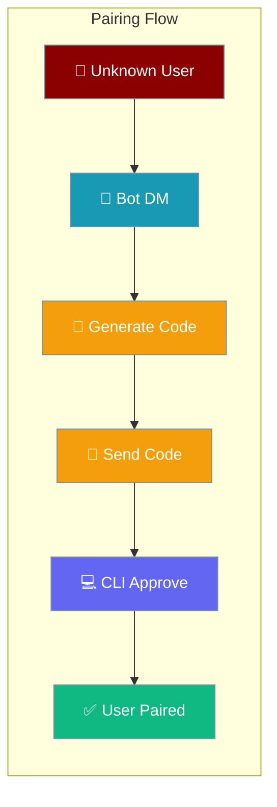
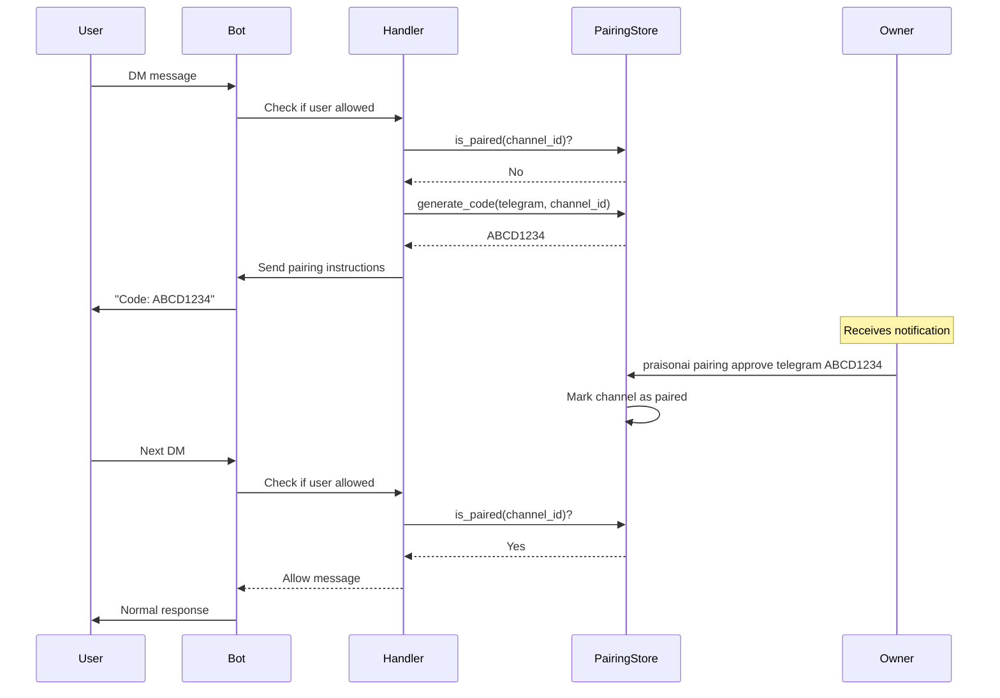
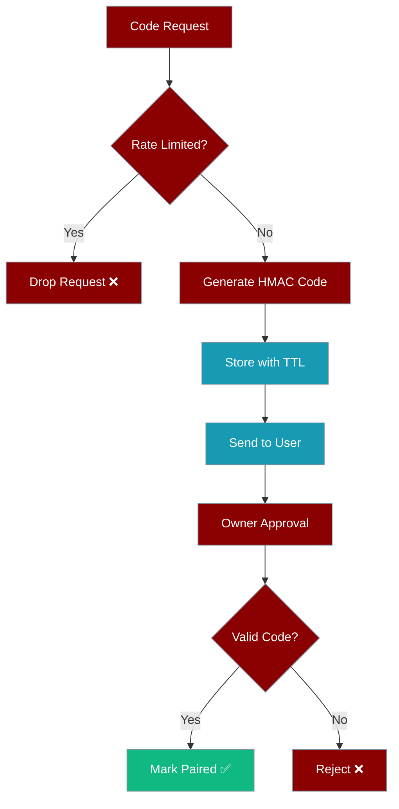

Bot pairing lets unknown users self-request access to your bot with secure 8-character codes that you approve from the CLI.



## Quick Start

<Steps>
<Step title="Enable Pairing Policy">

```python
from praisonaiagents import Agent
from praisonaiagents.bots import BotConfig

config = BotConfig(
    allowed_users=["@owner"],
    unknown_user_policy="pair",  # Enable pairing for unknown users
)

# Bot setup with Telegram adapter (other platforms pending)
# from praisonai.bots.telegram import TelegramAdapter
# bot = TelegramAdapter(config)
```

</Step>

<Step title="Approve Pairing Requests">

```bash
# List pending pairing requests
praisonai pairing list

# Approve a user's pairing code
praisonai pairing approve telegram ABCD1234 --label "alice"

# View all paired channels
praisonai pairing list
```

</Step>
</Steps>

---

## How It Works



---

## Policy Configuration

### Unknown User Policies

```python
from praisonaiagents.bots import BotConfig

# Policy options
config = BotConfig(
    allowed_users=["@owner", "123456789"],
    unknown_user_policy="pair"  # Choose one below
)
```

| Policy | Behavior | Use Case |
|--------|----------|----------|
| `"deny"` | Silently drop messages (default) | Private bots, testing |
| `"allow"` | Allow all users (overrides allowed_users) | Public bots |  
| `"pair"` | Use pairing flow for approval | Controlled access |

### Pairing Rate Limiting

The system includes built-in protection against code generation spam:

- **Rate Limit**: 10 minutes between code generations per channel
- **Code TTL**: Codes expire after a configurable time (default: check `PaisingStore` implementation)
- **Automatic Cleanup**: Stale rate limit entries are automatically evicted

---

## CLI Commands

### List Commands

```bash
# List all paired channels
praisonai pairing list

# Example output:
# Found 3 paired channels:
#
# Platform: telegram
# Channel:  @alice_username  
# Paired:   2026-04-22 10:30:15
# Label:    alice
#
# Platform: telegram
# Channel:  987654321
# Paired:   2026-04-22 11:45:22
# Label:    bob
```

### Approve Command

```bash
# Approve with auto-resolved channel ID (when code is bound)
praisonai pairing approve telegram ABCD1234

# Approve with explicit channel ID
praisonai pairing approve telegram ABCD1234 987654321

# Approve with human-readable label
praisonai pairing approve telegram ABCD1234 --label "alice"

# Use custom store directory
praisonai pairing approve telegram ABCD1234 --store-dir /path/to/store
```

### Revoke Access

```bash
# Revoke specific channel
praisonai pairing revoke telegram 987654321

# Clear all pairings (with confirmation)
praisonai pairing clear
# Are you sure you want to clear ALL paired channels? [y/N]: y
# ✅ Cleared 3 paired channels

# Clear without confirmation prompt
praisonai pairing clear --confirm
```

---

## Platform Support

### Current Implementation

| Platform | Status | Handler Wiring | CLI Support |
|----------|--------|----------------|-------------|
| **Telegram** | ✅ Shipped | ✅ Complete | ✅ Full |
| **Discord** | 🔧 Pending | ❌ Not wired | ✅ CLI ready |
| **Slack** | 🔧 Pending | ❌ Not wired | ✅ CLI ready |
| **WhatsApp** | 🔧 Pending | ❌ Not wired | ✅ CLI ready |

<Note>
**Platform Implementation Status**: PR #1504 ships the pairing system and CLI with full Telegram support. Other platform adapters need handler wiring to complete the integration.
</Note>

### Telegram Integration

```python
# Telegram adapter includes UnknownUserHandler wiring
from praisonai.bots.telegram import TelegramAdapter
from praisonaiagents.bots import BotConfig

config = BotConfig(
    token=os.getenv("TELEGRAM_BOT_TOKEN"),
    unknown_user_policy="pair"
)

# Handler automatically wired in Telegram adapter
bot = TelegramAdapter(config)
```

---

## Security Model

### Code Generation

- **8-character codes**: Hex format (e.g., `ABCD1234`)
- **HMAC signatures**: Codes are cryptographically signed
- **Per-install secret**: Auto-generated if `PRAISONAI_GATEWAY_SECRET` unset
- **Channel binding**: Codes can be bound to specific channel IDs

### Secret Management

```bash
# Option 1: Set explicit gateway secret (recommended for production)
export PRAISONAI_GATEWAY_SECRET="your-secure-secret-key"

# Option 2: Auto-generated per-install secret
# Stored at <store_dir>/.gateway_secret with 0600 permissions
# Persists across restarts, unique per installation
```

<Warning>
**Secret Persistence**: Without `PRAISONAI_GATEWAY_SECRET`, a per-install secret is auto-generated and stored at `<store_dir>/.gateway_secret` with mode `0600`. This file is critical for code verification across restarts.
</Warning>

### Security Features



1. **Rate Limiting**: 600s (10 min) window per channel prevents spam
2. **HMAC Verification**: Codes are cryptographically signed and verified
3. **TTL Expiration**: Codes automatically expire after configured time
4. **Atomic Operations**: Pairing state persisted atomically to disk

---

## User Interaction Flow

### Step-by-Step Process

1. **Unknown User DMs Bot**
   ```
   Unknown User: Hello!
   ```

2. **Bot Generates Pairing Code**
   ```
   Bot: Your pairing code: `ABCD1234`
   Owner: `praisonai pairing approve telegram ABCD1234`
   ```

3. **Owner Approves via CLI**
   ```bash
   $ praisonai pairing approve telegram ABCD1234 --label "alice"
   ✅ Successfully paired telegram channel 987654321
      Label: alice
   ```

4. **User Can Now Interact Normally**
   ```
   Unknown User: Hello!
   Bot: Hi there! How can I help you today?
   ```

### Rate Limit Handling

If a user tries to generate codes too frequently:

```
User: Hello!
Bot: [no response - rate limited]

# In logs:
# DEBUG: Rate limited channel 987654321 (last code: 120.5s ago)
```

The user must wait for the rate limit window (10 minutes) to expire before requesting a new code.

---

## Configuration Options

### Store Directory

```bash
# Default: ~/.praisonai/pairing/
praisonai pairing list

# Custom directory
praisonai pairing list --store-dir /custom/path

# All commands support --store-dir
praisonai pairing approve telegram ABCD1234 --store-dir /custom/path
```

### Environment Variables

```bash
# Explicit gateway secret (recommended for production)
export PRAISONAI_GATEWAY_SECRET="your-256-bit-secret"

# Custom store directory (optional)
export PRAISONAI_STORE_DIR="/custom/store/path"
```

---

## Best Practices

<AccordionGroup>
<Accordion title="Production Secret Management" icon="key">
Set `PRAISONAI_GATEWAY_SECRET` explicitly in production environments to ensure consistent code verification across deployments.

```bash
# Generate secure secret
openssl rand -hex 32 > gateway_secret.txt

# Set in production
export PRAISONAI_GATEWAY_SECRET=$(cat gateway_secret.txt)
```
</Accordion>

<Accordion title="Monitor Rate Limits" icon="gauge">
Watch for rate limiting warnings in logs - they indicate potential pairing spam or legitimate users hitting limits.

```bash
# Look for these log patterns:
# DEBUG: Rate limited channel 123456 (last code: 45.2s ago)
# INFO: Generated pairing code for user123 on telegram: ABCD1234
```
</Accordion>

<Accordion title="Use Descriptive Labels" icon="tag">
Add labels when approving pairings to identify channels later.

```bash
# Good - easy to identify
praisonai pairing approve telegram ABCD1234 --label "alice-work"
praisonai pairing approve telegram EFGH5678 --label "bob-personal"

# Less helpful
praisonai pairing approve telegram ABCD1234
```
</Accordion>

<Accordion title="Regular Pairing Audits" icon="list-check">
Periodically review paired channels and revoke access for inactive users.

```bash
# Review all pairings
praisonai pairing list

# Revoke specific channels  
praisonai pairing revoke telegram 987654321

# Clear all if starting fresh
praisonai pairing clear --confirm
```
</Accordion>
</AccordionGroup>

---

## Related

<CardGroup cols={2}>
<Card title="Bot Security" icon="shield-check" href="/docs/best-practices/bot-security">
Comprehensive bot security and DM policies
</Card>

<Card title="Messaging Bots" icon="message" href="/docs/features/messaging-bots">
Bot platform setup and configuration
</Card>
</CardGroup>