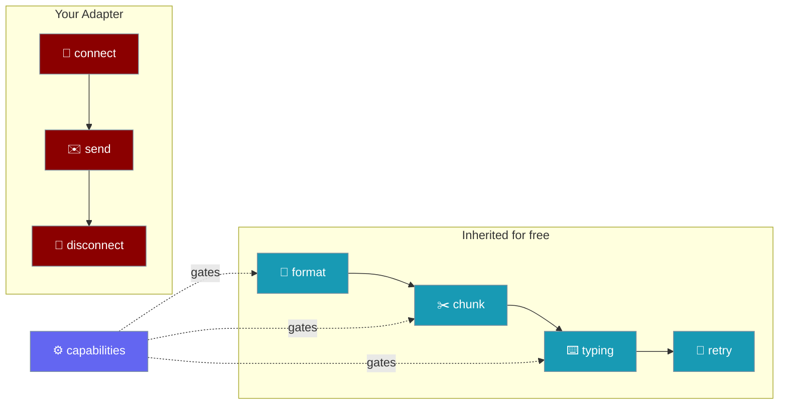
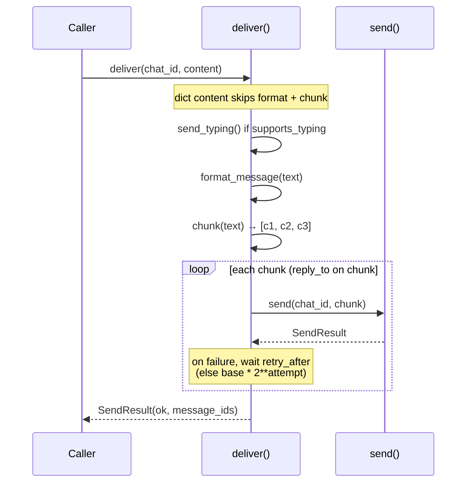
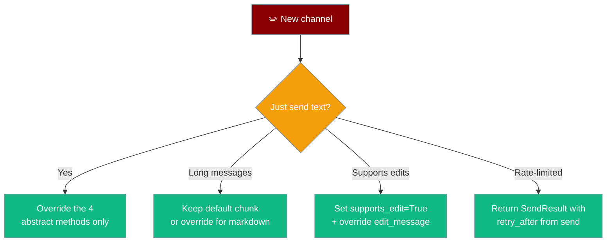
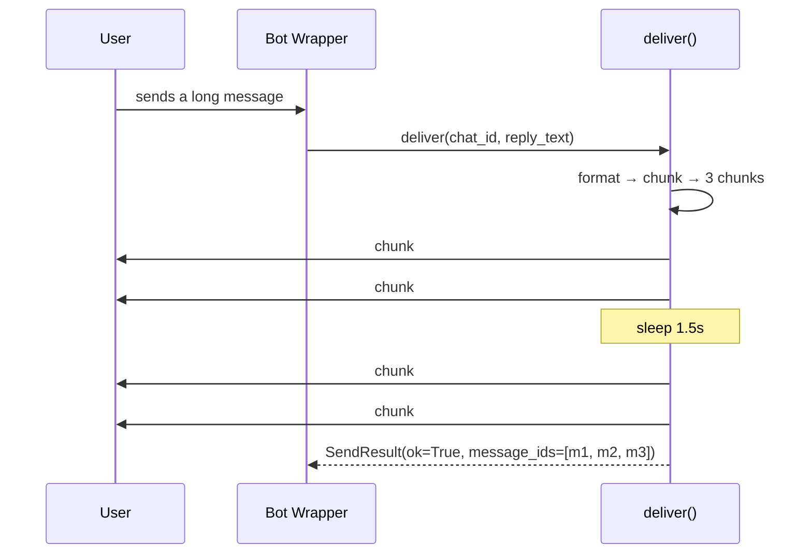

Subclass `BasePlatformAdapter` to add a new chat channel: implement four methods, declare capabilities, and inherit robust chunking, retry, typing, and edit-fallback delivery.



## Quick Start

A minimal adapter implements four methods and calls `deliver()` to send.

<Steps>
<Step title="Minimal adapter (4 methods)">

Subclass `BasePlatformAdapter`, declare `capabilities`, and implement `connect`, `disconnect`, `send`, and `get_chat_info`.

```python
from praisonaiagents import BasePlatformAdapter, SendResult
from praisonaiagents.bots import PlatformCapabilities


class AcmeBot(BasePlatformAdapter):
    capabilities = PlatformCapabilities(max_message_length=4096)

    async def connect(self, *, is_reconnect: bool = False) -> bool:
        # open your websocket / HTTP session here
        return True

    async def disconnect(self) -> None:
        # tear down cleanly
        ...

    async def send(self, chat_id, content, *, reply_to=None, metadata=None) -> SendResult:
        message_id = await acme_api.send(chat_id, content, reply_to=reply_to)
        return SendResult(ok=True, message_id=message_id, chat_id=chat_id)

    async def get_chat_info(self, chat_id):
        return {"id": chat_id}


# Chunking, retry, typing, edit-fallback — all inherited.
adapter = AcmeBot()
await adapter.connect()
result = await adapter.deliver(chat_id="C123", content="…very long text…")
print(result.ok, result.message_ids)
```

</Step>

<Step title="Declare more capabilities to unlock defaults">

Turn on `supports_edit` and `supports_typing`, then override only what the platform genuinely does — here a lightweight `edit_message`.

```python
from praisonaiagents import BasePlatformAdapter, SendResult
from praisonaiagents.bots import PlatformCapabilities


class AcmeBot(BasePlatformAdapter):
    capabilities = PlatformCapabilities(
        supports_edit=True,
        supports_typing=True,
        max_message_length=4096,
    )

    async def connect(self, *, is_reconnect: bool = False) -> bool:
        return True

    async def disconnect(self) -> None:
        ...

    async def send(self, chat_id, content, *, reply_to=None, metadata=None) -> SendResult:
        message_id = await acme_api.send(chat_id, content, reply_to=reply_to)
        return SendResult(ok=True, message_id=message_id, chat_id=chat_id)

    async def get_chat_info(self, chat_id):
        return {"id": chat_id}

    async def send_typing(self, chat_id) -> None:
        await acme_api.typing(chat_id)

    async def edit_message(self, chat_id, message_id, content) -> SendResult:
        await acme_api.edit(chat_id, message_id, content)
        return SendResult(ok=True, message_id=message_id, chat_id=chat_id)
```

</Step>
</Steps>

---

## How It Works

`deliver()` formats, chunks, sends a typing heartbeat, then sends each chunk with retry — all keyed off capabilities.



---

## What Do I Need to Override?

Start with the four abstract methods, then reach for defaults only when the platform can do better.



---

## User Interaction Flow

A long user reply flows through `deliver()` as three chunks, with one retry honouring `retry_after`.



Four behaviours are worth calling out:

1. **Chunking is text-only.** Dict content passes straight through to `send()` without chunking or formatting — ideal for rich payloads like attachments or buttons.
2. **Reply-to only on the first chunk.** In a multi-chunk reply, chunk #1 carries `reply_to`; chunks 2..N are unthreaded follow-ups. `SendResult.message_ids` gives you every chunk's id in order.
3. **Typing is best-effort.** Failures in `send_typing()` are swallowed, so a broken indicator never breaks delivery.
4. **`edit_message` declares "not supported" instead of crashing.** Callers on channels without edits use the `edit_not_supported` fallback to decide whether to re-send.

---

## Configuration Options

`SendResult` is the transport-neutral value returned by every send/edit path.

| Field | Type | Default | Description |
|-------|------|---------|-------------|
| `ok` | `bool` | `True` | Whether the send succeeded. |
| `message_id` | `Optional[str]` | `None` | Platform message id of the last message sent. For chunked delivery this is the final chunk. |
| `chat_id` | `Optional[str]` | `None` | The chat/channel the message was delivered to. |
| `message_ids` | `List[str]` | `[]` | Ids of **every** chunk that landed, in send order. On a partial failure the ids of chunks that landed before the error are preserved. |
| `error` | `Optional[str]` | `None` | Human-readable error string when `ok=False`. |
| `retry_after` | `Optional[float]` | `None` | Suggested seconds to wait before retrying, from the platform's rate-limit response. Honoured by the default retry loop. |
| `metadata` | `Dict[str, Any]` | `{}` | Additional platform-specific result details. On a successful multi-chunk `deliver()` this includes `{"chunks": N}`. |

`SendResult.to_dict()` returns a plain dict for logging and observability.

`BasePlatformAdapter` class attributes declare adapter behaviour.

| Attribute | Type | Default | Description |
|-----------|------|---------|-------------|
| `capabilities` | `PlatformCapabilities` | `PlatformCapabilities()` | Platform features. Every default behaviour keys off this, degrading gracefully when a flag is absent. |
| `max_retries` | `int` | `3` | Retry attempts for the default resilient delivery loop. |
| `retry_base_delay` | `float` | `0.5` | Base backoff (seconds) for exponential retry when `retry_after` is not supplied. |

The delay between attempts follows `retry_after` first, then exponential backoff:

```
delay_seconds =
    result.retry_after            # platform's own rate-limit hint, if any
    ELSE retry_base_delay * 2**attempt   # 0.5, 1.0, 2.0 with defaults
```

A `send()` implementation that raises is treated as a failure and retried — you do not have to catch transport errors yourself.

The four abstract methods every subclass must implement:

| Method | Signature | Purpose |
|--------|-----------|---------|
| `connect` | `async def connect(*, is_reconnect: bool = False) -> bool` | Establish the platform connection. |
| `disconnect` | `async def disconnect() -> None` | Tear down the connection and release resources. |
| `send` | `async def send(chat_id, content, *, reply_to=None, metadata=None) -> SendResult` | Send one message (no chunking, no retry). |
| `get_chat_info` | `async def get_chat_info(chat_id) -> Dict[str, Any]` | Return chat/channel metadata (at least an `id` key). |

<Card title="BasePlatformAdapter SDK Reference" icon="code" href="/docs/sdk/reference/python/modules">
  Full auto-generated Python API surface for `BasePlatformAdapter` and `SendResult`.
</Card>

---

## Common Patterns

Override `chunk()` when the platform needs code-fence-aware splitting.

```python
class AcmeBot(BasePlatformAdapter):
    def chunk(self, text: str):
        blocks, buf, fence = [], [], False
        for line in text.splitlines(keepends=True):
            if line.lstrip().startswith("```"):
                fence = not fence
            buf.append(line)
            if not fence and sum(len(b) for b in buf) >= self.max_message_length:
                blocks.append("".join(buf))
                buf = []
        if buf:
            blocks.append("".join(buf))
        return blocks
```

Send a dict payload to pass rich content straight through — `deliver()` skips chunking and formatting.

```python
await adapter.deliver(
    chat_id="C123",
    content={"text": "Choose an option", "buttons": ["Yes", "No"]},
)
```

Register the adapter at runtime via the platform registry — see [Bot Platform Plugins](/docs/features/bot-platform-plugins) for `register_platform(name, cls)`.

---

## Best Practices

<AccordionGroup>
<Accordion title="Keep send() a single API call">
Chunking, retry, and typing belong to `deliver()`. Keep `send()` a thin wrapper around one platform API call so the shared machinery stays in control.
</Accordion>

<Accordion title="Return retry_after when the platform tells you to">
Populate `SendResult(ok=False, retry_after=X)` from `send()` when the platform reports a rate limit. The default retry loop honours it and beats fixed backoff.
</Accordion>

<Accordion title="Declare only what your platform actually does">
A truthful `PlatformCapabilities` gives the shared code the best information for graceful degradation. Overstating a capability breaks the fallback path.
</Accordion>

<Accordion title="Don't override edit_message unless supports_edit=True">
Callers rely on the built-in `edit_not_supported` fallback to decide whether to re-send. Setting `supports_edit=True` without an override raises `NotImplementedError`.
</Accordion>

<Accordion title="Advanced: override format_message for markup">
Slack `mrkdwn`, Telegram MarkdownV2, and Discord embeds each have quirks. `format_message` is the single method to apply platform-specific markup.
</Accordion>
</AccordionGroup>

---

## Related

<CardGroup cols={2}>
<Card title="Bot Platform Capabilities" icon="sliders" href="/docs/features/bot-platform-capabilities">
  The `PlatformCapabilities` descriptor that gates adapter defaults.
</Card>
<Card title="Bot Platform Plugins" icon="puzzle-piece" href="/docs/features/bot-platform-plugins">
  Runtime registration and discovery of platform adapters.
</Card>
<Card title="Run Status Controller" icon="gauge-simple" href="/docs/features/bot-run-status-controller">
  Transport-agnostic run-progress state machine for your adapter.
</Card>
</CardGroup>
