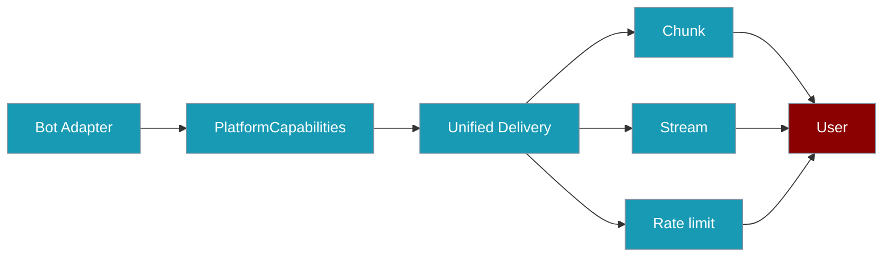
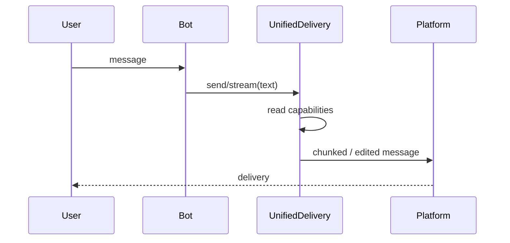

<Note>
Bot platform adapters now ship in the `praisonai-bot` package. `praisonai bot serve` still works exactly as documented here; for a standalone install see [praisonai-bot Migration](/docs/guides/praisonai-bot-migration).
</Note>


Platform capabilities tell PraisonAI what your bot's platform can do, so streaming, chunking, and rate limiting work the same way everywhere.

```python
from praisonaiagents import Agent

agent = Agent(name="assistant", instructions="Reply on Telegram with streaming when supported.")
agent.start("Send a long answer with progressive updates.")
```


<Info>
Capabilities describe what a channel **can** render; [Display Policy](/docs/features/display-policy) controls what you **want** shown.
</Info>

The user receives a reply; platform capabilities tell PraisonAI how to chunk, stream, and rate-limit on that channel.



## Quick Start

<Steps>

<Step title="Look up built-in capabilities">

```python
from praisonai import Bot
from praisonaiagents import Agent
from praisonai.bots._registry import get_platform_capabilities

agent = Agent(name="assistant", instructions="Be helpful")
caps = get_platform_capabilities("telegram")
print(caps.max_message_length)  # 4096
print(caps.length_unit)         # utf16

bot = Bot("telegram", agent=agent)
```

</Step>

<Step title="Register a custom platform">

```python
from praisonaiagents.bots import PlatformCapabilities
from praisonai.bots._registry import register_platform

class MyBot:
    async def start(self): ...
    async def stop(self): ...

register_platform(
    "mybot",
    MyBot,
    capabilities=PlatformCapabilities(
        max_message_length=2000,
        supports_edit=True,
        markdown_dialect="markdown",
    ),
)
```

</Step>

</Steps>

## How it works

`UnifiedDelivery` (via `create_delivery(bot)`) reads `platform_capabilities` to chunk long replies, stream edits, and apply rate limits.



## Configuration options

| Field | Type | Default | Description |
|-------|------|---------|-------------|
| `max_message_length` | `int` | `4096` | Maximum message length in the platform's unit |
| `length_unit` | `str` | `"codepoints"` | `"codepoints"` or `"utf16"` |
| `supports_edit` | `bool` | `False` | In-place message edits (streaming) |
| `supports_typing` | `bool` | `True` | Typing indicators |
| `markdown_dialect` | `str` | `"markdown"` | e.g. `"telegram_markdown_v2"`, `"discord_markdown"` |
| `needs_rate_limit` | `bool` | `True` | Apply Praison rate limiting |
| `edit_interval_ms` | `int` | `1000` | Minimum ms between edits |
| `max_files_per_message` | `int` | `1` | Attachments per message |
| `max_file_size_mb` | `int` | `10` | Max file size in MB |
| `supported_file_types` | `List[str]` | `["*"]` | Allowed mime types or extensions |
| `accepts_webhooks` | `bool` | `False` | Channel receives inbound HTTP webhooks |
| `verifies_webhook_signature` | `bool` | `False` | Adapter exposes a webhook verifier |
| `reconciles_unknown_send` | `bool` | `False` | Adapter can confirm whether a prior send actually landed (via `was_delivered(idempotency_key)`). Enables effectively-once delivery via the durable outbox. |
| `supports_idempotency_token` | `bool` | `False` | **Informational** — transport accepts a provider-level idempotency token. Set `reconciles_unknown_send` as well if you need effectively-once. |

Methods: `to_dict()` and `from_dict(data)`.

### Webhook-based platforms

Platforms that set `accepts_webhooks=True` must also expose a `webhook_verifier` so `enforce_webhook_verification` can enforce signatures fail-closed. See [Webhook Verification](/docs/features/webhook-verification).

## Built-in platform defaults

| Platform | Notes |
|----------|-------|
| **Telegram** | `max_message_length=4096`, `length_unit="utf16"`, `supports_edit=True`, `markdown_dialect="telegram_markdown_v2"`, `needs_rate_limit=True`, `edit_interval_ms=1000`, `max_file_size_mb=50` |
| **Discord** | `max_message_length=2000`, `length_unit="codepoints"`, `supports_edit=True`, `needs_rate_limit=False`, `edit_interval_ms=500`, `max_files_per_message=10`, `max_file_size_mb=8` |
| slack, whatsapp, linear, email, agentmail | Uses `PlatformCapabilities()` defaults until the adapter declares its own |

## Common patterns

**Subclass with `default_capabilities()`** (Telegram and Discord use this):

```python
@classmethod
def default_capabilities(cls) -> PlatformCapabilities:
    return PlatformCapabilities(max_message_length=2000, supports_edit=True)
```

Entry-point registrations (via `praisonai.channels`) get default capabilities unless the adapter class exposes a `default_capabilities()` classmethod. This keeps zero-config connectors functional while letting polished adapters declare exact limits:

```toml
# pyproject.toml
[project.entry-points."praisonai.channels"]
myplatform = "mypackage.bot:MyPlatformBot"
```

```python
class MyPlatformBot:
    @classmethod
    def default_capabilities(cls):
        from praisonaiagents.bots import PlatformCapabilities
        return PlatformCapabilities(max_message_length=1000, supports_edit=False)
    
    async def start(self): ...
    async def stop(self): ...
```

**Serialise for config files:**

```python
caps = get_platform_capabilities("telegram")
data = caps.to_dict()
restored = PlatformCapabilities.from_dict(data)
```

## Best practices

<AccordionGroup>

<Accordion title="Use utf16 for Telegram">
Telegram counts UTF-16 code units. Wrong `length_unit` can silently truncate messages.
</Accordion>

<Accordion title="Set needs_rate_limit=False only when the SDK rate-limits">
Discord.py handles limits internally; raw Telegram HTTP does not.
</Accordion>

<Accordion title="Enable supports_edit only with edit_message()">
`UnifiedDelivery` streams via edits when this flag is true.
</Accordion>

<Accordion title="Prefer default_capabilities() on the adapter class">
Keeps registry caching consistent when platforms override defaults.
</Accordion>

</AccordionGroup>

## Related

<CardGroup cols={2}>
  <Card title="Durable Outbound Delivery" icon="shield-check" href="/docs/features/durable-delivery#effectively-once-delivery">
    Effectively-once delivery via crash reconciliation
  </Card>
  <Card title="Display Policy" icon="monitor" href="/docs/features/display-policy">
    Operator policy for streaming and footers
  </Card>
  <Card title="Bot Platform Plugins" icon="puzzle-piece" href="/docs/features/bot-platform-plugins">
    Register custom adapters
  </Card>
  <Card title="Bot Streaming Replies" icon="stream" href="/docs/features/bot-streaming-replies">
    Uses supports_edit and edit_interval_ms
  </Card>
  <Card title="Bot Rate Limiting" icon="gauge" href="/docs/features/bot-rate-limiting">
    Uses needs_rate_limit
  </Card>
  <Card title="Chunking Strategies" icon="scissors" href="/docs/features/chunking-strategies">
    Uses max_message_length and length_unit
  </Card>
</CardGroup>
