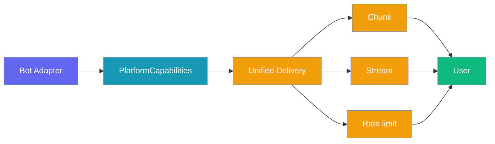
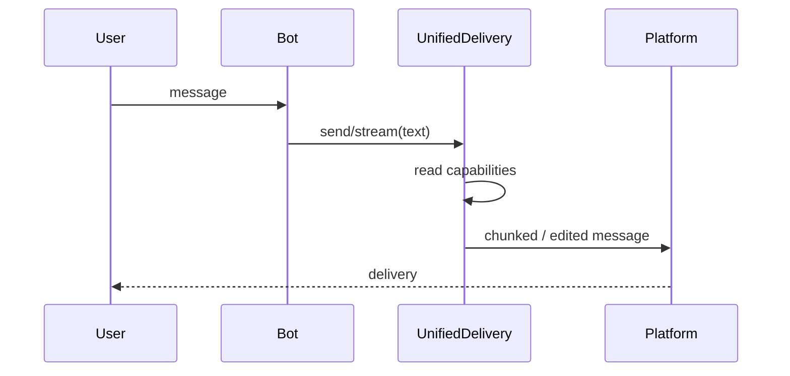

Platform capabilities tell PraisonAI what your bot's platform can do, so streaming, chunking, and rate limiting work the same way everywhere.



## Quick Start

<Steps>

<Step title="Look up built-in capabilities">

```python
from praisonai import Bot
from praisonaiagents import Agent
from praisonai.bots._registry import get_platform_capabilities

agent = Agent(name="assistant", instructions="Be helpful")
caps = get_platform_capabilities("telegram")
print(caps.max_message_length)  # 4096
print(caps.length_unit)         # utf16

bot = Bot("telegram", agent=agent)
```

</Step>

<Step title="Register a custom platform">

```python
from praisonaiagents.bots import PlatformCapabilities
from praisonai.bots._registry import register_platform

class MyBot:
    async def start(self): ...
    async def stop(self): ...

register_platform(
    "mybot",
    MyBot,
    capabilities=PlatformCapabilities(
        max_message_length=2000,
        supports_edit=True,
        markdown_dialect="markdown",
    ),
)
```

</Step>

</Steps>

## How it works

`UnifiedDelivery` (via `create_delivery(bot)`) reads `platform_capabilities` to chunk long replies, stream edits, and apply rate limits.



## Configuration options

| Field | Type | Default | Description |
|-------|------|---------|-------------|
| `max_message_length` | `int` | `4096` | Maximum message length in the platform's unit |
| `length_unit` | `str` | `"codepoints"` | `"codepoints"` or `"utf16"` |
| `supports_edit` | `bool` | `False` | In-place message edits (streaming) |
| `supports_typing` | `bool` | `True` | Typing indicators |
| `markdown_dialect` | `str` | `"markdown"` | e.g. `"telegram_markdown_v2"`, `"discord_markdown"` |
| `needs_rate_limit` | `bool` | `True` | Apply Praison rate limiting |
| `edit_interval_ms` | `int` | `1000` | Minimum ms between edits |
| `max_files_per_message` | `int` | `1` | Attachments per message |
| `max_file_size_mb` | `int` | `10` | Max file size in MB |
| `supported_file_types` | `List[str]` | `["*"]` | Allowed mime types or extensions |
| `accepts_webhooks` | `bool` | `False` | Declares this adapter receives inbound webhooks |
| `verifies_webhook_signature` | `bool` | `False` | Declares the adapter exposes a webhook verifier |

Methods: `to_dict()` and `from_dict(data)`.

## Built-in platform defaults

| Platform | Notes |
|----------|-------|
| **Telegram** | `max_message_length=4096`, `length_unit="utf16"`, `supports_edit=True`, `markdown_dialect="telegram_markdown_v2"`, `needs_rate_limit=True`, `edit_interval_ms=1000`, `max_file_size_mb=50` |
| **Discord** | `max_message_length=2000`, `length_unit="codepoints"`, `supports_edit=True`, `needs_rate_limit=False`, `edit_interval_ms=500`, `max_files_per_message=10`, `max_file_size_mb=8` |
| slack, whatsapp, linear, email, agentmail | Uses `PlatformCapabilities()` defaults until the adapter declares its own |

## Webhook-based platforms

Platforms that set `accepts_webhooks=True` receive events via HTTP POST rather than polling or long-polling. For these platforms, `enforce_webhook_verification` requires a configured verifier before dispatching to the agent — if `verifies_webhook_signature=True` is declared but no verifier is provided, all webhooks are rejected with HTTP 401 (fail-closed).

```python
from praisonaiagents.bots import PlatformCapabilities

caps = PlatformCapabilities(
    accepts_webhooks=True,
    verifies_webhook_signature=True,
)
```

See [Webhook Verification](/docs/features/webhook-verification) for how to implement a verifier for a custom adapter.

## Common patterns

**Subclass with `default_capabilities()`** (Telegram and Discord use this):

```python
@classmethod
def default_capabilities(cls) -> PlatformCapabilities:
    return PlatformCapabilities(max_message_length=2000, supports_edit=True)
```

**Serialise for config files:**

```python
caps = get_platform_capabilities("telegram")
data = caps.to_dict()
restored = PlatformCapabilities.from_dict(data)
```

## Best practices

<AccordionGroup>

<Accordion title="Use utf16 for Telegram">
Telegram counts UTF-16 code units. Wrong `length_unit` can silently truncate messages.
</Accordion>

<Accordion title="Set needs_rate_limit=False only when the SDK rate-limits">
Discord.py handles limits internally; raw Telegram HTTP does not.
</Accordion>

<Accordion title="Enable supports_edit only with edit_message()">
`UnifiedDelivery` streams via edits when this flag is true.
</Accordion>

<Accordion title="Prefer default_capabilities() on the adapter class">
Keeps registry caching consistent when platforms override defaults.
</Accordion>

</AccordionGroup>

## Related

<CardGroup cols={2}>
  <Card title="Bot Platform Plugins" icon="puzzle-piece" href="/docs/features/bot-platform-plugins">
    Register custom adapters
  </Card>
  <Card title="Webhook Verification" icon="shield-check" href="/docs/features/webhook-verification">
    Fail-closed HMAC verification for webhook adapters
  </Card>
  <Card title="Bot Streaming Replies" icon="stream" href="/docs/features/bot-streaming-replies">
    Uses supports_edit and edit_interval_ms
  </Card>
  <Card title="Bot Rate Limiting" icon="gauge" href="/docs/features/bot-rate-limiting">
    Uses needs_rate_limit
  </Card>
</CardGroup>
