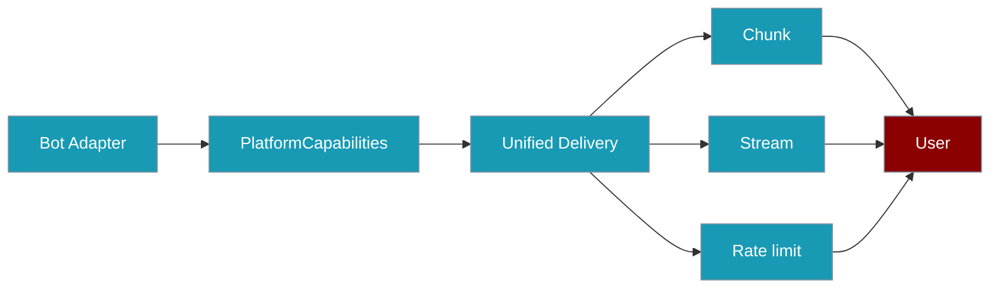
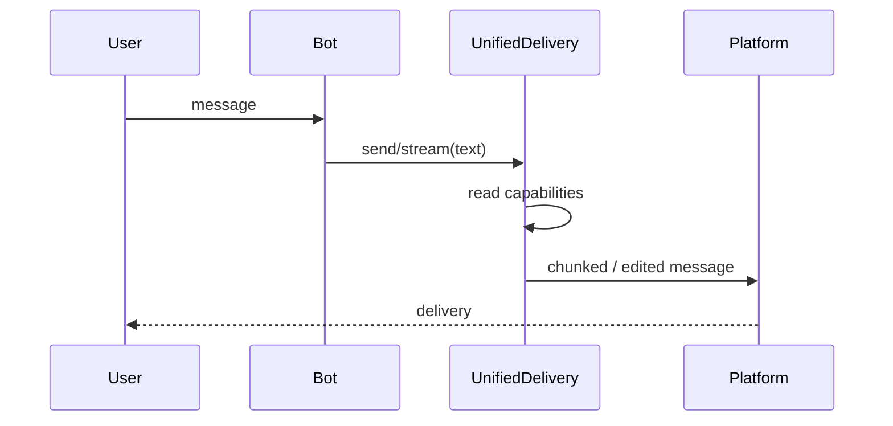
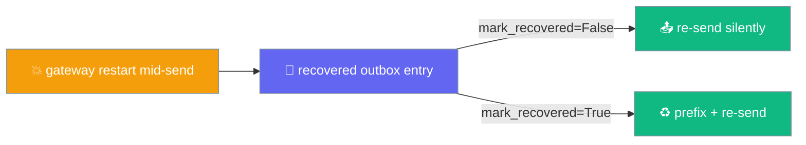
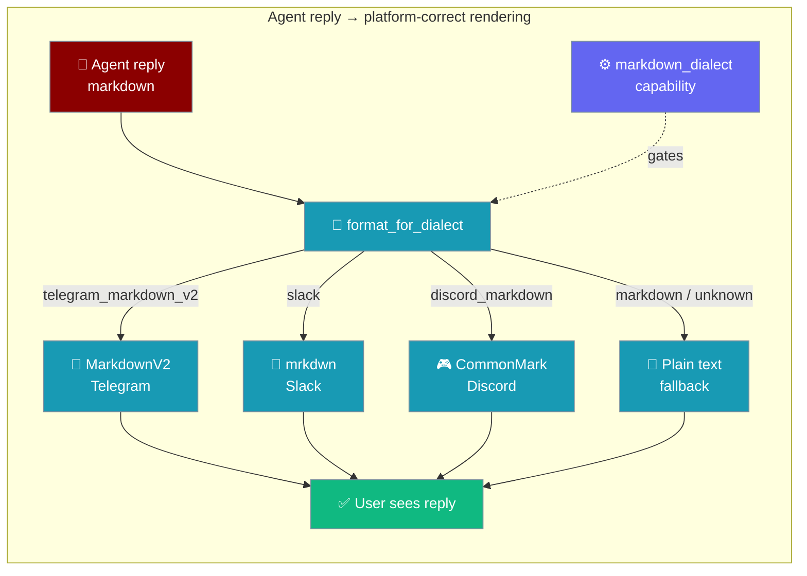

<Note>
Bot platform adapters now ship in the `praisonai-bot` package. `praisonai bot serve` still works exactly as documented here; for a standalone install see [praisonai-bot Migration](/docs/guides/praisonai-bot-migration).
</Note>


Platform capabilities tell PraisonAI what your bot's platform can do, so streaming, chunking, and rate limiting work the same way everywhere.

```python
from praisonaiagents import Agent

agent = Agent(name="assistant", instructions="Reply on Telegram with streaming when supported.")
agent.start("Send a long answer with progressive updates.")
```


<Info>
Capabilities describe what a channel **can** render; [Display Policy](/docs/features/display-policy) controls what you **want** shown.
</Info>

The user receives a reply; platform capabilities tell PraisonAI how to chunk, stream, and rate-limit on that channel.


```mermaid
graph LR
    A[Bot Adapter] --> B[PlatformCapabilities]
    B --> C[Unified Delivery]
    C --> D[Chunk]
    C --> E[Stream]
    C --> F[Rate limit]
    D --> G[User]
    E --> G
    F --> G

    classDef agent fill:#8B0000,stroke:#7C90A0,color:#fff
    classDef tool fill:#189AB4,stroke:#7C90A0,color:#fff

    class G agent
    class A,B,C,D,E,F tool
```

## Quick Start

<Steps>

<Step title="Look up built-in capabilities">

```python
from praisonai import Bot
from praisonaiagents import Agent
from praisonai.bots._registry import get_platform_capabilities

agent = Agent(name="assistant", instructions="Be helpful")
caps = get_platform_capabilities("telegram")
print(caps.max_message_length)  # 4096
print(caps.length_unit)         # utf16

bot = Bot("telegram", agent=agent)
```

</Step>

<Step title="Register a custom platform">

```python
from praisonaiagents.bots import PlatformCapabilities
from praisonai.bots._registry import register_platform

class MyBot:
    async def start(self): ...
    async def stop(self): ...

register_platform(
    "mybot",
    MyBot,
    capabilities=PlatformCapabilities(
        max_message_length=2000,
        supports_edit=True,
        markdown_dialect="markdown",
    ),
)
```

</Step>

</Steps>

## How it works

`UnifiedDelivery` (via `create_delivery(bot)`) reads `platform_capabilities` to chunk long replies, stream edits, and apply rate limits.


```mermaid
sequenceDiagram
    participant U as User
    participant B as Bot
    participant D as UnifiedDelivery
    participant P as Platform

    U->>B: message
    B->>D: send/stream(text)
    D->>D: read capabilities
    D->>P: chunked / edited message
    P-->>U: delivery
```

## Configuration options

| Field | Type | Default | Description |
|-------|------|---------|-------------|
| `max_message_length` | `int` | `4096` | Maximum message length in the platform's unit |
| `length_unit` | `str` | `"codepoints"` | `"codepoints"` or `"utf16"` |
| `supports_edit` | `bool` | `False` | In-place message edits (streaming) |
| `supports_typing` | `bool` | `True` | Typing indicators |
| `markdown_dialect` | `str` | `"markdown"` | Rendering flavour consumed by `format_for_dialect`. One of `"telegram_markdown_v2"`, `"slack"`, `"discord_markdown"`, or `"markdown"` (safe plain-text fallback for unknown values). See [How `markdown_dialect` is consumed](#how-markdown-dialect-is-consumed). |
| `needs_rate_limit` | `bool` | `True` | Apply Praison rate limiting |
| `edit_interval_ms` | `int` | `1000` | Minimum ms between edits |
| `max_files_per_message` | `int` | `1` | Attachments per message |
| `max_file_size_mb` | `int` | `10` | Max file size in MB |
| `supported_file_types` | `List[str]` | `["*"]` | Allowed mime types or extensions |
| `accepts_webhooks` | `bool` | `False` | Channel receives inbound HTTP webhooks |
| `verifies_webhook_signature` | `bool` | `False` | Adapter exposes a webhook verifier |
| `reconciles_unknown_send` | `bool` | `False` | Adapter can confirm whether a prior send actually landed (via `was_delivered(idempotency_key)`). Enables effectively-once delivery via the durable outbox. |
| `supports_idempotency_token` | `bool` | `False` | **Informational** — transport accepts a provider-level idempotency token. Set `reconciles_unknown_send` as well if you need effectively-once. |

Methods: `to_dict()` and `from_dict(data)`.

### Delivery reconciliation (`reconciles_unknown_send`)

After a gateway restart, can the adapter confirm that a client-side-keyed send actually landed — so a `recovered` outbox entry is marked `sent` instead of re-dispatched? That question is answered per adapter by `reconciles_unknown_send`. It is **not** a silent global default: at-least-once vs effectively-once is a **per-channel fact**.

An adapter opts in only when it both declares `reconciles_unknown_send=True` **and** exposes an async `was_delivered(idempotency_key) -> bool`. The durable outbox auto-wires the reconciler from these two signals (`DurableDelivery._build_reconciler`); when either is absent, `recovered` entries fall back to at-least-once re-send.

| Adapter | `reconciles_unknown_send` | Reconciliation behaviour |
|---------|---------------------------|--------------------------|
| Telegram | `False` | At-least-once — the Telegram Bot API cannot confirm a client-side-keyed send. |
| Discord | `False` | At-least-once — no client-keyed delivery lookup. |
| Slack | `False` | At-least-once — inherits the `PlatformCapabilities()` default. |
| Webhook / HTTP | `False` | At-least-once by design. |

<Note>
No built-in adapter declares `reconciles_unknown_send=True` in the current SDK — every channel is at-least-once out of the box. The flag and its `was_delivered` hook are the extension point a custom adapter implements to reach effectively-once. See [Effectively-Once Delivery](/docs/features/durable-delivery#effectively-once-delivery) for a worked `was_delivered` implementation.
</Note>

### Labelling the at-least-once fallback

For channels that fall back to at-least-once re-send, `mark_recovered=True` prefixes each crash-recovered copy with a visible marker so the recipient knows it may be a duplicate.


```mermaid
graph LR
    Crash[💥 gateway restart mid-send] --> Q[💾 recovered outbox entry]
    Q -->|mark_recovered=False| Silent[📤 re-send silently]
    Q -->|mark_recovered=True| Label[♻️ prefix + re-send]

    classDef restart fill:#F59E0B,stroke:#7C90A0,color:#fff
    classDef stored fill:#6366F1,stroke:#7C90A0,color:#fff
    classDef send fill:#10B981,stroke:#7C90A0,color:#fff

    class Crash restart
    class Q stored
    class Silent,Label send
```

The recipient sees this prefix on a labelled re-send:

> ♻️ Recovered reply — the gateway restarted during delivery, so this may be a duplicate.

Enable it once at setup:

```python
setup_durable_delivery(
    outbox_path="~/.praisonai/state/gateway_outbox.sqlite",
    platform="telegram",
    mark_recovered=True,   # opt-in: label crash-recovered re-sends
)
```

**What gets labelled**

- Only the unreconciled `recovered` branch — fresh sends and reconciled sends never carry the prefix.
- Only string `content` payloads — media and structured payloads pass through unchanged.
- Idempotent — a re-drained copy that already carries the prefix is not double-prefixed.
- Sticky — a transient failure of a labelled re-send keeps the entry in `recovered` so the next retry is still labelled.
- Fail-open — if labelling errors, the original unlabelled payload is sent (logged at WARNING); the send never fails because of it.

**When to enable**

- Adapters where `reconciles_unknown_send=False` in the table above.
- Product surfaces where honest "this may be a duplicate" is preferable to a silent duplicate.

**Default**

`mark_recovered` defaults to `False` — behaviour is unchanged unless you explicitly set it. See [Durable Delivery](/docs/features/durable-delivery) for the full outbox reference.

### How `markdown_dialect` is consumed

Every adapter that inherits `BasePlatformAdapter.format_message()` gets platform-correct rendering just by declaring `markdown_dialect` — the base class calls `format_for_dialect(text, caps.markdown_dialect)` for you.


```mermaid
graph LR
    subgraph "Agent reply → platform-correct rendering"
        Reply[📝 Agent reply<br/>markdown]
        Cap[⚙️ markdown_dialect<br/>capability]
        Fmt[🔀 format_for_dialect]
        MV2[📱 MarkdownV2<br/>Telegram]
        SLK[💬 mrkdwn<br/>Slack]
        DIS[🎮 CommonMark<br/>Discord]
        PT[📄 Plain text<br/>fallback]
        User[✅ User sees reply]
    end

    Reply --> Fmt
    Cap -.gates.-> Fmt
    Fmt -->|telegram_markdown_v2| MV2
    Fmt -->|slack| SLK
    Fmt -->|discord_markdown| DIS
    Fmt -->|markdown / unknown| PT
    MV2 --> User
    SLK --> User
    DIS --> User
    PT --> User

    classDef input fill:#8B0000,stroke:#7C90A0,color:#fff
    classDef process fill:#189AB4,stroke:#7C90A0,color:#fff
    classDef config fill:#6366F1,stroke:#7C90A0,color:#fff
    classDef result fill:#10B981,stroke:#7C90A0,color:#fff

    class Reply input
    class Fmt process
    class Cap config
    class MV2,SLK,DIS,PT process
    class User result
```

`format_for_dialect(text, dialect)` returns a `(rendered_text, parse_mode)` pair. The `parse_mode` is the value a transport expects (Telegram needs `"MarkdownV2"`); it is `None` when the text is already in the platform's native form.

| `markdown_dialect` value | Rendered as | Returned `parse_mode` |
|---|---|---|
| `"telegram_markdown_v2"` | MarkdownV2-escaped text (via `escape_markdown_v2`) | `"MarkdownV2"` |
| `"slack"` | Slack `mrkdwn` (via `markdown_to_slack`) | `None` |
| `"discord_markdown"` | Passthrough — Discord speaks CommonMark | `None` |
| `"markdown"` / unknown | Safe plain text (via `strip_markdown`) | `None` |

All four helpers are importable from `praisonaiagents.bots`:

```python
from praisonaiagents.bots import (
    format_for_dialect,
    escape_markdown_v2,
    markdown_to_slack,
    strip_markdown,
)
```

An agent replies in ordinary markdown; declaring `telegram_markdown_v2` makes special characters escape automatically instead of being dropped:

```python
from praisonaiagents import Agent
from praisonaiagents.bots import PlatformCapabilities

agent = Agent(
    name="assistant",
    instructions="Explain what `svc_1` does and show `*.py` globs.",
)
# Any adapter declaring telegram_markdown_v2 now escapes automatically.
caps = PlatformCapabilities(markdown_dialect="telegram_markdown_v2")
```

<Warning>
On Telegram, unescaped specials trigger an HTTP 400 `can't parse entities` response and the reply is dropped. `markdown_dialect="telegram_markdown_v2"` escapes every reserved character (`escape_markdown_v2` is conservative — it shows existing markup literally rather than reinterpreting it), so the message is always accepted verbatim.
</Warning>

### Webhook-based platforms

Platforms that set `accepts_webhooks=True` must also expose a `webhook_verifier` so `enforce_webhook_verification` can enforce signatures fail-closed. See [Webhook Verification](/docs/features/webhook-verification).

## Built-in platform defaults

| Platform | Notes |
|----------|-------|
| **Telegram** | `max_message_length=4096`, `length_unit="utf16"`, `supports_edit=True`, `markdown_dialect="telegram_markdown_v2"`, `needs_rate_limit=True`, `edit_interval_ms=1000`, `max_file_size_mb=50` |
| **Discord** | `max_message_length=2000`, `length_unit="codepoints"`, `supports_edit=True`, `needs_rate_limit=False`, `edit_interval_ms=500`, `max_files_per_message=10`, `max_file_size_mb=8` |
| slack, whatsapp, linear, email, agentmail | Uses `PlatformCapabilities()` defaults until the adapter declares its own |

## Native `/` command menu

Some platforms publish the bot's commands to their native `/` menu so typing `/` shows autocomplete. Adapters override `publish_command_menu` to project the shared `CommandRegistry`; the base implementation is a no-op.

| Platform | Native `/` menu | API used |
|----------|-----------------|----------|
| **Telegram** | ✅ | `set_my_commands` |
| **Discord** | ✅ | `CommandTree.sync()` |
| Slack, WhatsApp, others | ❌ (base no-op) | future — override `publish_command_menu` |

See [Native `/` Autocomplete](/docs/features/bot-commands) for user-facing behaviour and the Discord shim caveat.

## Common patterns

**Subclass with `default_capabilities()`** (Telegram and Discord use this):

```python
@classmethod
def default_capabilities(cls) -> PlatformCapabilities:
    return PlatformCapabilities(max_message_length=2000, supports_edit=True)
```

Entry-point registrations (via `praisonai.channels`) get default capabilities unless the adapter class exposes a `default_capabilities()` classmethod. This keeps zero-config connectors functional while letting polished adapters declare exact limits:

```toml
# pyproject.toml
[project.entry-points."praisonai.channels"]
myplatform = "mypackage.bot:MyPlatformBot"
```

```python
class MyPlatformBot:
    @classmethod
    def default_capabilities(cls):
        from praisonaiagents.bots import PlatformCapabilities
        return PlatformCapabilities(max_message_length=1000, supports_edit=False)
    
    async def start(self): ...
    async def stop(self): ...
```

**Serialise for config files:**

```python
caps = get_platform_capabilities("telegram")
data = caps.to_dict()
restored = PlatformCapabilities.from_dict(data)
```

## Best Practices

<AccordionGroup>

<Accordion title="Use utf16 for Telegram">
Telegram counts UTF-16 code units. Wrong `length_unit` can silently truncate messages.
</Accordion>

<Accordion title="Set needs_rate_limit=False only when the SDK rate-limits">
Discord.py handles limits internally; raw Telegram HTTP does not.
</Accordion>

<Accordion title="Enable supports_edit only with edit_message()">
`UnifiedDelivery` streams via edits when this flag is true.
</Accordion>

<Accordion title="Prefer default_capabilities() on the adapter class">
Keeps registry caching consistent when platforms override defaults.
</Accordion>

</AccordionGroup>

## Related

<CardGroup cols={2}>
  <Card title="Durable Outbound Delivery" icon="shield-check" href="/docs/features/durable-delivery#effectively-once-delivery">
    Effectively-once delivery via crash reconciliation
  </Card>
  <Card title="Display Policy" icon="monitor" href="/docs/features/display-policy">
    Operator policy for streaming and footers
  </Card>
  <Card title="Bot Platform Adapter" icon="puzzle-piece" href="/docs/features/bot-platform-adapter">
    Build a channel — the `format_message` / `markdown_dialect` seam
  </Card>
  <Card title="Bot Platform Plugins" icon="puzzle-piece" href="/docs/features/bot-platform-plugins">
    Register custom adapters
  </Card>
  <Card title="Bot Streaming Replies" icon="stream" href="/docs/features/bot-streaming-replies">
    Uses supports_edit and edit_interval_ms
  </Card>
  <Card title="Bot Rate Limiting" icon="gauge" href="/docs/features/bot-rate-limiting">
    Uses needs_rate_limit
  </Card>
  <Card title="Chunking Strategies" icon="scissors" href="/docs/features/chunking-strategies">
    Uses max_message_length and length_unit
  </Card>
</CardGroup>
