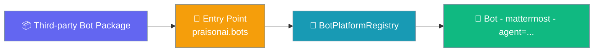
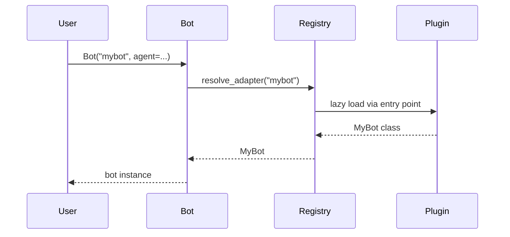

Third-party bot packages can register via Python entry points to extend PraisonAI with custom messaging platforms.



## Quick Start

<Steps>
<Step title="Programmatic Registration">

Register a bot platform directly in your code:

```python
from praisonai.bots._registry import register_platform

class MyBot:
    def __init__(self, **kwargs):
        self.kwargs = kwargs
    
    async def start(self):
        print("Starting MyBot...")
    
    async def stop(self):
        print("Stopping MyBot...")

register_platform("mybot", MyBot)
```

</Step>

<Step title="Entry-point Plugin">

Create a pip-installable plugin using `pyproject.toml`:

```toml
# pyproject.toml
[project.entry-points."praisonai.bots"]
mybot = "my_pkg.bot:MyBot"
```

After installation, use the bot platform:

```python
from praisonai.bots import Bot

bot = Bot("mybot", agent=my_agent, token="...")
await bot.start()
```

</Step>
</Steps>

---

## How It Works



The bot platform registry provides a central point for managing bot implementations:

| Operation | Description | When Called |
|-----------|-------------|-------------|
| Discovery | Entry points auto-loaded on registry access | Import time |
| Registration | Bot platforms registered by name | Plugin installation |
| Creation | Bot instances created on demand | `Bot()` constructor |
| Availability | Platform dependencies checked | Before execution |

---

## Configuration

The bot platform registry supports both programmatic and entry-point registration:

| Function | Purpose |
|----------|---------|
| `register_platform(name, cls)` | Register at runtime (backward-compat helper) |
| `list_platforms()` | List all registered platform names |
| `resolve_adapter(name)` | Get class for a platform name |
| `get_platform_registry()` | Backward-compat: returns `dict[name, class]` of all platforms |
| `get_default_bot_registry()` | Get the process-default `BotPlatformRegistry` (advanced) |

### Built-in Platforms

PraisonAI includes these built-in bot platforms:

- `telegram` - Telegram bot integration
- `discord` - Discord bot integration  
- `slack` - Slack bot integration
- `whatsapp` - WhatsApp bot integration
- `linear` - Linear issues integration
- `email` - Email bot integration
- `agentmail` - AgentMail integration

**Entry-point group**: `praisonai.bots`

---

## Common Patterns

### Override a Built-in Platform

Registry uses last-write-wins with lower-cased keys:

```python
from praisonai.bots._registry import register_platform

class CustomSlackBot:
    def __init__(self, **kwargs):
        self.token = kwargs.get('token')
    
    async def start(self):
        # Custom Slack implementation
        pass
    
    async def stop(self):
        pass

# Override built-in Slack bot
register_platform("slack", CustomSlackBot)
```

### Lazy Heavy Imports

Follow the pattern used by built-ins to avoid import-time failures:

```python
class HeavyFrameworkBot:
    def __init__(self, **kwargs):
        self.config = kwargs
        self._client = None
    
    async def start(self):
        # Only import when actually starting
        import heavy_networking_sdk
        self._client = heavy_networking_sdk.Client(
            token=self.config.get('token')
        )
        await self._client.connect()
    
    async def stop(self):
        if self._client:
            await self._client.disconnect()
```

### Multi-tenant Isolation

Construct your own `BotPlatformRegistry` to avoid leaking between tenants:

```python
from praisonai.bots._registry import BotPlatformRegistry

# Each tenant gets their own registry
tenant_registry = BotPlatformRegistry()
tenant_registry.register("custom-slack", TenantSpecificSlackBot)
```

---

## Best Practices

<AccordionGroup>

<Accordion title="Use Lazy Imports">

Never import heavy networking SDKs at module top level:

```python
# ❌ Bad - imports at module level
import heavy_sdk

class BadBot:
    def __init__(self, **kwargs):
        self.client = heavy_sdk.Client()

# ✅ Good - lazy imports
class GoodBot:
    async def start(self):
        import heavy_sdk
        self.client = heavy_sdk.Client()
```

</Accordion>

<Accordion title="Implement Proper Protocol">

Follow the expected bot lifecycle pattern:

```python
class ProperBot:
    def __init__(self, **kwargs):
        # Store config, don't establish connections yet
        self.config = kwargs
        self.running = False
    
    async def start(self):
        # Establish connections, start listening
        self.running = True
    
    async def stop(self):
        # Clean shutdown
        self.running = False
```

</Accordion>

<Accordion title="Handle Errors Gracefully">

Use logging instead of raising on initialization:

```python
import logging
logger = logging.getLogger(__name__)

class RobustBot:
    def __init__(self, **kwargs):
        self.config = kwargs
        
    async def start(self):
        try:
            # Connection logic here
            pass
        except Exception as e:
            logger.error(f"Failed to start bot: {e}")
            # Don't re-raise, let caller handle
```

</Accordion>

</AccordionGroup>

---

## Related

<CardGroup cols={2}>
<Card title="Framework Adapter Plugins" icon="puzzle-piece" href="/docs/features/framework-adapter-plugins">
  Learn about extending PraisonAI with custom execution frameworks
</Card>
<Card title="Messaging Channels Strategy" icon="message-circle" href="/docs/features/messaging-channels-strategy">
  See our roadmap for supported messaging platforms
</Card>
</CardGroup>