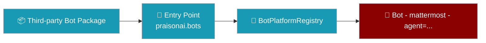
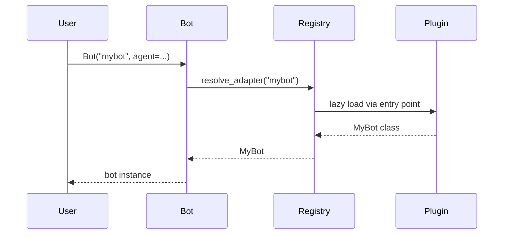
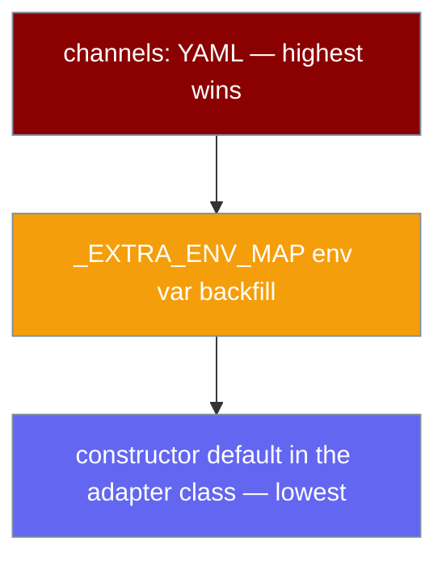
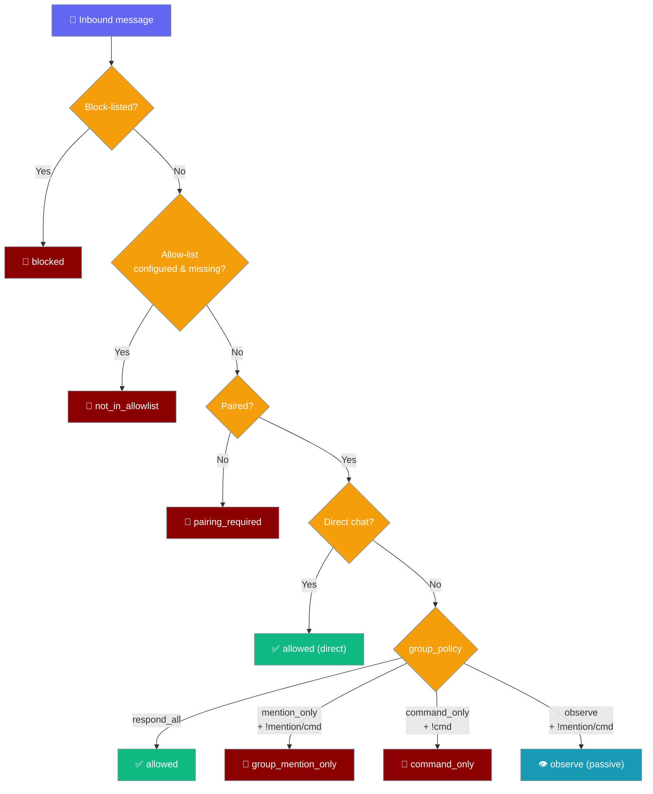

<Note>
Bot platform adapters now ship in the `praisonai-bot` package. `praisonai bot serve` still works exactly as documented here; for a standalone install see [praisonai-bot Migration](/guides/praisonai-bot-migration).
</Note>


```python
from praisonaiagents import Agent

agent = Agent(name="platform-bot", instructions="Use platform-specific bot plugins.")
agent.start("Enable Telegram and Discord plugins for this bot.")
```


Third-party bot packages can register via Python entry points to extend PraisonAI with custom messaging platforms.

The user installs a third-party bot package; entry points register new platforms alongside built-in channels.


```mermaid
graph LR
    A[📦 Third-party Bot Package] --> B[🔌 Entry Point<br/>praisonai.bots]
    B --> C[📝 BotPlatformRegistry]
    C --> D[💬 Bot - mattermost - agent=...]

    classDef agent fill:#8B0000,stroke:#7C90A0,color:#fff
    classDef tool fill:#189AB4,stroke:#7C90A0,color:#fff

    class D agent
    class A,B,C tool
```

## Quick Start

<Steps>
<Step title="Programmatic Registration">

Register a bot platform directly in your code:

```python
from praisonai.bots._registry import register_platform

class MyBot:
    def __init__(self, **kwargs):
        self.kwargs = kwargs
    
    async def start(self):
        print("Starting MyBot...")
    
    async def stop(self):
        print("Stopping MyBot...")

register_platform("mybot", MyBot)
```

</Step>

<Step title="Entry-point Plugin">

Create a pip-installable plugin using `pyproject.toml`:

```toml
# pyproject.toml
[project.entry-points."praisonai.channels"]
mybot = "my_pkg.bot:MyBot"
```

After installation, use the bot platform:

```python
from praisonai.bots import Bot

bot = Bot("mybot", agent=my_agent)
await bot.start()
```

</Step>
</Steps>

---

## How It Works


```mermaid
sequenceDiagram
    participant User
    participant Bot
    participant Registry
    participant Plugin
    
    User->>Bot: Bot("mybot", agent=...)
    Bot->>Registry: resolve_adapter("mybot")
    Registry->>Plugin: lazy load via entry point
    Plugin-->>Registry: MyBot class
    Registry-->>Bot: MyBot
    Bot-->>User: bot instance
```

The bot platform registry provides a central point for managing bot implementations:

| Operation | Description | When Called |
|-----------|-------------|-------------|
| Discovery | Entry points auto-loaded on registry access | Import time |
| Registration | Bot platforms registered by name | Plugin installation |
| Creation | Bot instances created on demand | `Bot()` constructor |
| Availability | Platform dependencies checked | Before execution |

---

## Configuration

The bot platform registry supports both programmatic and entry-point registration:

| Function | Purpose |
|----------|---------|
| `register_platform(name, cls, capabilities=None)` | Register at runtime (optional `PlatformCapabilities` descriptor) |
| `get_platform_capabilities(name)` | Get the capabilities descriptor for a registered platform |
| `list_platforms()` | List all registered platform names |
| `resolve_adapter(name)` | Get class for a platform name |
| `get_platform_registry()` | Backward-compat: returns `dict[name, class]` of all platforms |
| `get_default_bot_registry()` | Get the process-default `BotPlatformRegistry` (advanced) |

### Built-in Platforms

PraisonAI includes these built-in bot platforms:

- `telegram` - Telegram bot integration
- `discord` - Discord bot integration  
- `slack` - Slack bot integration
- `whatsapp` - WhatsApp bot integration
- `linear` - Linear issues integration
- `email` - Email bot integration
- `agentmail` - AgentMail integration
- `webhook` - Generic HTTP webhook trigger (declarative routes) — see [Webhook Channel](/features/webhook-channel)

### Entry-point Groups

| Group | Purpose |
|-------|---------|
| `praisonai.channels` | **Recommended** for new packaged connectors — idiomatic, zero-config auto-registration |
| `praisonai.bots` | Legacy group — still scanned for backward compatibility |

Both groups are scanned by `BotPlatformRegistry` on startup. A connector that would shadow a built-in platform is skipped with a warning.

### Discovery via entry points (`praisonai.channels`)

<Note>
**Plugin channels on `praisonai gateway start`** (from [PR #3579](https://github.com/MervinPraison/PraisonAI/pull/3579), merged 2026-08-01):
the gateway's `_create_bot` path now delegates to the same `resolve_adapter()` seam that `Bot()` and `probe_channels` use, so **channels registered via `register_platform()` or a `praisonai.channels` entry point are launched by the gateway exactly like a built-in**. Older gateway builds hardcoded seven built-in platforms and silently skipped everything else with a single `WARNING` — plugin channels never actually started under the gateway even though `Bot()` could construct them. Update to the post-#3579 wrapper if you rely on plugin channels in `gateway.yaml`.
</Note>

The `praisonai.channels` entry-point group is the idiomatic way to distribute a bot connector as a pip-installable package. Once installed, the platform is available with no extra Python code:

```toml
# pyproject.toml of your connector package
[project.entry-points."praisonai.channels"]
irc = "praisonai_irc:IRCBot"
```

After `pip install praisonai-irc`:

```python
from praisonai.bots import Bot

bot = Bot("irc", agent=my_agent, server="irc.libera.chat")
await bot.start()
```

List all registered platforms — built-in, entry-point, and custom — with the CLI:

```bash
praisonai gateway channels --available
# => telegram, discord, slack, whatsapp, linear, email, agentmail, irc
```

Or in Python:

```python
from praisonai.bots._registry import list_platforms

print(sorted(list_platforms()))
```

`list_platforms()` also returns anything registered by `register_platform()` in the current process. The entry-point group is loaded lazily on first registry access, so a plugin that is installed but never imported still appears after the first `resolve_adapter()` call.

<Note>
`praisonai.channels` is preferred over `praisonai.bots` for new packages. Both entry-point groups continue to work.
</Note>

### Plugin channel on the gateway runtime

Register a plugin platform, then reference it in `gateway.yaml`:

```python
# my_plugin.py
from praisonai.bots._registry import register_platform

class MattermostBot:
    def __init__(self, **kwargs): self.cfg = kwargs
    async def start(self): ...
    async def stop(self): ...

register_platform("mattermost", MattermostBot)
```

```yaml
# gateway.yaml
agents:
  assistant:
    instructions: "You are a helpful assistant."
channels:
  mattermost:
    token: ${MATTERMOST_TOKEN}
```

```bash
python -c "import my_plugin" && praisonai gateway start --config gateway.yaml
# Before PR #3579: gateway silently skipped 'mattermost' with a single WARNING; channel never started.
# After PR #3579:  resolve_adapter('mattermost') succeeds, adapter is constructed, channel runs;
#                  an unresolvable name is recorded as a degraded channel instead of dropped.
```

The gateway walks the same path a built-in channel does:

```mermaid
sequenceDiagram
    participant User
    participant Gateway as WebSocketGateway
    participant Registry as resolve_adapter
    participant Adapter as PluginBot

    User->>Gateway: praisonai gateway start --config gateway.yaml
    Gateway->>Gateway: _create_bot(channel_type, ...)
    Gateway->>Gateway: _build_channel_adapter(...)
    Gateway->>Registry: resolve_adapter("mattermost")
    Registry-->>Gateway: PluginBot class (register_platform or entry point)
    Gateway->>Gateway: seed kwargs + _EXTRA_ENV_MAP backfill + ch_cfg pass-through
    Gateway->>Adapter: PluginBot(**init_kwargs)
    Adapter-->>Gateway: instance
    Gateway->>Adapter: await bot.start()

    classDef agent fill:#8B0000,stroke:#7C90A0,color:#fff
    classDef process fill:#189AB4,stroke:#7C90A0,color:#fff
    classDef result fill:#10B981,stroke:#7C90A0,color:#fff

    class User,Adapter agent
    class Gateway,Registry process
```

When resolution fails, the gateway calls `self._mark_degraded_owner("channel", "mattermost", reason="unresolved_platform")` instead of raising — the channel is skipped but stays visible in `health` / `doctor`.

### How the gateway constructs a plugin channel

The gateway builds every channel adapter through one resolution seam and a three-step kwarg assembly.

**Adapter resolution.** `resolve_adapter(channel_type)` is the single lookup — built-in, `register_platform`-registered, and `praisonai.channels` entry-point adapters are indistinguishable at this point.

**Kwarg assembly.** The gateway layers three sources in order; later sources override earlier ones:

| Order | Source | Contents |
|-------|--------|----------|
| 1 | Seed | `{"token": <token>, "agent": <Agent>, "config": <config>}` |
| 2 | `_EXTRA_ENV_MAP[channel_type]` | For each `param → env_key`, if `os.environ.get(env_key)` is non-empty, set `init_kwargs[param] = env_val` (e.g. Slack's `SLACK_APP_TOKEN` → `app_token`) |
| 3 | `ch_cfg` (from `channels:` YAML) | Every key except `"platform"` and `"token"` copied verbatim; **overrides** step 2 |

The gateway then calls `adapter_cls(**init_kwargs)`. `ch_cfg` wins over env backfill, and `platform` / `token` are stripped so they never double up. This mirrors `probe_channels` and `Bot._build_adapter`.

**Token env-var fallback.** When the `token` from `channels:` YAML is falsy, the gateway consults `_TOKEN_FALLBACK_ENV` — the first non-empty value wins:

| `channel_type` | Env vars tried in order |
|----------------|-------------------------|
| `linear` | `LINEAR_OAUTH_TOKEN`, `LINEAR_API_KEY` |
| `email` | `EMAIL_APP_PASSWORD` |
| `agentmail` | `AGENTMAIL_API_KEY` |

Other platforms have no token fallback here — Slack's app-token env still comes from step 2 (`_EXTRA_ENV_MAP`), not this map.

Where a plugin author sets each value:


```mermaid
graph TB
    Y[channels: YAML — highest wins] --> B[_EXTRA_ENV_MAP env var backfill]
    B --> D[constructor default in the adapter class — lowest]

    classDef yaml fill:#8B0000,stroke:#7C90A0,color:#fff
    classDef env fill:#F59E0B,stroke:#7C90A0,color:#fff
    classDef default fill:#6366F1,stroke:#7C90A0,color:#fff

    class Y yaml
    class B env
    class D default
```

### Degraded channels: what happens when a plugin fails

A channel that cannot resolve or construct is recorded as degraded, not silently dropped.

Two exact `reason` strings surface via `_mark_degraded_owner("channel", <channel_type>, reason=...)`:

| `reason` | Trigger | Log line |
|----------|---------|----------|
| `unresolved_platform` | `resolve_adapter(channel_type)` raised `ValueError` — no built-in, `register_platform`, or entry-point adapter matches | `Unknown channel type %r — no built-in, registered, or entry-point adapter resolves it; channel not started.` |
| `adapter_construction_failed` | `adapter_cls(**init_kwargs)` raised any `Exception` (e.g. wrong kwargs, connection error) | `Failed to construct channel %r adapter: %s` |

Both paths return `None` from `_create_bot`, so the two call sites (`start_channels` and hot-reload) keep their existing `None` contract. The failure is queryable via the degraded-owner surface (`health` / `doctor`) — see [Gateway Degraded Channels](/features/gateway-degraded-channels) — instead of vanishing into logs.

---

## Common Patterns

### Declare Platform Capabilities

```python
from praisonaiagents.bots import PlatformCapabilities
from praisonai.bots._registry import register_platform

register_platform(
    "mybot",
    MyBot,
    capabilities=PlatformCapabilities(
        max_message_length=2000,
        length_unit="codepoints",
        supports_edit=True,
        markdown_dialect="markdown",
    ),
)
```

Capabilities let PraisonAI's shared delivery layer chunk, stream, and rate-limit messages correctly for your platform — see [Bot Platform Capabilities](/features/bot-platform-capabilities) for the full field list.

### Register a Native Presentation Renderer

Channel plugins that ship a `PresentationRenderer` should call `register_presentation_renderer(platform, MyRenderer)` from `praisonaiagents.bots` at setup time, so interactive UI (buttons, selects, approvals) renders natively instead of degrading to plain text.

```python
from praisonaiagents.bots import register_presentation_renderer
from my_matrix_plugin.renderer import MatrixPresentationRenderer

register_presentation_renderer("matrix", MatrixPresentationRenderer)
```

This is the same extension point built-in channels use. See [Presentation Renderers](/features/presentation-renderers) for the renderer contract and validation rules.

### Use the Canonical Admission Primitive

Reuse `resolve_ingress_admission()` in your adapter's message handler so your custom channel inherits the same allowlist / blocklist / group-policy semantics as every built-in — and drops become inspectable (`reason_code`) instead of silent `logger.debug` lines.

```python
from praisonaiagents.bots import resolve_ingress_admission

class MyBot:
    async def on_message(self, msg):
        decision = resolve_ingress_admission(
            chat_type=msg.chat_type,            # "dm" / "private" / "group" / "channel" / ...
            sender_id=msg.sender_id,
            is_mention=msg.mentions_bot,
            is_command=msg.text.startswith("/"),
            allowlist=self.config.allowed_users,
            blocklist=self.config.blocked_users,
            group_policy=self.config.group_policy,
            paired=self.pairing.is_paired(msg.sender_id),
        )

        if not decision.admit:
            # Record the reason so operators can answer "why didn't the bot reply?"
            logger.info(
                "message dropped: gate=%s reason=%s sender=%s",
                decision.gate, decision.reason_code, msg.sender_id,
            )
            if decision.observe:
                # `observe` group policy: passively record but do not run the agent
                await self.session.record_passive(msg)
            return

        await self.agent.run(msg.text)
```

The ladder (first matching gate wins): **block-list → allow-list → pairing → direct-chat bypass → group policy**. An unset `group_policy` defaults to `mention_only` — the live `BotConfig` default — so a forwarded unset policy fails safe rather than replying to everything in a group.


```mermaid
graph TB
    Start[📨 Inbound message] --> Block{Block-listed?}
    Block -->|Yes| Drop1["🛑 blocked"]
    Block -->|No| Allow{Allow-list<br/>configured & missing?}
    Allow -->|Yes| Drop2["🛑 not_in_allowlist"]
    Allow -->|No| Pair{Paired?}
    Pair -->|No| Drop3["🛑 pairing_required"]
    Pair -->|Yes| Direct{Direct chat?}
    Direct -->|Yes| OK1["✅ allowed (direct)"]
    Direct -->|No| Policy{group_policy}
    Policy -->|respond_all| OK2["✅ allowed"]
    Policy -->|mention_only<br/>+ !mention/cmd| Drop4["🛑 group_mention_only"]
    Policy -->|command_only<br/>+ !cmd| Drop5["🛑 command_only"]
    Policy -->|observe<br/>+ !mention/cmd| Obs["👁 observe (passive)"]

    classDef msg fill:#6366F1,stroke:#7C90A0,color:#fff
    classDef gate fill:#F59E0B,stroke:#7C90A0,color:#fff
    classDef drop fill:#8B0000,stroke:#7C90A0,color:#fff
    classDef ok fill:#10B981,stroke:#7C90A0,color:#fff
    classDef obs fill:#189AB4,stroke:#7C90A0,color:#fff

    class Start msg
    class Block,Allow,Pair,Direct,Policy gate
    class Drop1,Drop2,Drop3,Drop4,Drop5 drop
    class OK1,OK2 ok
    class Obs obs
```

**Reason codes** an operator can grep for: `allowed`, `blocked`, `not_in_allowlist`, `pairing_required`, `group_mention_only`, `command_only`, `observe`.

**IngressDecision fields:**

| Field | Type | Meaning |
|-------|------|---------|
| `admit` | `bool` | Whether the adapter should run the agent on this message. |
| `reason_code` | `str` | Machine-readable reason (one of the seven above). |
| `gate` | `str` | Which stage decided: `blocklist`, `allowlist`, `pairing`, `direct`, `group_policy`. |
| `observe` | `bool` | When `True`, do not admit but *do* record the message as passive session context (`observe` group policy). |

<Note>
The primitive is **pure and dependency-free** — same inputs, same verdict. That means built-in and plugin channels cannot drift, and adopting it does not couple your adapter to any transport, config-loading, or session module.
</Note>

### Override a Built-in Platform

Registry uses last-write-wins with lower-cased keys:

```python
from praisonai.bots._registry import register_platform

class CustomSlackBot:
    def __init__(self, **kwargs):
        self.token = kwargs.get('token')
    
    async def start(self):
        # Custom Slack implementation
        pass
    
    async def stop(self):
        pass

# Override built-in Slack bot
register_platform("slack", CustomSlackBot)
```

### Lazy Heavy Imports

Follow the pattern used by built-ins to avoid import-time failures:

```python
class HeavyFrameworkBot:
    def __init__(self, **kwargs):
        self.config = kwargs
        self._client = None
    
    async def start(self):
        # Only import when actually starting
        import heavy_networking_sdk
        self._client = heavy_networking_sdk.Client(
            token=self.config.get('token')
        )
        await self._client.connect()
    
    async def stop(self):
        if self._client:
            await self._client.disconnect()
```

### Multi-tenant Isolation

Construct your own `BotPlatformRegistry` to avoid leaking between tenants:

```python
from praisonai.bots._registry import BotPlatformRegistry

# Each tenant gets their own registry
tenant_registry = BotPlatformRegistry()
tenant_registry.register("custom-slack", TenantSpecificSlackBot)
```

---

## Best Practices

<AccordionGroup>

<Accordion title="Use Lazy Imports">

Never import heavy networking SDKs at module top level:

```python
# ❌ Bad - imports at module level
import heavy_sdk

class BadBot:
    def __init__(self, **kwargs):
        self.client = heavy_sdk.Client()

# ✅ Good - lazy imports
class GoodBot:
    async def start(self):
        import heavy_sdk
        self.client = heavy_sdk.Client()
```

</Accordion>

<Accordion title="Implement Proper Protocol">

Follow the expected bot lifecycle pattern:

```python
class ProperBot:
    def __init__(self, **kwargs):
        # Store config, don't establish connections yet
        self.config = kwargs
        self.running = False
    
    async def start(self):
        # Establish connections, start listening
        self.running = True
    
    async def stop(self):
        # Clean shutdown
        self.running = False
```

</Accordion>

<Accordion title="Handle Errors Gracefully">

Use logging instead of raising on initialization:

```python
import logging
logger = logging.getLogger(__name__)

class RobustBot:
    def __init__(self, **kwargs):
        self.config = kwargs
        
    async def start(self):
        try:
            # Connection logic here
            pass
        except Exception as e:
            logger.error(f"Failed to start bot: {e}")
            # Don't re-raise, let caller handle
```

</Accordion>

</AccordionGroup>

---

## Related

<CardGroup cols={2}>
<Card title="Bot Platform Capabilities" icon="sliders" href="/features/bot-platform-capabilities">
  Declare streaming, chunking, and rate-limit behaviour
</Card>
<Card title="Bot Gateway" icon="tower-broadcast" href="/features/bot-gateway">
  See how `group_policy`, `allowed_users`, and pairing are configured in YAML
</Card>
<Card title="Gateway Degraded Channels" icon="heart-pulse" href="/features/gateway-degraded-channels">
  See where `unresolved_platform` and `adapter_construction_failed` surface in health/doctor
</Card>
<Card title="Presentation Renderers" icon="layer-group" href="/features/presentation-renderers">
  Register a native renderer so buttons, selects, and approvals render natively
</Card>
<Card title="Framework Adapter Plugins" icon="puzzle-piece" href="/features/framework-adapter-plugins">
  Learn about extending PraisonAI with custom execution frameworks
</Card>
<Card title="Messaging Channels Strategy" icon="message-circle" href="/features/messaging-channels-strategy">
  See our roadmap for supported messaging platforms
</Card>
</CardGroup>