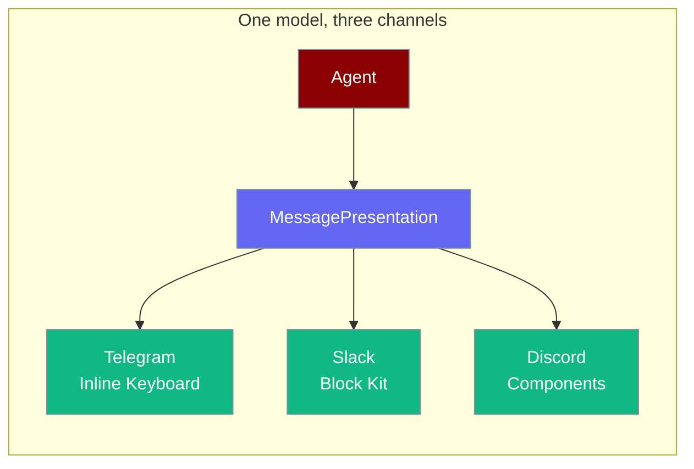
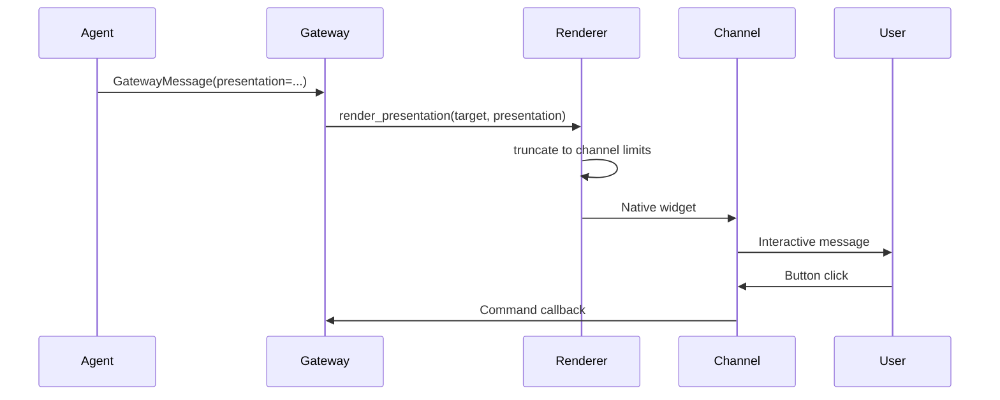

Agents can reply with structured interactive messages — buttons, dropdowns, dividers, context text — and each channel adapter renders them as native widgets.



## Quick Start

<Steps>
<Step title="Reply with two buttons">

```python
from praisonaiagents import Agent
from praisonaiagents.bots import (
    MessagePresentation,
    PresentationBlock,
    PresentationButton,
    PresentationAction,
)

def confirm_action(_args=None) -> MessagePresentation:
    return MessagePresentation(blocks=[
        PresentationBlock.make_text("Ready to deploy?"),
        PresentationBlock.make_buttons([
            PresentationButton(
                label="Deploy",
                action=PresentationAction(type="command", command="/deploy confirm"),
                style="primary",
            ),
            PresentationButton(
                label="Cancel",
                action=PresentationAction(type="command", command="/deploy cancel"),
                style="danger",
            ),
        ]),
    ])

agent = Agent(name="DeployBot", instructions="Confirm before deploying", tools=[confirm_action])
agent.start("Deploy main to production")
```

</Step>

<Step title="Dropdown selection">

```python
from praisonaiagents.bots import (
    MessagePresentation,
    PresentationBlock,
    SelectOption,
)

presentation = MessagePresentation(blocks=[
    PresentationBlock.make_text("Pick an environment:"),
    PresentationBlock.make_select(
        options=[
            SelectOption(label="Staging", value="staging", emoji="🧪"),
            SelectOption(label="Production", value="prod", emoji="🚀", default=True),
        ],
        placeholder="Choose an environment",
        action_id="env_select",
    ),
])
```

</Step>

<Step title="One-line approval prompt">

```python
from praisonaiagents.bots import MessagePresentation

presentation = MessagePresentation.approval(
    prompt="Allow delete_file for /var/log/old.log?",
    approval_id="appr_abc123",
    allow_always=True,
    context="Tool requested by agent: ops-bot",
)
```

</Step>
</Steps>

## How It Works



| Channel | Native rendering | Fallback |
|---------|------------------|----------|
| Telegram | Inline keyboard | Plain text |
| Slack | Block Kit | Plain text |
| Discord | Components | Plain text |
| WhatsApp | Plain text only | — |

## Block Types

| Block | Factory | Use for |
|-------|---------|---------|
| Text | `make_text(content)` | Markdown body |
| Buttons | `make_buttons(items)` | Action rows |
| Select | `make_select(options)` | Dropdown menus |
| Divider | `make_divider()` | Visual separator |
| Context | `make_context(content)` | Smaller hint text |

Higher `priority` on `PresentationButton` survives when renderers trim to channel limits.

## Approval Prompts

On channels implementing `SupportsPresentation`, approval prompts render as inline **Allow Once**, **Allow Always**, and **Deny** buttons wired to `/approve <approval_id> ...` commands — replacing fragile yes/no text classification.

Text-keyword backends (`TelegramApproval`, `SlackApproval`, `DiscordApproval`) remain valid fallbacks for channels without presentation support.

## Best Practices

<AccordionGroup>
<Accordion title="Use factory methods for blocks">
`PresentationBlock.make_text()` and `make_buttons()` are the agent-friendly path — fewer field mistakes than raw dataclass construction.
</Accordion>

<Accordion title="Set button priority for destructive actions">
Give **Deny** or **Cancel** higher priority so they survive truncation on Discord's stricter component limits.
</Accordion>

<Accordion title="Provide plain-text content as fallback">
Always set `MessagePresentation` text content so WhatsApp and email channels still deliver a readable message.
</Accordion>

<Accordion title="Use MessagePresentation.approval for tool gates">
The built-in helper wires standard Allow/Deny buttons consistently across Telegram, Slack, and Discord.
</Accordion>
</AccordionGroup>

## Related

<CardGroup cols={2}>
  <Card title="Approval Protocol" icon="shield-check" href="/docs/features/approval-protocol">
    Tool approval backends
  </Card>
  <Card title="Bot Gateway" icon="server" href="/docs/features/bot-gateway">
    Multi-channel gateway server
  </Card>
</CardGroup>
