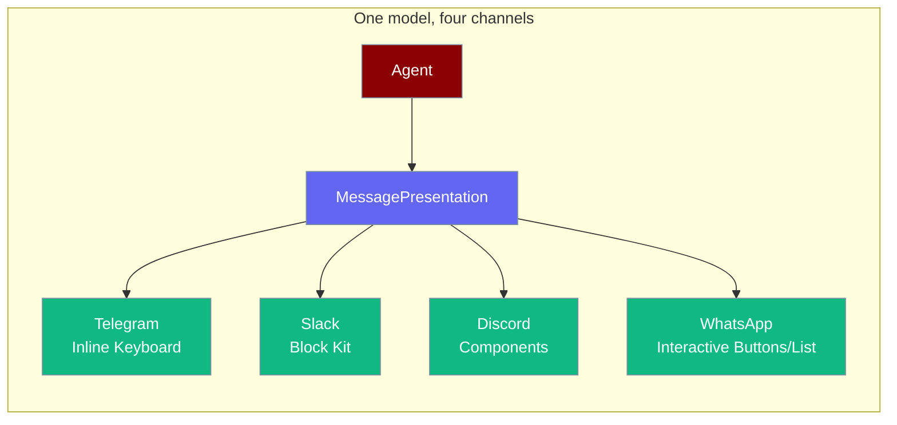
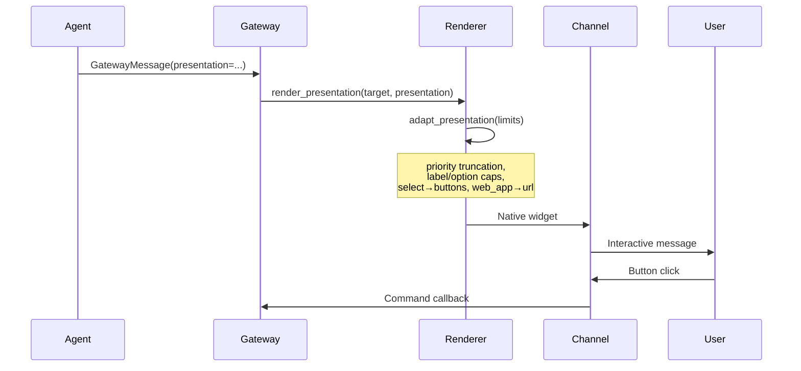
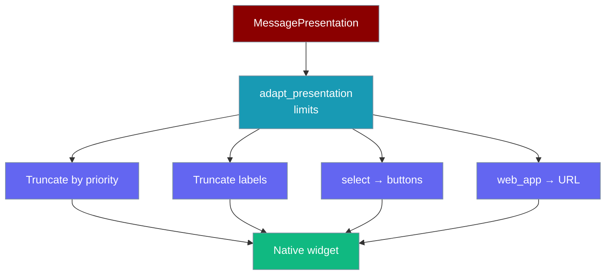
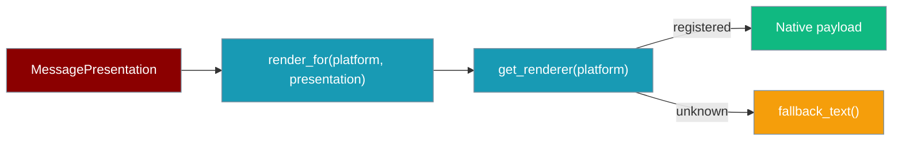
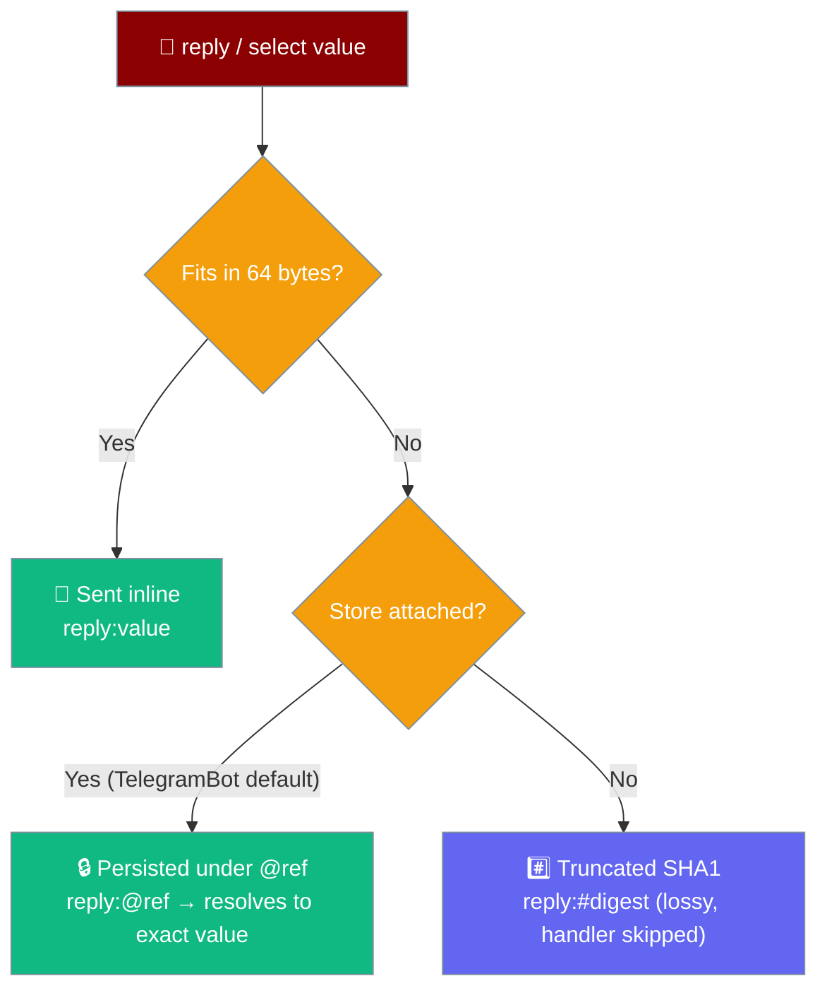

<Note>
Bot platform adapters now ship in the `praisonai-bot` package. `praisonai bot serve` still works exactly as documented here; for a standalone install see [praisonai-bot Migration](/docs/guides/praisonai-bot-migration).
</Note>


Agents can reply with structured interactive messages — buttons, dropdowns, dividers, context text — and each channel adapter renders them as native widgets.

```python
from praisonaiagents import Agent

agent = Agent(name="assistant", instructions="Offer clear yes/no choices in chat.")
agent.start("Ask the user to approve the deployment with buttons.")
```

The user taps an inline button or dropdown; each channel renders the same structured presentation natively.



## Quick Start

<Steps>
<Step title="Reply with two buttons">

```python
from praisonaiagents import Agent
from praisonaiagents.bots import (
    MessagePresentation,
    PresentationBlock,
    PresentationButton,
    PresentationAction,
)

def confirm_action(_args=None) -> MessagePresentation:
    return MessagePresentation(blocks=[
        PresentationBlock.make_text("Ready to deploy?"),
        PresentationBlock.make_buttons([
            PresentationButton(
                label="Deploy",
                action=PresentationAction(type="command", command="/deploy confirm"),
                style="primary",
                priority=10,
            ),
            PresentationButton(
                label="Cancel",
                action=PresentationAction(type="command", command="/deploy cancel"),
                style="danger",
                priority=9,
            ),
        ]),
    ])

agent = Agent(name="DeployBot", instructions="Confirm before deploying", tools=[confirm_action])
agent.start("Deploy main to production")
```

</Step>

<Step title="Dropdown selection">

```python
from praisonaiagents.bots import (
    MessagePresentation,
    PresentationBlock,
    SelectOption,
)

presentation = MessagePresentation(blocks=[
    PresentationBlock.make_text("Pick an environment:"),
    PresentationBlock.make_select(
        options=[
            SelectOption(label="Staging", value="staging", emoji="🧪"),
            SelectOption(label="Production", value="prod", emoji="🚀", default=True),
        ],
        placeholder="Choose an environment",
        action_id="env_select",
    ),
])
```

</Step>

<Step title="One-line approval prompt">

```python
from praisonaiagents.bots import MessagePresentation

presentation = MessagePresentation.approval(
    prompt="Allow delete_file for /var/log/old.log?",
    approval_id="appr_abc123",
    allow_always=True,
    context="Tool requested by agent: ops-bot",
)
```

</Step>

<Step title="One-line question / choice prompt">

```python
from praisonaiagents.bots import MessagePresentation

presentation = MessagePresentation.question(
    prompt="Which environment should I deploy to?",
    options=["staging", "production", "cancel"],
    context="Deployments run immediately.",
)
```

Each option renders as a native button on every channel; the tapped value flows back as the next agent turn — no callback handler needed.

</Step>
</Steps>

## How It Works



| Channel | Native rendering | If unsupported |
|---------|------------------|----------------|
| Telegram | Inline keyboard | `select` → button column |
| Slack | Block Kit | `web_app` action → URL button |
| Discord | Components | `web_app` action → URL button |
| WhatsApp | Reply buttons (≤3) / List messages (≤10 rows) | Buttons >3 or `select` → list message; URL buttons inlined as text links |

## Block Types

| Block | Factory | Use for |
|-------|---------|---------|
| Text | `make_text(content)` | Markdown body |
| Buttons | `make_buttons(items)` | Action rows |
| Select | `make_select(options)` | Dropdown menus |
| Divider | `make_divider()` | Visual separator |
| Context | `make_context(content)` | Smaller hint text |

Channel renderers always run `adapt_presentation()` first. Buttons over the per-channel cap are dropped lowest-`priority` first, so high-priority actions like `Confirm` or `Deny` survive on Discord and Slack.

## Channel Adaptation

`adapt_presentation()` runs automatically inside every renderer — you can also call it yourself to preview what a channel will receive.



```python
from praisonaiagents.bots import (
    MessagePresentation,
    PresentationBlock,
    PresentationButton,
    PresentationLimits,
    adapt_presentation,
)

buttons = [PresentationButton(label=f"opt {i}", priority=i) for i in range(12)]
presentation = MessagePresentation([PresentationBlock.make_buttons(buttons)])

adapted = adapt_presentation(presentation, PresentationLimits.slack())
# adapted.blocks[0].buttons → highest-priority 5 survive (opt 7..opt 11)
```

The input `presentation` is never mutated — `adapt_presentation()` always returns a new `MessagePresentation`.

## Channel Limits

`max_buttons` is per-row capacity; total button cap is `max_buttons × max_button_rows`.

| Channel | Max buttons (per row) | Max button rows | Total cap | Max button label | Max options | Max option label | Supports select | Supports web_app |
|---------|----------------------|-----------------|-----------|------------------|-------------|------------------|-----------------|-----------------|
| Telegram | 8 | 100 | 800 | 64 | 0 (none) | — | No | Yes |
| Slack | 5 | 1 | 5 | 75 | 100 | 75 | Yes | No |
| Discord | 5 | 5 | 25 | 80 | 25 | 100 | Yes | No |
| WhatsApp | 10 (list rows) / 3 (reply buttons) | 1 | 10 (list) / 3 (reply) | 24 (list) / 20 (reply) | 10 | 24 | Yes (native list) | No |

<Note>
Telegram has no native select menu (`supports_select=False`). Any `select` block is automatically converted to a column of callback buttons by `adapt_presentation()`.
</Note>

<Note>
WhatsApp uses split caps: `≤3` non-URL tappable buttons render as native **reply buttons** (title cap 20). More than 3 buttons — or any `select` block — promotes to a native **list message** (row title cap 24, up to 10 rows). URL buttons are never tappable widgets; their links are inlined into the message body as `Label: URL` lines.
</Note>

## Renderer Registry

Every channel plugs into a platform-keyed registry so adapters resolve a renderer uniformly and unknown channels degrade to readable text.



`render_for(platform, presentation)` resolves the registered renderer and returns its native payload; channels with no renderer fall back to `fallback_text(presentation)`.

```python
from praisonai_bot.bots._presentation_renderer import (
    get_renderer,
    render_for,
    fallback_text,
)
from praisonaiagents.bots import MessagePresentation

presentation = MessagePresentation.approval("Allow file delete?", "appr-1")

# Resolve + render for a known channel
payload = render_for("whatsapp", presentation)   # native interactive payload

# Unknown channels degrade to readable text
render_for("email", presentation)                # → {"text": "...\n• Allow Once\n• Deny"}

get_renderer("slack")   # → SlackPresentationRenderer
get_renderer("email")   # → None
```

Each renderer implements the `PresentationRenderer` `Protocol` — two static methods, `get_limits()` and `render()`. Register a new channel by adding a class with these methods to `_RENDERERS`.

| Method | Returns | Purpose |
|--------|---------|---------|
| `get_limits()` | `PresentationLimits` | Channel capability caps used by `adapt_presentation()` |
| `render(presentation)` | `Dict[str, Any]` | Native, platform-specific payload |

`fallback_text(presentation)` flattens a presentation for channels without a registered renderer: text/context/divider blocks become lines, buttons and select options become `• Label` bullets, and URL buttons inline as `• Label: URL` so nothing is silently dropped.

<Note>
See [Presentation Renderers](/docs/features/presentation-renderers) for the full registry API, the built-in renderer table, and an "add a channel" recipe.
</Note>

### Native rendering per channel

Call a renderer directly to preview the exact native payload a channel receives.

```python
from praisonai_bot.bots._presentation_renderer import WhatsAppPresentationRenderer
from praisonaiagents.bots import MessagePresentation

rendered = WhatsAppPresentationRenderer.render(
    MessagePresentation.approval("Allow file delete?", "appr-1")
)
# rendered["interactive"]["type"] == "button"  → 2 tappable reply buttons
```

## Capability Degradation

When a channel lacks a capability, `adapt_presentation()` gracefully degrades to the next best option.

**`select` → buttons on Telegram:**

```python
from praisonaiagents.bots import (
    MessagePresentation,
    PresentationBlock,
    PresentationLimits,
    SelectOption,
    adapt_presentation,
)

# Telegram has supports_select=False — adapt_presentation converts
# select options into a button column with bounded callback payloads.
block = PresentationBlock.make_select(
    options=[
        SelectOption(label="Staging", value="staging"),
        SelectOption(label="Production", value="prod"),
    ],
    action_id="env",
)
presentation = MessagePresentation([block])
adapted = adapt_presentation(presentation, PresentationLimits.telegram())
# → on Telegram, becomes two callback buttons:
#   [{label: "Staging", callback: "select:env:staging"},
#    {label: "Production", callback: "select:env:prod"}]
```

**`web_app` → URL button on Slack/Discord:**

```python
from praisonaiagents.bots import (
    MessagePresentation,
    PresentationBlock,
    PresentationButton,
    PresentationAction,
    PresentationLimits,
    ActionType,
    adapt_presentation,
)

# Slack has supports_web_apps=False — adapt_presentation degrades a
# web_app action to a plain URL button so the link still works.
button = PresentationButton(
    label="Open App",
    action=PresentationAction(type=ActionType.WEB_APP, web_app_url="https://example.com"),
)
presentation = MessagePresentation([PresentationBlock.make_buttons([button])])
adapted = adapt_presentation(presentation, PresentationLimits.slack())
# → on Slack, becomes a URL button to https://example.com
```

<Note>
On channels with a durable **callback payload store** attached (built-in default for `TelegramBot`), long `reply` / `select` values are persisted under a short reference and the callback carries `reply:@<ref>` / `select:<action_id>:@<ref>`. The registry resolves the reference back to the **exact** value on click, so long option values (URLs, file paths, free-text) round-trip losslessly.

On channels without a store attached, values that exceed the 64-byte cap fall back to a truncated SHA1 hash (`reply:#<digest>`) — distinct choices stay distinct but the original value is not recoverable, so the handler is skipped.
</Note>

## Approval Prompts

On channels implementing `SupportsPresentation`, approval prompts render as inline **Allow Once**, **Allow Always**, and **Deny** buttons wired to `/approve <approval_id> ...` commands — replacing fragile yes/no text classification.

Text-keyword backends (`TelegramApproval`, `SlackApproval`, `DiscordApproval`) remain valid fallbacks for channels without presentation support.

When the underlying bot uses `MessagePresentation.approval(...)`, the button namespace is automatically actor-bound — see [Interactive Callback Authorization](/docs/features/interactive-callback-authorization).

## Long callback values

Two paths keep long callback values usable past a channel's 64-byte inline-callback cap.



`TelegramBot` shares one `InMemoryCallbackPayloadStore` between its renderer and inbound registry, so long values round-trip by default. See [Interactive Callback Payload Store](/docs/features/interactive-callback-store) for a dedicated walkthrough.

## Best Practices

<AccordionGroup>
<Accordion title="Use factory methods for blocks">
`PresentationBlock.make_text()` and `make_buttons()` are the agent-friendly path — fewer field mistakes than raw dataclass construction.
</Accordion>

<Accordion title="Set high priority on destructive or critical actions">
When a channel forces truncation, `adapt_presentation()` drops the lowest-priority buttons first. Give `Confirm` / `Deny` / `Cancel` high priority so they always reach the user.
</Accordion>

<Accordion title="Set button priority for destructive actions">
Give **Deny** or **Cancel** higher priority so they survive truncation on Discord's stricter component limits.
</Accordion>

<Accordion title="Provide plain-text content as fallback">
Always set `MessagePresentation` text content so channels without a registered renderer (e.g. Email) still deliver a readable message. WhatsApp now renders interactive presentations natively.
</Accordion>

<Accordion title="Use MessagePresentation.approval for tool gates">
The built-in helper wires standard Allow/Deny buttons consistently across Telegram, Slack, and Discord.
</Accordion>

<Accordion title="Use MessagePresentation.question for non-binary clarifications">
`question(...)` is the counterpart to `approval(...)` for "which of these?" prompts — one call renders native buttons on every channel, and the tapped reply value flows back as the next agent turn.
</Accordion>
</AccordionGroup>

## Related

<CardGroup cols={2}>
  <Card title="Approval Protocol" icon="shield-check" href="/docs/features/approval-protocol">
    Tool approval backends
  </Card>
  <Card title="Bot Gateway" icon="server" href="/docs/features/bot-gateway">
    Multi-channel gateway server
  </Card>
  <Card title="Bot Platform Capabilities" icon="sliders" href="/docs/features/bot-platform-capabilities">
    `PresentationLimits` governs interactive widgets; `PlatformCapabilities` governs message length, chunking, and editing.
  </Card>
</CardGroup>
