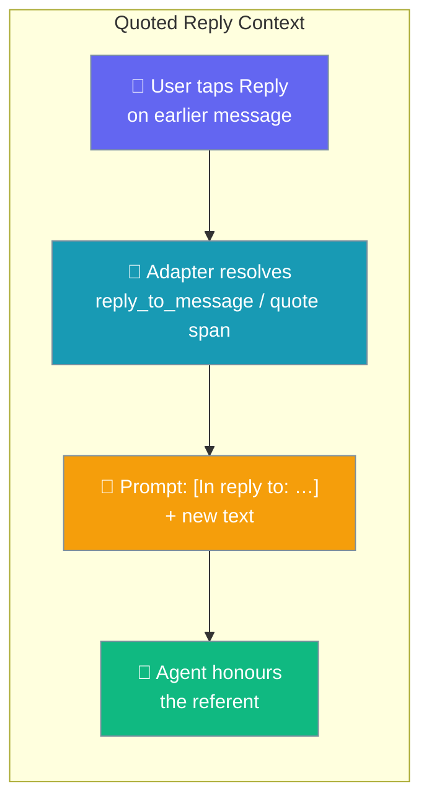
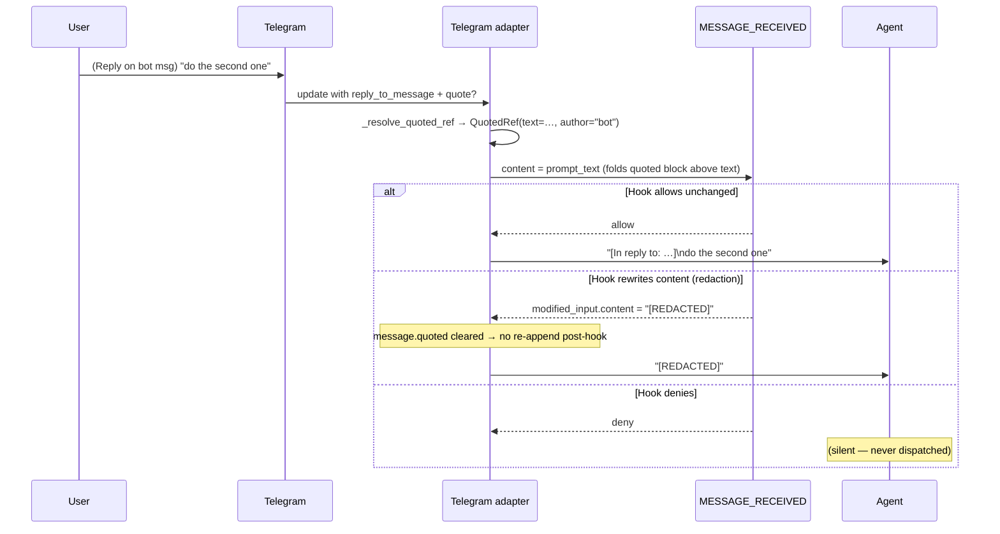

When a user replies to or quotes an earlier message on Telegram, the referenced text is folded into the agent turn as a compact quoted block so the agent honours the referent.



Tapping **Reply** on the bot's own message now carries the referenced text — so a bare "do the second one" resolves correctly:

```text
Bot:  Here are three options: 1) migrate now  2) stage it  3) roll back
User: (taps Reply on the bot's message) do the second one

# What the agent sees (rendered by BotMessage.prompt_text)
[In reply to: "Here are three options: 1) migrate now  2) stage it  3) roll back"]
do the second one

# Agent replies with the right referent — "Staging it — here's the plan…"
```

## Quick Start

<Steps>
<Step title="Start the bot — context is always on">
```python
from praisonaiagents import Agent
from praisonai.bots import TelegramBot

agent = Agent(name="Planner", instructions="Be concise.")
bot = TelegramBot(token="...", agent=agent)

import asyncio
asyncio.run(bot.start())
# Reply/quote context is always on — no flag to enable.
```
</Step>

<Step title="Inspect the resolved quote programmatically">
```python
from praisonaiagents.bots import BotMessage, QuotedRef

msg = BotMessage(
    content="do the second one",
    quoted=QuotedRef(
        text="Here are three options: 1) migrate now  2) stage it  3) roll back",
        author="bot",
    ),
)
print(msg.prompt_text)
# [In reply to: "Here are three options: 1) migrate now  2) stage it  3) roll back"]
# do the second one
```
</Step>
</Steps>

---

## How It Works

The adapter resolves the referenced text inbound, then `prompt_text` renders it above the new text before the message reaches the agent.



`prompt_text` whitespace-collapses the referenced text and truncates anything over 500 characters with an ellipsis. With no quote it is identical to the plain text.

| Situation | What the agent sees |
|---|---|
| No reply / no quote | Original text unchanged |
| Reply to a bot message | `[In reply to: "<bot's earlier text>"]\n<new text>` |
| Reply to a peer message | `[In reply to: "<peer's earlier text>"]\n<new text>` |
| Explicit quote span (partial highlight) | `[In reply to: "<selected span only>"]\n<new text>` |
| Referenced message has caption only | Caption used as the quoted text |
| New text empty (reply with just a sticker/reaction) | Only the `[In reply to: "…"]` block |
| Quoted text > 500 chars | Truncated with `…` |

Behavioural rules:

- **Always-on.** No YAML or Python flag — the feature is default behaviour on Telegram.
- **Best-effort.** Any missing field or error falls back to today's behaviour — the turn is never dropped just because resolution failed.
- **Context, never control.** Quoted content is injected as context only, never as a control frame — consistent with `allow_control` on `BotMessage`.
- **Runs behind the gate.** `MESSAGE_RECEIVED` sees `content = prompt_text` (the rendered turn including the quoted block). Redacting content in the hook is authoritative — the separately-resolved quote is cleared so unredacted quoted text can't leak past.
- **Works in the standalone bot and the gateway.** Both `praisonai bot` and `praisonai gateway` render `prompt_text` before dispatch.

---

## Platform Support

Quoted reply resolution is wired on Telegram in this release.

| Platform | Quoted reply resolved? |
|---|:---:|
| Telegram | ✅ |
| Discord | ❌ (not yet) |
| Slack | ❌ (not yet) |
| WhatsApp | ❌ (not yet) |

---

## Common Patterns

**Do nothing — it just works.** Start the bot and reply/quote context is folded in automatically.

```python
from praisonaiagents import Agent
from praisonai.bots import TelegramBot

agent = Agent(name="Planner", instructions="Be concise.")
bot = TelegramBot(token="...", agent=agent)

import asyncio
asyncio.run(bot.start())
```

**Redact quoted secrets before the agent sees them.** The `MESSAGE_RECEIVED` hook receives the rendered turn, so scrubbing `event_data.content` covers a secret that appeared **in the quoted message**, not just the new text.

```python
import re
from praisonaiagents.hooks import HookRegistry, HookEvent, HookResult

SECRET = re.compile(r"hunter\d+")
registry = HookRegistry()

@registry.on(HookEvent.MESSAGE_RECEIVED)
def redact(event_data):
    cleaned = SECRET.sub("[REDACTED]", event_data.content)
    if cleaned != event_data.content:
        return HookResult(decision="allow", modified_input={"content": cleaned})
    return HookResult.allow()
```

**Inspect `msg.quoted` in a custom hook or plugin.** The resolved reference exposes the referenced text and its author.

```python
from praisonaiagents.bots import BotMessage, QuotedRef

msg = BotMessage(
    content="do the second one",
    quoted=QuotedRef(
        text="Here are three options: 1) migrate now  2) stage it  3) roll back",
        author="bot",
    ),
)
print(msg.quoted.author)   # "bot"
print(msg.prompt_text)     # rendered turn with the quoted block
```

---

## Best Practices

<AccordionGroup>
<Accordion title="Don't add prompt guidance for quotes">
The `[In reply to: "…"]` block is unambiguous — the agent honours the referent without extra system-prompt scaffolding.
</Accordion>

<Accordion title="Use the inbound gate to filter quoted content">
`MESSAGE_RECEIVED` sees the rendered turn — redact or deny there, not by peeking at `msg.quoted` in the agent tools.
</Accordion>

<Accordion title="Treat quoted content as untrusted">
It comes from whoever sent the referenced message. It is context, never a control frame.
</Accordion>

<Accordion title="Expect graceful degradation across Telegram clients">
If a client doesn't send the `quote` span, the adapter falls back to `reply_to_message.text` / `caption`; if neither is present, the turn goes through unchanged.
</Accordion>
</AccordionGroup>

---

## Related

<CardGroup cols={2}>
<Card title="Implicit Mentions" icon="reply" href="/features/bot-implicit-mentions">
  The same reply gesture that admits the message under `mention_only`
</Card>
<Card title="Inbound Message Gate" icon="shield-check" href="/features/inbound-message-gate">
  The hook sees the rendered turn, including the quoted block
</Card>
<Card title="Bot Gateway" icon="tower-broadcast" href="/features/bot-gateway">
  Gateway agents render `prompt_text` before dispatch too
</Card>
<Card title="Control Trust" icon="lock" href="/features/bot-control-trust">
  Why quoted content is context, not control
</Card>
</CardGroup>
