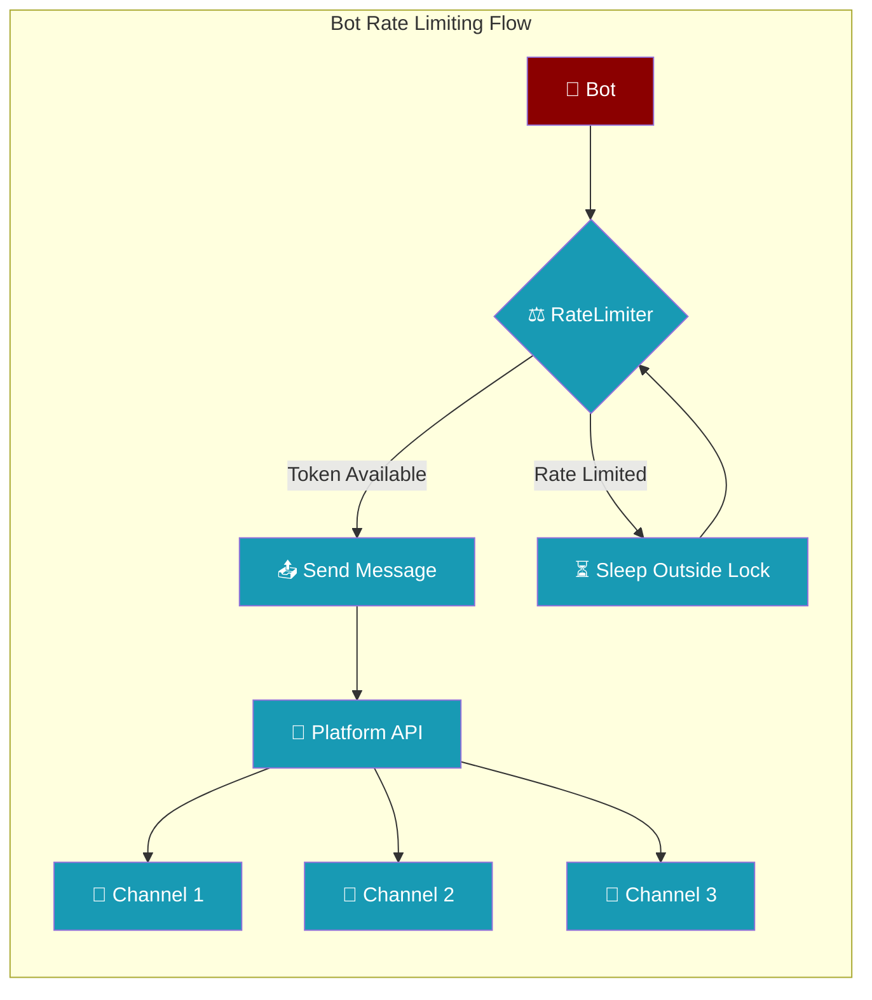
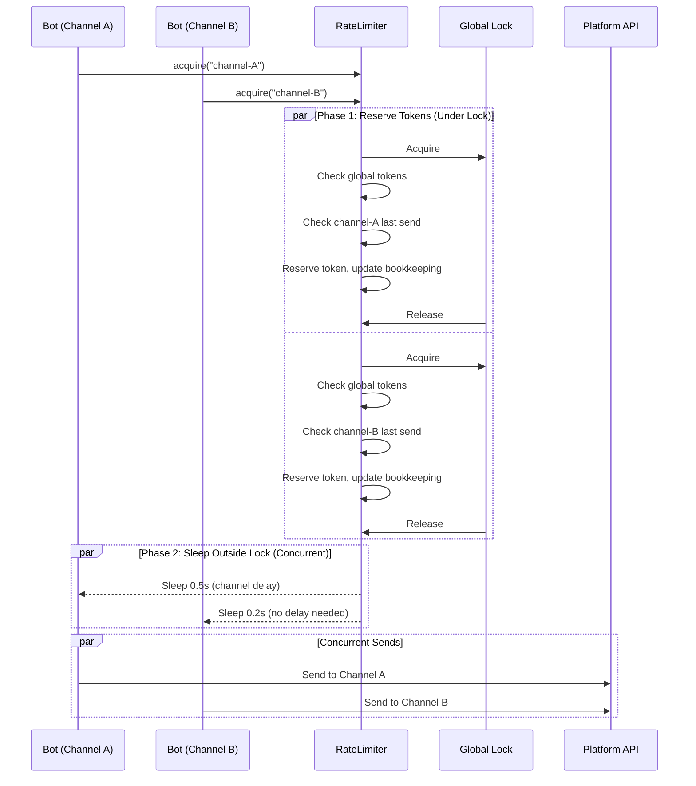
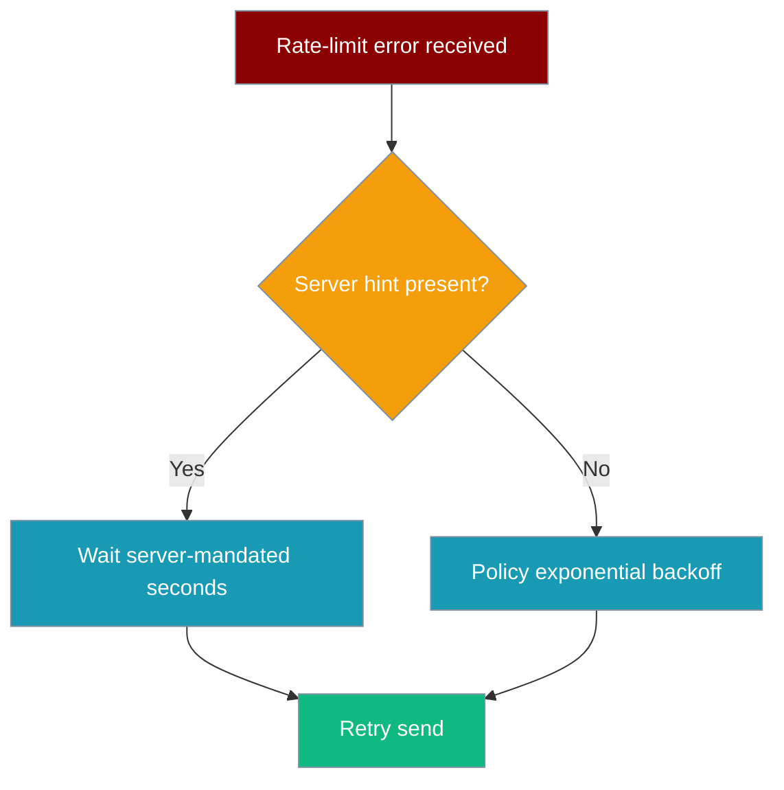

```python
from praisonaiagents import Agent, BotConfig

agent = Agent(name="rate-limited-bot", instructions="Respond to users within rate limits.")
config = BotConfig(rate_limit_per_user=10)
agent.start("Apply rate limiting: max 10 requests per user per minute.")
```

The user sends many messages quickly; outbound replies are throttled so the platform does not return HTTP 429 errors.


Bot Rate Limiting prevents messaging platform 429 errors by throttling outbound messages to channels, respecting platform-specific limits and per-channel delays.



## Quick Start

<Steps>
<Step title="Simple Usage">
Use the default rate limiter for general messaging bots.

```python
from praisonai.bots._rate_limit import RateLimiter

# Default: 1 message/sec, burst 5, 1s per-channel delay
limiter = RateLimiter()

# Bot adapters call this before sending
await limiter.acquire(channel_id="telegram-chat-12345")
```
</Step>

<Step title="Platform-Specific Configuration">
Use platform presets for optimal compliance with API limits.

```python
from praisonai.bots._rate_limit import RateLimiter

# Telegram: 25 msg/sec, 30 burst, 0.05s per-channel
telegram_limiter = RateLimiter.for_platform("telegram")

# Discord: 1 msg/sec, 5 burst, 1s per-channel  
discord_limiter = RateLimiter.for_platform("discord")

# Slack: 1 msg/sec, 1 burst, 1s per-channel
slack_limiter = RateLimiter.for_platform("slack")

# WhatsApp: 50 msg/sec, 80 burst, 0.1s per-channel
whatsapp_limiter = RateLimiter.for_platform("whatsapp")
```
</Step>

<Step title="Custom Configuration">
Fine-tune rate limits for specific platform policies or custom requirements.

```python
from praisonai.bots._rate_limit import RateLimiter, RateLimitConfig

limiter = RateLimiter(RateLimitConfig(
    messages_per_second=2.0,  # Global rate
    burst_size=10,            # Burst capacity
    per_channel_delay=1.5,    # Min delay per channel
))

await limiter.acquire(channel_id="custom-channel-456")
```
</Step>
</Steps>

---

## How It Works



The rate limiter uses a two-phase approach:

| Phase | Description | Benefits |
|-------|-------------|----------|
| **Reserve** | Under global lock: check tokens, reserve capacity, update channel tracking | Thread-safe bookkeeping |
| **Sleep** | Outside lock: actual delay based on computed wait time | Multiple channels can sleep concurrently |

---

## Configuration Options

| Option | Type | Default | Description |
|--------|------|---------|-------------|
| `messages_per_second` | `float` | `1.0` | Token refill rate for the global token bucket. |
| `burst_size` | `int` | `5` | Max tokens that can accumulate (burst capacity). |
| `per_channel_delay` | `float` | `1.0` | Minimum seconds between two sends to the same channel. |

### Platform Presets

| Platform | messages_per_second | burst_size | per_channel_delay | Notes |
|----------|---------------------|------------|-------------------|--------|
| **Telegram** | 25.0 | 30 | 0.05 | ~30 msg/sec to different users |
| **Discord** | 1.0 | 5 | 1.0 | 5 messages per 5 seconds per channel |
| **Slack** | 1.0 | 1 | 1.0 | 1 message per second per channel |
| **WhatsApp** | 50.0 | 80 | 0.1 | ~80 msg/sec Cloud API limit |

---

## Memory Management

Per-channel state is tracked in an LRU cache capped at **4096 channels**. If a bot serves more channels than that, the least-recently-used channels fall out of the cache and their `per_channel_delay` window resets. This bounds memory for long-running bots.

```python
# Memory usage stays bounded even with many channels
for channel_id in range(10000):  # 10k channels
    await limiter.acquire(f"channel-{channel_id}")
    # Internal cache automatically evicts old entries at 4096 limit
```

---

## Concurrency Design

The global lock is held only long enough to reserve a token and update bookkeeping — the actual sleep happens outside the lock. Multiple channels can be rate-limited concurrently without serialising on one mutex.

**Before PR #1870** (serialized):
```python
# Old behavior: sleep INSIDE lock - channels wait in line
async with self._lock:
    # check tokens, check channel timing
    await asyncio.sleep(delay)  # BLOCKS other channels
```

**After PR #1870** (concurrent):
```python
# New behavior: sleep OUTSIDE lock - channels sleep in parallel
async with self._lock:
    # check tokens, check channel timing, compute delay
    pass  # lock released immediately
await asyncio.sleep(delay)  # Multiple channels sleep concurrently
```

---

## Server-provided Retry-After

When a messaging platform explicitly tells the bot how long to wait, that hint takes precedence over the policy backoff.



**Precedence order (highest first):**

1. **Server-mandated wait** — extracted from the platform error:
   - **Telegram**: `parameters.retry_after` field (or `.retry_after` attr on `RetryAfter` exception)
   - **HTTP channels** (Slack / Discord / WhatsApp): `Retry-After` header — integer seconds *or* HTTP-date
   - **Text fallback**: `retry after ` / `retry_after: ` in the error message body
2. **Policy exponential backoff** — only used when the server provides no hint

The resilience layer (`_resilience.deliver_with_retry` and `_delivery.deliver_with_retry`) reads the server hint via `server_retry_after(err)` and sleeps for exactly that duration before the next attempt. The `OutboundQueue` also stores the hint and gates the next drain cycle accordingly.

<Note>
The hint is available across all delivery paths — both the immediate retry helper and the durable outbound queue — so no send bypasses a server-mandated backoff.
</Note>

---

## Penalised Lanes

After a 429 from a messaging platform, `RateLimiter.penalise(channel_id, seconds)` widens the wait window for that channel — and the global window — so the next sends don't immediately re-trip the limit.

```python
from praisonai.bots._rate_limit import RateLimiter

limiter = RateLimiter.for_platform("telegram")

# When a 429 arrives, the delivery layer calls:
# limiter.penalise(channel_id="telegram-chat-123", seconds=30)
# — the channel's per_channel_delay grows for 30 s,
#   and the global bucket also absorbs the penalty.
```

`penalise` is called automatically by `_delivery.deliver_with_retry` via its optional `rate_limiter=` argument when a server-mandated `Retry-After` hint is detected. You can also call it manually if you observe 429s through other means.

| What penalise does | Effect |
|---|---|
| Widens per-channel wait window by `seconds` | That channel's sends space out |
| Adds a global bucket penalty | Other channels slow slightly too |
| Resets automatically after the penalty duration | Normal rate resumes without intervention |

---

## Best Practices

<AccordionGroup>
<Accordion title="Use Platform Presets">
Start with `RateLimiter.for_platform()` instead of custom configs. Platform presets are tuned for each API's documented limits and real-world behavior.

```python
# Good: use tested platform preset
limiter = RateLimiter.for_platform("discord")

# Risky: custom config might hit undocumented limits
limiter = RateLimiter(RateLimitConfig(messages_per_second=10.0))
```
</Accordion>

<Accordion title="Share Limiters Across Bot Instances">
Create one rate limiter per platform and share it across all bot instances to respect global rate limits.

```python
# Good: shared limiter
telegram_limiter = RateLimiter.for_platform("telegram")

bot1 = TelegramBot(rate_limiter=telegram_limiter)
bot2 = TelegramBot(rate_limiter=telegram_limiter)

# Bad: separate limiters bypass global limits
bot1 = TelegramBot(rate_limiter=RateLimiter.for_platform("telegram"))
bot2 = TelegramBot(rate_limiter=RateLimiter.for_platform("telegram"))
```
</Accordion>

<Accordion title="Monitor Rate Limit Logs">
The rate limiter logs debug messages when applying delays. Monitor these to tune your configuration.

```python
import logging
logging.getLogger("praisonai.bots._rate_limit").setLevel(logging.DEBUG)

# Log output:
# DEBUG:praisonai.bots._rate_limit:Rate limit: waiting 0.750s for channel telegram-chat-123
```
</Accordion>

<Accordion title="Handle Platform-Specific Burst Patterns">
Some platforms allow bursts followed by longer delays. The `burst_size` parameter accommodates this pattern.

```python
# WhatsApp allows rapid bursts then enforces stricter limits
whatsapp_limiter = RateLimiter(RateLimitConfig(
    messages_per_second=10.0,  # Sustained rate
    burst_size=50,             # Initial burst capacity
    per_channel_delay=0.1      # Quick per-channel recovery
))
```
</Accordion>
</AccordionGroup>

---

## Related

<CardGroup cols={2}>
<Card title="Rate Limiter (LLM)" icon="gauge-high" href="/docs/features/rate-limiter">
  Rate limiting for LLM API calls (different from bot message rate limiting)
</Card>
<Card title="Messaging Bots" icon="message-circle" href="/docs/features/messaging-bots">
  Build bots for Telegram, Discord, Slack, and WhatsApp platforms
</Card>
<Card title="Bot Platform Capabilities" icon="sliders" href="/docs/features/bot-platform-capabilities">
  How platform capabilities drive this feature
</Card>
</CardGroup>