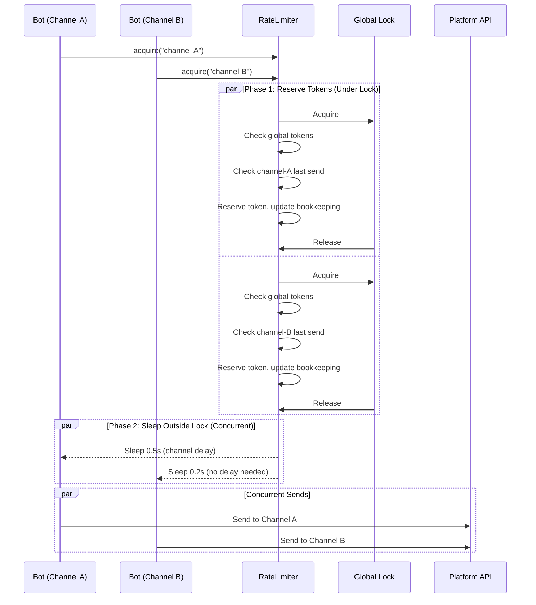
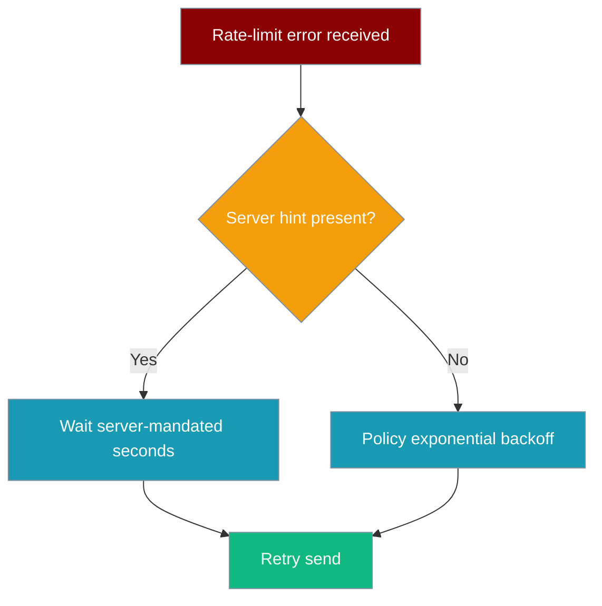

<Note>
Bot platform adapters now ship in the `praisonai-bot` package. `praisonai bot serve` still works exactly as documented here; for a standalone install see [praisonai-bot Migration](/docs/guides/praisonai-bot-migration).
</Note>


```python
from praisonai.bots._rate_limit import RateLimiter

limiter = RateLimiter.for_platform("telegram")
await limiter.acquire(channel_id="telegram-chat-12345")
```

Bot Rate Limiting prevents messaging platform 429 errors by throttling outbound messages to channels, respecting platform-specific limits and per-channel delays.

Since PraisonAI #2578, the limiter also covers the proactive path — scheduled and agent-initiated sends now share one bucket per platform with the reply path. `DeliveryRouter.deliver` reuses `adapter._rate_limiter` if the adapter already carries one; otherwise it lazily calls `RateLimiter.for_platform(platform)`.

| Send path | Rate limiter used |
|-----------|-------------------|
| Reply path (`DurableDelivery.send`, `deliver_with_retry`) | Per-platform bucket on the adapter |
| Proactive path (`BotOS.deliver` / `DeliveryRouter.deliver`) | Same per-platform bucket — reuses `adapter._rate_limiter` or lazily creates one |


## Quick Start

<Steps>
<Step title="Simple Usage">
Use the default rate limiter for general messaging bots.

```python
from praisonai.bots._rate_limit import RateLimiter

# Default: 1 message/sec, burst 5, 1s per-channel delay
limiter = RateLimiter()

# Bot adapters call this before sending
await limiter.acquire(channel_id="telegram-chat-12345")
```
</Step>

<Step title="Platform-Specific Configuration">
Use platform presets for optimal compliance with API limits.

```python
from praisonai.bots._rate_limit import RateLimiter

# Single-process: fast in-memory bucket (unchanged behaviour)
telegram_limiter = RateLimiter.for_platform("telegram")

# Multi-worker: share ONE bucket across every gateway worker on this bot token
from praisonai.bots import DeliveryControlStore
shared = DeliveryControlStore("~/.praisonai/state/delivery_control.sqlite")
telegram_limiter = RateLimiter.for_platform("telegram", store=shared)
# scope defaults to the platform name — all "telegram" limiters on this store
# share one ceiling. Pass scope="telegram:bot-<hash>" for multi-tenant isolation.
```
</Step>

<Step title="Custom Configuration">
Fine-tune rate limits for specific platform policies or custom requirements.

```python
from praisonai.bots._rate_limit import RateLimiter, RateLimitConfig

limiter = RateLimiter(RateLimitConfig(
    messages_per_second=2.0,  # Global rate
    burst_size=10,            # Burst capacity
    per_channel_delay=1.5,    # Min delay per channel
))

await limiter.acquire(channel_id="custom-channel-456")
```
</Step>
</Steps>

---

## How It Works



The rate limiter uses a two-phase approach:

| Phase | Description | Benefits |
|-------|-------------|----------|
| **Reserve** | Under global lock: check tokens, reserve capacity, update channel tracking | Thread-safe bookkeeping |
| **Sleep** | Outside lock: actual delay based on computed wait time | Multiple channels can sleep concurrently |

---

## Configuration Options

| Option | Type | Default | Description |
|--------|------|---------|-------------|
| `messages_per_second` | `float` | `1.0` | Token refill rate for the global token bucket. |
| `burst_size` | `int` | `5` | Max tokens that can accumulate (burst capacity). |
| `per_channel_delay` | `float` | `1.0` | Minimum seconds between two sends to the same channel. |

### `RateLimiter` constructor kwargs (multi-worker)

| Kwarg | Type | Default | Description |
|---|---|---|---|
| `store` | `DeliveryControlStore` \| None | `None` | When set, `acquire`/`penalise`/`reset` route through a shared SQLite bucket. When `None` (default), the fast per-process in-memory bucket is used — correct for single-process gateways. |
| `scope` | `str` | `"default"` | Identity of the shared bucket in the store — typically the platform name (`RateLimiter.for_platform` sets this for you) or a hash of the bot token. All limiters sharing a token **must** use the same `scope` so they share the ceiling. |

### Platform Presets

| Platform | messages_per_second | burst_size | per_channel_delay | Notes |
|----------|---------------------|------------|-------------------|--------|
| **Telegram** | 25.0 | 30 | 0.05 | ~30 msg/sec to different users |
| **Discord** | 1.0 | 5 | 1.0 | 5 messages per 5 seconds per channel |
| **Slack** | 1.0 | 1 | 1.0 | 1 message per second per channel |
| **WhatsApp** | 50.0 | 80 | 0.1 | ~80 msg/sec Cloud API limit |

---

## Memory Management

Per-channel state is tracked in an LRU cache capped at **4096 channels**. If a bot serves more channels than that, the least-recently-used channels fall out of the cache and their `per_channel_delay` window resets. This bounds memory for long-running bots.

```python
# Memory usage stays bounded even with many channels
for channel_id in range(10000):  # 10k channels
    await limiter.acquire(f"channel-{channel_id}")
    # Internal cache automatically evicts old entries at 4096 limit
```

---

## Multi-worker (horizontally-scaled gateway)

A single-process gateway is served by the fast in-memory token bucket — `RateLimiter()` with no `store=` — and that's the right default. But once you run **N workers**, each with its own `RateLimiter`, each worker keeps its own bucket and the platform sees `N × messages_per_second`. That's the exact scenario a token-bucket limiter exists to prevent, and it produces 429s and temporary bans.

Pass a shared [`DeliveryControlStore`](#deliverycontrolstore) so every worker draws from **one** SQLite-backed bucket:

```python
from praisonai.bots import DeliveryControlStore
from praisonai.bots._rate_limit import RateLimiter

# One file, shared by every worker on the box (or on the shared volume)
store = DeliveryControlStore("~/.praisonai/state/delivery_control.sqlite")

limiter = RateLimiter.for_platform("telegram", store=store)
# scope defaults to "telegram" — matches every other worker calling for_platform("telegram", store=store)
```

The token reservation now happens inside a `BEGIN IMMEDIATE` transaction, so `N` workers racing on `acquire()` get **atomic** wait times summing to the configured ceiling. The sleep still happens outside the transaction — workers block only for their share of the wait, not for the transaction round-trip.

### `scope` — sharing identity

`scope` is the shared-bucket identity. All limiters that must share one ceiling **must use the same scope string**. Two common patterns:

- **Per platform** (default): every worker running `for_platform("telegram", store=store)` uses `scope="telegram"` — one ceiling per platform per host.
- **Per bot token** (multi-tenant): hash the token so tenant A's Telegram bot doesn't share a bucket with tenant B's Telegram bot: `RateLimiter.for_platform("telegram", store=store, scope=f"telegram:{token_hash}")`.

### Restart survival

The bucket state (`tokens`, `last_refill`, `global_penalty_until`, per-channel `last_send`, `penalty_until`) is persisted on every reservation. A worker restart resumes from the last recorded reservation anchor instead of refilling to `burst_size`, so a rolling restart doesn't briefly triple the send rate.

### `penalise()` and `reset()` are also shared

When any worker records a 429/Retry-After hint via `penalise()`, every other worker on the same `scope` immediately respects the same hold-off window. `reset()` clears the shared row.

<Note>
The shared store uses `time.time()` (wall clock) instead of `time.monotonic()` because monotonic clocks are per-process and cannot be shared. Keep the workers' clocks in sync (NTP or the same host) — a clock skew of `X` seconds between two workers effectively widens the bucket by `X × messages_per_second` tokens during that skew.
</Note>

### DeliveryControlStore

The store is stdlib `sqlite3`-only (no extra dependency), uses WAL journaling, and can back both the rate limiter and the dead-target registry from one file.

```python
from praisonai.bots import DeliveryControlStore

store = DeliveryControlStore("~/.praisonai/state/delivery_control.sqlite")
# Parent directory is created if missing.
```

| Kwarg | Type | Default | Description |
|---|---|---|---|
| `path` | `str` \| `Path` | required | SQLite file path. Can share the same file as your outbox / DLQ. |

Table shape (informational — you never write SQL yourself):

- `rate_limit_state(scope, tokens, last_refill, global_penalty_until)` — one row per scope.
- `rate_limit_channel(scope, channel_id, last_send, penalty_until)` — per-channel rows, capped at 4096 per scope with LRU eviction.
- `dead_targets(platform, channel_id, reason, ts)` — see [Dead-Target Registry](/docs/features/dead-target-registry#multi-worker-horizontally-scaled-gateway).

---

## Concurrency Design

The global lock is held only long enough to reserve a token and update bookkeeping — the actual sleep happens outside the lock. Multiple channels can be rate-limited concurrently without serialising on one mutex.

<Note>
When a `store=` is set, "Phase 1: Reserve" runs inside a SQLite `BEGIN IMMEDIATE` transaction so N workers on N hosts race atomically on one bucket. The sleep in "Phase 2" still happens outside the transaction, so a slow worker never blocks another worker's reservation. See [Multi-worker (horizontally-scaled gateway)](#multi-worker-horizontally-scaled-gateway).
</Note>

**Before PR #1870** (serialized):
```python
# Old behavior: sleep INSIDE lock - channels wait in line
async with self._lock:
    # check tokens, check channel timing
    await asyncio.sleep(delay)  # BLOCKS other channels
```

**After PR #1870** (concurrent):
```python
# New behavior: sleep OUTSIDE lock - channels sleep in parallel
async with self._lock:
    # check tokens, check channel timing, compute delay
    pass  # lock released immediately
await asyncio.sleep(delay)  # Multiple channels sleep concurrently
```

---

## Server-provided Retry-After

When a messaging platform explicitly tells the bot how long to wait, that hint takes precedence over the policy backoff.



**Precedence order (highest first):**

1. **Server-mandated wait** — extracted from the platform error:
   - **Telegram**: `parameters.retry_after` field (or `.retry_after` attr on `RetryAfter` exception)
   - **HTTP channels** (Slack / Discord / WhatsApp): `Retry-After` header — integer seconds *or* HTTP-date
   - **Text fallback**: `retry after ` / `retry_after: ` in the error message body
2. **Policy exponential backoff** — only used when the server provides no hint

The resilience layer (`_resilience.deliver_with_retry` and `_delivery.deliver_with_retry`) reads the server hint via `server_retry_after(err)` and sleeps for exactly that duration before the next attempt. The `OutboundQueue` also stores the hint and gates the next drain cycle accordingly.

<Note>
The hint is available across all delivery paths — both the immediate retry helper and the durable outbound queue — so no send bypasses a server-mandated backoff.
</Note>

---

## Penalised Lanes

After a 429 from a messaging platform, `RateLimiter.penalise(channel_id, seconds)` widens the wait window for that channel — and the global window — so the next sends don't immediately re-trip the limit.

```python
from praisonai.bots._rate_limit import RateLimiter

limiter = RateLimiter.for_platform("telegram")

# When a 429 arrives, the delivery layer calls:
# limiter.penalise(channel_id="telegram-chat-123", seconds=30)
# — the channel's per_channel_delay grows for 30 s,
#   and the global bucket also absorbs the penalty.
```

`penalise` is called automatically by `_delivery.deliver_with_retry` via its optional `rate_limiter=` argument when a server-mandated `Retry-After` hint is detected. You can also call it manually if you observe 429s through other means.

| What penalise does | Effect |
|---|---|
| Widens per-channel wait window by `seconds` | That channel's sends space out |
| Adds a global bucket penalty | Other channels slow slightly too |
| Resets automatically after the penalty duration | Normal rate resumes without intervention |
| Persists across workers via `DeliveryControlStore` | Every worker on the same `scope` immediately respects the penalty; no cross-worker `penalise()` call needed |

---

## Best Practices

<AccordionGroup>
<Accordion title="Use Platform Presets">
Start with `RateLimiter.for_platform()` instead of custom configs. Platform presets are tuned for each API's documented limits and real-world behavior.

```python
# Good: use tested platform preset
limiter = RateLimiter.for_platform("discord")

# Risky: custom config might hit undocumented limits
limiter = RateLimiter(RateLimitConfig(messages_per_second=10.0))
```
</Accordion>

<Accordion title="Share Limiters Across Bot Instances">
Within one process, share one `RateLimiter` object across every bot instance. Across **multiple processes** (a horizontally-scaled gateway), instead pass a shared `DeliveryControlStore`:

```python
from praisonai.bots import DeliveryControlStore
from praisonai.bots._rate_limit import RateLimiter

# Multi-worker gateway — every worker constructs its own limiter, but they share
# one bucket via the store on the shared volume.
store = DeliveryControlStore("~/.praisonai/state/delivery_control.sqlite")
telegram_limiter = RateLimiter.for_platform("telegram", store=store)
```

See [Multi-worker (horizontally-scaled gateway)](#multi-worker-horizontally-scaled-gateway).
</Accordion>

<Accordion title="Monitor Rate Limit Logs">
The rate limiter logs debug messages when applying delays. Monitor these to tune your configuration.

```python
import logging
logging.getLogger("praisonai.bots._rate_limit").setLevel(logging.DEBUG)

# Log output:
# DEBUG:praisonai.bots._rate_limit:Rate limit: waiting 0.750s for channel telegram-chat-123
```
</Accordion>

<Accordion title="Handle Platform-Specific Burst Patterns">
Some platforms allow bursts followed by longer delays. The `burst_size` parameter accommodates this pattern.

```python
# WhatsApp allows rapid bursts then enforces stricter limits
whatsapp_limiter = RateLimiter(RateLimitConfig(
    messages_per_second=10.0,  # Sustained rate
    burst_size=50,             # Initial burst capacity
    per_channel_delay=0.1      # Quick per-channel recovery
))
```
</Accordion>
</AccordionGroup>

---

## Related

<CardGroup cols={2}>
<Card title="Rate Limiter (LLM)" icon="gauge-high" href="/docs/features/rate-limiter">
  Rate limiting for LLM API calls (different from bot message rate limiting)
</Card>
<Card title="Messaging Bots" icon="message-circle" href="/docs/features/messaging-bots">
  Build bots for Telegram, Discord, Slack, and WhatsApp platforms
</Card>
<Card title="Bot Platform Capabilities" icon="sliders" href="/docs/features/bot-platform-capabilities">
  How platform capabilities drive this feature
</Card>
</CardGroup>