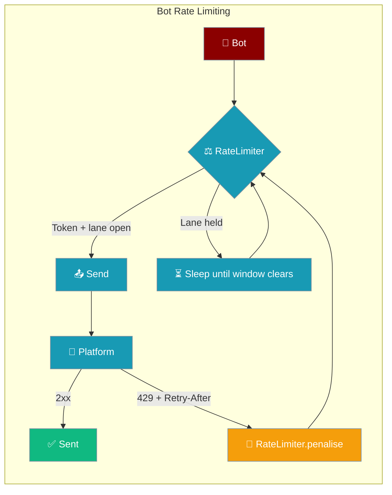
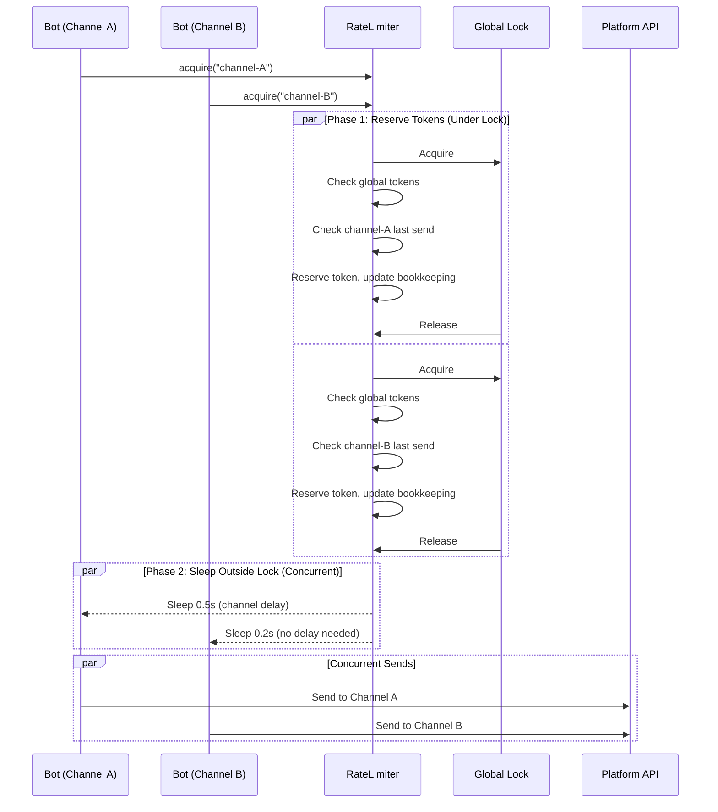
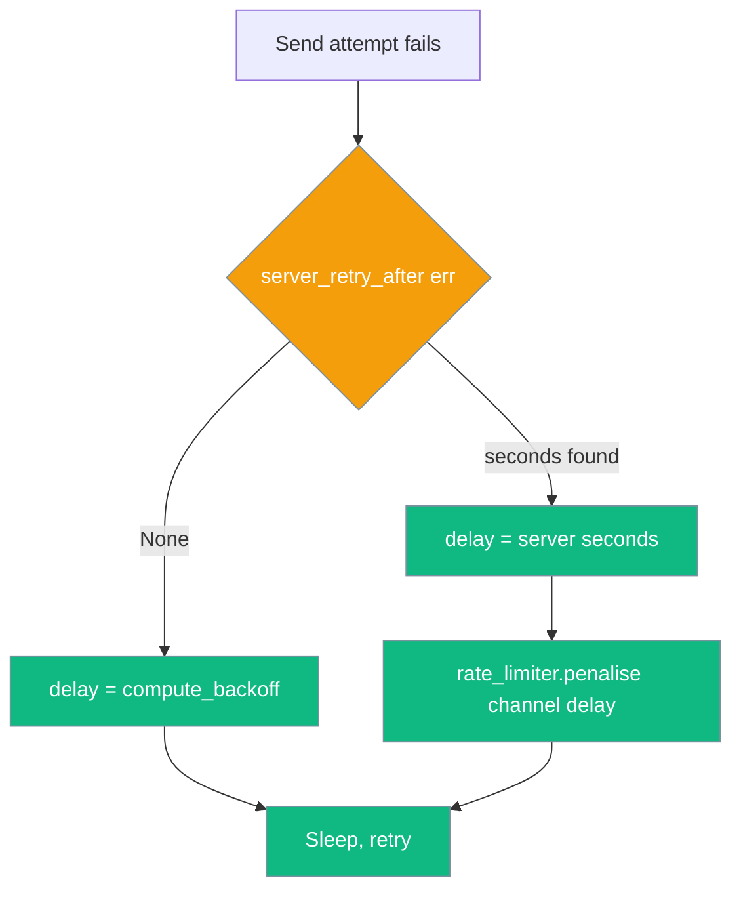

Bot Rate Limiting prevents messaging platform 429 errors **proactively** (token bucket + per-channel delay) and **reactively** widens a lane when the platform itself sends a `Retry-After` / `retry_after` signal, so subsequent sends do not immediately re-trip the throttle.



## Quick Start

<Steps>
<Step title="Simple Usage">
Use the default rate limiter for general messaging bots.

```python
from praisonai.bots._rate_limit import RateLimiter

# Default: 1 message/sec, burst 5, 1s per-channel delay
limiter = RateLimiter()

# Bot adapters call this before sending
await limiter.acquire(channel_id="telegram-chat-12345")
```
</Step>

<Step title="Platform-Specific Configuration">
Use platform presets for optimal compliance with API limits.

```python
from praisonai.bots._rate_limit import RateLimiter

# Telegram: 25 msg/sec, 30 burst, 0.05s per-channel
telegram_limiter = RateLimiter.for_platform("telegram")

# Discord: 1 msg/sec, 5 burst, 1s per-channel  
discord_limiter = RateLimiter.for_platform("discord")

# Slack: 1 msg/sec, 1 burst, 1s per-channel
slack_limiter = RateLimiter.for_platform("slack")

# WhatsApp: 50 msg/sec, 80 burst, 0.1s per-channel
whatsapp_limiter = RateLimiter.for_platform("whatsapp")
```
</Step>

<Step title="Custom Configuration">
Fine-tune rate limits for specific platform policies or custom requirements.

```python
from praisonai.bots._rate_limit import RateLimiter, RateLimitConfig

limiter = RateLimiter(RateLimitConfig(
    messages_per_second=2.0,  # Global rate
    burst_size=10,            # Burst capacity
    per_channel_delay=1.5,    # Min delay per channel
))

await limiter.acquire(channel_id="custom-channel-456")
```
</Step>
</Steps>

---

## How It Works



The rate limiter uses a two-phase approach:

| Phase | Description | Benefits |
|-------|-------------|----------|
| **Reserve** | Under global lock: check tokens, reserve capacity, update channel tracking | Thread-safe bookkeeping |
| **Sleep** | Outside lock: actual delay based on computed wait time | Multiple channels can sleep concurrently |

---

## Reactive Throttle Handling

When a platform returns a 429 with an explicit wait hint, the limiter widens the affected lane so concurrent sends do not immediately re-trip the throttle.

### `RateLimiter.penalise(channel_id, seconds)`

Called after a 429 with a known server hint. Widens the lane for `seconds`; `channel_id=None` sets a global window that blocks every `acquire()` call.

```python
from praisonai.bots._rate_limit import RateLimiter

limiter = RateLimiter.for_platform("telegram")

# Widen lane for one channel after receiving a 30s server hint
await limiter.penalise(channel_id="telegram-chat-12345", seconds=30)

# Widen globally (e.g. platform-wide 429)
await limiter.penalise(channel_id=None, seconds=60)
```

`penalise()` is awaitable, never shortens an existing window, and is a no-op when `seconds <= 0`.

### Penalty Windows

| Window | State | Trigger | Effect |
|---|---|---|---|
| Per-channel | `_channel_penalty_until[channel_id]` | `penalise(channel_id, n)` | This channel's `acquire()` waits until the window clears |
| Global | `_global_penalty_until` | `penalise(None, n)` | **Every** `acquire()` waits until the window clears |

Subsequent `acquire()` calls observe both the global and per-channel windows and sleep until the longer of the two clears.

### When does `penalise()` get called?



### Penalty API Reference

| API | Signature | Description |
|---|---|---|
| `RateLimiter.penalise` | `async penalise(channel_id: Optional[str], seconds: float) -> None` | Widen `channel_id`'s lane for `seconds`. `channel_id=None` ⇒ global. No-op if `seconds <= 0`. Never shortens an existing window. |
| `RateLimiter.reset` | `reset() -> None` | Clears all state including `_channel_penalty_until` and `_global_penalty_until`. |

---

## Honouring Server Retry-After

The limiter does not parse 429s itself — the retry/send path (`deliver_with_retry`, `ConnectionMonitor`, `OutboundQueue.drain`) extracts the hint via `server_retry_after(err)` and calls `penalise()`. Pass the shared limiter into `deliver_with_retry` so the lane is widened for the whole window:

```python
from praisonai.bots._rate_limit import RateLimiter
from praisonai.bots._delivery import deliver_with_retry

limiter = RateLimiter.for_platform("telegram")
ok, err = await deliver_with_retry(
    send_fn, channel_id="telegram-chat-12345",
    rate_limiter=limiter,
    platform="telegram",
)
```

Full details on extraction logic and `server_retry_after()` are in [Durable Delivery](/docs/features/durable-delivery).

---

## Configuration Options

| Option | Type | Default | Description |
|--------|------|---------|-------------|
| `messages_per_second` | `float` | `1.0` | Token refill rate for the global token bucket. |
| `burst_size` | `int` | `5` | Max tokens that can accumulate (burst capacity). |
| `per_channel_delay` | `float` | `1.0` | Minimum seconds between two sends to the same channel. |

### Platform Presets

| Platform | messages_per_second | burst_size | per_channel_delay | Notes |
|----------|---------------------|------------|-------------------|--------|
| **Telegram** | 25.0 | 30 | 0.05 | ~30 msg/sec to different users |
| **Discord** | 1.0 | 5 | 1.0 | 5 messages per 5 seconds per channel |
| **Slack** | 1.0 | 1 | 1.0 | 1 message per second per channel |
| **WhatsApp** | 50.0 | 80 | 0.1 | ~80 msg/sec Cloud API limit |

---

## Memory Management

Per-channel state is tracked in two LRU caches, both capped at **4096 channels**. Oldest entries are evicted on overflow, bounding memory for long-running bots.

| Cache | Tracks |
|---|---|
| `_channel_last_send` | Proactive per-channel delay (token bucket) |
| `_channel_penalty_until` | Reactive penalty windows from server hints |

```python
# Memory usage stays bounded even with many channels
for channel_id in range(10000):  # 10k channels
    await limiter.acquire(f"channel-{channel_id}")
    # Both internal caches automatically evict old entries at 4096 limit
```

---

## Concurrency Design

The global lock is held only long enough to reserve a token and update bookkeeping — the actual sleep happens outside the lock. Multiple channels can be rate-limited concurrently without serialising on one mutex.

**Before PR #1870** (serialized):
```python
# Old behavior: sleep INSIDE lock - channels wait in line
async with self._lock:
    # check tokens, check channel timing
    await asyncio.sleep(delay)  # BLOCKS other channels
```

**After PR #1870** (concurrent):
```python
# New behavior: sleep OUTSIDE lock - channels sleep in parallel
async with self._lock:
    # check tokens, check channel timing, compute delay
    pass  # lock released immediately
await asyncio.sleep(delay)  # Multiple channels sleep concurrently
```

---

## Best Practices

<AccordionGroup>
<Accordion title="Use Platform Presets">
Start with `RateLimiter.for_platform()` instead of custom configs. Platform presets are tuned for each API's documented limits and real-world behavior.

```python
# Good: use tested platform preset
limiter = RateLimiter.for_platform("discord")

# Risky: custom config might hit undocumented limits
limiter = RateLimiter(RateLimitConfig(messages_per_second=10.0))
```
</Accordion>

<Accordion title="Share Limiters Across Bot Instances">
Create one rate limiter per platform and share it across all bot instances to respect global rate limits.

```python
# Good: shared limiter
telegram_limiter = RateLimiter.for_platform("telegram")

bot1 = TelegramBot(rate_limiter=telegram_limiter)
bot2 = TelegramBot(rate_limiter=telegram_limiter)

# Bad: separate limiters bypass global limits
bot1 = TelegramBot(rate_limiter=RateLimiter.for_platform("telegram"))
bot2 = TelegramBot(rate_limiter=RateLimiter.for_platform("telegram"))
```
</Accordion>

<Accordion title="Monitor Rate Limit Logs">
The rate limiter logs debug messages when applying delays. Monitor these to tune your configuration.

```python
import logging
logging.getLogger("praisonai.bots._rate_limit").setLevel(logging.DEBUG)

# Log output:
# DEBUG:praisonai.bots._rate_limit:Rate limit: waiting 0.750s for channel telegram-chat-123
```
</Accordion>

<Accordion title="Handle Platform-Specific Burst Patterns">
Some platforms allow bursts followed by longer delays. The `burst_size` parameter accommodates this pattern.

```python
# WhatsApp allows rapid bursts then enforces stricter limits
whatsapp_limiter = RateLimiter(RateLimitConfig(
    messages_per_second=10.0,  # Sustained rate
    burst_size=50,             # Initial burst capacity
    per_channel_delay=0.1      # Quick per-channel recovery
))
```
</Accordion>

<Accordion title="Always pass a shared limiter to deliver_with_retry">
Without `rate_limiter=`, a 429 still pauses the failing send (the hint is read from the error), but the limiter has no way to know — concurrent sends on the same channel may immediately re-trip the platform's throttle. Pass the shared limiter so the lane is widened for the whole window.

```python
from praisonai.bots._rate_limit import RateLimiter
from praisonai.bots._delivery import deliver_with_retry

limiter = RateLimiter.for_platform("telegram")  # shared across bot instances
ok, err = await deliver_with_retry(
    send_fn, channel_id=chat_id,
    rate_limiter=limiter,
    platform="telegram",
)
```
</Accordion>
</AccordionGroup>

---

## Related

<CardGroup cols={2}>
<Card title="Rate Limiter (LLM)" icon="gauge-high" href="/docs/features/rate-limiter">
  Rate limiting for LLM API calls (different from bot message rate limiting)
</Card>
<Card title="Messaging Bots" icon="message-circle" href="/docs/features/messaging-bots">
  Build bots for Telegram, Discord, Slack, and WhatsApp platforms
</Card>
<Card title="Bot Platform Capabilities" icon="sliders" href="/docs/features/bot-platform-capabilities">
  How platform capabilities drive this feature
</Card>
</CardGroup>