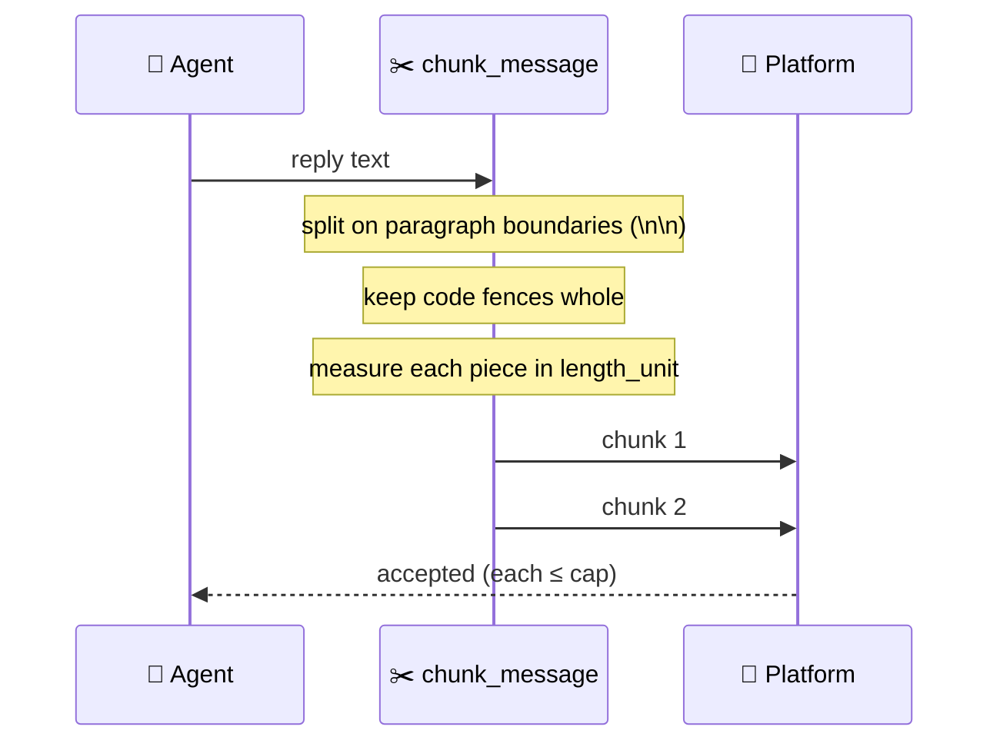

Every agent reply on Telegram, Slack, and Discord is split at paragraph boundaries, keeps its code fences intact, and is measured in the length unit each platform actually enforces.

```python
from praisonaiagents import Agent
from praisonai.bots import Bot

agent = Agent(name="assistant", instructions="Answer with long, code-heavy replies.")
bot = Bot("telegram", agent=agent)
bot.run()
```

The user asks a question; the delivery layer chunks the reply so a long, code-heavy, or emoji-heavy answer reaches them whole rather than being rejected by the platform's length limit.


## Quick Start

<Steps>
<Step title="Nothing to configure">
Chunking runs automatically on every adapter. A reply that fits the platform cap is sent as-is; a longer one is split at paragraph boundaries before sending.
</Step>
<Step title="Code fences stay intact">
A fenced code block is kept whole rather than split mid-block, so users always see complete, copyable code.
</Step>
<Step title="Telegram measures in UTF-16">
Telegram counts its 4096-character cap in UTF-16 code units. PraisonAI counts in the same unit, so emoji- and CJK-heavy replies are chunked at the point Telegram actually enforces.
</Step>
</Steps>

## How It Works

`chunk_message` splits the reply, using the platform's `length_unit` to measure each piece.



`chunk_message(text, max_length, preserve_fences, length_unit)` returns a list of chunks, each within the platform cap:

```python
from praisonai.bots._chunk import chunk_message

# Telegram: 4096 cap, measured in UTF-16 code units
chunks = chunk_message(
    long_text,
    max_length=4096,
    preserve_fences=True,
    length_unit="utf16",
)
for chunk in chunks:
    await adapter.send_message(channel_id, chunk)
```

The adapter reads `length_unit` from its own `platform_capabilities()`, so you rarely call `chunk_message` yourself — it runs inside `_send_long_message` on every reply.

## Platform Caps

| Platform | Max length | Length unit |
|----------|-----------:|-------------|
| Telegram | 4096       | `utf16`     |
| Slack    | 4096       | `codepoints`|
| Discord  | 2000       | `codepoints`|

<Note>
Only Telegram declares `length_unit="utf16"` in the current SDK (`TelegramBot.default_capabilities()`). Every other adapter uses the `"codepoints"` default, where one character counts as one unit.
</Note>

## Common Patterns

<Tabs>
<Tab title="Long transcripts">
A reply longer than the platform cap is split at paragraph boundaries and sent as several messages — no manual chunking needed in the agent.
</Tab>
<Tab title="Code-heavy replies">
`preserve_fences=True` (the default) keeps a fenced block whole so syntax highlighting and copy-paste stay intact.
</Tab>
<Tab title="Emoji / CJK on Telegram">
A single emoji is two UTF-16 code units. Measuring in `utf16` means an emoji-heavy reply is chunked at the point Telegram's 4096-unit cap actually bites, not later.
</Tab>
</Tabs>

## Best Practices

<AccordionGroup>
<Accordion title="Let the adapter chunk — don't pre-split in the agent">
The delivery layer already splits at paragraph boundaries and measures in the correct unit. Manual chunking inside the agent duplicates work and usually produces worse breaks.
</Accordion>
<Accordion title="Use utf16 for any Telegram-style platform">
If you build a custom adapter for a platform that counts UTF-16 (like Telegram), set `length_unit="utf16"` on its `PlatformCapabilities` so emoji/CJK replies are measured correctly.
</Accordion>
<Accordion title="Keep preserve_fences on">
Leaving `preserve_fences=True` keeps code blocks whole. Turn it off only when you specifically want a fenced block hard-split by character count.
</Accordion>
</AccordionGroup>

## Related

<CardGroup cols={2}>
<Card title="Messaging Bots" icon="robot" href="/features/messaging-bots">
  Deploy bots on Telegram, Slack, and Discord
</Card>
<Card title="Bot Platform Capabilities" icon="sliders" href="/features/bot-platform-capabilities">
  Per-platform length units and limits
</Card>
<Card title="Durable Outbound Delivery" icon="shield-check" href="/features/durable-delivery">
  Persist, retry, and drain outbound replies across restarts
</Card>
</CardGroup>
