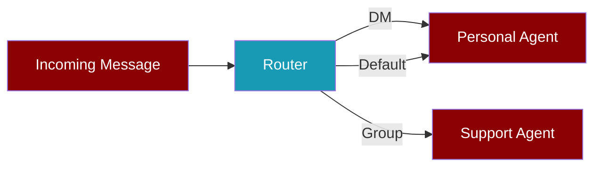
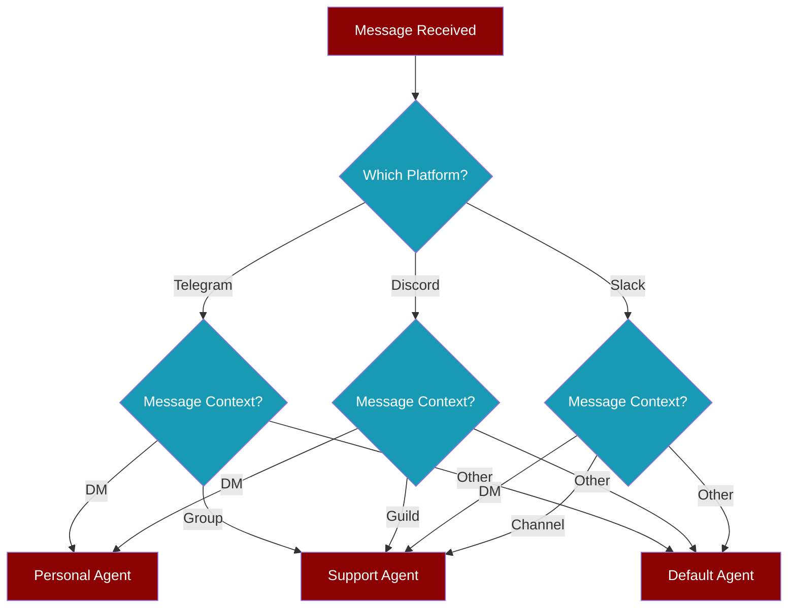

Message routing lets you send different types of messages to different AI agents. For example, direct messages go to your personal assistant, while group messages go to a support agent.

## How Routing Works

<Steps>
  <Step title="Message Arrives">
    A user sends a message on Telegram, Discord, or Slack.
  </Step>
  <Step title="Context Detection">
    The gateway detects where the message came from — a DM, group, or channel.
  </Step>
  <Step title="Route Lookup">
    The gateway checks the `routes` table in `gateway.yaml` for that context.
  </Step>
  <Step title="Agent Handles Message">
    The matched agent receives the message and responds.
  </Step>
</Steps>

## Route Contexts

| Context | Description | Example |
|---------|-------------|---------|
| **dm** | Direct / private message | User sends a DM to your bot |
| **group** | Group chat message | Message in a Telegram group or Discord server |
| **channel** | Channel message | Message in a Slack channel |
| **default** | Fallback for any unmatched context | Any message that doesn't match above |

<Tip>
Always define a `default` route. It acts as a safety net — if a message comes from an unexpected context, the default agent handles it.
</Tip>

## Configuration

Define routes in the `channels` section of `gateway.yaml`:

```yaml
channels:
  telegram:
    token: ${TELEGRAM_BOT_TOKEN}
    routes:
      dm: personal        # DMs → personal agent
      group: support      # Groups → support agent
      default: personal   # Everything else → personal agent

  discord:
    token: ${DISCORD_BOT_TOKEN}
    routes:
      dm: personal
      group: support
      default: personal

  slack:
    token: ${SLACK_BOT_TOKEN}
    app_token: ${SLACK_APP_TOKEN}
    routes:
      dm: support
      channel: support
      default: support

  whatsapp:
    mode: web             # or: token: ${WHATSAPP_ACCESS_TOKEN}
    routes:
      dm: personal
      group: support
      default: personal
```

## Routing Examples

<Tabs>
  <Tab title="Personal + Support">
    Route DMs to a personal assistant and group messages to support:
    ```yaml
    agents:
      personal:
        instructions: "You are a helpful personal assistant"
        model: gpt-4o-mini
      support:
        instructions: "You are a customer support agent"
        model: gpt-4o

    channels:
      telegram:
        token: ${TELEGRAM_BOT_TOKEN}
        routes:
          dm: personal
          group: support
          default: personal
    ```
  </Tab>

  <Tab title="Single Agent">
    Route all messages to one agent:
    ```yaml
    agents:
      assistant:
        instructions: "You are a helpful assistant"
        model: gpt-4o-mini

    channels:
      discord:
        token: ${DISCORD_BOT_TOKEN}
        routes:
          default: assistant
    ```
  </Tab>

  <Tab title="Multi-Channel">
    Different agents per platform:
    ```yaml
    agents:
      telegram_agent:
        instructions: "Telegram-optimized assistant"
        model: gpt-4o-mini
      slack_agent:
        instructions: "Slack workspace assistant"
        model: gpt-4o

    channels:
      telegram:
        token: ${TELEGRAM_BOT_TOKEN}
        routes:
          default: telegram_agent
      slack:
        token: ${SLACK_BOT_TOKEN}
        routes:
          default: slack_agent
    ```
  </Tab>
</Tabs>

## Routing Flow Diagram



<Note>
Routing is configured per channel. Each platform can have completely different routing rules — Telegram DMs can go to one agent while Discord DMs go to another.
</Note>
