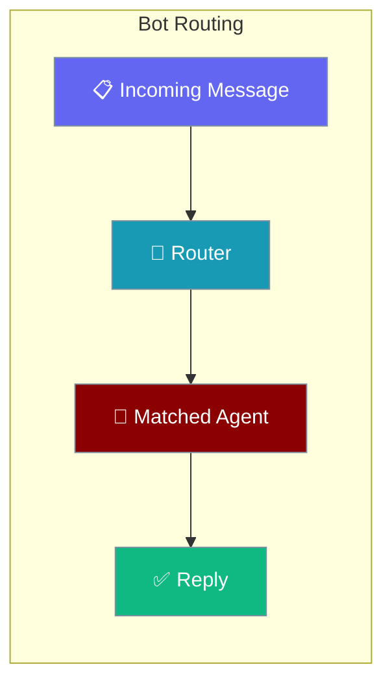
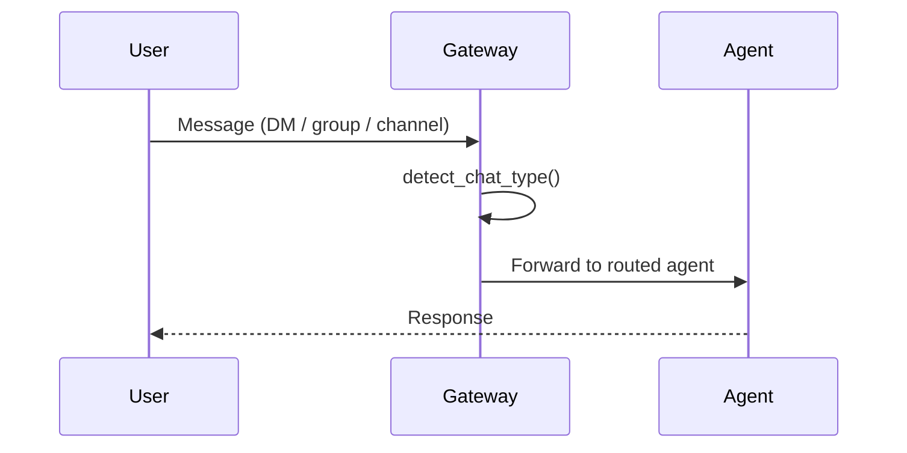
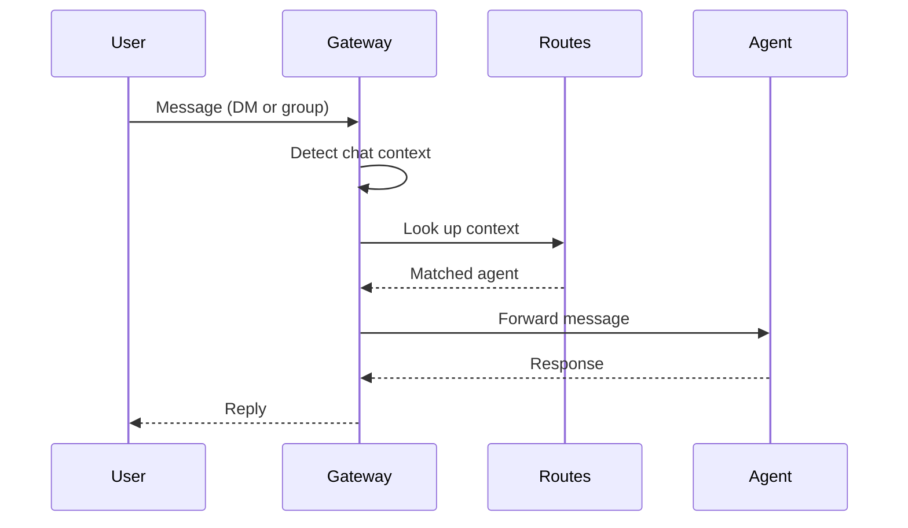
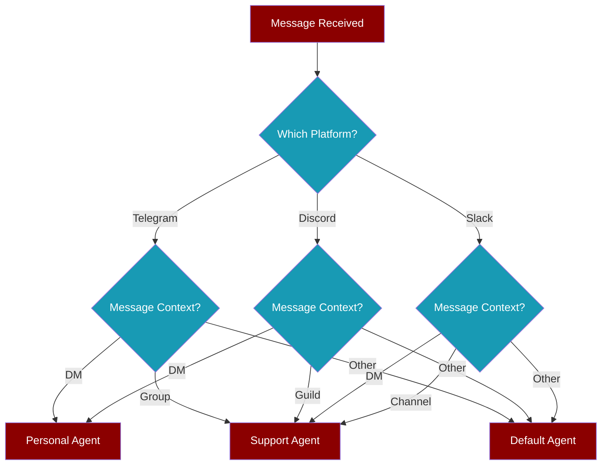

<Note>
Bot platform adapters now ship in the `praisonai-bot` package. `praisonai bot serve` still works exactly as documented here; for a standalone install see [praisonai-bot Migration](/docs/guides/praisonai-bot-migration).
</Note>


## Quick Start

<Steps>
<Step title="Define your agents">
```python
from praisonaiagents import Agent

personal_agent = Agent(name="personal", instructions="Handle personal questions.")
support_agent = Agent(name="support", instructions="Handle support requests.")
personal_agent.start("Route DMs to me, group messages to support.")
```
</Step>

<Step title="Serve with routing">
```bash
praisonai bot serve
```

The user messages in a DM or group; the gateway matches the chat context and forwards the turn to the configured agent.
</Step>
</Steps>


`routes:` is the preferred field name for gateway routing configuration — gateway runtime accepts both `routing:` and `routes:` interchangeably in YAML.


```mermaid
graph LR
    subgraph "Bot Routing"
        MSG[📋 Incoming Message] --> Router[🔀 Router]
        Router --> Agent[🤖 Matched Agent]
        Agent --> Reply[✅ Reply]
    end

    classDef input fill:#6366F1,stroke:#7C90A0,color:#fff
    classDef tool fill:#189AB4,stroke:#7C90A0,color:#fff
    classDef agent fill:#8B0000,stroke:#7C90A0,color:#fff
    classDef output fill:#10B981,stroke:#7C90A0,color:#fff
    class MSG input
    class Router tool
    class Agent agent
    class Reply output
```

Message routing lets you send different types of messages to different AI agents. For example, direct messages go to your personal assistant, while group messages go to a support agent.

## How Routing Works

The user sends a message; the gateway detects the chat context, looks up the matching route, and forwards the turn to that agent.


```mermaid
sequenceDiagram
    participant User
    participant Gateway
    participant Agent

    User->>Gateway: Message (DM / group / channel)
    Gateway->>Gateway: detect_chat_type()
    Gateway->>Agent: Forward to routed agent
    Agent-->>User: Response
```

<Steps>
  <Step title="Message Arrives">
    A user sends a message on Telegram, Discord, or Slack.
  </Step>
  <Step title="Context Detection">
    The gateway detects where the message came from — a DM, group, or channel.
  </Step>
  <Step title="Route Lookup">
    The gateway checks the `routes` table in `gateway.yaml` for that context.
  </Step>
  <Step title="Agent Handles Message">
    The matched agent receives the message and responds.
  </Step>
</Steps>

A user messages from a DM or group; the gateway detects the context, picks the matching agent, and returns its reply.


```mermaid
sequenceDiagram
    participant User
    participant Gateway
    participant Routes
    participant Agent

    User->>Gateway: Message (DM or group)
    Gateway->>Gateway: Detect chat context
    Gateway->>Routes: Look up context
    Routes-->>Gateway: Matched agent
    Gateway->>Agent: Forward message
    Agent-->>Gateway: Response
    Gateway-->>User: Reply
```

<Tip>
Context detection uses the `detect_chat_type(platform, chat_id)` helper under the hood. It classifies each message as `"direct"`, `"group"`, `"channel"`, or `"unknown"` based on platform-specific chat ID patterns. See [Platform-Aware Agents](/features/platform-aware-agents#chat-type-detection) for the per-platform rules.
</Tip>

## Route Contexts

| Context | Description | Example |
|---------|-------------|---------|
| **dm** | Direct / private message | User sends a DM to your bot |
| **group** | Group chat message | Message in a Telegram group or Discord server |
| **channel** | Channel message | Message in a Slack channel |
| **default** | Fallback for any unmatched context | Any message that doesn't match above |

<Tip>
Always define a `default` route. It acts as a safety net — if a message comes from an unexpected context, the default agent handles it.
</Tip>

## Configuration

Define routes in the `channels` section of `gateway.yaml`:

```yaml
channels:
  telegram:
    token: ${TELEGRAM_BOT_TOKEN}
    routes:
      dm: personal        # DMs → personal agent
      group: support      # Groups → support agent
      default: personal   # Everything else → personal agent

  discord:
    token: ${DISCORD_BOT_TOKEN}
    routes:
      dm: personal
      group: support
      default: personal

  slack:
    token: ${SLACK_BOT_TOKEN}
    app_token: ${SLACK_APP_TOKEN}
    routes:
      dm: support
      channel: support
      default: support

  whatsapp:
    mode: web             # or: token: ${WHATSAPP_ACCESS_TOKEN}
    routes:
      dm: personal
      group: support
      default: personal
```

## Routing Examples

<Tabs>
  <Tab title="Personal + Support">
    Route DMs to a personal assistant and group messages to support:
    ```yaml
    agents:
      personal:
        instructions: "You are a helpful personal assistant"
        model: gpt-4o-mini
      support:
        instructions: "You are a customer support agent"
        model: gpt-4o

    channels:
      telegram:
        token: ${TELEGRAM_BOT_TOKEN}
        routes:
          dm: personal
          group: support
          default: personal
    ```
  </Tab>

  <Tab title="Single Agent">
    Route all messages to one agent:
    ```yaml
    agents:
      assistant:
        instructions: "You are a helpful assistant"
        model: gpt-4o-mini

    channels:
      discord:
        token: ${DISCORD_BOT_TOKEN}
        routes:
          default: assistant
    ```
  </Tab>

  <Tab title="Multi-Channel">
    Different agents per platform:
    ```yaml
    agents:
      telegram_agent:
        instructions: "Telegram-optimized assistant"
        model: gpt-4o-mini
      slack_agent:
        instructions: "Slack workspace assistant"
        model: gpt-4o

    channels:
      telegram:
        token: ${TELEGRAM_BOT_TOKEN}
        routes:
          default: telegram_agent
      slack:
        token: ${SLACK_BOT_TOKEN}
        routes:
          default: slack_agent
    ```
  </Tab>

  <Tab title="Workforce (one platform, many roles)">
    Multiple specialized bots on the same platform:
    ```yaml
    agents:
      cfo:
        instructions: "You are a CFO agent. Help with financial analysis and budget planning."
        model: gpt-4o-mini
      ops:
        instructions: "You are an ops agent. Help with system monitoring and deployment."
        model: gpt-4o-mini
      content:
        instructions: "You are a content agent. Help with writing and content strategy."
        model: gpt-4o-mini

    channels:
      telegram_cfo:
        platform: telegram
        token: ${TELEGRAM_CFO_BOT_TOKEN}
        routes:
          default: cfo
      telegram_ops:
        platform: telegram
        token: ${TELEGRAM_OPS_BOT_TOKEN}
        routes:
          default: ops
      telegram_content:
        platform: telegram
        token: ${TELEGRAM_CONTENT_BOT_TOKEN}
        routes:
          default: content
    ```
    
    <Info>
    Note that the channel key (`telegram_cfo`) is now arbitrary — it no longer has to equal the platform name. The `platform:` key identifies the protocol.
    </Info>
  </Tab>
</Tabs>

## Going further: per-peer / per-role bindings

When chat-type routing isn't specific enough — e.g. one specific user, a Discord role, or a specific channel id — use the priority-ordered bindings surface.

<Card title="Gateway Route Bindings" icon="route" href="/docs/features/gateway-route-bindings">
  Route by sender, role, channel id, or bot account — with priority ordering.
</Card>

```yaml
channels:
  telegram:
    routes:
      default: general
    bindings:
      - { peer: "12345678", agent: vip }
      - { role: support, agent: support }
      - { channel_id: "-100999", agent: ops }
      - { chat_type: dm, agent: assistant }
```

## Routing Flow Diagram


```mermaid
flowchart TD
    A[Message Received] --> B{Which Platform?}
    B -->|Telegram| C{Message Context?}
    B -->|Discord| D{Message Context?}
    B -->|Slack| E{Message Context?}
    
    C -->|DM| F[Personal Agent]
    C -->|Group| G[Support Agent]
    C -->|Other| H[Default Agent]
    
    D -->|DM| F
    D -->|Guild| G
    D -->|Other| H
    
    E -->|DM| G
    E -->|Channel| G
    E -->|Other| H
    
    style A fill:#8B0000,color:#fff
    style B fill:#189AB4,color:#fff
    style C fill:#189AB4,color:#fff
    style D fill:#189AB4,color:#fff
    style E fill:#189AB4,color:#fff
    style F fill:#8B0000,color:#fff
    style G fill:#8B0000,color:#fff
    style H fill:#8B0000,color:#fff
```

<Note>
Routing is configured per channel. Each platform can have completely different routing rules — Telegram DMs can go to one agent while Discord DMs go to another.
</Note>

## Best Practices

<AccordionGroup>
  <Accordion title="Always define a default route">
    Set `default` on every channel so unexpected contexts (new group types, API changes) still reach an agent instead of failing silently.
  </Accordion>
  <Accordion title="Isolate agents by context">
    Route `dm` and `group` to different agents when personal and support workflows must not share memory or tools. See [Platform-Aware Agents](/features/platform-aware-agents).
  </Accordion>
  <Accordion title="Use bindings for fine-grained routing">
    When chat-type routing is not enough, add priority-ordered [Gateway Route Bindings](/docs/features/gateway-route-bindings) for specific users, roles, or channel IDs.
  </Accordion>
  <Accordion title="Scope tools per route">
    Pair routing with [Gateway Tool Policy](/docs/features/gateway-tool-policy) so public group chats cannot invoke dangerous tools available to trusted DMs.
  </Accordion>
</AccordionGroup>

---

## Related

<CardGroup cols={2}>
  <Card title="Gateway Route Bindings" icon="route" href="/docs/features/gateway-route-bindings">
    Advanced routing by peer, role, channel id, and bot account — with priority.
  </Card>
  <Card title="Gateway Tool Policy" icon="shield-check" href="/docs/features/gateway-tool-policy">
    Scope the toolset per route — keep stranger DMs from running dangerous tools.
  </Card>
</CardGroup>
