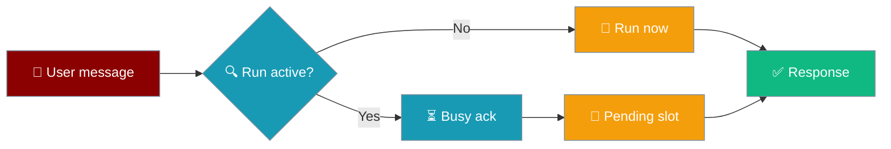
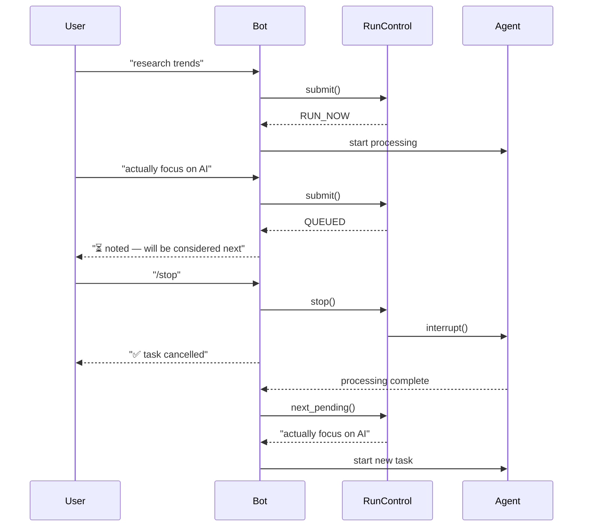
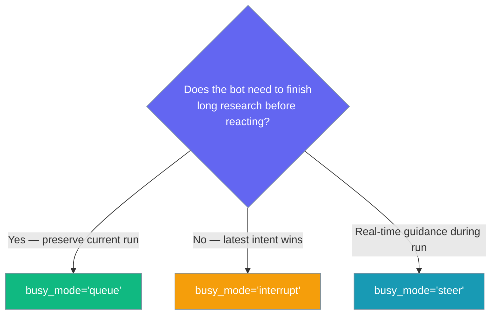

Bot run control provides responsive feedback during long-running agent tasks, eliminating silent blocking where follow-up messages queue invisibly.



## Quick Start

<Steps>
<Step title="Enable Run Control">
```python
from praisonaiagents import Agent
from praisonai.bots import TelegramBot

agent = Agent(name="assistant", instructions="Be helpful")
bot = TelegramBot(token="YOUR_TOKEN", agent=agent, busy_mode="interrupt")

import asyncio
asyncio.run(bot.start())
```
</Step>

<Step title="Test with Long Task">
Send a long-running request like "research solar energy trends" to your bot, then immediately send another message. You'll get instant feedback instead of silence.
</Step>

<Step title="Try /stop Command">
While the bot is working, send `/stop` to cancel the current task. The bot responds immediately and starts fresh.
</Step>
</Steps>

---

## How It Works



When `run_timeout` is exceeded (default 300 seconds), `BotSessionManager` raises `BotRunTimeout` and cancels the in-flight run. Timeout failures are **not** pushed to the DLQ, so slow agents do not retry in a loop.

---

## Choosing a Busy Mode



| Mode | When to Use | Behavior |
|------|-------------|----------|
| `queue` | Research bots, task completion important | Messages queued, processed in order after current task |
| `interrupt` | Interactive chat, latest intent matters | Cancels current task, starts new one immediately |
| `steer` | Real-time collaboration (experimental) | Injects messages into running task (fallback to queue) |

---

## Configuration Options

Configure run control through `BotConfig` or directly with bot constructors:

```python
from praisonaiagents import Agent
from praisonai.bots import TelegramBot

# Via bot constructor
bot = TelegramBot(
    token="YOUR_TOKEN",
    agent=agent,
    busy_mode="queue",
    busy_ack="🕒 Got it — {action}. I'll handle it after this finishes."
)
```

| Option | Type | Default | Description |
|--------|------|---------|-------------|
| `busy_mode` | `str` | `"queue"` | Policy for mid-run messages. One of `"queue"`, `"interrupt"`, `"steer"`. |
| `busy_ack` | `str` | `"⏳ {action} — will be considered next"` | Template for busy acknowledgment. `{action}` is replaced with `"noted"` (queued) or `"added to pending request"` (merged). |
| `run_timeout` | `float` | `300.0` | Maximum seconds a single agent run may take before it is cancelled with `BotRunTimeout`. Set to `0` or a negative value to disable. Applies to both streaming (`agent.astart`) and non-streaming (`agent.chat`) paths. |

### Programmatic cancellation

`BotSessionManager` exposes cancellation for admin hooks or custom integrations:

```python
from praisonaiagents import Agent
from praisonai.bots import TelegramBot

agent = Agent(name="assistant", instructions="Be helpful")
bot = TelegramBot(token="YOUR_TOKEN", agent=agent)

# Cancel a specific user's in-flight run (e.g. from an admin endpoint)
bot._session.cancel_run(user_id="123456789", reason="admin_kill")

# See who has a run in progress right now
print(bot._session.get_active_runs())
```

| Method | Returns | Description |
|--------|---------|-------------|
| `cancel_run(user_id, reason="user_cancel")` | `bool` | `True` if an active run existed and was signalled |
| `get_active_runs()` | `list[str]` | Storage keys with runs currently in progress |

<Card title="BotConfig API Reference" icon="code" href="/docs/sdk/reference/typescript/classes/BotConfig">
  Full configuration options for bot settings
</Card>

---

## Common Patterns

### Long Research Bot (Queue Mode)
```python
from praisonaiagents import Agent
from praisonai.bots import TelegramBot

agent = Agent(
    name="researcher", 
    instructions="Research topics deeply and provide comprehensive analysis"
)

bot = TelegramBot(
    token="YOUR_TOKEN",
    agent=agent,
    busy_mode="queue",  # Preserves work, processes follow-ups in order
    busy_ack="📚 Research noted — {action}. Will incorporate after analysis."
)

import asyncio
asyncio.run(bot.start())
```

### Interactive Chat Bot (Interrupt Mode)
```python
from praisonaiagents import Agent
from praisonai.bots import TelegramBot

agent = Agent(name="assistant", instructions="Be helpful and responsive")

bot = TelegramBot(
    token="YOUR_TOKEN",
    agent=agent,
    busy_mode="interrupt",  # Latest message wins
    busy_ack="⚡ {action} — switching to your latest request"
)

import asyncio
asyncio.run(bot.start())
```

### Using /stop Mid-Task
When a bot is processing a long request:

```
User: research quantum computing applications
Bot:  (working...)
User: /stop
Bot:  ✅ Current task cancelled. Send a new message to start fresh.
User: what's the weather?
Bot:  (starts new task immediately)
```

---

## Best Practices

<AccordionGroup>
<Accordion title="When to Use Queue vs Interrupt vs Steer">
Use **queue mode** for bots that do important work users shouldn't lose — research bots, analysis tools, content generators. Users get acknowledgments but work continues.

Use **interrupt mode** for conversational bots where the latest message reflects user intent — chat assistants, Q&A bots, real-time helpers.

Use **steer mode** (experimental) for collaborative scenarios where users provide guidance during long tasks. Currently falls back to queue mode.
</Accordion>

<Accordion title="How /stop Finds the Right Cancel Path">
`/stop` works on stock bots without setting `busy_mode`. The handler tries `SessionRunControl.stop()` first when run control is enabled, then falls back to `BotSessionManager.cancel_run()` on the default session manager. Enable run control (`busy_mode`) when you also want mid-run pending-message handling — not as a prerequisite for `/stop`.
</Accordion>

<Accordion title="Race Protection via run_generation">
Each run gets a unique generation number. When a run finishes, it only clears the session state if its generation matches the current one. This prevents cancelled runs from overwriting fresh state when they complete.
</Accordion>

<Accordion title="Cleaning Up Stale Sessions">
Use `SessionRunControl.cleanup_stale_sessions(max_age_seconds=3600)` to clean up old sessions. This prevents memory leaks in long-running bots and removes abandoned user sessions.
</Accordion>

<Accordion title="Custom integrators: use agent.interrupt_controller">
If you embed `BotSessionManager.chat_with_run_control()` in a custom bot, attach interrupt controllers to **`agent.interrupt_controller`** (the public attribute on `Agent`). An earlier underscore-prefixed name was unreliable and made `/stop` a no-op for custom integrations. The built-in bots (`TelegramBot`, etc.) handle this attachment automatically.
</Accordion>
</AccordionGroup>

---

## Related

<CardGroup cols={2}>
  <Card title="Bot Commands" icon="terminal" href="/docs/features/bot-commands">
    Built-in chat commands including /stop
  </Card>
  <Card title="Messaging Bots" icon="message-circle" href="/docs/features/messaging-bots">
    Complete guide to Telegram, Discord, Slack bots
  </Card>
</CardGroup>