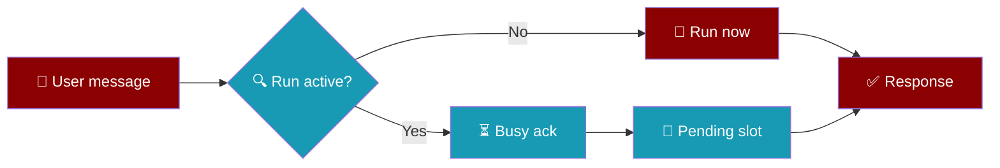
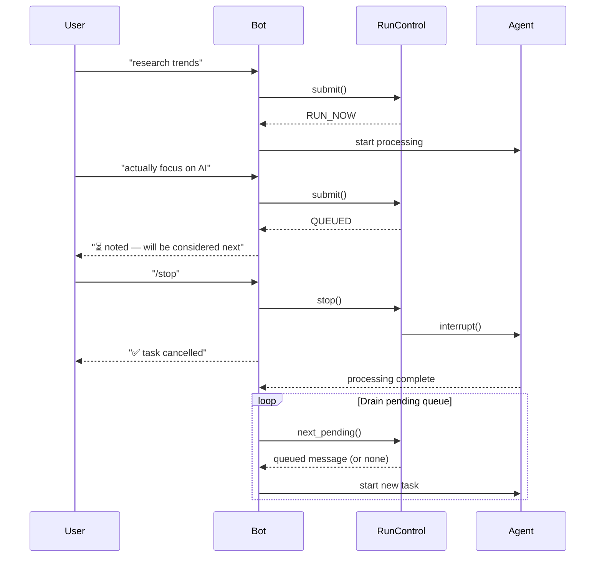
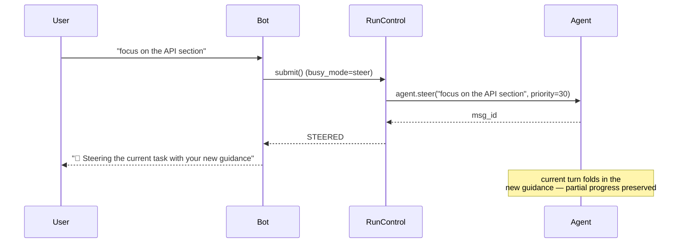
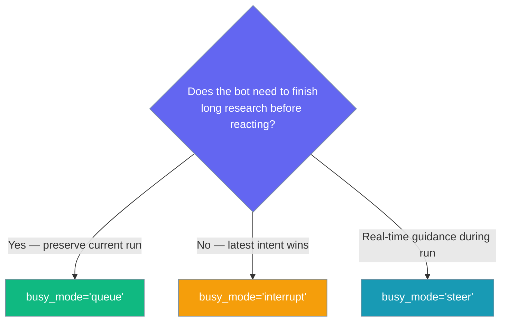
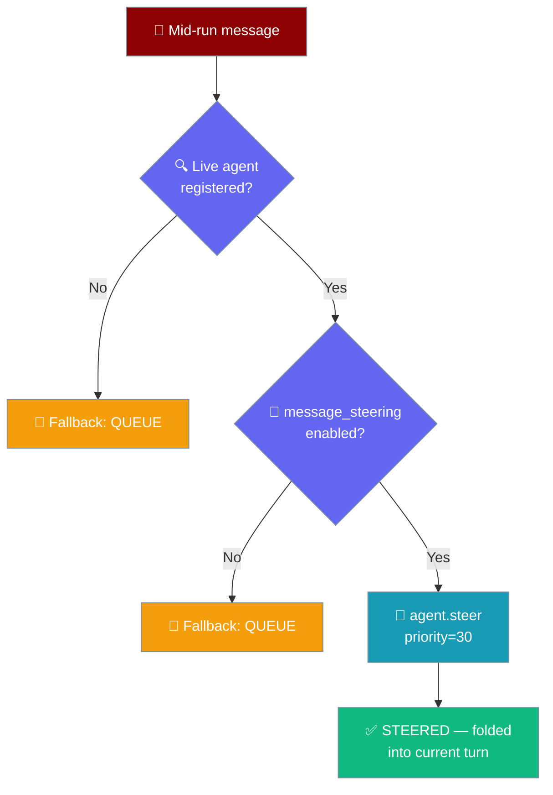

<Note>
Bot platform adapters now ship in the `praisonai-bot` package. `praisonai bot serve` still works exactly as documented here; for a standalone install see [praisonai-bot Migration](/docs/guides/praisonai-bot-migration).
</Note>


Bot run control provides responsive feedback during long-running agent tasks, eliminating silent blocking where follow-up messages queue invisibly.

```python
from praisonaiagents import Agent

agent = Agent(name="assistant", instructions="You are a helpful assistant.")
agent.start("Research solar energy trends while the user sends follow-ups.")
```

The user sends a message while a long run is active; the bot acknowledges busy state, queues follow-ups, or honours `/stop`.



## Quick Start

<Steps>
<Step title="Enable Run Control">
```python
from praisonaiagents import Agent
from praisonai.bots import TelegramBot

agent = Agent(name="assistant", instructions="Be helpful")
bot = TelegramBot(token="YOUR_TOKEN", agent=agent, busy_mode="interrupt")

import asyncio
asyncio.run(bot.start())
```
</Step>

<Step title="Test with Long Task">
Send a long-running request like "research solar energy trends" to your bot, then immediately send another message. You'll get instant feedback instead of silence.
</Step>

<Step title="Try /stop Command">
While the bot is working, send `/stop` to cancel the current task. The bot responds immediately and starts fresh.
</Step>
</Steps>

---

## How It Works

<Note>
Fixed in [PR #1980](https://github.com/MervinPraison/PraisonAI/pull/1980) (release after 2026-06-19): earlier releases wired the interrupt controller to the wrong attribute, so `/stop` and `busy_mode="interrupt"` silently had no effect. Queued follow-ups were surfaced in metadata but never drained — upgrade to pick up the fix.
</Note>

<Note>
STEER mode is fully wired as of [PR #2244](https://github.com/MervinPraison/PraisonAI/pull/2244) (release after 2026-06-24). Earlier releases declared `busy_mode="steer"` but silently fell back to queue mode. Upgrade to use real mid-run steering.
</Note>

<Note>
Extended in [PR #2751](https://github.com/MervinPraison/PraisonAI/pull/2751) (release after 2026-07-07): `/stop` now aborts runs on non-OpenAI providers too (Anthropic, Gemini, Groq, local models via litellm). Previously the interrupt controller only reached the OpenAI completion path in `chat_mixin` — the `llm/llm.py` tool loop used for every other provider took no cancel token, so `/stop` on a Telegram/Discord bot backed by e.g. Claude would silently continue to completion. Upgrade to pick up uniform cancellation.
</Note>

<Note>
Extended in [PR #2997](https://github.com/MervinPraison/PraisonAI/pull/2997) (release after 2026-07-14): `/stop` is now re-checked **immediately before dispatching tool calls** in every tool-loop iteration (both LiteLLM and OpenAI-native, sync and async). Previously the cancel token was only checked at the top of each iteration, so a `/stop` arriving between the model returning tool calls and the tools starting could still run the tools once before honouring the cancel.
</Note>



**STEER lane** — when `busy_mode="steer"` and the agent has `message_steering=True`:



When `run_timeout` is exceeded (default 300 seconds), `BotSessionManager` raises `BotRunTimeout` and cancels the in-flight run. Timeout failures are **not** pushed to the DLQ, so slow agents do not retry in a loop.

---

## Choosing a Busy Mode



| Mode | When to Use | Behavior |
|------|-------------|----------|
| `queue` | Research bots, task completion important | Messages queued, processed in order after current task |
| `interrupt` | Interactive chat, latest intent matters | Cancels current task, starts new one immediately |
| `steer` | Real-time guidance while the agent is mid-task | Injects the new message into the running turn via `agent.steer()`; falls back to `queue` only if the agent has `message_steering` disabled. As of PR #2997 the steer lands on the next tool-loop iteration too — long multi-tool runs no longer have to wait for the run to return to a boundary before picking up new guidance. |

---

## How STEER Mode Works



- Enable steering on the agent with `message_steering=True`.
- Set the bot's `busy_mode="steer"`.
- Mid-run messages are injected into the live turn at `SteeringPriority.INTERRUPT` (priority `30`); the agent picks them up before its next tool-loop step.

Custom integrators embedding `chat_with_run_control()` must call `register_agent(...)` on **every** fresh and pending run inside the drain loop — not only the first run — so STEER always has a live agent handle.

---

## Configuration Options

Configure run control through `BotConfig` or directly with bot constructors:

```python
from praisonaiagents import Agent
from praisonai.bots import TelegramBot

# Via bot constructor
bot = TelegramBot(
    token="YOUR_TOKEN",
    agent=agent,
    busy_mode="queue",
    busy_ack="🕒 Got it — {action}. I'll handle it after this finishes."
)
```

| Option | Type | Default | Description |
|--------|------|---------|-------------|
| `busy_mode` | `str` | `"queue"` | Policy for mid-run messages. One of `"queue"`, `"interrupt"`, `"steer"`. |
| `busy_ack` | `str` | `"⏳ {action} — will be considered next"` | Template for busy acknowledgment. `{action}` is replaced with `"noted"` (queued) or `"added to pending request"` (merged). |
| `run_timeout` | `float` | `300.0` | Maximum seconds a single agent run may take before it is cancelled with `BotRunTimeout`. Set to `0` or a negative value to disable. Applies to both streaming (`agent.astart`) and non-streaming (`agent.chat`) paths. |

### `RunDecision` enum

`submit()` returns a `RunDecision` value that tells the bot how to handle the message:

| Value | When returned | Meaning |
|-------|---------------|---------|
| `RUN_NOW` | No active run | Start the agent immediately |
| `QUEUED` | Active run, `busy_mode="queue"` | Message parked in pending slot |
| `MERGED` | Active run, pending slot already occupied | Message merged into existing pending |
| `INTERRUPTED` | Active run, `busy_mode="interrupt"` | Current run cancelled, start new one |
| `STEERED` | Active run, `busy_mode="steer"`, steering enabled | Message injected into running turn |

### Run metadata

`chat_with_run_control` returns `{"response": str, "metadata": dict}`:

| Field | Type | Description |
|-------|------|-------------|
| `run_control` | `bool` | Always `True` when run control was active. |
| `decision` | `str` | Initial decision: `"RUN_NOW"`, `"QUEUED"`, `"INTERRUPTED"`, or `"STEERED"`. |
| `completed` | `bool` | `True` after the run and drain loop finish cleanly. |
| `run_generation` | `int` | Generation counter for race protection. |
| `pending_processed` | `list[str]` | Queued follow-ups drained after the initial run (each truncated to 100 chars). Present only when at least one was processed. |
| `interrupted` | `bool` | `True` if the run was cancelled mid-way. |
| `steered` | `bool` | `True` if the mid-run message was injected into the live agent's steering queue (only set when `decision == "STEERED"`). |
| `reason` | `str` | Cancellation reason (when `interrupted` is `True`). |

**Acknowledgment messages:**

| Decision | Default ack |
|----------|-------------|
| `INTERRUPTED` | `"⚠️ Previous task cancelled, starting your new request"` |
| `STEERED` | `"🧭 Steering the current task with your new guidance"` |

Queue drain implemented in [PR #1980](https://github.com/MervinPraison/PraisonAI/pull/1980).

### Programmatic steering

Inject real-time guidance into a running agent from outside the bot chat — useful for admin hooks, orchestrators, or test harnesses:

```python
agent.steer("Stop summarising — return raw JSON instead", priority=30)
```

`agent.steer(text, priority=30)` queues `text` into the agent's steering queue at priority `30` (`SteeringPriority.INTERRUPT` — highest available). The agent picks it up before its next tool-loop step without cancelling the current run.

| Aspect | Detail |
|--------|--------|
| Requires | Agent created with `message_steering=True` |
| Priority values | `1`=low, `5`=normal, `10`=high, `20`=urgent, `30`=interrupt |
| Return value | Message ID string (`""` if steering is disabled) |
| Fallback | If the agent does not have steering enabled, the call returns `""` silently |

**`register_agent` / `finish_run` / `stop` lifecycle:**

| Method | When to call |
|--------|-------------|
| `register_agent(user_id, agent)` | After `submit()` returns `RUN_NOW` or when starting a pending/drain run — gives STEER mode a live agent handle |
| `finish_run(user_id, run_generation)` | After the agent turn completes — clears the running state; uses generation counter for race protection |
| `stop(user_id)` | Admin or `/stop` command — cancels the run and clears state immediately |

**Fallback path:** If `submit()` is called with `busy_mode="steer"` but no agent is registered (`session.agent is None`) or the agent has `message_steering` disabled, `submit()` falls back to `QUEUE` silently — no error is raised.

### Programmatic cancellation

`BotSessionManager` exposes cancellation for admin hooks or custom integrations:

```python
from praisonaiagents import Agent
from praisonai.bots import TelegramBot

agent = Agent(name="assistant", instructions="Be helpful")
bot = TelegramBot(token="YOUR_TOKEN", agent=agent)

# Cancel a specific user's in-flight run (e.g. from an admin endpoint)
bot._session.cancel_run(user_id="123456789", reason="admin_kill")

# See who has a run in progress right now
print(bot._session.get_active_runs())
```

| Method | Returns | Description |
|--------|---------|-------------|
| `cancel_run(user_id, reason="user_cancel")` | `bool` | `True` if an active run existed and was signalled |
| `get_active_runs()` | `list[str]` | Storage keys with runs currently in progress |

<Card title="BotConfig API Reference" icon="code" href="/docs/sdk/reference/typescript/classes/BotConfig">
  Full configuration options for bot settings
</Card>

---

## Common Patterns

### Long Research Bot (Queue Mode)
```python
from praisonaiagents import Agent
from praisonai.bots import TelegramBot

agent = Agent(
    name="researcher", 
    instructions="Research topics deeply and provide comprehensive analysis"
)

bot = TelegramBot(
    token="YOUR_TOKEN",
    agent=agent,
    busy_mode="queue",  # Preserves work — all follow-ups drained in order after each run
    busy_ack="📚 Research noted — {action}. Will incorporate after analysis."
)

import asyncio
asyncio.run(bot.start())
```

### Interactive Chat Bot (Interrupt Mode)
```python
from praisonaiagents import Agent
from praisonai.bots import TelegramBot

agent = Agent(name="assistant", instructions="Be helpful and responsive")

bot = TelegramBot(
    token="YOUR_TOKEN",
    agent=agent,
    busy_mode="interrupt",  # Latest message wins
    busy_ack="⚡ {action} — switching to your latest request"
)

import asyncio
asyncio.run(bot.start())
```

### Real-Time Steering Bot (Steer Mode)
```python
from praisonaiagents import Agent
from praisonai.bots import TelegramBot

agent = Agent(
    name="researcher",
    instructions="Research topics deeply and write structured reports.",
    message_steering=True,  # Required for busy_mode="steer" to actually steer
)

bot = TelegramBot(
    token="YOUR_TOKEN",
    agent=agent,
    busy_mode="steer",
    busy_ack="🧭 Steering the current task with your new guidance",
)

import asyncio
asyncio.run(bot.start())
```

Example user flow:

```
User: research solar trends and write a 500-word summary
Bot:  (working — gathering sources…)
User: actually, focus on the EU market only
Bot:  🧭 Steering the current task with your new guidance
Bot:  ✅ EU Solar Market Trends Summary [...] (partial progress preserved)
```

### Using /stop Mid-Task
When a bot is processing a long request:

```
User: research quantum computing applications
Bot:  (working...)
User: /stop
Bot:  ✅ Current task cancelled. Send a new message to start fresh.
User: what's the weather?
Bot:  (starts new task immediately)
```

---

## Best Practices

<AccordionGroup>
<Accordion title="When to Use Queue vs Interrupt vs Steer">
Use **queue mode** for bots that do important work users shouldn't lose — research bots, analysis tools, content generators. Users get acknowledgments but work continues.

Use **interrupt mode** for conversational bots where the latest message reflects user intent — chat assistants, Q&A bots, real-time helpers.

Use **steer mode** when you want users to nudge the agent mid-task ("focus on the API section instead", "also include market size") without losing the partial progress already made. The agent must be created with `message_steering=True`; otherwise STEER safely falls back to queue.
</Accordion>

<Accordion title="How /stop Finds the Right Cancel Path">
`/stop` works on stock bots without setting `busy_mode`. The handler tries `SessionRunControl.stop()` first when run control is enabled, then falls back to `BotSessionManager.cancel_run()` on the default session manager. Enable run control (`busy_mode`) when you also want mid-run pending-message handling — not as a prerequisite for `/stop`.
</Accordion>

<Accordion title="Race Protection via run_generation">
Each run gets a unique generation number. When a run finishes, it only clears the session state if its generation matches the current one. This prevents cancelled runs from overwriting fresh state when they complete.
</Accordion>

<Accordion title="Cleaning Up Stale Sessions">
Use `SessionRunControl.cleanup_stale_sessions(max_age_seconds=3600)` to clean up old sessions. This prevents memory leaks in long-running bots and removes abandoned user sessions.
</Accordion>

<Accordion title="Custom integrators: use agent.interrupt_controller">
If you embed `BotSessionManager.chat_with_run_control()` in a custom bot, attach interrupt controllers to **`agent.interrupt_controller`** (the public attribute on `Agent`). An earlier underscore-prefixed name was unreliable and made `/stop` a no-op for custom integrations. The built-in bots (`TelegramBot`, etc.) handle this attachment automatically.
</Accordion>
</AccordionGroup>

---

## Related

<CardGroup cols={2}>
  <Card title="Bot Commands" icon="terminal" href="/docs/features/bot-commands">
    Built-in chat commands including /stop and /queue — /queue pairs naturally with busy_mode for parking follow-ups while a task runs
  </Card>
  <Card title="Messaging Bots" icon="message-circle" href="/docs/features/messaging-bots">
    Complete guide to Telegram, Discord, Slack bots
  </Card>
  <Card title="Message Steering" icon="compass" href="/docs/features/message-steering">
    Enable `message_steering=True` on the agent so STEER mode can inject mid-run guidance
  </Card>
</CardGroup>