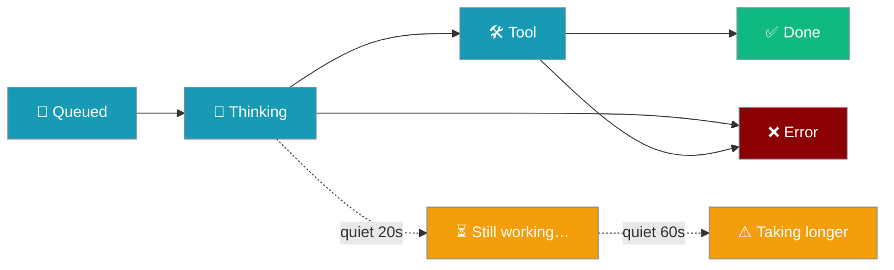
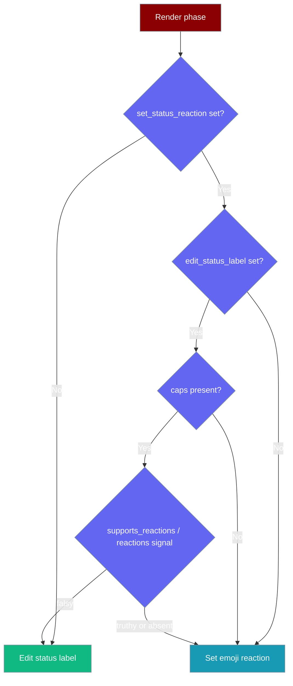
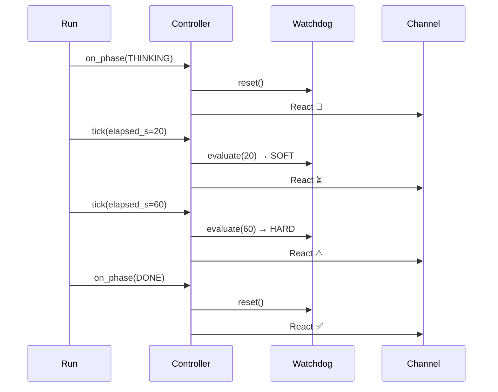
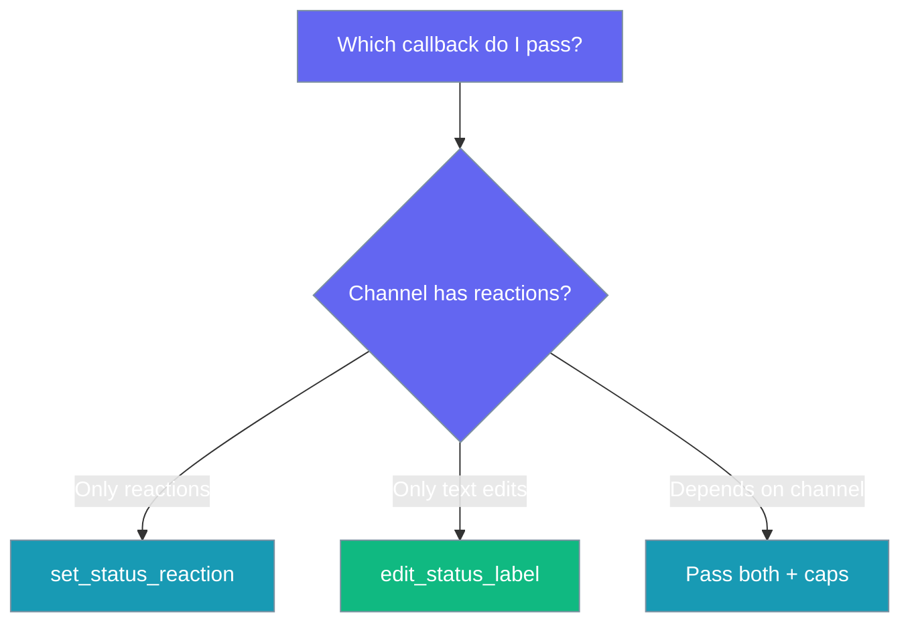
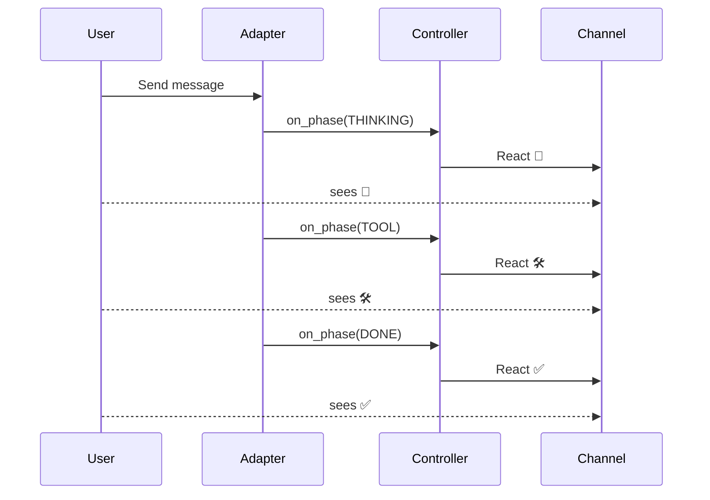

Drive an in-chat status through a run's lifecycle — from your own bot, channel adapter, or gateway — with a single transport-agnostic controller.

```python
from praisonaiagents import Agent
from praisonaiagents.bots import RunStatusController, RunPhase

agent = Agent(name="assistant", instructions="Helpful assistant")

async def send_reaction(emoji: str) -> None:
    await my_channel.set_reaction(message_id, emoji)   # your transport

controller = RunStatusController(
    set_status_reaction=send_reaction,
    enabled=True,
)

await controller.on_phase(RunPhase.THINKING)
response = await agent.astart("Hello!")
await controller.on_phase(RunPhase.DONE)
```



## Quick Start

<Steps>
<Step title="Reactions only">

```python
from praisonaiagents.bots import RunStatusController, RunPhase

async def send_reaction(emoji: str) -> None:
    await my_channel.set_reaction(message_id, emoji)

controller = RunStatusController(
    set_status_reaction=send_reaction,
    enabled=True,
)

await controller.on_phase(RunPhase.QUEUED)
await controller.on_phase(RunPhase.THINKING)
await controller.on_phase(RunPhase.DONE)
```

</Step>

<Step title="Reactions + label fallback + custom thresholds">

```python
from praisonaiagents.bots import RunStatusController, RunPhase

async def send_reaction(emoji: str) -> None:
    await my_channel.set_reaction(message_id, emoji)

async def edit_label(label: str) -> None:
    await my_channel.edit_message(status_message_id, label)

controller = RunStatusController(
    caps=my_channel.capabilities,
    set_status_reaction=send_reaction,
    edit_status_label=edit_label,
    stall_soft_s=15.0,
    stall_hard_s=45.0,
    enabled=True,
)

await controller.on_phase(RunPhase.THINKING)
await controller.tick(elapsed_s=15.0)   # ⏳ still working…
await controller.on_phase(RunPhase.DONE)
```

</Step>
</Steps>

---

## How It Works

The controller renders through a reaction OR a label, chosen from platform capabilities plus which callbacks you injected.



`on_phase(...)` reports progress and resets the watchdog; `tick(elapsed_s)` flushes debounced phases and arms the stall signal.



Phases and stall states map to fixed emoji and labels.

| Phase | Emoji | Label | `is_terminal` |
|---|---|---|---|
| `RunPhase.QUEUED` | 👀 | `queued` | `False` |
| `RunPhase.THINKING` | 🧠 | `thinking…` | `False` |
| `RunPhase.TOOL` | 🛠️ | `using a tool…` | `False` |
| `RunPhase.DONE` | ✅ | `done` | `True` |
| `RunPhase.ERROR` | ❌ | `error` | `True` |

| Stall state | Emoji | Label |
|---|---|---|
| `StallState.OK` | — | — |
| `StallState.SOFT` | ⏳ | `still working…` |
| `StallState.HARD` | ⚠️ | `this is taking longer than expected` |

Intermediate phases debounce by `debounce_ms` (default `700`); the latest pending phase wins and flushes on the next `tick`. Terminal phases (`DONE`/`ERROR`) render immediately and clear any pending phase or stall signal.

---

## StallWatchdog standalone

`StallWatchdog` maps elapsed-since-progress seconds to a `StallState` and needs no controller.

```python
from praisonaiagents.bots import StallWatchdog, StallState

watchdog = StallWatchdog(soft_s=20.0, hard_s=60.0)

watchdog.evaluate(5.0)    # StallState.OK
watchdog.evaluate(25.0)   # StallState.SOFT
watchdog.evaluate(70.0)   # StallState.HARD
watchdog.state            # StallState.HARD
watchdog.reset()          # back to StallState.OK
```

<Warning>
If `hard_s < soft_s`, `hard_s` is clamped up to `soft_s` and a warning is logged — `SOFT` becomes unreachable. Keep `hard_s >= soft_s`.
</Warning>

---

## Configuration Options

Every option comes straight from `RunStatusController.__init__`.

| Option | Type | Default | Description |
|---|---|---|---|
| `caps` | `Optional[PlatformCapabilities]` | `None` | Platform capabilities used to gate reaction vs label rendering |
| `set_status_reaction` | `Optional[Callable[[str], Awaitable[None]]]` | `None` | Async callback that sets the single status reaction |
| `edit_status_label` | `Optional[Callable[[str], Awaitable[None]]]` | `None` | Async callback that edits a single status line/label |
| `debounce_ms` | `int` | `700` | Minimum spacing between intermediate renders; terminal phases always render immediately |
| `stall_soft_s` | `float` | `20.0` | Seconds without progress before the soft stall signal |
| `stall_hard_s` | `float` | `60.0` | Seconds without progress before the hard stall signal |
| `enabled` | `bool` | `False` | Master switch — off by default; adapters opt in |
| `now` | `Optional[Callable[[], float]]` | `time.monotonic` | Monotonic clock callable (injectable for tests) |

The controller is `enabled` only when `enabled=True` **and** at least one of `set_status_reaction` / `edit_status_label` is present.

| `enabled=` | Has a callback? | `controller.enabled` |
|---|---|---|
| `True` | Yes | `True` |
| `True` | No | `False` |
| `False` | Yes | `False` |
| `False` | No | `False` |

Pick reaction vs label rendering per this decision flow.



`RunStatusController` also exposes `phase` (last phase passed to `on_phase`, possibly un-rendered) and `watchdog` (the underlying `StallWatchdog`, so you can `reset()` it on external progress signals).

---

## User interaction flow

A user sends a message and watches one emoji move through the run without reading any reply text.



---

## Best Practices

<AccordionGroup>
<Accordion title="Keep thresholds above your slowest legit tool">
If a real tool call takes 40s (web scraping, image generation), set `stall_soft_s` to 45–60s so users don't see ⏳ while everything is healthy.
</Accordion>

<Accordion title="Let on_phase reset the watchdog for you">
Any phase change is treated as progress and resets the stall watchdog automatically — you rarely need to call `watchdog.reset()` yourself.
</Accordion>

<Accordion title="Inject now= in tests">
Pass `now=` a controllable monotonic clock to test debounce and stall behavior deterministically without real sleeps.
</Accordion>

<Accordion title="Provide BOTH callbacks">
Supply `set_status_reaction` and `edit_status_label` so channels without reactions degrade to a label automatically, driven by `caps`.
</Accordion>
</AccordionGroup>

---

## Related

<CardGroup cols={2}>
<Card title="Bot Status Reactions" icon="face-smile" href="/docs/features/bot-status-reactions">
  The one-flag `TelegramBot(status_reactions=True)` opt-in
</Card>
<Card title="Bot Platform Adapter" icon="plug" href="/docs/features/bot-platform-adapter">
  Build a custom channel adapter that wires this controller
</Card>
</CardGroup>
