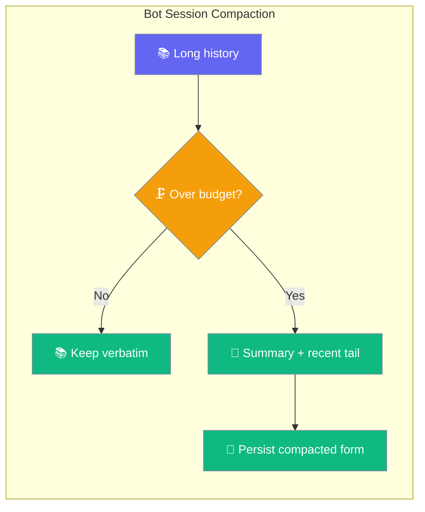
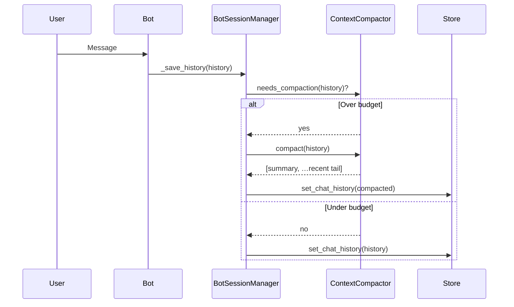
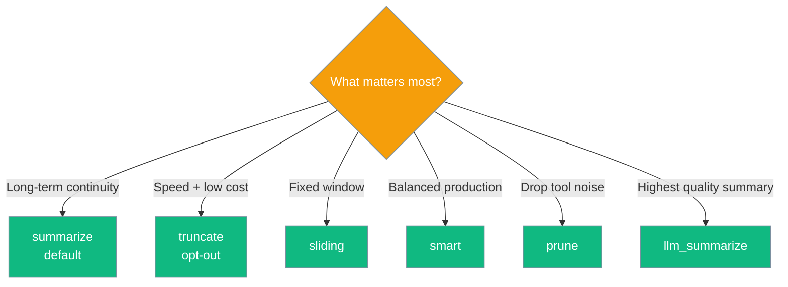

<Note>
Bot platform adapters now ship in the `praisonai-bot` package. `praisonai bot serve` still works exactly as documented here; for a standalone install see [praisonai-bot Migration](/docs/guides/praisonai-bot-migration).
</Note>


Long-lived bot conversations get a compact summary of older turns instead of having them silently dropped.

```python
from praisonaiagents import Agent

agent = Agent(name="assistant", instructions="Maintain context across a long Telegram thread.")
agent.start("Summarise what we discussed last week.")
```

The user continues a long-lived bot thread; older turns are summarised instead of being dropped silently.



## Quick Start

<Steps>

<Step title="Enable with one line">

```yaml
channels:
  telegram:
    token: ${TELEGRAM_BOT_TOKEN}
    session:
      compaction:
        enabled: true
```

</Step>

<Step title="Tune the budget">

```yaml
channels:
  telegram:
    token: ${TELEGRAM_BOT_TOKEN}
    session:
      max_history: 500           # hard cap
      compaction:
        enabled: true
        strategy: summarize       # or truncate / sliding / smart / prune / llm_summarize
        max_messages: 100         # approximate compaction threshold
        keep_recent: 10           # keep the last 10 turns verbatim
```

</Step>

</Steps>

---

## Agent-Centric Example

```python
from praisonaiagents import Agent
from praisonai.bots import TelegramBot

bot = TelegramBot(
    token="YOUR_BOT_TOKEN",
    agent=Agent(name="Assistant", instructions="Help users."),
    session={
        "compaction": {
            "enabled": True,
            "strategy": "summarize",
            "max_messages": 100,
            "keep_recent": 10,
        }
    },
)
bot.run()
```

---

## How It Works



Compaction runs at save time. When history exceeds the budget, the manager summarises older turns into a single system message, appends the most-recent verbatim tail, and persists the compacted form. Bot restarts preserve the same memory.

<Note>
The manager builds a fresh `ContextCompactor` per save call rather than sharing one instance. This prevents per-conversation summary state from leaking between users under concurrent saves.
</Note>

---

## Choosing a Strategy



| Strategy | Use when |
|----------|----------|
| `summarize` (default) | Long-running support bots / personal assistants. |
| `truncate` | Explicit opt-out — same behaviour as no compaction config. |
| `sliding` | Fixed-window conversations (e.g. customer chat queues). |
| `smart` | Production default when you want a balanced trade-off. |
| `prune` | Tool-heavy agents that produce noisy intermediate messages. |
| `llm_summarize` | Highest fidelity summary; uses an extra LLM call. |

---

## Configuration Options

| Option | Type | Default | Description |
|--------|------|---------|-------------|
| `enabled` | `bool` | `false` | Master switch. When `false` the legacy tail-slice truncation runs. |
| `strategy` | `str` | `"summarize"` | One of `truncate`, `sliding`, `summarize`, `smart`, `prune`, `llm_summarize`. Invalid values raise at schema-validation time. |
| `max_messages` | `int` | `100` | Approximate compaction threshold. Converted to a token budget (`max_messages × 80`) when `max_tokens` is not set. Must be ≥ 1. |
| `max_tokens` | `int` | `null` | Optional explicit token budget. Overrides `max_messages` when set. |
| `keep_recent` | `int` | `10` | Number of most-recent messages kept verbatim (tail). Must be ≥ 0. |

Configure under `session.compaction` inside any channel block in `gateway.yaml` or `bot.yaml`.

---

## User Interaction Flow

> *A 3-week-old Telegram support bot conversation. Messages 1–400 covered the customer's account setup, billing decisions, and ongoing tickets. Message #500 arrives. **Without compaction:** the bot loads the most recent 100 messages and has no memory of the original setup — the customer has to re-explain everything. **With compaction:** the bot loads a one-line summary of decisions/facts from messages 1–490 followed by the last 10 verbatim turns. The agent answers the new question with full historical context. The compacted form is also persisted, so a bot restart preserves the memory.*

---

## Best Practices

<AccordionGroup>

<Accordion title="Pair with session.reset and max_history">
Reset clears context on idle or daily schedule. Compaction keeps context across long sessions. `max_history × 4` is the hard cap in compaction mode — history cannot grow past that ceiling even if the token threshold has not tripped yet. Use all three together for production bots.
</Accordion>

<Accordion title="Start with defaults">
`enabled: true` alone is enough for most bots. The defaults (`strategy: summarize`, `max_messages: 100`, `keep_recent: 10`) work well out of the box.
</Accordion>

<Accordion title="Raise keep_recent for handoff flows">
When the most recent turns carry the context that matters — a multi-step purchase flow or live escalation — increase `keep_recent` so more verbatim turns survive the compaction cycle.
</Accordion>

<Accordion title="No cross-user leakage">
The manager builds a fresh compactor per save call, so per-conversation summary state never leaks between users sharing the same bot instance. This is safe for concurrent, high-traffic bots.
</Accordion>

</AccordionGroup>

---

## Related

<CardGroup cols={2}>
  <Card title="Bot Session Reset" icon="rotate" href="/docs/features/bot-session-reset">
    Clear history on idle or daily schedule
  </Card>
  <Card title="Session Persistence" icon="database" href="/docs/features/session-persistence">
    How bot sessions are stored and restored
  </Card>
  <Card title="Messaging Bots" icon="robot" href="/docs/features/messaging-bots">
    Multi-platform bot setup and YAML config
  </Card>
  <Card title="Context Compaction" icon="compress" href="/docs/features/context-compaction">
    Agent-level context compaction (core ContextCompactor API)
  </Card>
</CardGroup>
