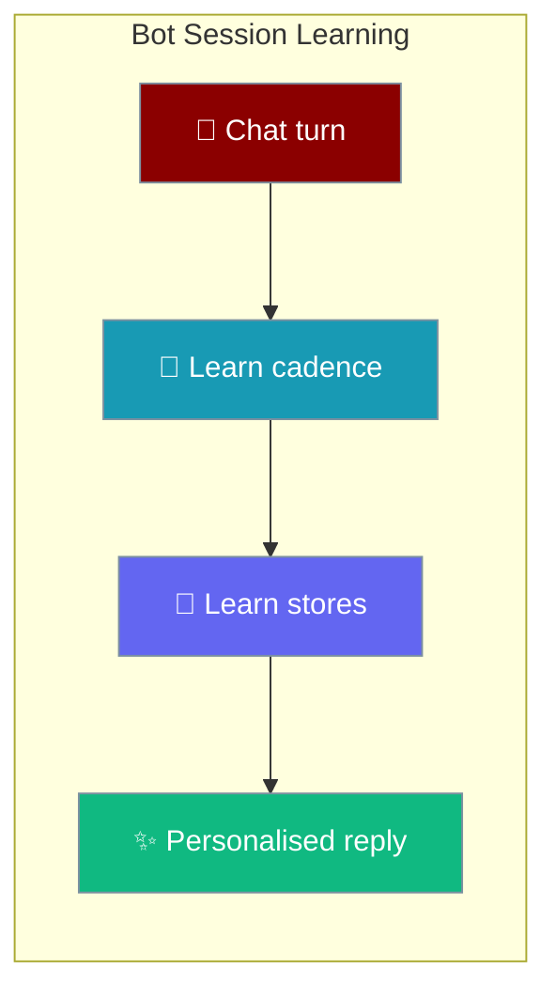
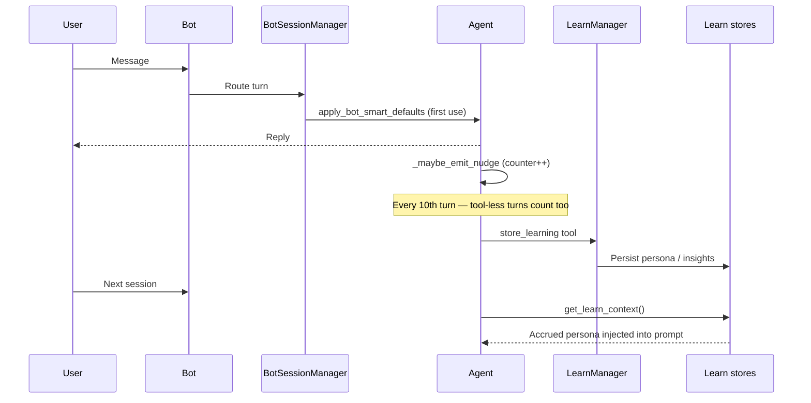
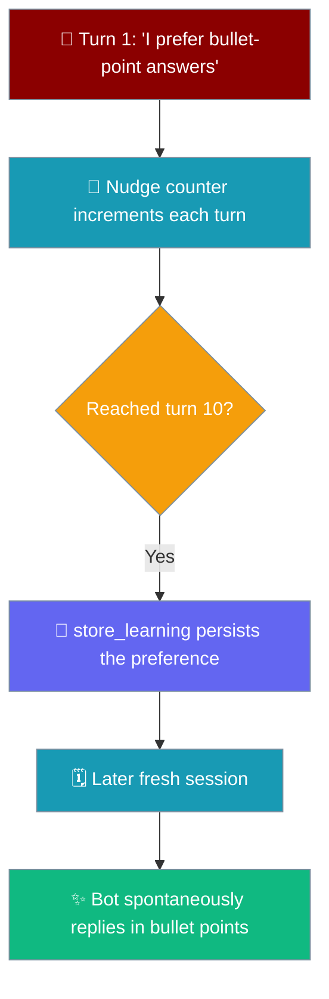

Any bot or gateway session — Telegram, WhatsApp, Slack, or a custom transport — remembers who each user is across sessions by default, capturing preferences, style, and durable facts from plain conversation, not just from tool-using turns.



## Quick Start

<Steps>
<Step title="Zero-config bot">

A bot agent learns from plain chat with no learn wiring — the gateway/bot layer turns on the coordinated posture for you.

```python
from praisonai_bot.bots import TelegramBot
from praisonaiagents import Agent

bot = TelegramBot(
    agent=Agent(
        name="Companion",
        instructions="You are a friendly personal assistant.",
    )
)
bot.start()
```

After a few casual messages, inspect what the bot picked up:

```bash
praisonai memory learn show persona
```

</Step>

<Step title="Opt-out (YAML)">

Set `learn: false` on the channel and the bot behaves exactly as before — no learn stores are written.

```yaml
channels:
  telegram:
    token: "${TELEGRAM_TOKEN}"
    learn: false
```

</Step>

<Step title="Explicit tuning">

A pre-configured agent always wins — the bot defaults leave it alone.

```python
from praisonai_bot.bots import TelegramBot
from praisonaiagents import Agent, LearnConfig

bot = TelegramBot(
    agent=Agent(
        name="Companion",
        instructions="You are a friendly personal assistant.",
        learn=LearnConfig(mode="agentic", nudge_interval=5),
    )
)
bot.start()
```

</Step>
</Steps>

---

## Coordinated posture

`learn=True` is one switch that turns on three previously independent mechanisms at once.

| Mechanism | What it does | Value set by `learn=True` |
|-----------|--------------|---------------------------|
| `LearnMode.AGENTIC` | LLM extracts durable facts from the turn | `mode=LearnMode.AGENTIC` |
| Nudge cadence | Fires every N turns to trigger review/persist | `nudge_interval=10` |
| Conversational-turn coverage | Cadence counts tool-less turns too | `nudge_min_tool_iters=0` |
| `auto_memory` | Auto-writes extracted facts into memory | `True` (only when the caller did not set it explicitly) |

You no longer discover and wire three independent knobs — one switch coordinates them.

---

## How It Works

Every user message runs `apply_bot_smart_defaults` once per agent, then the nudge cadence drives persistence in the background.



- Every user message runs `apply_bot_smart_defaults` once per agent (on first use).
- After a response, `_maybe_emit_nudge` increments a per-turn counter; every `nudge_interval` turns (default 10) it emits a system nudge — regardless of whether tools ran, because `nudge_min_tool_iters=0`.
- The nudge drives the auto-injected `store_learning` tool → `LearnManager` → JSON-backed learn stores under the standard learn path.
- Next turn: `get_learn_context()` retrieves the accrued persona/insights and auto-injects them into the system prompt.

---

## User Interaction Flow

The bot picks up a stated preference and applies it in a later, fresh session.



---

## What Triggers the Default-On Posture

| Surface | Default-on? |
|---------|-------------|
| `TelegramBot(agent=…)`, `SlackBot(...)`, `WhatsAppBot(...)`, any bot through `apply_bot_smart_defaults` | ✅ Yes |
| Gateway channels started via `praisonai gateway start` (config forwarded through `config.metadata`) | ✅ Yes |
| Raw `Agent(...)` used outside a bot/gateway | ❌ No — set `learn=True` explicitly |
| Any `Agent` where the developer already set `learn=` (`True`, `False`, or a `LearnConfig`) | ❌ Not overwritten — the developer's choice wins |
| Any bot where the developer passed a live `memory=` instance | ⚠️ Nudge cadence only — the memory backend is never swapped out |

For a user-supplied `memory=` instance, the memory-based `auto_memory` half is skipped so the operator's chosen backend/intent is preserved; the nudge cadence still fires.

---

## Opt-out

Three equivalent ways disable session learning.

<Tabs>
<Tab title="YAML (channel)">

```yaml
channels:
  telegram:
    token: "${TELEGRAM_TOKEN}"
    learn: false          # or: session_learning: false
```

The gateway forwards this via `config.metadata`.

</Tab>
<Tab title="Python (agent)">

```python
from praisonaiagents import Agent

agent = Agent(name="FAQ", instructions="Answer FAQs.", learn=False)
```

`_learn_enabled` is set to `False`, and the bot default never overwrites an explicit opt-out.

</Tab>
<Tab title="Python (config)">

```python
from praisonaiagents.bots.config import BotConfig
from praisonai_bot.bots._defaults import apply_bot_smart_defaults

config = BotConfig()
config.metadata["learn"] = False
apply_bot_smart_defaults(agent, config)
```

</Tab>
</Tabs>

Boolean `false`, or the strings `"false"` / `"0"` / `"no"` / `"off"` / `"disabled"` (case-insensitive) all count as opt-out.

---

## How the Nudge Cadence Changed

`nudge_min_tool_iters` used to be a hard floor; it is now a tunable override.

- **Before:** `nudge_min_tool_iters=3` was a hard floor — a purely conversational bot never nudged.
- **After:** `<= 0` (the new coordinated default) fires on conversational turns; a positive value keeps the "only after N real tool calls" behaviour for task-oriented agents.

```python
from praisonaiagents import Agent, LearnConfig

Agent(learn=True)                                                # cadence fires every turn
Agent(learn=LearnConfig(mode="agentic", nudge_min_tool_iters=3)) # only after tool work
```

---

## Safety Properties Preserved

<AccordionGroup>
<Accordion title="Consent / approval gating unchanged">
Consent and approval gating for `propose_skills` is unchanged. The default posture uses `mode=agentic` and does not alter skill-proposal approval.
</Accordion>

<Accordion title="No live reply latency">
Learn work stays post-response (background execution). The nudge and `store_learning` run after the reply is sent, so no latency is added to the live turn.
</Accordion>

<Accordion title="Guarded review turn">
The review turn remains guarded by the `skill_manage` + `store_memory` allow-list — the nudge cannot invoke arbitrary tools.
</Accordion>

<Accordion title="User memory is never silently swapped">
A user-supplied `memory=` (live instance, `memory=True`, provider string, or dict) is never swapped out. Only when the bot itself injected the default `{"history": True, "history_limit": 20}` does the helper rebuild the backend with a `LearnManager`. A user's explicit `learn.mode` inside a memory dict is respected, not overwritten.
</Accordion>
</AccordionGroup>

---

## Best Practices

<AccordionGroup>
<Accordion title="Leave the default on for personal assistants">
Cross-session persona pays for itself in the gateway/bot use case. Opt out only for stateless single-turn bots (FAQ, one-shot Q&A).
</Accordion>

<Accordion title="Opt out for stateless / regulatory channels">
If a channel must not accrue user data (KYC-restricted, PII-sensitive, ephemeral), set `learn: false` in the channel YAML. The nudge and `store_learning` tool never fire.
</Accordion>

<Accordion title="Tune the cadence for volume">
`nudge_interval=10` is a sensible chat default. Raise it (20–50) for high-volume group channels to keep LLM cost down, or lower it (3–5) for a low-volume 1:1 assistant where preferences settle fast.
</Accordion>

<Accordion title="Task-oriented agents inside a bot">
If a bot fronts a task-oriented agent that should only learn from real tool work, pass `Agent(learn=LearnConfig(mode="agentic", nudge_min_tool_iters=3))` explicitly — a pre-configured agent wins over the default.
</Accordion>
</AccordionGroup>

---

## Related

<CardGroup cols={2}>
<Card title="Agent Learn" icon="graduation-cap" href="/concepts/agent-learn">
  The core learning concept and modes
</Card>
<Card title="Learn Config" icon="graduation-cap" href="/configuration/learn-config">
  Full LearnConfig options
</Card>
<Card title="Memory vs Learning" icon="brain" href="/concepts/memory-vs-learning">
  How memory and learning differ
</Card>
<Card title="Bot Gateway" icon="tower-broadcast" href="/features/bot-gateway">
  Multi-channel gateway setup
</Card>
<Card title="Bot Run Control" icon="sliders" href="/features/bot-run-control">
  Pause, resume, and stop bot runs
</Card>
<Card title="Learning Retention" icon="clock" href="/features/learning-retention">
  Govern how long learnings are kept
</Card>
</CardGroup>
