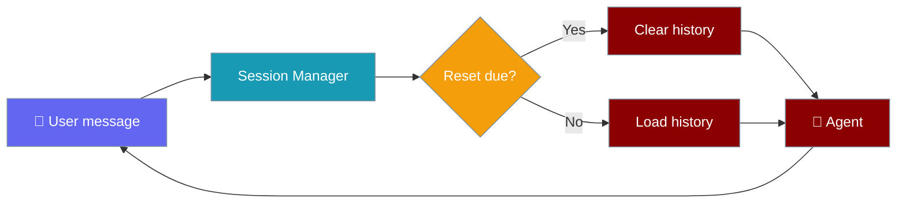
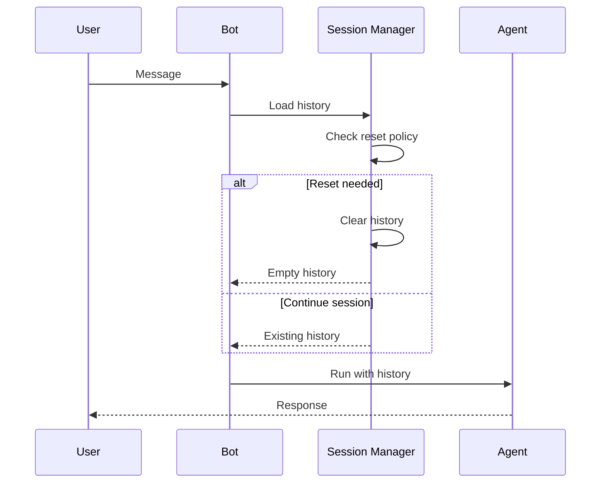

Session reset policies automatically clear bot conversation history after inactivity or at a scheduled time, preventing unbounded context growth.



## Quick Start

<Steps>

<Step title="Idle reset after 30 minutes">

```yaml
channels:
  telegram:
    token: ${TELEGRAM_BOT_TOKEN}
    session:
      reset:
        mode: idle
        idle_minutes: 30
```

</Step>

<Step title="Daily reset at 04:00">

```yaml
channels:
  discord:
    token: ${DISCORD_BOT_TOKEN}
    session:
      reset:
        mode: daily
        at_hour: 4
```

</Step>

<Step title="Combined idle + daily">

```yaml
channels:
  slack:
    token: ${SLACK_BOT_TOKEN}
    app_token: ${SLACK_APP_TOKEN}
    session:
      max_history: 100
      reset:
        mode: both
        idle_minutes: 60
        at_hour: 4
```

</Step>

</Steps>

---

## How It Works

Each time a message arrives, the bot checks whether a reset is due **before** loading the conversation history:



Idle tracking is **per user**. Idle timeout compares elapsed time since the last message; daily reset checks the current wall-clock hour.

---

## Reset Modes

| Mode | Behaviour |
|------|-----------|
| `none` | No automatic reset (default — backward compatible) |
| `idle` | Reset after N minutes of inactivity |
| `daily` | Reset at a specific hour each day (0–23) |
| `both` | Combine idle and daily reset |

---

## Configuration Options

Configure under each channel's `session.reset` block in `gateway.yaml` or `bot.yaml`.

**`session.reset` options:**

| Option | Type | Default | Description |
|--------|------|---------|-------------|
| `mode` | `str` | `"none"` | One of `none`, `idle`, `daily`, `both` |
| `idle_minutes` | `int` | `60` | Minutes of inactivity before reset (≥1). Used when mode includes `idle`. |
| `at_hour` | `int` | `None` | Daily reset hour (0–23). **Required** when mode is `daily` or `both`. |

**`session` options (parent block):**

| Option | Type | Default | Description |
|--------|------|---------|-------------|
| `max_history` | `int` | `100` | Maximum history entries retained per user. |

---

## Common Patterns

**Customer support** — drop stale conversations when the customer leaves:

```yaml
session:
  reset:
    mode: idle
    idle_minutes: 30
```

**Daily briefing bot** — fresh start each midnight:

```yaml
session:
  reset:
    mode: daily
    at_hour: 0
```

**Compliance bot** — idle timeout plus nightly sweep:

```yaml
session:
  reset:
    mode: both
    idle_minutes: 15
    at_hour: 2
```

---

## Best Practices

<AccordionGroup>

<Accordion title="Session Reset vs Session Reaper">
**Session Reset Policy** (this feature) clears a user's *conversation history* based on idle or scheduled time — configured per channel in YAML.

**Session Reaper** (`session_ttl` on `BotConfig`) prunes the *in-memory session record* of stale users. They solve different problems; use both for long-running bots.
</Accordion>

<Accordion title="Pair with max_history">
Combine `session.max_history` with reset policies to cap context size and cost. Reset clears history entirely; `max_history` trims retained turns during an active session.
</Accordion>

<Accordion title="Manual /new command">
Users can always send `/new` for an immediate reset. Manual reset works alongside automatic policies — see [Bot Commands](/docs/features/bot-commands).
</Accordion>

</AccordionGroup>

---

## Related

<CardGroup cols={2}>
  <Card title="Messaging Bots" icon="comments" href="/docs/features/messaging-bots">
    Multi-platform bot setup and YAML config
  </Card>
  <Card title="Bot Commands" icon="terminal" href="/docs/features/bot-commands">
    Built-in /new, /help, and /status commands
  </Card>
  <Card title="Sessions" icon="clock-rotate-left" href="/docs/features/sessions">
    Agent-level session management
  </Card>
  <Card title="Session Persistence" icon="database" href="/docs/features/session-persistence">
    Persisting session state to disk
  </Card>
</CardGroup>
