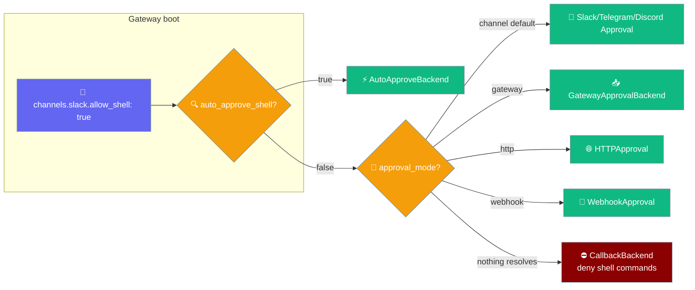
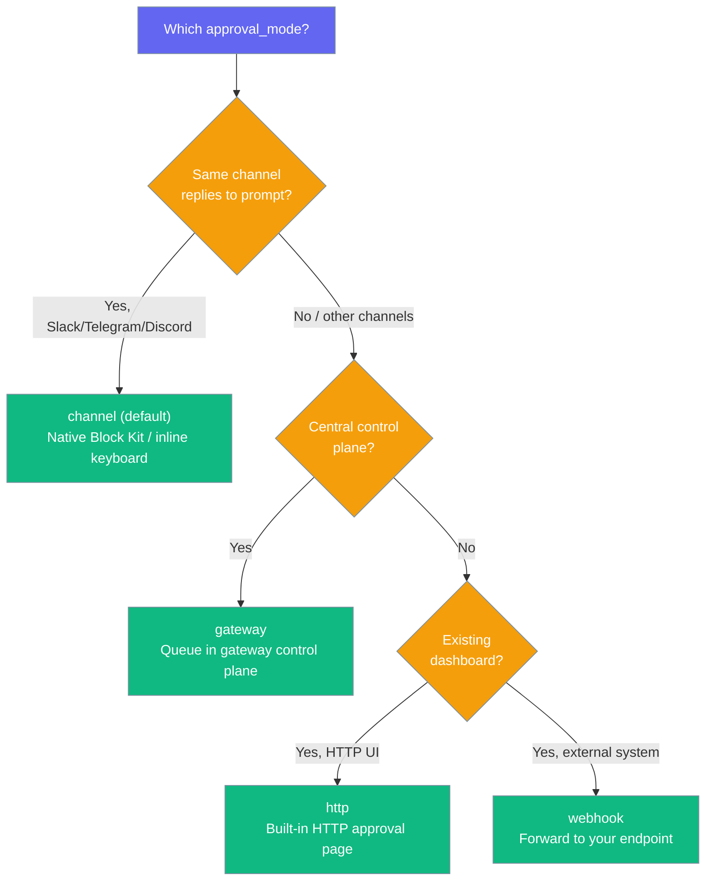
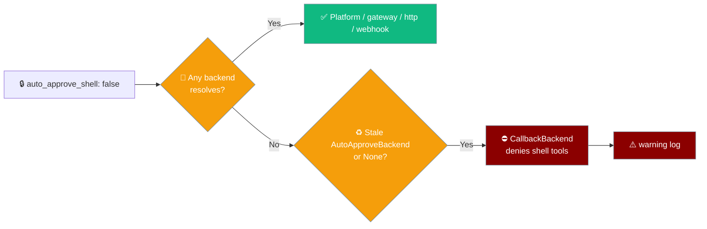
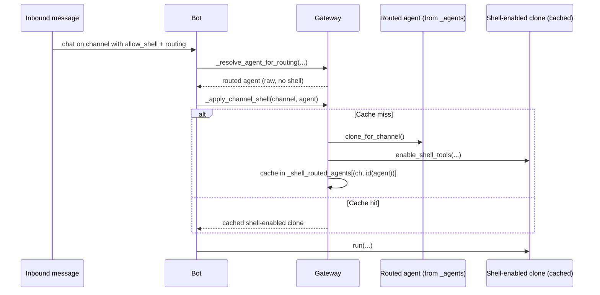
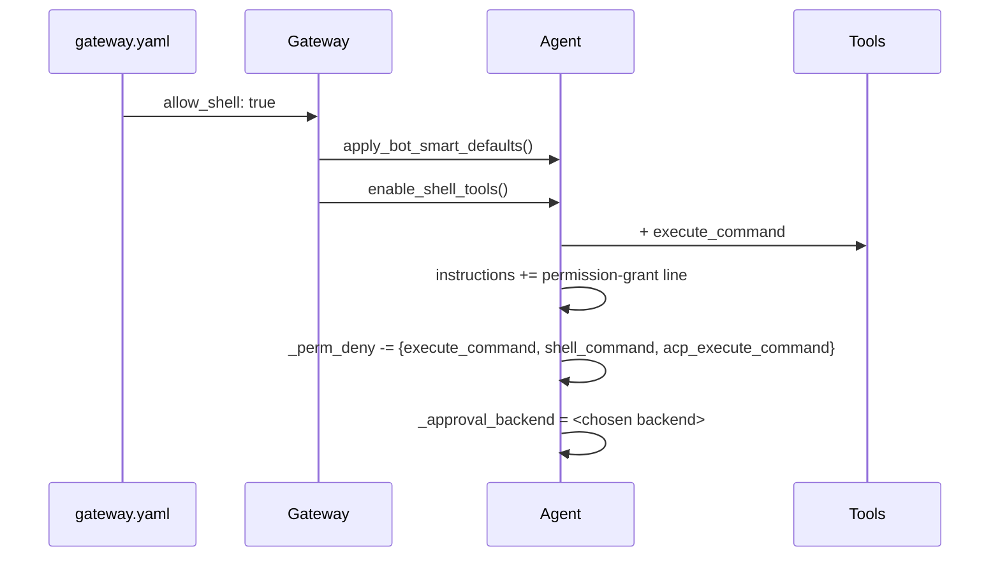

Flip one YAML flag and any inbound channel bot can run shell commands, with approval routed to the platform of your choice.



Before this feature, adding `execute_command` to an inbound bot meant building the agent, attaching an approval backend, and lifting the default deny — all in Python. Now the operator flips one flag and the gateway wires everything at bot construction.

## Quick Start

<Steps>
<Step title="Turn it on">
Add `allow_shell: true` to any channel. In a dev or trusted workspace, auto-approve every command:

```yaml
channels:
  slack:
    token: "${SLACK_BOT_TOKEN}"
    app_token: "${SLACK_APP_TOKEN}"
    allow_shell: true
    auto_approve_shell: true
```

Start the gateway:

```bash
praisonai gateway start
```

Now `@your-bot run ls` executes on the server.
</Step>

<Step title="Require approval for real workloads">
Turn off auto-approve and route the prompt to the owner. Every shell call now sends a Slack Block Kit approval message to `UOWNER`, and only `UOWNER` can approve:

```yaml
channels:
  slack:
    token: "${SLACK_BOT_TOKEN}"
    app_token: "${SLACK_APP_TOKEN}"
    allow_shell: true
    auto_approve_shell: false
    approval_channel: "UOWNER"
    approval_users: "UOWNER"
```
</Step>
</Steps>

---

## Configuration Options

Eight new per-channel fields control shell execution and approval routing.

| Field | Type | Default | Description |
|-------|------|---------|-------------|
| `allow_shell` | `bool` | `False` | Opt in shell execution for this channel. Adds `execute_command` to the agent's tools, injects a permission-grant sentence into instructions, and lifts the deny-list entry. |
| `auto_approve_shell` | `bool` | `True` | If `True`, uses `AutoApproveBackend` — every shell call runs immediately. If `False`, wires a human-in-the-loop backend via the routing ladder below. |
| `approval_channel` | `str` | `None` | Where the approval prompt is delivered. Slack: user/channel ID. Telegram: chat ID. Discord: channel ID (falls back to `home_channel`). |
| `approval_users` | `str \| list[str]` | `None` | Approver allowlist. Comma-separated string or list. Falls back to `SLACK_APPROVERS` / `TELEGRAM_APPROVERS` / `DISCORD_APPROVERS` env var. |
| `approval_mode` | `str` | `None` (= `"channel"`) | Backend selector: `"channel"` (default per-platform), `"gateway"`, `"http"`, `"webhook"`. **Validated at load time — typos throw `ValueError`.** |
| `approval_webhook_url` | `str` | `None` | HTTPS URL for `approval_mode=webhook`. Falls back to `APPROVAL_WEBHOOK_URL` env var. If missing, warns and falls through to `GatewayApprovalBackend`. |
| `approval_http_host` | `str` | `"127.0.0.1"` | HTTP dashboard host for `approval_mode=http`. Set to `"0.0.0.0"` to expose. |
| `approval_http_port` | `int` | `8899` | HTTP dashboard port for `approval_mode=http`. |

<Warning>
`approval_mode` is validated at load time. A typo like `chanel` or `webook` throws a `ValueError` instead of silently falling through to the gateway-queue fallback — which would leave shell approvals stuck where the operator never looks. Only `channel`, `gateway`, `http`, and `webhook` are accepted.
</Warning>

`auto_approve_shell` accepts string truthy values `"1"`, `"true"`, `"yes"`, `"on"` (case-insensitive).

---

## Choosing an approval_mode

Pick the backend that matches where you want to answer approval prompts.



The routing precedence, exactly as wired at bot construction:

```
approval_mode == "gateway"                → GatewayApprovalBackend()
approval_mode == "http"                   → HTTPApproval(host, port)
approval_mode == "webhook" OR
  approval_webhook_url is set             → WebhookApproval(webhook_url)
                                             ↳ webhook mode with NO url:
                                               warn + fall through to gateway
channel_type == "slack"    + resolved id  → SlackApproval(...)
channel_type == "telegram" + resolved id  → TelegramApproval(...)
channel_type == "discord"  + resolved id  → DiscordApproval(...)
GatewayApprovalBackend importable         → GatewayApprovalBackend()  (fallback)
otherwise                                 → CallbackBackend (deny shell tools)
                                            + warning log
```

---

## Fail-closed behaviour

When `auto_approve_shell: false` is set but no approval backend can be wired, shell commands are denied instead of silently auto-approved.



`apply_bot_smart_defaults()` may install an `AutoApproveBackend` when `auto_approve_tools` is on. If the shell wiring then finds no `SlackApproval` / `TelegramApproval` / `DiscordApproval` / `GatewayApprovalBackend` / `HTTPApproval` / `WebhookApproval`, leaving that backend in place would auto-approve shell despite the explicit opt-out. The gateway now swaps in a deny-by-default `CallbackBackend`.

| Situation | Outcome |
|-----------|---------|
| A backend resolves from the routing ladder | Shell approval routed to that backend. |
| No backend resolves, existing `AutoApproveBackend` or `None` | Shell tools denied by a `CallbackBackend`; startup logs a warning. |
| Non-shell tools | Still auto-approved — the deny fence is scoped to `execute_command`, `shell_command`, and `acp_execute_command`. |

The warning line to watch for at startup:

```
allow_shell with auto_approve_shell=false needs approval_channel,
approval_mode (gateway|http|webhook), or a custom approval backend on the agent
— shell commands will be denied until one is configured
```

<Warning>
This is a behavioural change. A bot that previously auto-approved shell under `auto_approve_shell: false` (because smart defaults auto-approved tools) now replies *"That command needs approval and was denied."* Add `approval_channel`, set `approval_mode`, or wire a custom backend to restore approvals.
</Warning>

---

## With routing rules

Routing rules on a shell-enabled channel keep `execute_command` — routed agents are shell-enabled too, not just the default channel clone.



Previously a routing rule swapped in a raw agent that never saw `enable_shell_tools()`, so `execute_command` disappeared for any turn that hit a routing rule — even with `allow_shell: true`. The gateway now re-applies the channel's shell setup to routed agents.

| Behaviour | Detail |
|-----------|--------|
| **Routed agents opt in too** | Every routed agent on a shell-enabled channel gains `execute_command`, closing the silent gap. Any routing rule on that channel inherits the shell capability. |
| **Cloned per `(channel, agent)`** | The routed agent is cloned once per channel-agent pair and cached, so a shared agent used by other channels never gains `execute_command` on channels that did not opt in. |
| **Reload drops the clones** | Hot-reloading a channel to remove `allow_shell: true` drops the cached shell-enabled clones — the next inbound message uses the non-shell agent. |

---

## What `allow_shell` changes on the agent

Setting the flag runs `enable_shell_tools()` on the per-channel cloned agent, after smart defaults are applied.



The four side effects, in order:

| Step | Effect |
|------|--------|
| **1. Tool injection** | Adds `execute_command` to `agent.tools` if not already present. |
| **2. Permission grant** | Appends `You can run shell commands on the bot server using the execute_command tool.` to `agent.instructions` (idempotent). |
| **3. Deny-list lift** | Removes `execute_command`, `shell_command`, and `acp_execute_command` from `agent._perm_deny`. |
| **4. Approval backend** | Sets `agent._approval_backend` — `AutoApproveBackend()` when auto-approve is on, the routed platform backend when one resolves, otherwise a deny-by-default `CallbackBackend` that rejects shell tools (see [Fail-closed behaviour](#fail-closed-behaviour)). |

---

## Per-platform routing

Each platform resolves the approval target from a fallback chain, then builds its native backend.

| Channel | Resolves `approval_channel` from | Uses backend |
|---------|----------------------------------|--------------|
| Slack | `approval_channel` → `owner_user_id` → `SLACK_APPROVAL_CHANNEL` | `SlackApproval(token, channel, allowed_approvers)` |
| Telegram | `approval_channel` → `owner_user_id` → `TELEGRAM_CHAT_ID` | `TelegramApproval(token, chat_id, allowed_approvers)` |
| Discord | `approval_channel` → `home_channel` → `DISCORD_APPROVAL_CHANNEL` | `DiscordApproval(token, channel_id, allowed_approvers)` |
| WhatsApp / email / other | — | `GatewayApprovalBackend()` (fallback) |

`approval_users` accepts a comma-separated string or a list. An empty allowlist passes `allowed_approvers=None` to the platform backend, whose native default lets anyone in the channel approve.

---

## Environment Variables

Every fallback the feature reads, in one place.

| Env var | Purpose |
|---------|---------|
| `SLACK_APPROVAL_CHANNEL` | Slack user/channel ID for approval prompts (fallback for `approval_channel`) |
| `TELEGRAM_CHAT_ID` | Telegram chat ID for approval prompts (fallback for `approval_channel`) |
| `DISCORD_APPROVAL_CHANNEL` | Discord channel ID for approval prompts (fallback for `approval_channel`) |
| `SLACK_APPROVERS` | Comma-separated Slack user IDs (fallback for `approval_users`) |
| `TELEGRAM_APPROVERS` | Comma-separated Telegram user IDs (fallback for `approval_users`) |
| `DISCORD_APPROVERS` | Comma-separated Discord user IDs (fallback for `approval_users`) |
| `APPROVAL_WEBHOOK_URL` | HTTPS URL (fallback for `approval_webhook_url`) |

<Note>
**Webhook without a URL falls back safely.** If `approval_mode=webhook` but neither `approval_webhook_url` nor `APPROVAL_WEBHOOK_URL` is set, the gateway logs a warning and falls through to `GatewayApprovalBackend`. It does **not** build a broken `WebhookApproval("None")`.
</Note>

---

## Recipes

Copy-paste-ready configurations for common setups.

<Tabs>
<Tab title="Slack auto-approve (dev)">
Fastest to demo — every shell call runs immediately in a trusted workspace.

```yaml
channels:
  slack:
    token: "${SLACK_BOT_TOKEN}"
    app_token: "${SLACK_APP_TOKEN}"
    allow_shell: true
    auto_approve_shell: true
```
</Tab>

<Tab title="Slack owner-DM approval">
Every command needs owner approval, and only the owner may approve.

```yaml
channels:
  slack:
    token: "${SLACK_BOT_TOKEN}"
    app_token: "${SLACK_APP_TOKEN}"
    allow_shell: true
    auto_approve_shell: false
    approval_channel: "UOWNER"
    approval_users: "UOWNER"
```
</Tab>

<Tab title="WhatsApp gateway queue">
WhatsApp has no native approval wiring, so route approvals into the gateway control plane.

```yaml
channels:
  whatsapp:
    allow_shell: true
    auto_approve_shell: false
    approval_mode: gateway
```
</Tab>

<Tab title="Multi-channel policy">
Different channels, different policies — all in one gateway.

```yaml
channels:
  slack:
    token: "${SLACK_BOT_TOKEN}"
    app_token: "${SLACK_APP_TOKEN}"
    allow_shell: true
    auto_approve_shell: true          # trusted workspace

  telegram:
    token: "${TELEGRAM_BOT_TOKEN}"
    allow_shell: true
    auto_approve_shell: false
    approval_channel: "123456789"     # owner chat ID

  whatsapp:
    allow_shell: true
    auto_approve_shell: false
    approval_mode: gateway            # queue in control plane

  discord:
    token: "${DISCORD_BOT_TOKEN}"
    allow_shell: true
    auto_approve_shell: false
    approval_mode: webhook
    approval_webhook_url: "https://hooks.example.com/approve"
```
</Tab>
</Tabs>

---

## HTTP dashboard approvals

Serve a built-in approval page and answer from the browser.

```yaml
channels:
  telegram:
    token: "${TELEGRAM_BOT_TOKEN}"
    allow_shell: true
    auto_approve_shell: false
    approval_mode: http
    approval_http_host: "0.0.0.0"     # default "127.0.0.1"
    approval_http_port: 9000          # default 8899
```

---

## User Flow

A Slack workspace owner wants their support team to type `@bot run pytest -q` and see results in-thread, but only after they personally approve each command. They edit `gateway.yaml` on the server, add `allow_shell: true`, `auto_approve_shell: false`, and `approval_channel: "UOWNER"` to their `slack:` block, then restart the gateway. From that moment, every shell request from any Slack user triggers a Block Kit approval prompt in the owner's DMs — they tap **Approve** and the command runs; they tap **Deny** and the agent replies *"That command needs approval and was denied."* No Python was written.

---

## Best Practices

<AccordionGroup>
<Accordion title="Never auto-approve on a public channel">
Set `auto_approve_shell: true` only in trusted workspaces. On any channel that untrusted users can reach, keep it `false` and route approvals to an owner.
</Accordion>

<Accordion title="Set approval_users explicitly">
Prefer an explicit `approval_users` allowlist over relying on `SLACK_APPROVERS` / `TELEGRAM_APPROVERS` / `DISCORD_APPROVERS` env vars — it keeps the policy visible in the config and avoids env-var leakage.
</Accordion>

<Accordion title="Use approval_mode: gateway for channels without native wiring">
WhatsApp, email, and other channels have no in-channel approval UI. Route them to `approval_mode: gateway` so approvals queue in the control plane instead of falling silently.
</Accordion>

<Accordion title="Validate the YAML before starting">
Run `praisonai gateway lint` — the fail-closed `approval_mode` validator rejects typos at load time, catching `chanel`/`webook` before they strand approvals.
</Accordion>

<Accordion title="Watch the startup log for '— shell commands will be denied'">
When `auto_approve_shell: false` resolves no approval backend, the gateway logs a warning and denies shell tools. If your bot suddenly refuses commands with *"needs approval and was denied"*, that log line lists the missing knobs — add `approval_channel`, set `approval_mode`, or wire a custom backend.
</Accordion>

<Accordion title="Routing rules inherit shell on shell-enabled channels">
Adding `allow_shell: true` to a channel with routing rules grants `execute_command` to every routed agent on that channel, not just the default one. Keep routing rules narrow on shell-enabled channels, and remove `allow_shell` on reload to drop the cached shell clones.
</Accordion>
</AccordionGroup>

---

## Related

<CardGroup cols={2}>
<Card title="Approval Protocol" icon="shield-check" href="/docs/features/approval-protocol">
  Approval backend reference for Slack, Telegram, Discord, webhook, and HTTP.
</Card>
<Card title="Bot Gateway" icon="server" href="/docs/features/bot-gateway">
  Gateway config, channel security, and hot-reload.
</Card>
<Card title="Bot Default Tools" icon="wrench" href="/docs/features/bot-default-tools">
  How tools get injected on bot agents.
</Card>
<Card title="Durable Approvals" icon="database" href="/docs/features/durable-approvals">
  Survive gateway restarts across in-flight approvals.
</Card>
</CardGroup>
