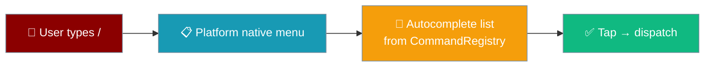
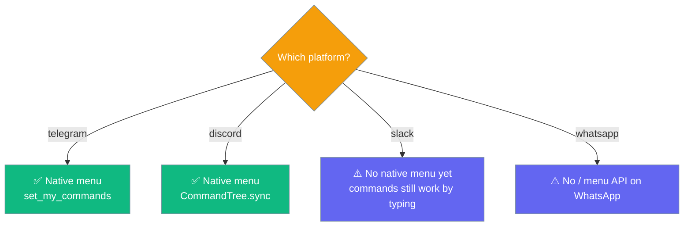
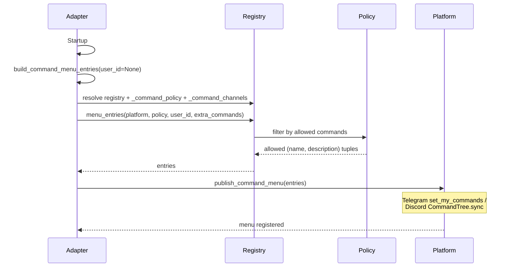
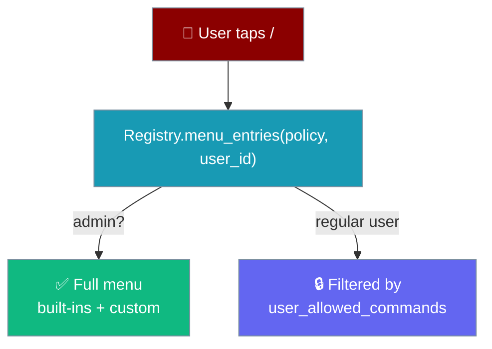

Typing `/` in Telegram or Discord shows a native menu of every bot command with its description.

```python
from praisonaiagents import Agent
from praisonai.bots import TelegramBot

agent = Agent(name="assistant", instructions="Be helpful.")
bot = TelegramBot(token="YOUR_TOKEN", agent=agent)

# Register a custom command — it appears in the native `/` menu automatically
async def handle_ping(message):
    return "Pong!"

bot.register_command("ping", handle_ping, description="Check if bot is alive")

import asyncio
asyncio.run(bot.start())
# Type "/" in your chat — Telegram/Discord shows the full command list.
```



The shared `CommandRegistry` is the single source of truth. Adapters project it into each platform's native menu at startup — no extra code, and every `register_command`-added command shows up too.

## What Appears in the Menu

Both built-in and custom commands surface in the `/` menu, filtered per user by `CommandAccessPolicy`.

| Built-in commands | Custom commands |
|---|---|
| `/status`, `/new`, `/help`, `/stop`, `/model` | Any command added with `register_command(name, handler, description=...)` |
| `/usage`, `/compress`, `/queue`, `/undo` | The `description` you pass becomes the menu label |
| `/sessions`, `/resume`, `/retry`, `/reasoning` | Restrict to platforms with `channels=[...]` |
| `/whoami`, `/sethome`, `/learn` | Hidden from a user's menu when the policy denies it |

Admins see everything; regular users only see the commands their `user_allowed_commands` allows.

## Platform Support

| Platform | Native menu | How |
|---|---|---|
| **Telegram** | ✅ | `bot.set_my_commands(BotCommand(...))` at startup |
| **Discord** | ✅ | Application commands on `CommandTree`, `sync()` on `on_ready` |
| **Slack** | ⚠️ | Base no-op — commands still work by typing, no native menu yet |
| **WhatsApp** | ⚠️ | Base no-op — WhatsApp has no `/` command menu API |



## Quick Start

<Steps>
<Step title="Start a Telegram bot — built-ins appear automatically">
Every built-in command shows up in `/` autocomplete with no extra code.

```python
from praisonaiagents import Agent
from praisonai.bots import TelegramBot

agent = Agent(name="assistant", instructions="Be helpful.")
bot = TelegramBot(token="YOUR_TOKEN", agent=agent)

import asyncio
asyncio.run(bot.start())
# Type "/" — Telegram lists /status, /new, /help, /stop, /model, /usage,
# /compress, /queue, /undo, /sessions, /resume, /retry, /reasoning,
# /whoami, /sethome, /learn.
```
</Step>

<Step title="Register a custom command — it joins the menu">
Pass a `description` — it becomes the label users see in the menu.

```python
async def handle_ping(message):
    return "Pong!"

bot.register_command("ping", handle_ping, description="Check if bot is alive")
# /ping now appears in the native menu alongside the built-ins.
```
</Step>

<Step title="Restrict a command to specific platforms">
Use `channels=[...]` to keep a command out of other platforms' menus.

```python
bot.register_command(
    "tgstats",
    handle_ping,
    description="Telegram-only stats",
    channels=["telegram"],
)
# Telegram's menu lists /tgstats; Discord's menu does not.
```
</Step>
</Steps>

## How It Works

At startup each adapter builds policy-filtered `(name, description)` pairs from the registry, then publishes them to the platform's native menu.



| Step | Method | Where |
|------|--------|-------|
| Build entries | `build_command_menu_entries(user_id)` | `ChatCommandMixin` |
| Resolve truth | `registry.menu_entries(platform, policy, user_id, extra_commands)` | `CommandRegistry` |
| Publish | `publish_command_menu(entries)` | Adapter override |

Menu publishing is best-effort: a missing SDK, network error, or unsupported platform is logged and swallowed, so startup is never blocked.

## Access-Control Interaction

`CommandAccessPolicy` filters `menu_entries()` per user — admins see everything, regular users only see commands in their `user_allowed_commands`.



<Card title="Command Access Control" icon="shield-keyhole" href="/docs/features/bot-command-access-control">
  admin_users, user_allowed_commands, and /whoami
</Card>

## Custom Commands API

Custom commands use the same `register_command()` API documented in [Bot Chat Commands](/docs/features/bot-commands#register_command-api).

<Note>
Any command registered via `register_command(..., description=...)` appears in the native `/` menu automatically. Descriptions ARE the menu labels — write them for humans.
</Note>

## Best Practices

<AccordionGroup>
<Accordion title="Always pass a description">
The `description` becomes the native menu label. A command with no description shows a generic placeholder.
</Accordion>

<Accordion title="Restrict privileged commands with CommandAccessPolicy">
Filtered menus keep the UX safe — a user never sees a command they cannot run. See [Command Access Control](/docs/features/bot-command-access-control).
</Accordion>

<Accordion title="Use channels for platform-specific commands">
Pass `channels=["telegram"]` when a command only makes sense on one platform — it's hidden from other platforms' menus.
</Accordion>

<Accordion title="Menu publishing is best-effort">
A failure at startup never blocks the bot. If the menu is empty on Telegram or Discord, check the startup logs for a swallowed `set_my_commands` / `CommandTree.sync` error.
</Accordion>
</AccordionGroup>

## Related

<CardGroup cols={2}>
  <Card title="Bot Chat Commands" icon="terminal" href="/docs/features/bot-commands">
    Built-in and custom commands
  </Card>
  <Card title="Command Access Control" icon="shield-keyhole" href="/docs/features/bot-command-access-control">
    admin_users, user_allowed_commands, /whoami
  </Card>
  <Card title="Gateway" icon="gateway" href="/docs/gateway">
    Gateway and control-plane overview
  </Card>
  <Card title="Learn a Skill" icon="graduation-cap" href="/docs/features/learn-skill">
    The privileged /learn command
  </Card>
</CardGroup>
