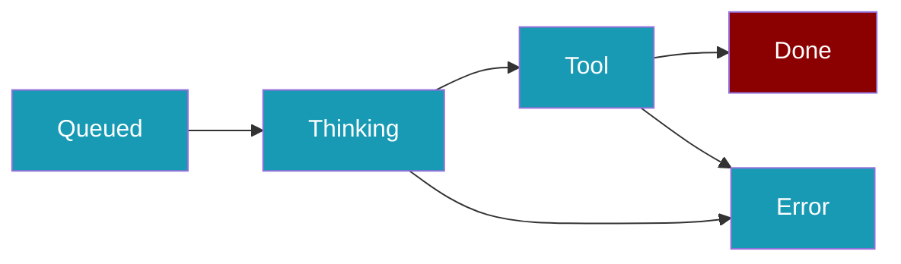
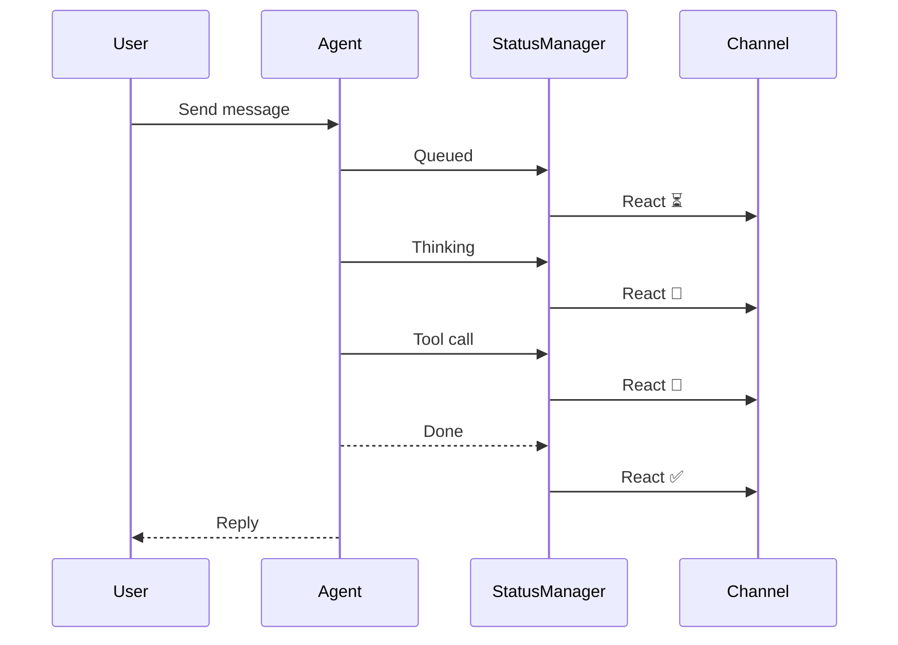

<Note>
Bot platform adapters now ship in the `praisonai-bot` package. `praisonai bot serve` still works exactly as documented here; for a standalone install see [praisonai-bot Migration](/docs/guides/praisonai-bot-migration).
</Note>


Status reactions update an emoji on the user's message to reflect run state — queued, thinking, tool execution, done, or error — at a glance without reading reply text.

```python
from praisonaiagents import Agent
from praisonai.bots import TelegramBot

agent = Agent(name="assistant", instructions="Helpful assistant")
bot = TelegramBot(token="...", agent=agent, status_reactions=True)
bot.start()
```

The user sends a message on Telegram; emoji reactions update through queued, thinking, tool, done, or error states.



## Quick Start

<Steps>
<Step title="Enable with one flag">

```python
from praisonaiagents import Agent
from praisonai.bots import TelegramBot

agent = Agent(name="assistant", instructions="Helpful assistant")
bot = TelegramBot(token="...", agent=agent, status_reactions=True)
bot.start()
```

</Step>

<Step title="Customise emoji via dict">

```python
bot = TelegramBot(
    token="...",
    agent=agent,
    status_reactions={
        "thinking_emoji": "💭",
        "tool_emoji": "⚙️",
        "done_emoji": "🎉",
        "debounce_delay": 1.0,
    },
)
```

</Step>

<Step title="Full control with StatusConfig">

```python
from praisonai.bots import TelegramBot, StatusConfig

bot = TelegramBot(
    token="...",
    agent=agent,
    status_reactions=StatusConfig(
        thinking_emoji="💭",
        immediate_terminal=True,
    ),
)
```

</Step>
</Steps>

## How It Works

The user sends a message and watches a single emoji on that message move through each run stage.



## Configuration Options

| Option | Type | Default | Description |
|--------|------|---------|-------------|
| `queued_emoji` | `str` | `"⏳"` | Shown when the run is queued |
| `thinking_emoji` | `str` | `"🤔"` | Shown while the LLM is generating |
| `tool_emoji` | `str` | `"🔧"` | Shown during tool execution |
| `done_emoji` | `str` | `"✅"` | Terminal: success |
| `error_emoji` | `str` | `"❌"` | Terminal: failure |
| `debounce_delay` | `float` | `0.5` | Seconds before applying intermediate states |
| `immediate_terminal` | `bool` | `True` | Apply done/error immediately |

<Note>
Reactions auto-skip on channels where `capabilities["reactions"]` is `False` (WhatsApp, Email). On Slack, Unicode emoji map to Slack `:text_name:` form (e.g. 🤔 → `thinking_face`).
</Note>

<Warning>
Telegram's reaction API is set-based — `remove_reaction` clears all bot reactions on the message rather than a specific emoji. This is a Telegram API limitation.
</Warning>

## Best Practices

<AccordionGroup>
<Accordion title="Keep debounce_delay at 0.3s or higher on shared channels">
Avoids hitting reaction rate limits on busy Telegram groups.
</Accordion>

<Accordion title="Use distinct emoji for tool vs thinking">
Helps users tell when an external API call is in progress.
</Accordion>

<Accordion title="Leave immediate_terminal enabled">
Users see done/error states instantly without debounce delay.
</Accordion>
</AccordionGroup>

## Related

<CardGroup cols={2}>
  <Card title="Channel Capabilities" icon="list-check" href="/docs/features/channel-capabilities">
    Which channels support reactions
  </Card>
  <Card title="Typing Indicators" icon="keyboard" href="/docs/features/bot-typing-indicators">
    Complementary typing feedback
  </Card>
</CardGroup>
