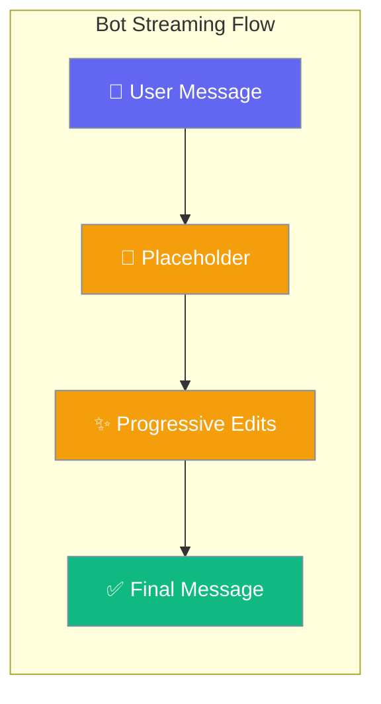
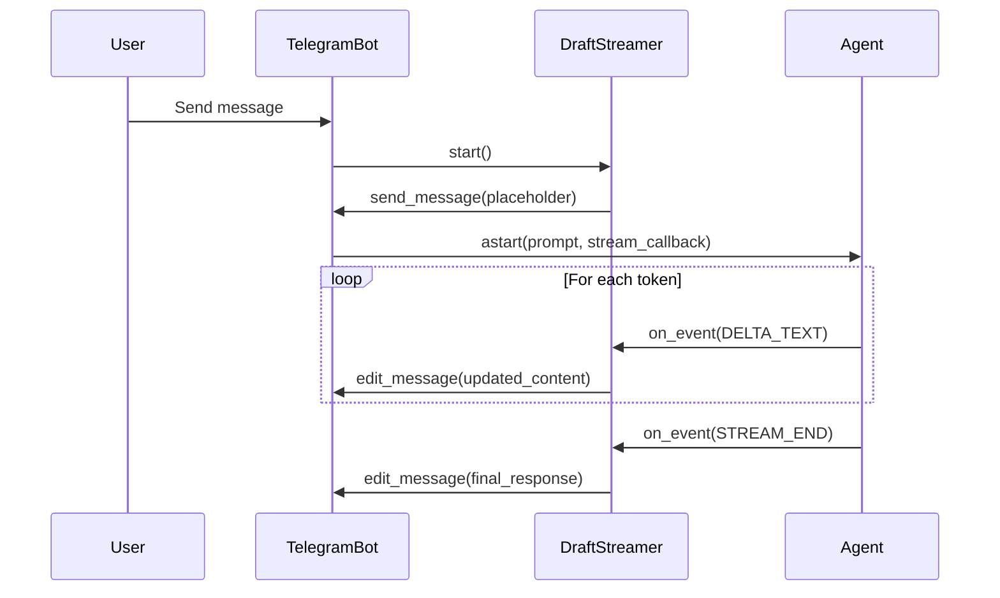
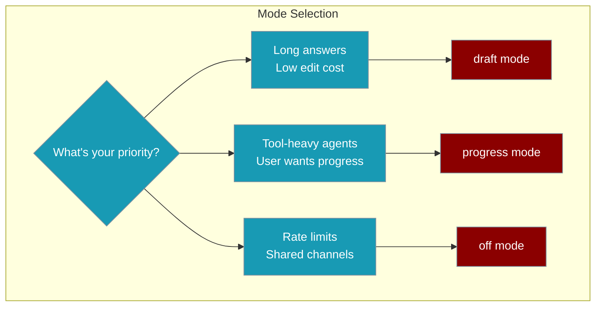

Channel bots can post a quick placeholder message and progressively edit it in place as the agent's answer streams in — replacing the old "stare at a typing indicator for 45s, then a wall of text lands in one burst" experience.



## Quick Start

<Steps>
<Step title="Simple Usage (YAML)">

Enable streaming with default settings in your `bot.yaml`:

```yaml
channels:
  telegram:
    token: "${TELEGRAM_BOT_TOKEN}"
    streaming:
      mode: draft
```

</Step>

<Step title="Python API">

Configure streaming programmatically:

```python
from praisonaiagents import Agent
from praisonai.bots import TelegramBot, StreamingConfig, StreamingMode

bot = TelegramBot(token="...", agent=Agent(instructions="..."))
bot.configure_streaming(StreamingConfig(mode=StreamingMode.DRAFT))
bot.start()
```

</Step>

<Step title="Tuned Configuration">

Customize for slower platforms with higher thresholds:

```yaml
channels:
  telegram:
    streaming:
      mode: draft
      min_interval: 2.0
      min_delta: 200
      placeholder_text: "Working on it..."
```

</Step>
</Steps>

---

## How It Works



| Component | Purpose | Responsibility |
|-----------|---------|----------------|
| `DraftStreamer` | Manages live updates | Coalesces edits, respects rate limits |
| `BotAdapter` | Platform interface | Sends/edits messages |
| `StreamingConfig` | User preferences | Timing, text, mode settings |

---

## Streaming Modes

Three modes are available to match different use cases:



| Mode | Behavior | Best For |
|------|----------|----------|
| `off` | Single final message after completion | Default behavior, zero impact |
| `draft` | Progressive edits with growing answer | Long responses, platforms like Telegram |
| `progress` | Tool status updates, then final answer | Tool-heavy agents, user wants progress |

<Note>
Streaming replies are currently wired up for **Telegram**. The `DraftStreamer` is platform-agnostic (it speaks to any adapter that implements `send_message` + `edit_message`), but the YAML/`configure_streaming()` surface is only connected on Telegram in the initial release. Slack, Discord, and WhatsApp wiring will follow.
</Note>

---

## Configuration Options

| Option | Type | Default | Description |
|--------|------|---------|-------------|
| `mode` | `StreamingMode` | `StreamingMode.OFF` | Streaming mode: `OFF`, `DRAFT`, or `PROGRESS` |
| `min_interval` | `float` | `1.5` | Minimum seconds between message edits (rate-limit safe) |
| `min_delta` | `int` | `120` | Minimum new characters in the buffer before an edit fires |
| `placeholder_text` | `str` | `"🤔 Thinking..."` | Initial message text sent before any content arrives |
| `progress_prefix` | `str` | `"🤔 "` | Prefix used in `progress` mode tool-status updates |

---

## YAML vs Python vs CLI

### YAML Configuration

Add to your `bot.yaml` under the channel configuration:

```yaml
channels:
  telegram:
    token: ${TELEGRAM_BOT_TOKEN}
    streaming:
      mode: draft
      min_interval: 1.5
      min_delta: 120
      placeholder_text: "🤔 Thinking..."
      progress_prefix: "🤔 "
```

### Python API

Configure streaming programmatically with the `configure_streaming()` method:

```python
from praisonai.bots import TelegramBot, StreamingConfig, StreamingMode

bot = TelegramBot(token="...", agent=agent)

# Enable with defaults
bot.configure_streaming(StreamingConfig(mode=StreamingMode.DRAFT))

# Custom configuration
bot.configure_streaming(StreamingConfig(
    mode=StreamingMode.PROGRESS,
    min_interval=2.0,
    min_delta=200,
    placeholder_text="Working...",
    progress_prefix="⚡ "
))
```

### Manual Streamer Usage

For advanced use cases, you can use `DraftStreamer` directly:

```python
from praisonai.bots import DraftStreamer, StreamingConfig, StreamingMode

streamer = DraftStreamer(
    adapter=bot_adapter,              # implements BotAdapter Protocol
    channel_id="123456",
    config=StreamingConfig(mode=StreamingMode.DRAFT, min_interval=1.5),
    rate_limiter=None,                # optional, defaults from platform
)

message_id = await streamer.start()                      # sends placeholder
# ... agent run subscribes streamer.on_event as the stream callback ...
await streamer.finalize(final_response_text)             # final edit with full text
```

---

## Best Practices

<AccordionGroup>
<Accordion title="Tune min_interval to your platform's edit rate limit">
Each platform has different edit rate limits. Telegram allows ~1 edit/sec/chat, while Slack's `chat_update` API is more generous. Set `min_interval` to match your platform's limits to avoid 429 errors.

```yaml
# Telegram (liberal editing)
streaming:
  mode: draft
  min_interval: 1.0

# Discord (stricter limits)
streaming:
  mode: draft
  min_interval: 2.0
```
</Accordion>

<Accordion title="Use progress mode for tool-heavy agents">
When your agent frequently calls tools (web search, calculations, etc.), `progress` mode keeps users informed about what's happening instead of showing a static "thinking" message.

```python
# Good for agents that use many tools
bot.configure_streaming(StreamingConfig(
    mode=StreamingMode.PROGRESS,
    progress_prefix="🔧 "
))
```
</Accordion>

<Accordion title="Streaming is off by default — opt in per channel">
The feature has zero impact on existing bots. Only channels with explicit `streaming:` configuration will use the new behavior. All other channels continue with the original single-message approach.
</Accordion>

<Accordion title="The final edit always contains the complete text">
Even if every intermediate edit fails due to network issues or rate limits, the user will always see the full answer at the end when `finalize()` is called. This ensures reliability even in poor network conditions.
</Accordion>
</AccordionGroup>

---

## Related

<CardGroup cols={2}>
<Card title="Core SDK Streaming" icon="stream" href="/docs/features/streaming">
  Learn about the underlying streaming events that power bot streaming
</Card>
<Card title="Streaming Tool Events" icon="wrench" href="/docs/features/streaming-tool-events">
  Understand tool-event details used in progress mode
</Card>
<Card title="Bot Gateway" icon="gateway" href="/docs/features/bot-gateway">
  Set up and run channel bots with gateway configuration
</Card>
<Card title="Messaging Bots" icon="message-circle" href="/docs/features/messaging-bots">
  Complete guide to messaging bot setup and features
</Card>
</CardGroup>