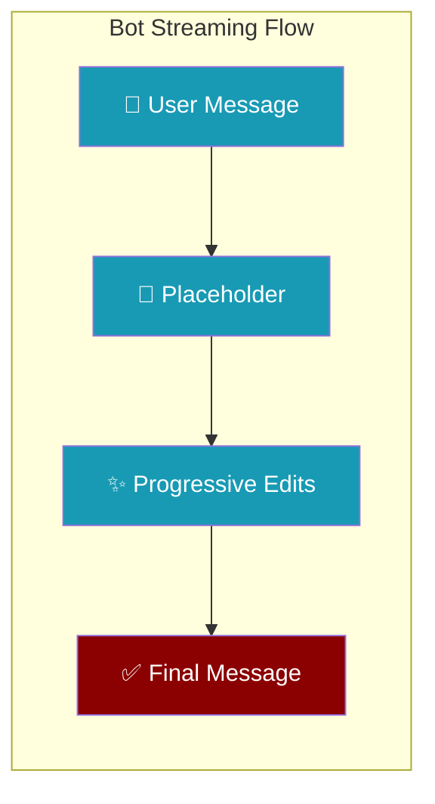
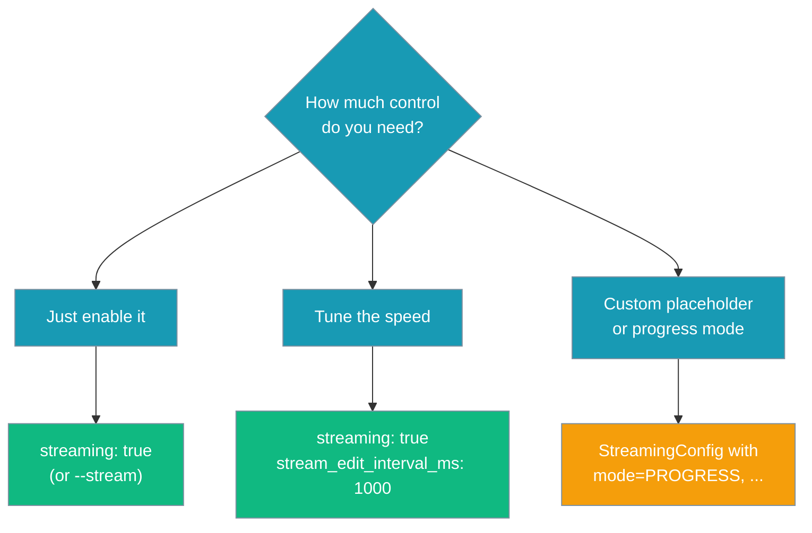
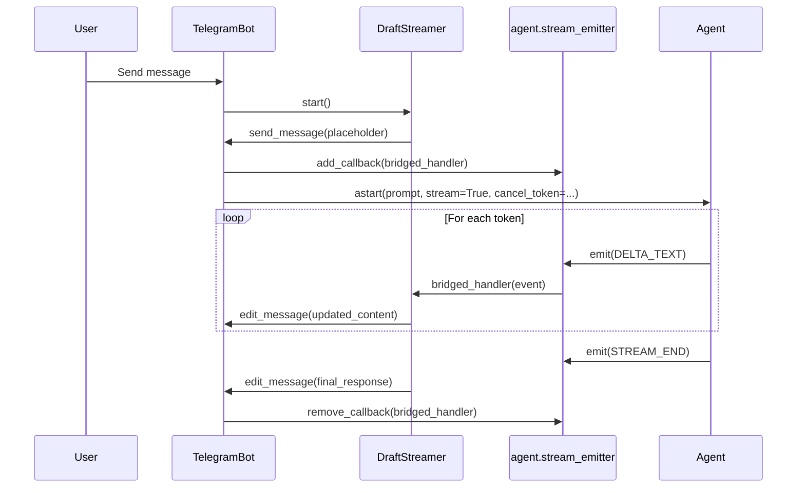
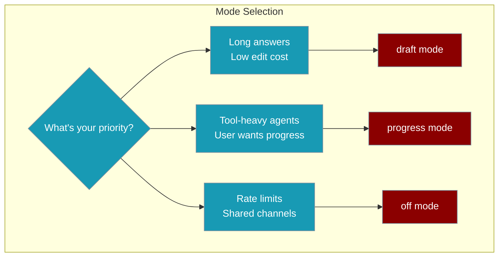
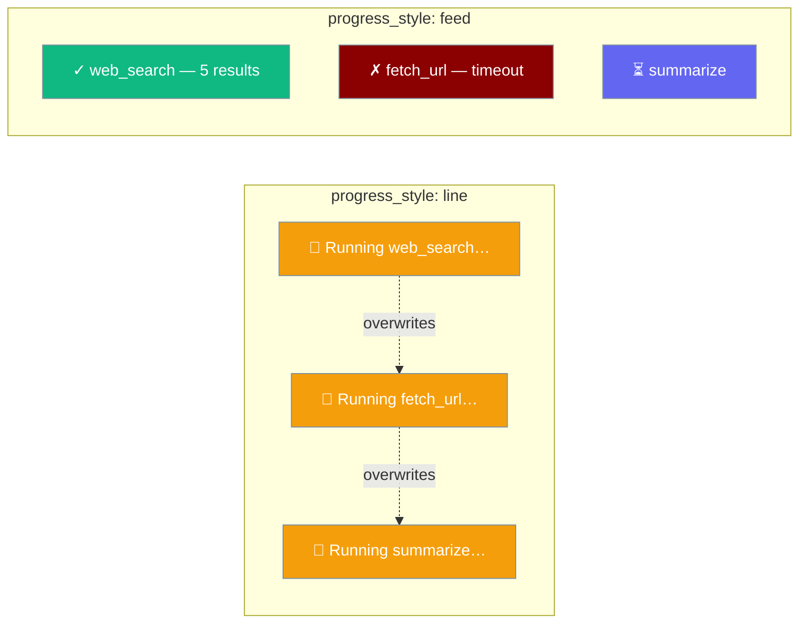
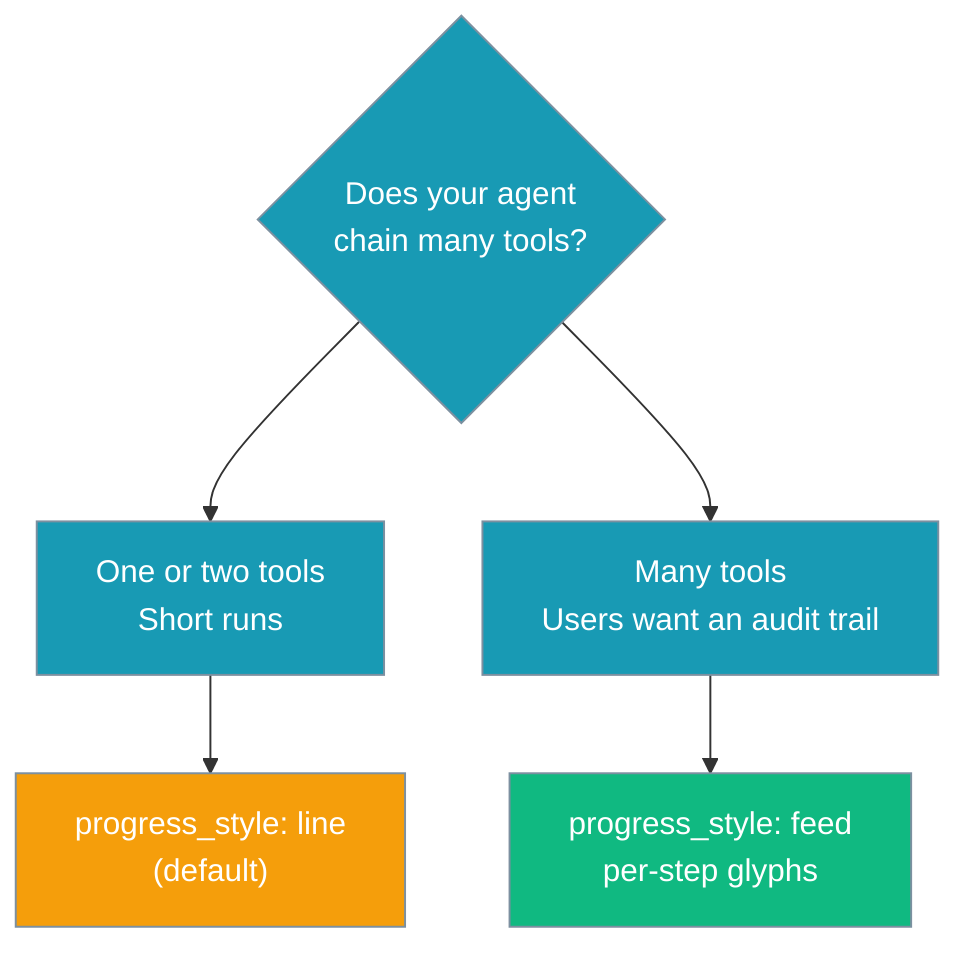
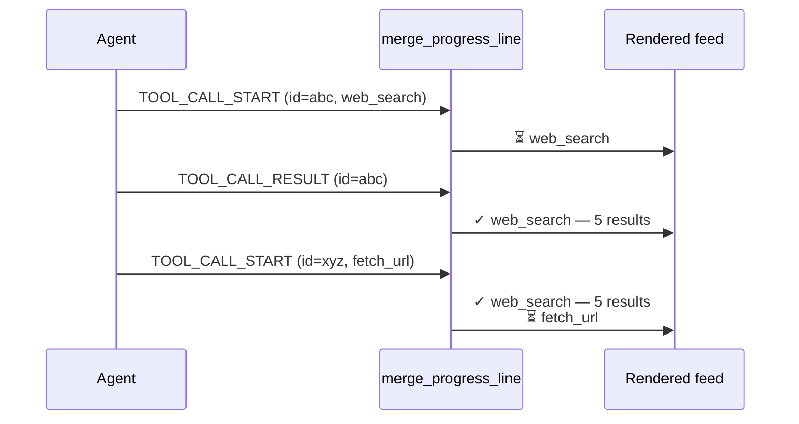
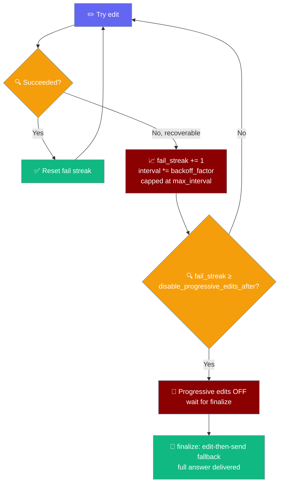
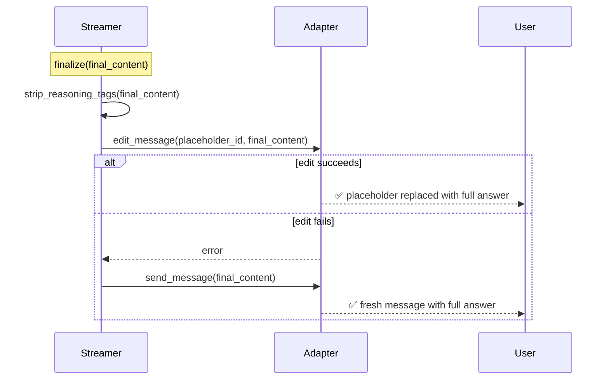

<Note>
Bot platform adapters now ship in the `praisonai-bot` package. `praisonai bot serve` still works exactly as documented here; for a standalone install see [praisonai-bot Migration](/docs/guides/praisonai-bot-migration).
</Note>


Channel bots can post a quick placeholder message and progressively edit it in place as the agent's answer streams in — replacing the old "stare at a typing indicator for 45s, then a wall of text lands in one burst" experience.

```python
from praisonaiagents import Agent

agent = Agent(name="assistant", instructions="You are a helpful assistant.")
agent.start("Explain quantum computing in simple terms.")
```

The user waits on Telegram or Discord; a placeholder message updates in place as the agent streams its answer.

<Info>
Session-level `streaming: true` is a shortcut. For unified per-platform defaults and overrides, use [Display Policy](/docs/features/display-policy).
</Info>



<Note>
Progressive streaming on Telegram/Discord/Slack required a [bug fix in PR #2004](https://github.com/MervinPraison/PraisonAI/pull/2004) — earlier versions crashed on the first message with `TypeError: achat() got an unexpected keyword argument 'stream_callback'`. Upgrade to the latest release if you hit that error.
</Note>

## Quick Start

<Steps>
<Step title="Enable with one flag (CLI)">

```bash
praisonai bot telegram --token $TELEGRAM_BOT_TOKEN --stream
```

</Step>

<Step title="Enable in YAML">

```yaml
channels:
  telegram:
    token: ${TELEGRAM_BOT_TOKEN}
    streaming: true
    stream_edit_interval_ms: 700
```

</Step>

<Step title="Enable in Python">

```python
from praisonaiagents import Agent
from praisonai.bots import TelegramBot
from praisonaiagents.bots import BotConfig

agent = Agent(name="assistant", instructions="Be helpful and concise.")

bot = TelegramBot(
    token="...",
    agent=agent,
    config=BotConfig(
        token="...",
        streaming=True,
        stream_edit_interval_ms=700,
    ),
)
bot.start()
```

</Step>
</Steps>



---

## How It Works

<Info>
Streaming events flow through `agent.stream_emitter`, not as a `stream_callback` kwarg to `astart()`. The bot adds a temporary callback for the duration of the run and removes it on completion (and on timeout/cancel).
</Info>



| Component | Purpose | Responsibility |
|-----------|---------|----------------|
| `DraftStreamer` | Manages live updates | Coalesces edits, respects rate limits |
| `BotAdapter` | Platform interface | Sends/edits messages |
| `StreamingConfig` | User preferences | Timing, text, mode settings |

---

## Configuration Options

| Option | Type | Default | Description |
|--------|------|---------|-------------|
| `streaming` | `bool` | `False` | Enable progressive streaming — bot sends a placeholder then edits it live as the agent produces tokens |
| `stream_edit_interval_ms` | `int` | `700` | Minimum milliseconds between message edits (respects platform rate limits) |

### Per-channel streaming support

| Channel | Live edits | Default edit interval | Text limit |
|---------|------------|----------------------|------------|
| Telegram | Yes | platform default | 4096 |
| Slack | Yes | 1.0s | 40000 |
| Discord | Yes | platform default | 2000 |
| WhatsApp | No (single message) | — | 4096 |
| Email | No (single message) | — | unlimited |

See [Channel Capabilities](/docs/features/channel-capabilities) for the full matrix including reactions and typing.

---

## Advanced configuration (StreamingConfig)

For `progress` mode, custom placeholder text, or fine-grained `min_delta` control, use the lower-level `StreamingConfig` API.

### Streaming Modes

Three modes are available to match different use cases:



| Mode | Behavior | Best For |
|------|----------|----------|
| `off` | Single final message after completion | Default behavior, zero impact |
| `draft` | Progressive edits with growing answer | Long responses, platforms like Telegram |
| `progress` | Tool status updates, then final answer | Tool-heavy agents, user wants progress |

<Note>
Live streaming (`draft` mode) works on **Telegram, Slack, and Discord** — each adapter honours its own `edit_rate_limit` and `text_limit` from [Channel Capabilities](/docs/features/channel-capabilities). **WhatsApp** and **Email** fall back to a single final message (`live_edit=False`). The simple `streaming: true` / `--stream` form enables `draft` mode automatically.
</Note>

### StreamingConfig options

| Option | Type | Default | Description |
|--------|------|---------|-------------|
| `mode` | `StreamingMode` | `StreamingMode.OFF` | Streaming mode: `OFF`, `DRAFT`, or `PROGRESS` |
| `min_interval` | `float` | `1.5` | Minimum seconds between message edits (rate-limit safe) |
| `min_delta` | `int` | `120` | Minimum new characters in the buffer before an edit fires |
| `placeholder_text` | `str` | `"🤔 Thinking..."` | Initial message text sent before any content arrives |
| `progress_prefix` | `str` | `"🤔 "` | Prefix used in `progress` mode tool-status updates |
| `progress_style` | `str` | `"line"` | Progress-mode rendering style: `"line"` (single overwritten tool label, unchanged default) or `"feed"` (bounded multi-line rolling status feed with per-step ⏳/✓/✗ glyphs) |
| `progress_max_lines` | `int` | `8` | Max trailing lines shown when `progress_style="feed"`; older lines scroll off the top of the window |
| `progress_max_line_chars` | `int` | `120` | Per-line character cap in `feed` style (includes the leading glyph); words are truncated at a boundary with an ellipsis |
| `disable_progressive_edits_after` | `int` | `3` | Consecutive recoverable edit failures before progressive editing is turned off for the rest of the stream — the completed answer is then delivered as a single final send |
| `flood_backoff_factor` | `float` | `2.0` | Multiplier applied to the edit interval on each recoverable (flood / 429 / transient) failure |
| `max_interval` | `float` | `30.0` | Cap in seconds for the adaptively widened edit interval — backoff stops growing past this |
| `strip_reasoning_tags` | `bool` | `True` | Strip `<think>…</think>` and `<reasoning>…</reasoning>` spans from streamed and final output. Default ON — set to `false` to opt out |

---

## Progress feed style

Set `progress_style: feed` to render tool calls as a bounded rolling multi-line status view instead of a single overwritten label.

A research agent on Telegram chains `web_search`, `fetch_url`, and `summarize`. With the default `progress_style="line"`, each tool overwrites the last, so a failed `fetch_url` vanishes. With `feed`, every step keeps its own line and outcome glyph:

```python
from praisonaiagents import Agent
from praisonai.bots import TelegramBot, StreamingConfig, StreamingMode
from praisonaiagents.bots import BotConfig

agent = Agent(
    name="research-assistant",
    instructions="Research the user's question with web tools and summarise.",
    tools=[web_search, fetch_url, summarize],
)

bot = TelegramBot(
    token="...",
    agent=agent,
    config=BotConfig(token="...", streaming=True),
)
bot.configure_streaming(StreamingConfig(
    mode=StreamingMode.PROGRESS,
    progress_style="feed",     # enable the multi-line rolling feed
    progress_max_lines=6,      # keep it short on mobile
    progress_max_line_chars=100,
))
bot.start()
```

The user's Telegram message updates in place with a live per-step audit trail:

```
✓ web_search — 5 results
✗ fetch_url — timeout
⏳ summarize
```

Each tool gets its own line with a state glyph — `⏳` running, `✓` done, `✗` error — instead of one label that overwrites itself.



### When to use which style



### How one tool flows through the feed

A tool's start event and its matching finish event share one correlation id, so the line updates in place instead of duplicating.



<Note>
The `feed` style activates only when `mode: progress` **and** `progress_style: feed`. The default `progress_style="line"` preserves the existing single-line behaviour bit-for-bit — `feed` is strictly opt-in per channel.
</Note>

---

## Flood-control

Your Telegram bot is streaming a long answer during peak hours. Telegram starts returning 429 after the third edit. The streamer doubles its edit interval (1.5s → 3s → 6s → capped at `max_interval`). After `disable_progressive_edits_after` consecutive failures it stops editing entirely and waits — when `finalize()` fires it delivers the completed answer as a fresh message. The user never sees a stuck placeholder, never sees a partial reply, and the rest of your bot's chats are unaffected because the backoff is per-stream.

<Note>
Backoff is per-stream — `_current_min_interval` is mutated on the stream instance, not the shared `StreamingConfig`. A flood in one chat will never slow streaming in another.
</Note>



| Event | What the streamer does |
|-------|----------------------|
| Recoverable edit failure (flood / 429 / transient) | `fail_streak += 1`; `current_min_interval *= flood_backoff_factor` (capped at `max_interval`). Per-stream — does not mutate the shared `StreamingConfig` |
| `fail_streak >= disable_progressive_edits_after` | Progressive editing turns OFF for the rest of this stream. Subsequent token events skip `_perform_update`. The placeholder is left in place until `finalize()` |
| Non-recoverable edit failure | Logged at WARNING. Fail streak does NOT increment; progressive stays enabled |
| Successful edit | `fail_streak` resets to 0 (recovery) |
| `finalize(final_content)` | Strip reasoning tags (if enabled), try edit-in-place, fall back to `send_message` if edit fails |

---

## Reasoning-tag filtering

**Default ON.** `<think>` and `<reasoning>` spans (case-insensitive, multi-line) are stripped from both streamed and final output. A trailing unclosed opening tag is also dropped so internal reasoning never leaks mid-stream while a block is still being produced. Set `strip_reasoning_tags: false` to opt out (for example, on a reasoning-transparency bot).

```python
from praisonai.bots._streaming import strip_reasoning_tags

strip_reasoning_tags("Hi <think>secret</think> there")        # -> "Hi  there"
strip_reasoning_tags("a <REASONING>x\ny</REASONING> b")       # -> "a  b"
strip_reasoning_tags("Answer <think>still going")             # -> "Answer "
```

<Tip>
Used to see `<think>` or `<reasoning>` spans land in your Telegram/Slack/Discord chat? Fixed in [PR #2356](https://github.com/MervinPraison/PraisonAI/pull/2356). Reasoning-tag filtering is now on by default. Upgrade `praisonai`.
</Tip>

---

## YAML vs Python vs CLI

### YAML Configuration

Add to your `bot.yaml` under the channel configuration:

```yaml
channels:
  telegram:
    token: ${TELEGRAM_BOT_TOKEN}
    streaming:
      mode: progress
      progress_style: feed          # "line" (default) or "feed"
      progress_max_lines: 8
      progress_max_line_chars: 120
      min_interval: 1.5
      min_delta: 120
      placeholder_text: "🤔 Thinking..."
      progress_prefix: "🤔 "
      # New in #2356
      disable_progressive_edits_after: 3
      flood_backoff_factor: 2.0
      max_interval: 30.0
      strip_reasoning_tags: true
```

### Python API

Configure streaming programmatically with the `configure_streaming()` method:

```python
from praisonai.bots import TelegramBot, StreamingConfig, StreamingMode

bot = TelegramBot(token="...", agent=agent)

# Enable with defaults
bot.configure_streaming(StreamingConfig(mode=StreamingMode.DRAFT))

# Custom configuration
bot.configure_streaming(StreamingConfig(
    mode=StreamingMode.PROGRESS,
    min_interval=2.0,
    min_delta=200,
    placeholder_text="Working...",
    progress_prefix="⚡ "
))

# Multi-line feed style (per-step ⏳/✓/✗ glyphs)
bot.configure_streaming(StreamingConfig(
    mode=StreamingMode.PROGRESS,
    progress_style="feed",
    progress_max_lines=6,
    progress_max_line_chars=100,
))
```

### Manual Streamer Usage

For advanced use cases, you can use `DraftStreamer` directly:

```python
from praisonai.bots import DraftStreamer, StreamingConfig, StreamingMode

streamer = DraftStreamer(
    adapter=bot_adapter,              # implements BotAdapter Protocol
    channel_id="123456",
    config=StreamingConfig(mode=StreamingMode.DRAFT, min_interval=1.5),
    rate_limiter=None,                # optional, defaults from platform
    platform="telegram",              # enables platform-specific recoverable-error classification
)

message_id = await streamer.start()                      # sends placeholder
# ... agent run subscribes streamer.on_event through agent.stream_emitter.add_callback(...) ...
await streamer.finalize(final_response_text)             # final edit with full text
```

---

## Best Practices

<AccordionGroup>
<Accordion title="Start with `--stream` — tune `stream_edit_interval_ms` only if needed">
The default `700ms` interval works well on Telegram. If you hit "message is not modified" or 429 errors on a shared/busy channel, raise it to `1000`–`2000`. On Discord (stricter limits), prefer `2000` or use the advanced `StreamingConfig` form.
</Accordion>

<Accordion title="Tune min_interval to your platform's edit rate limit">
Each platform has different edit rate limits. Telegram allows ~1 edit/sec/chat, while Slack's `chat_update` API is more generous. Set `min_interval` to match your platform's limits to avoid 429 errors.

```yaml
# Telegram (liberal editing)
streaming:
  mode: draft
  min_interval: 1.0

# Discord (stricter limits)
streaming:
  mode: draft
  min_interval: 2.0
```
</Accordion>

<Accordion title="Use progress mode for tool-heavy agents">
When your agent frequently calls tools (web search, calculations, etc.), `progress` mode keeps users informed about what's happening instead of showing a static "thinking" message.

```python
# Good for agents that use many tools
bot.configure_streaming(StreamingConfig(
    mode=StreamingMode.PROGRESS,
    progress_prefix="🔧 "
))
```
</Accordion>

<Accordion title="Use `feed` when your agent chains many tools">
`progress_style: feed` turns a black-box "still thinking…" indicator into a live per-step audit trail. Every tool call keeps its own line with a `⏳`/`✓`/`✗` glyph, so users see which step failed instead of watching one label overwrite itself. See the [line-vs-feed comparison](#progress-feed-style).

```python
bot.configure_streaming(StreamingConfig(
    mode=StreamingMode.PROGRESS,
    progress_style="feed",
))
```
</Accordion>

<Accordion title="Keep `progress_max_lines` small on mobile channels">
Telegram mobile crops long messages. Set `progress_max_lines` to `4`–`6` so the feed stays readable — older lines scroll off the top of the window while the newest steps stay visible.

```yaml
streaming:
  mode: progress
  progress_style: feed
  progress_max_lines: 6
```
</Accordion>

<Accordion title="Streaming is off by default — opt in per channel">
The feature has zero impact on existing bots. Only channels with explicit `streaming:` configuration will use the new behavior. All other channels continue with the original single-message approach.
</Accordion>

<Accordion title="Final delivery is guaranteed even when edits are flooded">
When `finalize()` runs, the streamer first tries to edit the placeholder with the full answer. If that edit fails (or progressive editing was already disabled by a flood-control strike), the streamer falls back to a fresh `send_message` so you always receive the completed answer. No stale "🤔 Thinking…" placeholder is left behind.


</Accordion>
</AccordionGroup>

---

## Troubleshooting

<AccordionGroup>
<Accordion title="Used to see `<think>` or `<reasoning>` spans in your chat?">
Fixed in [PR #2356](https://github.com/MervinPraison/PraisonAI/pull/2356). Reasoning-tag filtering is now on by default. Upgrade `praisonai` to get the fix automatically.
</Accordion>

<Accordion title="Bot reply got stuck mid-edit on a busy chat?">
Fixed in [PR #2356](https://github.com/MervinPraison/PraisonAI/pull/2356). The streamer now backs off on 429/flood, and after 3 consecutive failures falls back to a single final send so you always get the completed answer. Tune `disable_progressive_edits_after` / `flood_backoff_factor` / `max_interval` per channel if your platform's rate limits differ.
</Accordion>

<Accordion title="My `progress_style: feed` config was rejected at startup">
The schema validator only accepts `"line"` or `"feed"`. Any other value raises `Invalid progress_style '<v>'. Must be one of: feed, line` at load time. Check for typos like `feeds` or `multiline`.
</Accordion>

<Accordion title="An errored tool still shows the ✓ glyph">
Impossible by design. Once a line reaches `error` (`✗`) the compositor never downgrades it to `done` (`✓`), and a late `done` event never overwrites an `error`. If you ever see this, please file a bug against `praisonai`.
</Accordion>
</AccordionGroup>

---

## Related

<CardGroup cols={2}>
<Card title="Channel Capabilities" icon="list-check" href="/docs/features/channel-capabilities">
  What each platform supports — live edits, reactions, typing
</Card>
<Card title="Bot Status Reactions" icon="face-smile" href="/docs/features/bot-status-reactions">
  Show run progress as emoji reactions
</Card>
<Card title="Streaming Tool Events" icon="wrench" href="/docs/features/streaming-tool-events">
  Understand tool-event details used in progress mode
</Card>
<Card title="Progress Compositor" icon="layer-group" href="/docs/features/streaming-progress-compositor">
  Fold typed StreamEvents into your own multi-line status view
</Card>
<Card title="Bot Gateway" icon="gateway" href="/docs/features/bot-gateway">
  Set up and run channel bots with gateway configuration
</Card>
<Card title="Messaging Bots" icon="message-circle" href="/docs/features/messaging-bots">
  Complete guide to messaging bot setup and features
</Card>
<Card title="Bot Platform Capabilities" icon="sliders" href="/docs/features/bot-platform-capabilities">
  How platform capabilities drive this feature
</Card>
</CardGroup>