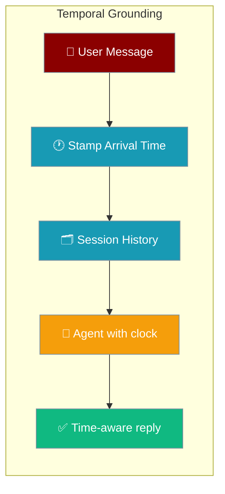
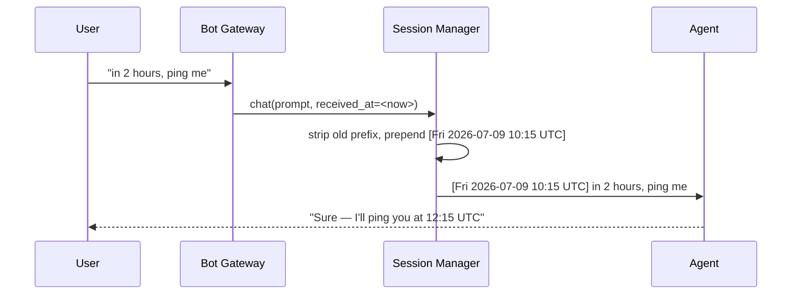

Prefix each inbound message with its arrival time so the agent can answer *"remind me in 2 hours"* or *"what did I say this morning?"*.



## Quick Start

<Steps>
<Step title="Enable timestamps in your gateway config">

Add one line under `session:` to stamp every inbound turn:

```yaml
# gateway.yaml
channels:
  telegram:
    platform: telegram
    token: "${TELEGRAM_BOT_TOKEN}"
    session:
      timestamps: true       # enable arrival-time prefix

agent:
  name: assistant
  instructions: "You are a helpful assistant. Use the time prefix on each message to interpret relative-time requests."
  model: gpt-4o-mini
```

Run with:

```bash
praisonai gateway start gateway.yaml
```

The model now sees each turn with its real arrival time:

```
[Fri 2026-07-09 10:15 UTC] Remind me in 2 hours to call mum.
```
</Step>

<Step title="Customise the template">

```yaml
session:
  timestamps: true
  timestamp_template: "[%Y-%m-%d %H:%M] "   # drop weekday and timezone
```

The template must contain a `YYYY-MM-DD HH:MM` date-time — the replay de-dup regex anchors on it. The `%a` weekday and `%Z` timezone are optional, so non-English server locales are safe.
</Step>
</Steps>

---

## How It Works

The session manager strips any stale prefix and re-stamps each turn with its real arrival time before the agent sees it.



| Behavior | Detail |
|----------|--------|
| Scope | Applied to both `per_user` (DM) and `per_chat` (group) turns |
| Group ordering | The time sits **outermost**, after sender attribution — e.g. `[Fri 2026-07-09 10:15 UTC] [alice] hello` |
| Replay-safe | Leading prefixes are stripped and re-rendered each turn, so compaction / reset never accumulates `[ts] [ts] … text` |
| Fallback | Without a platform receive time, a timezone-aware UTC `now()` is used so `%Z` renders `UTC` |
| Fail-open | On a `strftime` error the raw un-stamped content is returned — a bad template never breaks chat |

---

## Configuration Options

Set these under `session:` in your channel config.

| Option | Type | Default | Description |
|--------|------|---------|-------------|
| `timestamps` | `bool` | `False` | When true, each inbound turn is prefixed with its arrival time. Off by default for prompt-cache stability |
| `timestamp_template` | `str` | `"[%a %Y-%m-%d %H:%M %Z] "` | `strftime` template for the prefix. Must contain a `YYYY-MM-DD HH:MM` date-time — the replay de-dup regex anchors on it |

<Warning>
Keep `timestamps` **off** unless the agent needs relative-time reasoning. Every stamped turn is billed again on replay, and the changing prefix breaks prompt caching.
</Warning>

---

## Common Patterns

**Relative-time reminders** — the model reads the prefix to resolve *"in 2 hours"* against a real clock:

```yaml
session:
  timestamps: true
agent:
  instructions: "Resolve relative-time requests using the time prefix on each message."
```

**Group chats** — pair with `per_chat` scope; the timestamp sits outermost so sender attribution stays intact:

```yaml
session:
  session_scope: per_chat
  timestamps: true
```

The agent sees: `[Fri 2026-07-09 10:15 UTC] [alice] when's the launch?`

**Minimal prefix** — drop the weekday and timezone to save tokens:

```yaml
session:
  timestamps: true
  timestamp_template: "[%Y-%m-%d %H:%M] "
```

---

## Best Practices

<AccordionGroup>
<Accordion title="Enable it only when you need a clock">
Leave `timestamps` off for bots that never reason about time. The prefix changes on every turn, so it disrupts prompt caching and adds tokens to each replayed message. Turn it on for scheduling, reminders, or gap-aware assistants.
</Accordion>

<Accordion title="Keep the template short">
Every character in the prefix is billed on every replayed turn. `"[%Y-%m-%d %H:%M] "` is enough for most agents; the default adds the weekday and timezone for readability.
</Accordion>

<Accordion title="Keep the date-time in custom templates">
A custom `timestamp_template` must render a `YYYY-MM-DD HH:MM` inside the bracket — the replay de-dup regex anchors on that date-time, not on the English weekday. Templates that omit `%a` (or run under non-English locales) stay safe.
</Accordion>

<Accordion title="Let the session manager stamp turns">
Don't hand-format time prefixes in `instructions`. The session manager strips and re-stamps each turn so replay de-dup works; a manual prefix bypasses that and accumulates on history replay.
</Accordion>
</AccordionGroup>

---

## Related

<CardGroup cols={2}>
<Card title="Per-Chat Session Scope" icon="users" href="/docs/features/per-chat-session-scope">
  Share one transcript across a group — the scope this feature stacks on top of
</Card>
<Card title="Session Compaction" icon="database" href="/docs/features/bot-session-compaction">
  How stamped turns survive history compaction
</Card>
<Card title="Bot Gateway" icon="server" href="/docs/features/bot-gateway">
  Top-level gateway config that owns the `session:` block
</Card>
<Card title="Chat" icon="comment" href="/docs/features/chat">
  Chat-level docs where `received_at` shows up
</Card>
</CardGroup>
