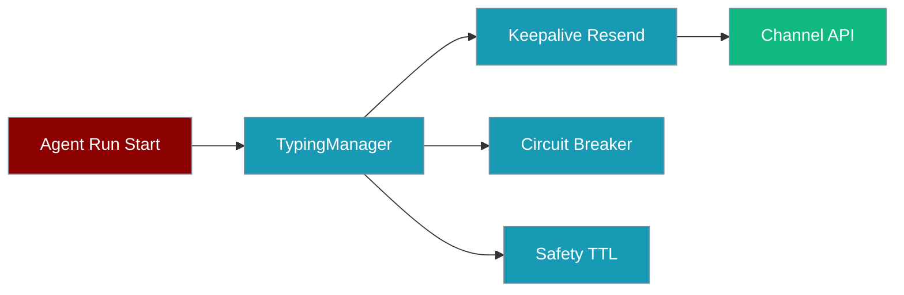

Typing indicators tell users the bot is working — with automatic keepalive resends, a circuit breaker on failures, and a safety TTL so a stuck indicator never hangs forever.



## Quick Start

<Steps>
<Step title="Enable typing on a Telegram bot">

```python
from praisonaiagents import Agent
from praisonai.bots import TelegramBot

agent = Agent(name="assistant", instructions="Helpful assistant")
bot = TelegramBot(token="...", agent=agent, typing_indicator=True)
bot.start()
```

</Step>

<Step title="Use as async context manager">

```python
async with bot.typing_manager(channel_id="123456"):
    result = await agent.astart("Long research task")
```

The indicator starts on entry and stops on exit — even if the agent raises an error.

</Step>
</Steps>

## How It Works

`TypingManager` checks `capabilities["typing"]` before sending. On supported channels (Telegram, Discord):

1. Sends typing action when the agent run starts
2. Resends on a keepalive interval to prevent expiry
3. Opens a circuit breaker after consecutive failures
4. Enforces a safety TTL so typing never persists indefinitely

Slack, WhatsApp, and Email skip typing automatically (`typing=False`).

## Best Practices

<AccordionGroup>
<Accordion title="Combine with status reactions for rich feedback">
Reactions show state on the user's message; typing shows activity in the input area.
</Accordion>

<Accordion title="Pair with streaming replies on Telegram">
Streaming reduces the need for typing on long answers — use both for tool-heavy agents.
</Accordion>

<Accordion title="Trust the safety TTL in production">
The TTL prevents stuck typing indicators if a run hangs or the channel API fails silently.
</Accordion>
</AccordionGroup>

## Related

<CardGroup cols={2}>
  <Card title="Channel Capabilities" icon="list-check" href="/docs/features/channel-capabilities">
    Which channels support typing
  </Card>
  <Card title="Streaming Replies" icon="message-pen" href="/docs/features/bot-streaming-replies">
    Live draft edits as alternative feedback
  </Card>
</CardGroup>
