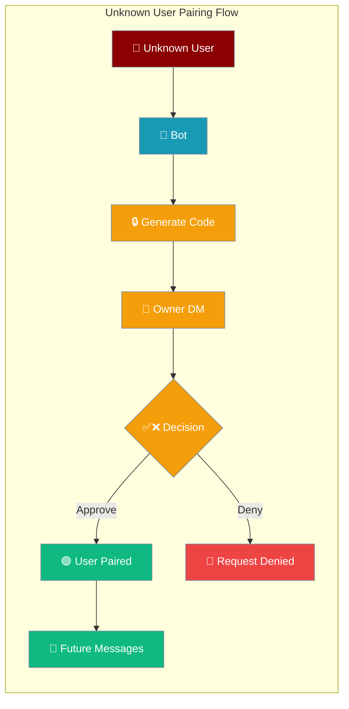
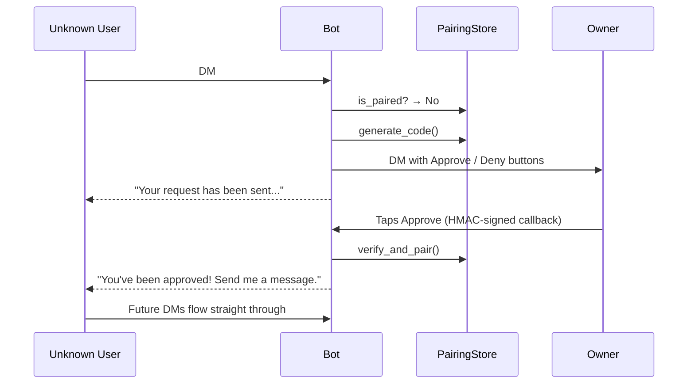
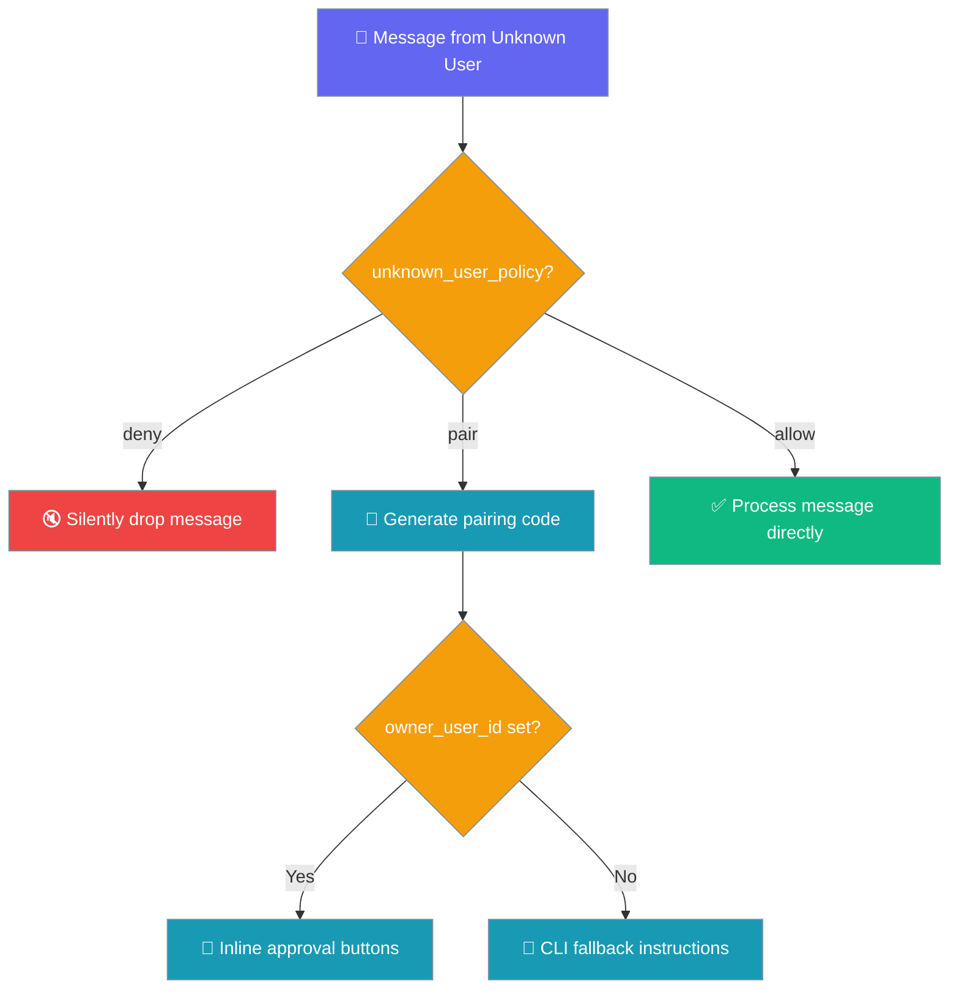
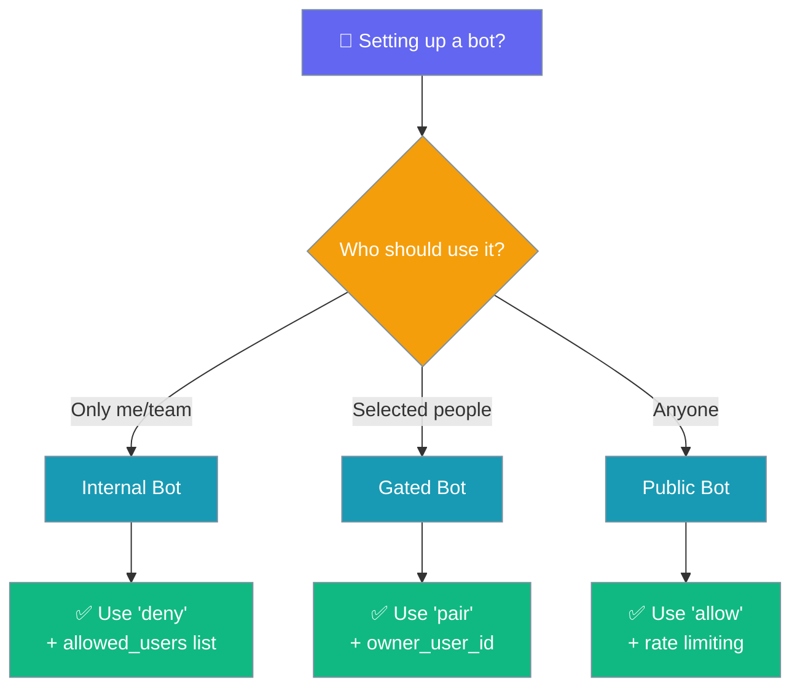

Bot pairing enables owner-approval for unknown users with inline Approve/Deny buttons sent directly to your DM.



## Quick Start

<Steps>
<Step title="Enable Pairing">
```python
from praisonaiagents import Agent
from praisonaiagents.bots import BotConfig

config = BotConfig(
    token="YOUR_BOT_TOKEN",
    unknown_user_policy="pair",
    owner_user_id="123456789",   # your Telegram/Discord/Slack user ID
)

agent = Agent(
    name="Support",
    instructions="You are a helpful support assistant.",
)
```
</Step>

<Step title="Production Environment">
```bash
export PRAISONAI_CALLBACK_SECRET="$(openssl rand -hex 32)"
```
Without this, inline-button callbacks stop working across bot restarts.
</Step>
</Steps>

---

## How It Works



The pairing system intercepts messages from users not in `allowed_users` and routes them through an approval workflow controlled by the `unknown_user_policy`.

---

## Policy Options



| Policy | Behaviour | When to use |
|--------|-----------|-------------|
| `"deny"` (default) | Silently drops messages from users not in `allowed_users`. | Closed / internal bots. |
| `"pair"` | Generates a code and DMs the owner an Approve/Deny button. Falls back to CLI if `owner_user_id` is unset. | Semi-public bots where you want owner control. |
| `"allow"` | Lets every unknown user through (no persistent pair). | Fully public bots (combine with rate limits / approval protocol). |

### Which Policy Should I Choose?



---

## CLI Fallback

When `owner_user_id` is not set, the bot replies to the requester:

```
Your pairing code: abc12345. Ask the owner to run: praisonai pairing approve telegram abc12345
```

The owner can then approve manually:

```bash
praisonai pairing approve <channel_type> <code>
```

Where `<channel_type>` is one of: `telegram`, `discord`, `slack`.

---

## Security: HMAC-signed Callbacks

All inline-button callbacks are cryptographically signed to prevent tampering:

- **Callback format**: `pair:{action}:{channel}:{user_id}:{code}:{sig}`
- **Signature**: First 8 hex chars of `HMAC-SHA256(PRAISONAI_CALLBACK_SECRET, payload)`
- **Verification**: Tampered `callback_data` fails verification and is silently ignored + logged

<Warning>
Without `PRAISONAI_CALLBACK_SECRET` set in your environment, a random per-process secret is used and inline buttons stop working after bot restart. Always set this in production:

```bash
export PRAISONAI_CALLBACK_SECRET="$(openssl rand -hex 32)"
```
</Warning>

---

## Platform-specific UI

<AccordionGroup>
<Accordion title="Telegram">
Uses `InlineKeyboardMarkup` with ✅ Approve / ❌ Deny buttons. Callbacks are handled via `CallbackQueryHandler` that parses the signed `callback_data` and verifies the HMAC signature.

**What the owner sees:**
```
User @username wants to chat. Approve access?
[✅ Approve] [❌ Deny]
```

**Implementation:** Telegram's `InlineKeyboardButton` with `callback_data` containing the signed pairing payload.
</Accordion>

<Accordion title="Discord">
Uses `discord.ui.View` with success (green) and danger (red) button styles. Handled via `button.callback` method that verifies the HMAC signature in the `custom_id`.

**What the owner sees:**
```
User username#1234 wants to chat. Approve access?
[✅ Approve] [❌ Deny]
```

**Implementation:** Discord's Button components in an Action Row with HMAC-signed `custom_id` values.
</Accordion>

<Accordion title="Slack">
Uses Block Kit `actions` block with primary (blue) and danger (red) button styles. Handled via `@app.action("pair_approve")` and `@app.action("pair_deny")` decorators that verify the signature in the button's `value`.

**What the owner sees:**
```
*@username* wants to chat. Approve access?
[✅ Approve] [❌ Deny]
```

**Implementation:** Slack Block Kit buttons with HMAC-signed values and dedicated action handlers.
</Accordion>
</AccordionGroup>

---

## Configuration Options

For the complete `BotConfig` options including `unknown_user_policy` and `owner_user_id`, see the canonical reference at [Messaging Bots Configuration](/docs/features/messaging-bots#configuration-options).

---

## Common Patterns

<Tabs>
<Tab title="Semi-public Bot">
```python
from praisonaiagents import Agent
from praisonaiagents.bots import BotConfig

config = BotConfig(
    token="your-bot-token",
    unknown_user_policy="pair",    # Enable approval workflow
    owner_user_id="123456789",     # Your platform user ID
)

agent = Agent(
    name="Support Bot",
    instructions="Help users with their questions",
)
```
Perfect for customer support or community bots where you want to vet new users.
</Tab>

<Tab title="Internal Bot">
```python
from praisonaiagents import Agent  
from praisonaiagents.bots import BotConfig

config = BotConfig(
    token="your-bot-token",
    unknown_user_policy="deny",           # Block unknown users
    allowed_users=["user123", "user456"], # Explicit allowlist
)

agent = Agent(
    name="Internal Assistant", 
    instructions="Help with internal tasks",
)
```
For team or company-internal bots with a fixed user list.
</Tab>

<Tab title="Public Bot">
```python
from praisonaiagents import Agent
from praisonaiagents.bots import BotConfig

config = BotConfig(
    token="your-bot-token", 
    unknown_user_policy="allow",     # Open to everyone
    auto_approve_tools=False,        # Still require tool approval
)

agent = Agent(
    name="Public Assistant",
    instructions="Help anyone with general questions",
)
```
For fully public bots. Combine with rate limiting and tool approval for safety.
</Tab>
</Tabs>

---

## Best Practices

<AccordionGroup>
<Accordion title="Always set PRAISONAI_CALLBACK_SECRET in production">
Generate a strong secret and set it as an environment variable:

```bash
# Generate and export
export PRAISONAI_CALLBACK_SECRET="$(openssl rand -hex 32)"

# Or set permanently in your deployment
echo "PRAISONAI_CALLBACK_SECRET=$(openssl rand -hex 32)" >> .env
```

Without this, inline buttons stop working when your bot restarts.
</Accordion>

<Accordion title="Use platform-native user IDs for owner_user_id">
Each platform has its own user ID format:
- **Telegram**: Numeric ID (e.g., `123456789`)  
- **Discord**: Snowflake ID (e.g., `123456789012345678`)
- **Slack**: User ID format (e.g., `U1234ABCD`)

Find your ID by messaging the bot directly and checking the logs, or use platform-specific methods.
</Accordion>

<Accordion title="Combine 'allow' policy with rate limiting and tool approval">
If using `unknown_user_policy="allow"` for a public bot, protect yourself with:

```python
config = BotConfig(
    unknown_user_policy="allow",
    auto_approve_tools=False,     # Users still need approval for dangerous tools
    debounce_ms=2000,            # Coalesce rapid messages
)
```

Consider also implementing rate limiting at the platform level.
</Accordion>

<Accordion title="Treat denied pairings as final">
When you deny a pairing request, the code is consumed and cannot be retried. The user must send a new message to generate a fresh code. This prevents spam and ensures each approval decision is deliberate.
</Accordion>
</AccordionGroup>

---

## Related

<CardGroup cols={2}>
<Card title="Messaging Bots" icon="robot" href="/docs/features/messaging-bots">
  Complete bot configuration and setup
</Card>
<Card title="Bot Security" icon="shield" href="/docs/best-practices/bot-security">
  Security best practices for bots
</Card>
</CardGroup>