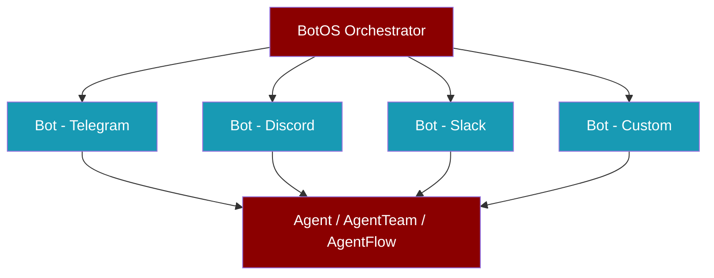
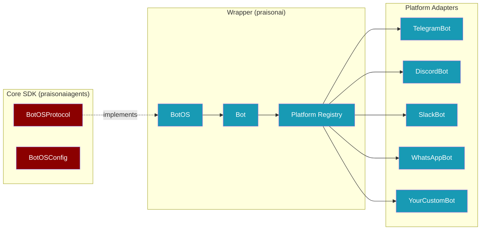

BotOS lets you deploy your AI agent to **multiple messaging platforms** with just a few lines of code. One agent brain, many channels.

## Quick Start

<Tabs>
  <Tab title="Single Bot">
    ```python
    from praisonai.bots import Bot
    from praisonaiagents import Agent

    agent = Agent(name="assistant", instructions="Be helpful")
    bot = Bot("telegram", agent=agent)
    bot.run()
    ```
  </Tab>
  <Tab title="Multi-Platform">
    ```python
    from praisonai.bots import BotOS
    from praisonaiagents import Agent

    agent = Agent(name="assistant", instructions="Be helpful")
    botos = BotOS(agent=agent, platforms=["telegram", "discord"])
    botos.run()
    ```
  </Tab>
  <Tab title="YAML Config">
    ```python
    from praisonai.bots import BotOS

    botos = BotOS.from_config("botos.yaml")
    botos.run()
    ```
  </Tab>
</Tabs>

## How It Works

<Steps>
  <Step title="Create your Agent">
    Build an `Agent`, `AgentTeam`, or `AgentFlow` — your AI brain.
  </Step>
  <Step title="Wrap in a Bot">
    `Bot("telegram", agent=agent)` wraps your agent for a single platform.
  </Step>
  <Step title="Orchestrate with BotOS">
    `BotOS` starts all your bots concurrently — one command, all platforms.
  </Step>
</Steps>

## Architecture



<Accordion title="Design principles">
  - **Protocol-driven**: `BotOSProtocol` lives in the lightweight core SDK; heavy implementations live in the wrapper
  - **Lazy loading**: Platform libraries (telegram, discord, etc.) are only imported when `start()` is called
  - **Agent-centric**: Every bot is powered by an Agent, AgentTeam, or AgentFlow
  - **Extensible**: Register custom platforms at runtime with `register_platform()`
</Accordion>

## Token Setup

Tokens are resolved automatically from environment variables. Set them once, use everywhere.

| Platform | Environment Variable |
|----------|---------------------|
| Telegram | `TELEGRAM_BOT_TOKEN` |
| Discord | `DISCORD_BOT_TOKEN` |
| Slack | `SLACK_BOT_TOKEN` + `SLACK_APP_TOKEN` |
| WhatsApp | `WHATSAPP_ACCESS_TOKEN` + `WHATSAPP_PHONE_NUMBER_ID` |

<Tip>
You can always override with an explicit `token=` parameter:
```python
bot = Bot("telegram", agent=agent, token="your-token-here")
```
</Tip>

## Usage Examples

### Single Agent on Telegram

```python
from praisonai.bots import Bot
from praisonaiagents import Agent

agent = Agent(
    name="assistant",
    instructions="You are a helpful assistant.",
    llm="gpt-4o-mini",
)

bot = Bot("telegram", agent=agent)
bot.run()  # Blocks until Ctrl+C
```

### AgentTeam on Discord

```python
from praisonai.bots import Bot
from praisonaiagents import Agent, AgentTeam, Task

researcher = Agent(name="researcher", instructions="Research topics thoroughly")
writer = Agent(name="writer", instructions="Write clear, engaging content")

t1 = Task(name="research", description="Research the user's topic", agent=researcher)
t2 = Task(name="write", description="Write a summary based on research", agent=writer)

team = AgentTeam(agents=[researcher, writer], tasks=[t1, t2])

bot = Bot("discord", agent=team)
bot.run()
```

### AgentFlow on Multiple Platforms

```python
from praisonai.bots import BotOS, Bot
from praisonaiagents import Agent, AgentFlow, Task

analyst = Agent(name="analyst", instructions="Analyze data")
reporter = Agent(name="reporter", instructions="Create reports")

t1 = Task(name="analyze", description="Analyze the input", agent=analyst)
t2 = Task(name="report", description="Generate a report", agent=reporter)

flow = AgentFlow(steps=[t1, t2])

botos = BotOS(bots=[
    Bot("telegram", agent=flow),
    Bot("discord", agent=flow),
    Bot("slack", agent=flow, app_token="xapp-..."),
])
botos.run()
```

### YAML Configuration

Create a `botos.yaml` file:

```yaml
agent:
  name: assistant
  instructions: You are a helpful assistant.
  llm: gpt-4o-mini
platforms:
  telegram:
    token: ${TELEGRAM_BOT_TOKEN}
  discord:
    token: ${DISCORD_BOT_TOKEN}
```

Then load and run:

```python
from praisonai.bots import BotOS

botos = BotOS.from_config("botos.yaml")
botos.run()
```

<Note>
Environment variables in `${VAR_NAME}` format are automatically resolved.
</Note>

## Smart Defaults

When you create a `Bot()`, it automatically enhances your agent with useful defaults — no configuration needed:

```python
from praisonai.bots import Bot
from praisonaiagents import Agent

# Agent gets smart defaults automatically
agent = Agent(name="assistant", instructions="Be helpful")
bot = Bot("telegram", agent=agent)
bot.run()
# Agent now has: search_web, schedule_add, schedule_list, schedule_remove tools
```

| Default | What Happens | When Applied |
|---------|-------------|--------------|
| **Safe tools** | `search_web`, `schedule_add`, `schedule_list`, `schedule_remove` | Only if agent has no tools |

<Note>
Smart defaults only apply to plain `Agent` instances. `AgentTeam` and `AgentFlow` are left untouched — they already have their own configuration.
</Note>

## Health Checks

Every bot adapter supports `probe()` and `health()` for diagnostics:

```python
from praisonai.bots import Bot
from praisonaiagents import Agent

agent = Agent(name="assistant", instructions="Be helpful")
bot = Bot("telegram", agent=agent)

import asyncio

# Test connectivity before starting
result = asyncio.run(bot.probe())
print(result.ok)        # True if token is valid and API is reachable
print(result.platform)  # "telegram"
print(result.latency)   # Response time in seconds

# Get detailed health after running
health = asyncio.run(bot.health())
print(health.ok)
print(health.uptime)
print(health.sessions_active)
```

<Tip>
Use `probe()` in CI/CD pipelines or doctor checks to verify bot tokens before deployment.
</Tip>

---

## Extending Platforms

Add your own messaging platform in 3 steps:

<Steps>
  <Step title="Create your adapter">
    ```python
    class LineBot:
        def __init__(self, token="", agent=None, **kwargs):
            self.token = token
            self.agent = agent

        async def start(self):
            # Connect to LINE API and start listening
            ...

        async def stop(self):
            # Graceful shutdown
            ...
    ```
  </Step>
  <Step title="Register the platform">
    ```python
    from praisonai.bots._registry import register_platform

    register_platform("line", LineBot)
    ```
  </Step>
  <Step title="Use it like any built-in platform">
    ```python
    from praisonai.bots import Bot
    from praisonaiagents import Agent

    agent = Agent(name="assistant", instructions="Be helpful")
    bot = Bot("line", agent=agent, token="your-line-token")
    bot.run()
    ```
  </Step>
</Steps>

<Accordion title="Adapter contract">
Your custom adapter class must implement:

| Method | Required | Description |
|--------|----------|-------------|
| `__init__(**kwargs)` | Yes | Accept `token`, `agent`, and platform-specific params |
| `async start()` | Yes | Start the bot (connect, listen for messages) |
| `async stop()` | Yes | Gracefully stop the bot |
| `async send_message(channel_id, content)` | Optional | Send a message programmatically |
| `on_message(handler)` | Optional | Register a message handler |
| `on_command(command)` | Optional | Register a command handler |
| `is_running` (property) | Optional | Whether the bot is currently running |
</Accordion>

## Managing Bots

```python
from praisonai.bots import BotOS, Bot
from praisonaiagents import Agent

agent = Agent(name="assistant", instructions="Be helpful")

botos = BotOS()

# Add bots
botos.add_bot(Bot("telegram", agent=agent))
botos.add_bot(Bot("discord", agent=agent))

# List platforms
print(botos.list_bots())  # ["telegram", "discord"]

# Get a specific bot
tg_bot = botos.get_bot("telegram")

# Remove a bot
botos.remove_bot("discord")

# Start all remaining bots
botos.run()
```

## API Reference

<Accordion title="Bot class">
<ParamField path="platform" type="str" required>
  Platform name: `"telegram"`, `"discord"`, `"slack"`, `"whatsapp"`, or any registered custom platform.
</ParamField>
<ParamField path="agent" type="Agent | AgentTeam | AgentFlow">
  The AI agent that powers the bot.
</ParamField>
<ParamField path="token" type="str">
  Explicit token. Falls back to `{PLATFORM}_BOT_TOKEN` env var.
</ParamField>
<ParamField path="**kwargs">
  Platform-specific parameters (e.g., `app_token` for Slack, `mode` for WhatsApp).
</ParamField>

**Methods:**
- `bot.run()` — Start the bot (sync, blocks)
- `await bot.start()` — Start the bot (async)
- `await bot.stop()` — Stop the bot
- `await bot.send_message(channel_id, content)` — Send a message
- `await bot.probe()` — Test channel connectivity (returns `ProbeResult`)
- `await bot.health()` — Get detailed health status (returns `HealthResult`)
- `bot.register_command(name, handler)` — Register a custom chat command
- `bot.list_commands()` — List all registered commands
</Accordion>

<Accordion title="BotOS class">
<ParamField path="bots" type="list[Bot]">
  Pre-built Bot instances to orchestrate.
</ParamField>
<ParamField path="agent" type="Agent | AgentTeam | AgentFlow">
  Shared agent — used with `platforms` to auto-create Bots.
</ParamField>
<ParamField path="platforms" type="list[str]">
  Platform names — auto-creates a Bot per platform using `agent`.
</ParamField>

**Methods:**
- `botos.run()` — Start all bots (sync, blocks)
- `await botos.start()` — Start all bots (async)
- `await botos.stop()` — Stop all bots
- `botos.add_bot(bot)` — Register a bot
- `botos.remove_bot("platform")` — Remove a bot
- `botos.list_bots()` — List platform names
- `botos.get_bot("platform")` — Get a bot by platform
- `BotOS.from_config("path.yaml")` — Load from YAML
</Accordion>

<Accordion title="Platform Registry">
```python
from praisonai.bots._registry import (
    register_platform,    # Add a custom platform
    list_platforms,       # List all platforms
    resolve_adapter,      # Get adapter class by name
    get_platform_registry # Get full registry dict
)
```
</Accordion>
