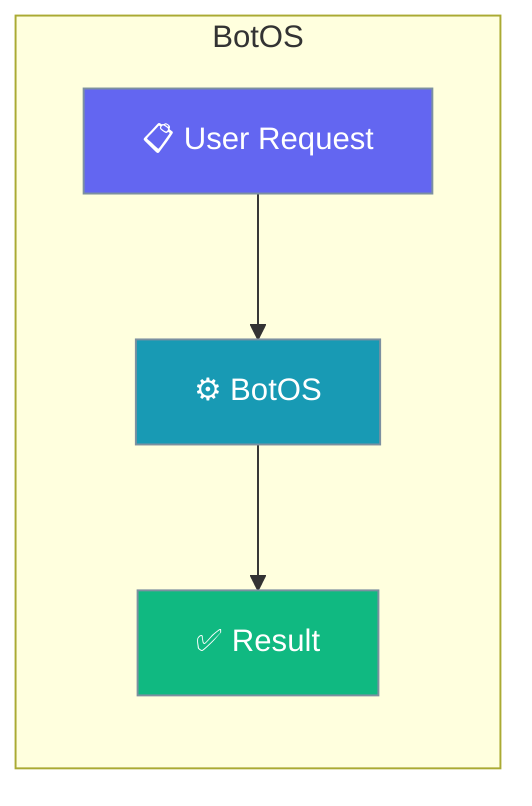
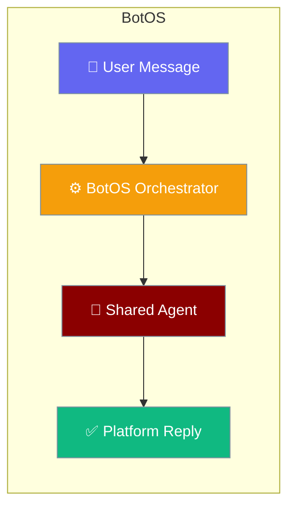
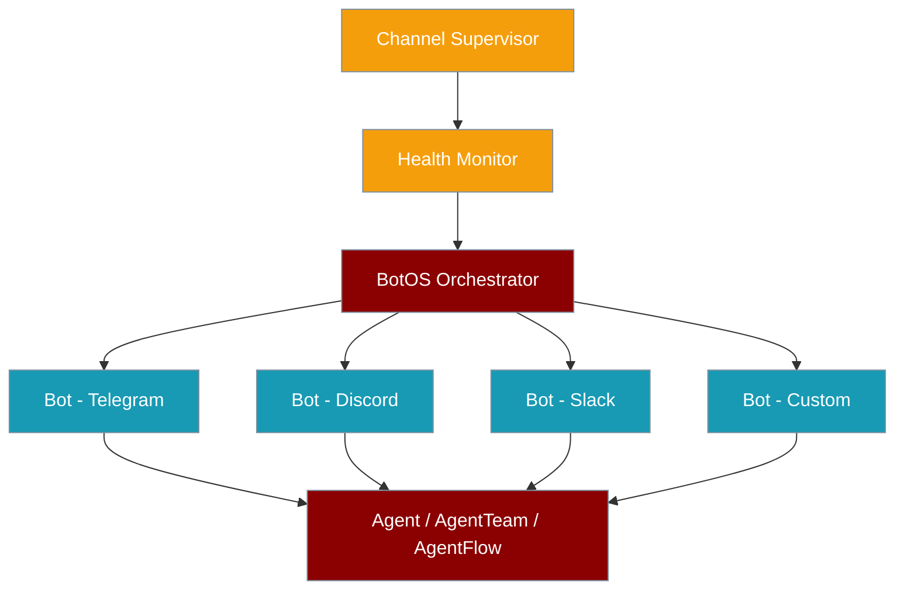
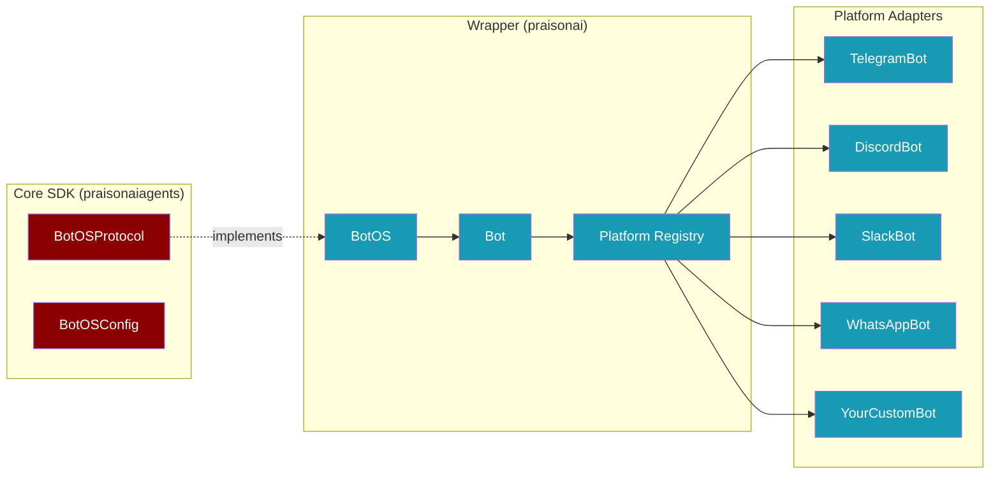
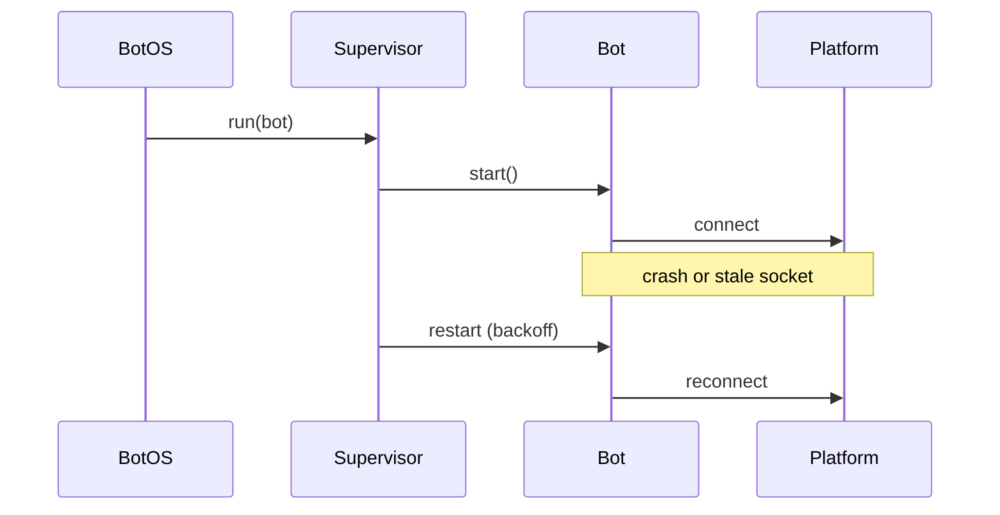
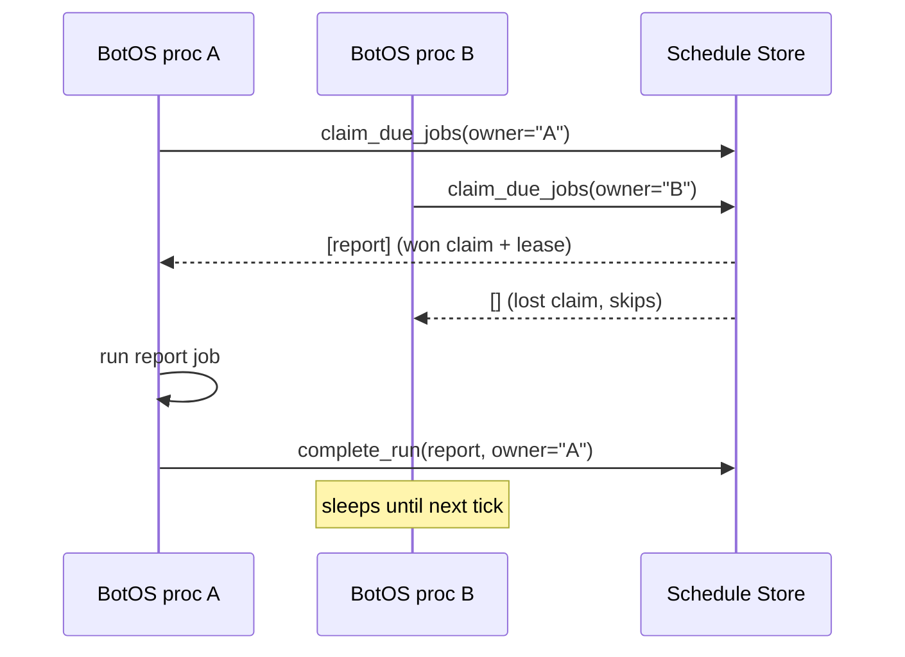
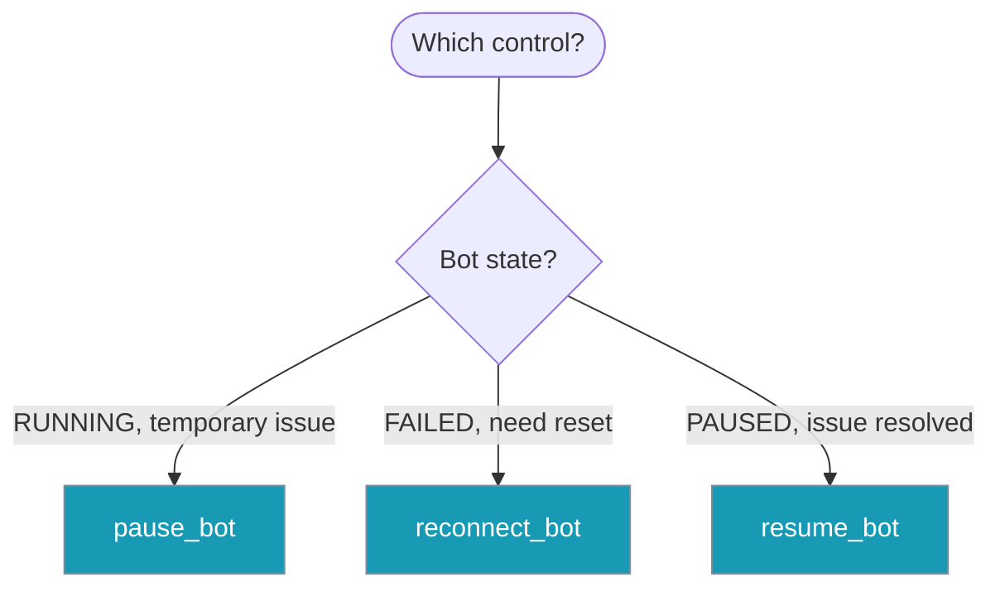

```mermaid
graph LR
    subgraph "BotOS"
        Request[📋 User Request] --> Process[⚙️ BotOS]
        Process --> Result[✅ Result]
    end

    classDef input fill:#6366F1,stroke:#7C90A0,color:#fff
    classDef process fill:#189AB4,stroke:#7C90A0,color:#fff
    classDef output fill:#10B981,stroke:#7C90A0,color:#fff

    class Request input
    class Process process
    class Result output
```


```python
from praisonai_bot.bots import BotOS
from praisonaiagents import Agent

agent = Agent(name="assistant", instructions="You are a helpful assistant.")
botos = BotOS(agent=agent, platforms=["telegram", "discord"])
botos.run()
```

The user chats on Telegram or Discord; one shared agent brain answers on every connected platform.


```mermaid
graph LR
    subgraph "BotOS"
        In[📝 User Message] --> Orchestrator[⚙️ BotOS Orchestrator]
        Orchestrator --> Agent[🤖 Shared Agent]
        Agent --> Out[✅ Platform Reply]
    end

    classDef input fill:#6366F1,stroke:#7C90A0,color:#fff
    classDef process fill:#F59E0B,stroke:#7C90A0,color:#fff
    classDef agent fill:#8B0000,stroke:#7C90A0,color:#fff
    classDef output fill:#10B981,stroke:#7C90A0,color:#fff

    class In input
    class Orchestrator process
    class Agent agent
    class Out output
```

### Orchestration


```mermaid
flowchart TB
    Supervisor[Channel Supervisor] --> Monitor[Health Monitor]
    Monitor --> BotOS[BotOS Orchestrator]
    BotOS --> B1[Bot - Telegram]
    BotOS --> B2[Bot - Discord]
    BotOS --> B3[Bot - Slack]
    BotOS --> B4[Bot - Custom]
    B1 --> Agent[Agent / AgentTeam / AgentFlow]
    B2 --> Agent
    B3 --> Agent
    B4 --> Agent

    classDef supervisor fill:#F59E0B,stroke:#7C90A0,color:#fff
    classDef botos fill:#8B0000,stroke:#7C90A0,color:#fff
    classDef bot fill:#189AB4,stroke:#7C90A0,color:#fff
    classDef agent fill:#8B0000,stroke:#7C90A0,color:#fff

    class Supervisor,Monitor supervisor
    class BotOS botos
    class B1,B2,B3,B4 bot
    class Agent agent

```

BotOS lets you deploy your AI agent to **multiple messaging platforms** with just a few lines of code. One agent brain, many channels.

## Quick Start

<Steps>
  <Step title="Single platform">
    ```python
    from praisonai_bot.bots import Bot
    from praisonaiagents import Agent

    agent = Agent(name="assistant", instructions="Be helpful")
    bot = Bot("telegram", agent=agent)
    bot.run()
    ```
    <Tip>
    `from praisonai.bots import Bot` also works when the `praisonai` wrapper is installed (backward-compatible shim).
    </Tip>
  </Step>
  <Step title="Multiple platforms">
    ```python
    from praisonai_bot.bots import BotOS
    from praisonaiagents import Agent

    agent = Agent(name="assistant", instructions="Be helpful")
    botos = BotOS(agent=agent, platforms=["telegram", "discord"])
    botos.run()
    ```
  </Step>
  <Step title="YAML config">
    ```python
    from praisonai_bot.bots import BotOS

    botos = BotOS.from_config("botos.yaml")
    botos.run()
    ```
  </Step>
</Steps>

## How It Works

<Steps>
  <Step title="Create your Agent">
    Build an `Agent`, `AgentTeam`, or `AgentFlow` — your AI brain.
  </Step>
  <Step title="Wrap in a Bot">
    `Bot("telegram", agent=agent)` wraps your agent for a single platform.
  </Step>
  <Step title="Orchestrate with BotOS">
    `BotOS` starts all your bots concurrently — one command, all platforms.
  </Step>
</Steps>

## Architecture


```mermaid
flowchart LR
    subgraph Core["Core SDK (praisonaiagents)"]
        Proto[BotOSProtocol]
        Config[BotOSConfig]
    end
    subgraph Wrapper["Wrapper (praisonai)"]
        BotOS[BotOS]
        Bot[Bot]
        Reg[Platform Registry]
    end
    subgraph Adapters["Platform Adapters"]
        TG[TelegramBot]
        DC[DiscordBot]
        SL[SlackBot]
        WA[WhatsAppBot]
        Custom[YourCustomBot]
    end

    Proto -.->|implements| BotOS
    BotOS --> Bot
    Bot --> Reg
    Reg --> TG
    Reg --> DC
    Reg --> SL
    Reg --> WA
    Reg --> Custom

    style Proto fill:#8B0000,color:#fff
    style Config fill:#8B0000,color:#fff
    style BotOS fill:#189AB4,color:#fff
    style Bot fill:#189AB4,color:#fff
    style Reg fill:#189AB4,color:#fff
    style TG fill:#189AB4,color:#fff
    style DC fill:#189AB4,color:#fff
    style SL fill:#189AB4,color:#fff
    style WA fill:#189AB4,color:#fff
    style Custom fill:#189AB4,color:#fff
```

<Accordion title="Design principles">
  - **Protocol-driven**: `BotOSProtocol` lives in the lightweight core SDK; heavy implementations live in the wrapper
  - **Lazy loading**: Platform libraries (telegram, discord, etc.) are only imported when `start()` is called
  - **Agent-centric**: Every bot is powered by an Agent, AgentTeam, or AgentFlow
  - **Extensible**: Register custom platforms at runtime with `register_platform()`, or distribute packaged connectors via the `praisonai.channels` entry-point group for zero-code auto-registration
</Accordion>

## Token Setup

Tokens are resolved automatically from environment variables. Set them once, use everywhere.

| Platform | Environment Variable |
|----------|---------------------|
| Telegram | `TELEGRAM_BOT_TOKEN` |
| Discord | `DISCORD_BOT_TOKEN` |
| Slack | `SLACK_BOT_TOKEN` + `SLACK_APP_TOKEN` |
| WhatsApp | `WHATSAPP_ACCESS_TOKEN` + `WHATSAPP_PHONE_NUMBER_ID` |

<Tip>
You can always override with an explicit `token=` parameter:
```python
bot = Bot("telegram", agent=agent, token="your-token-here")
```
</Tip>

## Usage Examples

<Tip>
Examples below use `from praisonai.bots import Bot, BotOS` — the wrapper aliases. Replace with `from praisonai_bot.bots import Bot, BotOS` when using the standalone `praisonai-bot` package without the wrapper.
</Tip>

### Single Agent on Telegram

<Tip>`from praisonai_bot.bots import Bot` is the canonical bot-tier import. `from praisonai.bots import Bot` is a backward-compatible shim when the `praisonai` wrapper is installed.</Tip>

```python
from praisonai_bot.bots import Bot
from praisonaiagents import Agent

agent = Agent(
    name="assistant",
    instructions="You are a helpful assistant.",
    llm="gpt-4o-mini",
)

bot = Bot("telegram", agent=agent)
bot.run()  # Blocks until Ctrl+C
```

### AgentTeam on Discord

```python
from praisonai_bot.bots import Bot
from praisonaiagents import Agent, AgentTeam, Task

researcher = Agent(name="researcher", instructions="Research topics thoroughly")
writer = Agent(name="writer", instructions="Write clear, engaging content")

t1 = Task(name="research", description="Research the user's topic", agent=researcher)
t2 = Task(name="write", description="Write a summary based on research", agent=writer)

team = AgentTeam(agents=[researcher, writer], tasks=[t1, t2])

bot = Bot("discord", agent=team)
bot.run()
```

### AgentFlow on Multiple Platforms

```python
from praisonai_bot.bots import BotOS, Bot
from praisonaiagents import Agent, AgentFlow, Task

analyst = Agent(name="analyst", instructions="Analyze data")
reporter = Agent(name="reporter", instructions="Create reports")

t1 = Task(name="analyze", description="Analyze the input", agent=analyst)
t2 = Task(name="report", description="Generate a report", agent=reporter)

flow = AgentFlow(steps=[t1, t2])

botos = BotOS(bots=[
    Bot("telegram", agent=flow),
    Bot("discord", agent=flow),
    Bot("slack", agent=flow, app_token="xapp-..."),
])
botos.run()
```

### YAML Configuration

Create a `botos.yaml` file:

```yaml
agent:
  name: assistant
  instructions: You are a helpful assistant.
  llm: gpt-4o-mini
platforms:
  telegram:
    token: ${TELEGRAM_BOT_TOKEN}
  discord:
    token: ${DISCORD_BOT_TOKEN}
```

Then load and run:

```python
from praisonai_bot.bots import BotOS

botos = BotOS.from_config("botos.yaml")
botos.run()
```

<Note>
Environment variables in `${VAR_NAME}` format are automatically resolved.
</Note>

## Smart Defaults

When you create a `Bot()`, it automatically enhances your agent with useful defaults — no configuration needed:

```python
from praisonai.bots import Bot
from praisonaiagents import Agent

# Agent gets smart defaults automatically
agent = Agent(name="assistant", instructions="Be helpful")
bot = Bot("telegram", agent=agent)
bot.run()
# Agent now has: search_web, schedule_add, schedule_list, schedule_remove tools
```

| Default | What Happens | When Applied |
|---------|-------------|--------------|
| **Safe tools** | `search_web`, `schedule_add`, `schedule_list`, `schedule_remove` | Only if agent has no tools |

<Note>
Smart defaults only apply to plain `Agent` instances. `AgentTeam` and `AgentFlow` are left untouched — they already have their own configuration.
</Note>

## Auto-Recovery & Health Monitoring

Every `BotOS` instance is supervised by default — crashed bots are restarted with backoff, and proactive health checks catch hung connections before users notice.


```mermaid
sequenceDiagram
    participant BotOS
    participant Supervisor
    participant Bot
    participant Platform

    BotOS->>Supervisor: run(bot)
    Supervisor->>Bot: start()
    Bot->>Platform: connect
    Note over Bot,Platform: crash or stale socket
    Supervisor->>Bot: restart (backoff)
    Bot->>Platform: reconnect
```

Supervision is on automatically — no extra arguments needed:

```python
from praisonai.bots import BotOS
from praisonaiagents import Agent

agent = Agent(name="assistant", instructions="Be helpful.")
botos = BotOS(agent=agent, platforms=["telegram", "discord"])
botos.run()  # supervised by default
```

Tune the health monitor when you need tighter sweeps or restart caps:

```python
from praisonai.bots import BotOS
from praisonai.gateway.health_monitor import HealthMonitorConfig
from praisonaiagents import Agent

agent = Agent(name="assistant", instructions="Be helpful.")

botos = BotOS(
    agent=agent,
    platforms=["telegram"],
    health_monitor=HealthMonitorConfig(interval=120, max_restarts_per_hour=20),
)
```

Opt out when an external supervisor (systemd, Kubernetes) owns restarts:

```python
botos = BotOS(agent=agent, platforms=["telegram"], enable_supervision=False)
```

<Note>
`Bot(..., enable_supervision=...)` and `BotOS(..., enable_supervision=...)` are two separate kwargs on two separate classes — set the one that matches the entry point you're actually calling. See [Auto-reconnect on `long-running-bots`](/docs/features/long-running-bots#auto-reconnect-default) for the single-`Bot` path.
</Note>

```yaml
# botos.yaml
agent:
  name: assistant
  instructions: Be helpful.
platforms:
  telegram:
    token: ${TELEGRAM_BOT_TOKEN}
  discord:
    token: ${DISCORD_BOT_TOKEN}
health:
  interval: 300
  startup_grace: 60
  max_restarts_per_hour: 10
supervision:
  enabled: true   # default; set false to opt out
```

## Multi-Process / HA Deployments

Running more than one `BotOS` process — for high availability, horizontal scaling, or a brief rolling-restart overlap — used to double-fire every scheduled job, double-posting messages, double-charging tokens, and duplicating side effects.

Each due job is now claimed atomically before it runs, so exactly one `BotOS` process fires it; the others skip silently. This needs no config change — both bundled stores support atomic claim via an advisory-locked `claim_due`: the default `ConfigYamlScheduleStore` and `FileScheduleStore`.


```mermaid
sequenceDiagram
    participant procA as BotOS proc A
    participant procB as BotOS proc B
    participant store as Schedule Store

    procA->>store: claim_due_jobs(owner="A")
    procB->>store: claim_due_jobs(owner="B")
    store-->>procA: [report] (won claim + lease)
    store-->>procB: [] (lost claim, skips)
    procA->>procA: run report job
    procA->>store: complete_run(report, owner="A")
    Note over procB: sleeps until next tick
```

Verify the guarantee is engaged from the startup log — every ticker prints one line when its schedule loop starts:

```
BotOS: schedule loop started (30s tick, atomic_claim=True)
```

`atomic_claim=True` confirms cross-process at-most-once is active. `atomic_claim=False` means the current store does not implement `claim_due`, so the legacy non-atomic path is in use and a job can fire once per process.

Start two processes against the same store and watch the log — only one fires each job:

```python
from praisonai.bots import BotOS
from praisonaiagents import Agent

agent = Agent(name="assistant", instructions="Be helpful.")
botos = BotOS(agent=agent, platforms=["telegram"])
botos.run()  # run this same script in two processes; each due job fires once
```

| Store | At-most-once | How |
|-------|-------------|-----|
| `ConfigYamlScheduleStore` (default) | ✅ | Advisory-locked `claim_due` |
| `FileScheduleStore` | ✅ | Advisory-locked `claim_due` |
| Custom store | Depends | Only when it implements `claim_due` on `ScheduleStoreProtocol` |

<Note>
If a `BotOS` process crashes mid-run, its 300-second lease expires and another ticker re-claims the job — no permanent job loss. Single-process behaviour is unchanged.
</Note>

Related: [Bot Lifecycle Hooks → SCHEDULE_TRIGGER](/docs/features/bot-lifecycle-hooks), [Scheduled Run Policy](/docs/features/scheduled-run-policy), [Proactive Delivery](/docs/features/proactive-delivery).

## Operator Controls

When supervision is enabled, use Python API controls (BotOS has no CLI for these):

```python
botos.pause_bot("telegram")      # stop processing; returns False if supervision disabled
botos.resume_bot("telegram")     # restart from pause
botos.reconnect_bot("telegram")  # full reset + reconnect
```


```mermaid
graph TD
    Start([Which control?]) --> Question{Bot state?}
    Question -->|RUNNING, temporary issue| Pause[pause_bot]
    Question -->|FAILED, need reset| Reconnect[reconnect_bot]
    Question -->|PAUSED, issue resolved| Resume[resume_bot]

    classDef action fill:#189AB4,stroke:#7C90A0,color:#fff
    class Pause,Resume,Reconnect action
```

## Aggregated Health

```python
import asyncio
from praisonai.bots import BotOS
from praisonaiagents import Agent

agent = Agent(name="assistant", instructions="Be helpful.")
botos = BotOS(agent=agent, platforms=["telegram", "discord"])

async def check():
    health_by_platform = await botos.health()
    # {"telegram": HealthResult(...), "discord": HealthResult(...)}
    tg = health_by_platform["telegram"]
    print(tg.ok)             # bool — overall pass/fail
    print(tg.is_running)     # bool — adapter loop alive
    print(tg.uptime_seconds) # float | None
    print(tg.probe.ok)       # bool — platform API reachable
    print(tg.sessions)       # int — active sessions
    print(tg.error)          # str | None — populated when probe fails

    status = botos.get_supervisor_status()
    # supervisor + health-monitor snapshot for /healthz or metrics
    return status

asyncio.run(check())
```

Plug `await botos.health()` into a `/healthz` endpoint or Prometheus exporter — one dict per platform, no custom wiring per adapter.

## Unified Per-User Session

Link multiple platforms so one human gets one conversation across all channels:

```python
from praisonai.bots import BotOS
from praisonaiagents import Agent
from praisonaiagents.session import FileIdentityResolver

agent = Agent(name="assistant", instructions="Be helpful.")

resolver = FileIdentityResolver()
resolver.link("telegram", "12345", "alice")
resolver.link("discord", "snowflake-1", "alice")

botos = BotOS(
    agent=agent,
    platforms=["telegram", "discord"],
    identity_resolver=resolver,  # Cross-platform sessions
)
```

<Tip>
See [Cross-Platform Sessions](/features/cross-platform-mirror) for complete documentation on identity linking and unified sessions.
</Tip>

## Health Checks

Every bot adapter supports `probe()` and `health()` for diagnostics:

```python
from praisonai.bots import Bot
from praisonaiagents import Agent

agent = Agent(name="assistant", instructions="Be helpful")
bot = Bot("telegram", agent=agent)

import asyncio

# Test connectivity before starting
result = asyncio.run(bot.probe())
print(result.ok)        # True if token is valid and API is reachable
print(result.platform)  # "telegram"
print(result.latency)   # Response time in seconds

# Get detailed health after running
health = asyncio.run(bot.health())
print(health.ok)
print(health.platform)
print(health.is_running)
print(health.uptime_seconds)
print(health.sessions)
print(health.error)
```

<Tip>
Use `probe()` in CI/CD pipelines or doctor checks to verify bot tokens before deployment.
</Tip>

---

## Extending Platforms

Add your own messaging platform in 3 steps:

<Steps>
  <Step title="Create your adapter">
    ```python
    class LineBot:
        def __init__(self, token="", agent=None, **kwargs):
            self.token = token
            self.agent = agent

        async def start(self):
            # Connect to LINE API and start listening
            ...

        async def stop(self):
            # Graceful shutdown
            ...
    ```
  </Step>
  <Step title="Register the platform">
    ```python
    from praisonai.bots._registry import register_platform

    register_platform("line", LineBot)
    ```
  </Step>
  <Step title="Use it like any built-in platform">
    ```python
    from praisonai.bots import Bot
    from praisonaiagents import Agent

    agent = Agent(name="assistant", instructions="Be helpful")
    bot = Bot("line", agent=agent, token="your-line-token")
    bot.run()
    ```
  </Step>
  <Step title="Remove a platform (optional)">
    Useful for tests, hot-reloads, or multi-tenant cleanup:

    ```python
    from praisonai.bots._registry import get_default_bot_registry

    removed = get_default_bot_registry().unregister("line")  # bool
    ```

    `unregister()` returns `True` if the platform was registered and removed, `False` otherwise. It's safe to call even when the platform isn't registered.
  </Step>
</Steps>

<Accordion title="Adapter contract">
Your custom adapter class must implement:

| Method | Required | Description |
|--------|----------|-------------|
| `__init__(**kwargs)` | Yes | Accept `token`, `agent`, and platform-specific params |
| `async start()` | Yes | Start the bot (connect, listen for messages) |
| `async stop()` | Yes | Gracefully stop the bot |
| `async send_message(channel_id, content)` | Optional | Send a message programmatically |
| `on_message(handler)` | Optional | Register a message handler |
| `on_command(command)` | Optional | Register a command handler |
| `is_running` (property) | Optional | Whether the bot is currently running |
</Accordion>

## Managing Bots

```python
from praisonai.bots import BotOS, Bot
from praisonaiagents import Agent

agent = Agent(name="assistant", instructions="Be helpful")

botos = BotOS()

# Add bots
botos.add_bot(Bot("telegram", agent=agent))
botos.add_bot(Bot("discord", agent=agent))

# List platforms
print(botos.list_bots())  # ["telegram", "discord"]

# Get a specific bot
tg_bot = botos.get_bot("telegram")

# Remove a bot
botos.remove_bot("discord")

# Start all remaining bots
botos.run()
```

## API Reference

<Accordion title="Bot class">
<ParamField path="platform" type="str" required>
  Platform name: `"telegram"`, `"discord"`, `"slack"`, `"whatsapp"`, or any registered custom platform.
</ParamField>
<ParamField path="agent" type="Agent | AgentTeam | AgentFlow">
  The AI agent that powers the bot.
</ParamField>
<ParamField path="token" type="str">
  Explicit token. Falls back to `{PLATFORM}_BOT_TOKEN` env var.
</ParamField>
<ParamField path="identity_resolver" type="IdentityResolverProtocol">
  Cross-platform identity resolver for unified sessions. `StoreBackedIdentityResolver.from_env()` (from `praisonai.bots`) reuses the gateway pairing store so paired users share one session out of the box — see [Cross-Platform Sessions](/docs/features/cross-platform-mirror#storebackedidentityresolver).
</ParamField>
<ParamField path="**kwargs">
  Platform-specific parameters (e.g., `app_token` for Slack, `mode` for WhatsApp).
</ParamField>

**Methods:**
- `bot.run()` — Start the bot (sync, blocks)
- `await bot.start()` — Start the bot (async)
- `await bot.stop()` — Stop the bot
- `await bot.send_message(channel_id, content)` — Send a message
- `await bot.probe()` — Test channel connectivity (returns `ProbeResult`)
- `await bot.health()` — Get detailed health status (returns `HealthResult`)
- `bot.register_command(name, handler)` — Register a custom chat command
- `bot.list_commands()` — List all registered commands
</Accordion>

<Accordion title="BotOS class">
<ParamField path="bots" type="list[Bot]">
  Pre-built Bot instances to orchestrate.
</ParamField>
<ParamField path="agent" type="Agent | AgentTeam | AgentFlow">
  Shared agent — used with `platforms` to auto-create Bots.
</ParamField>
<ParamField path="platforms" type="list[str]">
  Platform names — auto-creates a Bot per platform using `agent`.
</ParamField>
<ParamField path="identity_resolver" type="IdentityResolverProtocol">
  Cross-platform identity resolver for unified sessions. `StoreBackedIdentityResolver.from_env()` (from `praisonai.bots`) reuses the gateway pairing store so paired users share one session out of the box — see [Cross-Platform Sessions](/docs/features/cross-platform-mirror#storebackedidentityresolver).
</ParamField>
<ParamField path="health_monitor" type="HealthMonitorConfig">
  Proactive health sweep settings (`interval`, `startup_grace`, `stale_after`, `stuck_after`, `max_restarts_per_hour`).
</ParamField>
<ParamField path="enable_supervision" type="bool" default="True">
  Run each bot through `ChannelSupervisor` with auto-recovery. Set `False` when an external supervisor owns restarts.
</ParamField>
<ParamField path="reliability" type="str">
  Reliability preset: `"production"` (15 s graceful drain + CPU-scaled admission ceiling + bounded fair queue), `"default"` / `None` (5 s drain, no admission ceiling), or `"off"` (immediate teardown, no admission). Explicit fields like `drain_timeout` and `max_concurrent_runs` always override the preset. See [Gateway Reliability Presets](/docs/features/gateway-reliability) for details.
</ParamField>

**Methods:**
- `botos.run()` — Start all bots (sync, blocks)
- `await botos.start()` — Start all bots (async)
- `await botos.stop()` — Stop all bots
- `botos.add_bot(bot)` — Register a bot
- `botos.remove_bot("platform")` — Remove a bot
- `botos.list_bots()` — List platform names
- `botos.get_bot("platform")` — Get a bot by platform
- `await botos.health()` — Aggregated `Dict[str, HealthResult]` across all bots
- `botos.get_supervisor_status()` — Supervisor + health-monitor snapshot
- `botos.pause_bot("platform")` — Pause a supervised bot
- `botos.resume_bot("platform")` — Resume a paused bot
- `botos.reconnect_bot("platform")` — Force reconnect and reset error state
- `await botos.deliver(target, text, origin=None)` — Proactive outbound delivery (see [Proactive Delivery](/docs/features/proactive-delivery))
- `botos.configure_channels(config)` — Set home channels and aliases
- `botos.delivery_router` — Direct access to `DeliveryRouter` and `ChannelDirectory`
- `BotOS.from_config("path.yaml")` — Load from YAML
</Accordion>

<Accordion title="Platform Registry">
```python
from praisonai.bots._registry import (
    register_platform,         # Add a custom platform (lower-cased name)
    list_platforms,            # List all registered platform names
    resolve_adapter,           # Get adapter class by name
    get_platform_registry,     # Get the full {name: class} dict
    get_default_bot_registry,  # Get the underlying BotPlatformRegistry (advanced)
)

# Remove a previously registered platform (useful for tests, hot-reloads, multi-tenant cleanup)
get_default_bot_registry().unregister("line")  # returns True if it was registered
```

**Error you'll see for unknown platforms:**

```
ValueError: Unknown praisonai.bots plugin: 'nonexistent_xyz'. Available: ['agentmail', 'discord', 'email', 'linear', 'slack', 'telegram', 'whatsapp']
```

The error string changed in a recent refactor. If you're migrating from an older PraisonAI, update any `try/except` blocks or test assertions that matched the old `"Unknown platform"` text.
</Accordion>

---

## Best Practices

<AccordionGroup>
  <Accordion title="Set tokens via environment variables">
    Use `TELEGRAM_BOT_TOKEN`, `DISCORD_BOT_TOKEN`, and related env vars so secrets never live in source code.
  </Accordion>
  <Accordion title="Keep supervision enabled in production">
    Default `BotOS` supervision restarts crashed bots with backoff — disable only when systemd or Kubernetes owns restarts.
  </Accordion>
  <Accordion title="Link identities for cross-channel users">
    Use `FileIdentityResolver` or `StoreBackedIdentityResolver` so one person gets one session across Telegram, Discord, and Slack.
  </Accordion>
  <Accordion title="Probe tokens before deploy">
    Call `await bot.probe()` in CI to catch invalid tokens before users hit your bot.
  </Accordion>
</AccordionGroup>

---

## Related

<CardGroup cols={2}>
  <Card icon="messages" href="/features/messaging-bots" title="Messaging Bots">
    Platform-specific bot setup and capabilities.
  </Card>
  <Card icon="network" href="/features/bot-gateway" title="Bot Gateway">
    Gateway routing, pairing, and channel supervision.
  </Card>
  <Card icon="link" href="/features/cross-platform-mirror" title="Cross-Platform Sessions">
    Unified sessions across Telegram, Discord, and more.
  </Card>
  <Card icon="send" href="/features/proactive-delivery" title="Proactive Delivery">
    Push outbound messages with `botos.deliver()`.
  </Card>
</CardGroup>
